# # Files mentioned by the user:

## Transcript

### User 1

<environment_context>
  <cwd>/home/ros</cwd>
  <shell>bash</shell>
  <current_date>2026-05-25</current_date>
  <timezone>Asia/Shanghai</timezone>
</environment_context>

# Files mentioned by the user:

## transcript.md: /home/ros/ws_rm_75_robot/2026-05-22-0816_vscode_019e4ebf-b600-7e01-a519-79b5ed37917f_RM75/transcript.md

## My request for Codex:
阅读一下对话记录，现在继续学习睿尔曼的机械臂

### Assistant 1

我先把这份对话记录读一遍，摸清你前面已经学到哪里、用的是哪些命令和资料，然后我们接着往下推进。

### Assistant 1

记录里显示：之前已经把默认模型链路一次性切到了 `rm_75_6f_description`，而且明确约定“先不接真机，导纳继续用模拟外力”。我继续往后读一点，确认上次计划文件和后续有没有新的分支。

### Assistant 1

我已经把整段记录读完了。主线现在应该回到干净的官方工作区 `/home/ros/ws_rm_75_robot`，先按官方 RM75-B ROS 流程学习；`-6F` 和导纳先暂时放在后面，不再混进当前阶段。接下来我快速核对一下现在工作区的实际状态，避免凭历史记录继续带偏。

### Assistant 1

实际状态和记录一致：官方工作区是干净的 9 个 RM75 包，`.bashrc` 默认 source 的也是新工作区；MoveIt controller manager 现在加载的是 `controllers_gazebo.yaml`，也就是官方第六章仿真联动配置。接下来最适合继续学第六章：先启动总 launch，再用话题/节点把链路看懂。

### Assistant 1

我也看了一下第六章总 launch：它确实就是四步串起来，`arm_world` 放机器人，`arm_gazebo_states` 发布状态，`arm_75_trajectory_controller` 接收轨迹，最后 `moveit_planning_execution` 开 MoveIt/RViz。我们现在可以用它做一遍“节点、话题、控制器”的手工验收。

### Assistant 1

解析结果也正常：总 launch 会起来 `gazebo/gazebo_gui/urdf_spawner`、两个 controller spawner、`robot_state_publisher`、`move_group`、`rviz` 和 `joint_state_publisher`。这已经足够开始下一轮实操学习了。

读完了。我们现在从一个清爽状态继续：

当前主线是：

```bash
/home/ros/ws_rm_75_robot
```

这是按官方 ROS 教程重新建的干净工作区。旧的 `/home/ros/ws_rm75` 已经归档，不再作为学习主线。现阶段先学习 **官方 RM75-B 的 MoveIt + Gazebo 联动仿真流程**，暂时不碰 `-6F`、不碰导纳、不碰自定义脚本。

我也核对了当前状态：

- 官方 9 个包都在：`rm_75_description`、`rm_75_gazebo`、`rm_75_moveit_config` 等。
- 工作区只继承 `/opt/ros/noetic`，没有再继承旧工作区。
- 第六章需要的 MoveIt 控制配置已经是 `controllers_gazebo.yaml`。
- 总 launch 是这个：[arm_75_bringup_moveit.launch](/home/ros/ws_rm_75_robot/src/rm_75_robot/rm_75_gazebo/launch/arm_75_bringup_moveit.launch:1)

接下来我们就学第六章的实操链路。你先开一个新终端，执行：

```bash
cd /home/ros/ws_rm_75_robot
source devel/setup.bash
roslaunch rm_75_gazebo arm_75_bringup_moveit.launch
```

这个总 launch 会启动：

```text
Gazebo 世界
Gazebo 机械臂模型
joint_state_controller
arm_joint_controller
robot_state_publisher
move_group
RViz
```

启动后先不要急着拖 MoveIt。另开一个终端检查三件事：

```bash
rostopic hz /clock
```

再：

```bash
rostopic hz /arm/joint_states
```

再：

```bash
rostopic list | grep follow_joint_trajectory
```

你重点看有没有这个 action：

```text
/arm/arm_joint_controller/follow_joint_trajectory
```

第六章一句话理解就是：

```text
RViz/MoveIt 规划轨迹
  -> 发给 /arm/arm_joint_controller/follow_joint_trajectory
  -> Gazebo 控制器执行
  -> /arm/joint_states 反馈当前关节角
  -> RViz 同步显示机械臂姿态
```

你先运行总 launch。把启动终端最后几十行，或者检查命令的输出贴我，我们继续一步一步看它是不是完整跑起来了。

### User 2

第六章我已经跑过一遍了，moviet发布轨迹，gazebo执行，同时反馈关节角度，rviz监听角度，进行显示复刻，思路是这个思路吧

### Assistant 2

对，思路就是这个，而且你已经抓到第六章的核心了。

可以再精确一点说：

```text
RViz 里设置目标位姿/关节目标
        ↓
MoveIt / move_group 规划出 JointTrajectory
        ↓
MoveIt 根据 controllers_gazebo.yaml 找到 Gazebo 控制器 action
        ↓
发布到 /arm/arm_joint_controller/follow_joint_trajectory
        ↓
Gazebo 里的 ros_control + JointTrajectoryController 执行轨迹
        ↓
Gazebo 机械臂真实仿真状态变化
        ↓
joint_state_controller 发布 /arm/joint_states
        ↓
robot_state_publisher 根据关节角发布 TF
        ↓
RViz 监听 joint_states/TF，把 Gazebo 当前姿态复刻显示出来
```

你说的“MoveIt 发布轨迹，Gazebo 执行，同时反馈关节角度，RViz 监听角度进行显示复刻”完全对。

再补一个关键区分：

- **MoveIt 不是直接控制 Gazebo 物理模型**，它只是规划轨迹并把轨迹发给控制器。
- **Gazebo 才是执行和物理仿真的地方**。
- **RViz 不执行机械臂运动**，它只是显示 MoveIt 规划结果和当前机器人状态。
- **`/arm/joint_states` 是 Gazebo 到 RViz/MoveIt 的状态反馈桥梁**。

所以第六章本质就是：**MoveIt 规划，ros_control 执行，Gazebo 仿真，joint_states 回显，RViz 可视化。**

### User 3

行，现在需要进行一些更新了，我的实物机械臂的模型是rm75-6f，官方的urdf在这里：
/home/ros/机械臂/RM-75系列机械臂/（4）ROS资料/RM75系列URDF文件/rm_75_6f_description
你看看我现在应该怎么转移到-6f的模型里面？
或者说我做仿真学习还是不用-6f，实物用6f？

### Assistant 3

这个问题问得正是时候：现在第六章链路已经理解了，下一步不能直接“把模型一换完事”，因为 MoveIt、Gazebo、SRDF、controllers 都会被 link/joint 命名牵动。我先看一下官方 6F URDF 和当前官方工作区模型差异，再给你一个稳妥迁移方案。

### Assistant 3

初步看完了：官方 6F 包是一个独立 `rm_75_6f_description`，只有原始 URDF/mesh/display/gazebo 示例；当前第六章完整链路则依赖 `rm_75_description` 里的 xacro、transmission、gazebo_ros_control 插件，以及 MoveIt 的 SRDF。也就是说，迁移要分阶段做，不能只复制一个文件夹。

### Assistant 3

对，你现在有两个选择。我建议选 **双阶段路线**，不要马上把官方第六章工作区整体改成 6F。

**我的建议**

现在继续仿真学习时，可以先用官方 RM75-B 模型。因为第六章你学的是这条控制链路：

```text
MoveIt 规划 -> FollowJointTrajectory action -> Gazebo controller 执行 -> /arm/joint_states 反馈 -> RViz 显示
```

这套机制和是不是 6F 模型关系不大。当前官方包已经跑通，适合作为“学习基线”。

但后面一旦进入 **真实机械臂规划、碰撞检测、RViz 显示、MoveIt 控制实物**，就应该切到 `rm_75_6f_description`。因为实物是 RM75-6F，MoveIt 里的几何模型、link 名、末端 link、关节限制都应该和实物一致。

所以路线是：

```text
阶段 1：官方 RM75-B 仿真继续学习
阶段 2：复制一份独立 6F 工作区/分支
阶段 3：把 MoveIt + Gazebo 模型迁移到 rm_75_6f_description
阶段 4：6F 仿真跑通后，再考虑真实机械臂
```

不要在现在这个已经跑通的官方工作区里直接乱改。我们应该保留它作为标准答案。

**迁移到 6F 需要改什么**

官方 6F 包在这里：

```bash
/home/ros/机械臂/RM-75系列机械臂/（4）ROS资料/RM75系列URDF文件/rm_75_6f_description
```

我看了一下，它和当前官方仿真包的关键差异是：

```text
当前 rm_75_description:
Link1 Link2 ... Link7  大写 L

官方 rm_75_6f_description:
link1 link2 ... link7  小写 l
```

关节名还是一样：

```text
joint1 ~ joint7
```

所以：

- `controllers_gazebo.yaml` 基本不用改，因为它只认 joint 名。
- `rm_75_trajectory_control.yaml` 基本不用改。
- driver 控制链路基本不用改。
- 但 MoveIt 的 `rm_75.srdf` 必须改，因为里面现在写的是 `Link7`。
- Gazebo xacro 也要改，因为现在引用的是 `rm_75_description` 和 `Link1~Link7`。
- `joint_limits.yaml` 建议同步 6F URDF，6F 里面速度限制是 `1 rad/s`，比当前官方包更保守。
- 6F 原始 URDF 还需要补 `transmission` 和 `gazebo_ros_control`，否则 Gazebo 不能用 ros_control 执行轨迹。

**我建议你现在这样做**

短期继续用官方 RM75-B 跑仿真学习，不急着换 6F。你现在最应该掌握的是：

```text
launch 怎么互相 include
yaml 怎么加载 controller
MoveIt 怎么找 action
Gazebo 怎么发布 joint_states
RViz 为什么只是显示
```

等你把第六章完全吃透，我们再新建一个干净的 6F 版本，例如：

```bash
/home/ros/ws_rm_75_6f_robot
```

然后在那里迁移，不污染现在这个官方基线。

一句话结论：

**仿真学习阶段可以继续用官方 RM75-B；进入真实机械臂前，必须迁移到 RM75-6F。迁移时不要直接覆盖当前工作区，应该复制出一个 6F 专用工作区做。**

### User 4

launch 怎么互相 include
yaml 怎么加载 controller
MoveIt 怎么找 action
Gazebo 怎么发布 joint_states
RViz 为什么只是显示
你介绍一下吧，我之前学ros2的时候学过，现在你带我回顾一遍

### Assistant 4

好，我们按 ROS1 的第六章链路回顾一遍。你可以把它理解成：**launch 负责把系统搭起来，yaml 负责把参数塞进去，controller 负责执行，MoveIt 负责规划，Gazebo 负责仿真，RViz 负责看。**

**1. launch 怎么互相 include**

ROS1 的 `launch` 文件可以像“总开关”一样包含别的 launch。

你现在第六章的总文件是：

```bash
rm_75_gazebo/launch/arm_75_bringup_moveit.launch
```

它里面大概是这样：

```xml
<include file="$(find rm_75_gazebo)/launch/arm_world.launch" />
<include file="$(find rm_75_gazebo)/launch/arm_gazebo_states.launch" />
<include file="$(find rm_75_gazebo)/launch/arm_75_trajectory_controller.launch" />
<include file="$(find rm_75_moveit_config)/launch/moveit_planning_execution.launch" />
```

意思是：我启动一个总 launch，它再帮我启动四个子 launch。

对应关系是：

```text
arm_world.launch
  启动 Gazebo，并把机器人 spawn 进去

arm_gazebo_states.launch
  启动 joint_state_controller 和 robot_state_publisher

arm_75_trajectory_controller.launch
  启动轨迹控制器 arm_joint_controller

moveit_planning_execution.launch
  启动 move_group 和 RViz
```

所以你只敲：

```bash
roslaunch rm_75_gazebo arm_75_bringup_moveit.launch
```

等价于把整套系统拉起来。

**2. yaml 怎么加载 controller**

ROS1 里很多配置不是写死在代码里，而是通过 YAML 加载到参数服务器。

例如：

```xml
<rosparam file="$(find rm_75_gazebo)/config/rm_75_trajectory_control.yaml" command="load"/>
```

这句的意思是：

```text
把 rm_75_trajectory_control.yaml 里的参数加载到 ROS 参数服务器
```

这个 yaml 里定义了 Gazebo 控制器：

```yaml
arm:
  arm_joint_controller:
    type: "position_controllers/JointTrajectoryController"
    joints:
      - joint1
      - joint2
      - joint3
      - joint4
      - joint5
      - joint6
      - joint7
```

加载后，启动 controller spawner：

```xml
<node pkg="controller_manager"
      type="spawner"
      ns="/arm"
      args="arm_joint_controller" />
```

它会去参数服务器里找：

```text
/arm/arm_joint_controller/type
/arm/arm_joint_controller/joints
```

然后根据这些参数真正创建控制器。

所以 YAML 不是直接运行的，它是“控制器说明书”。`controller_manager/spawner` 读取它，然后启动控制器。

**3. MoveIt 怎么找 action**

MoveIt 规划完轨迹以后，要知道“把轨迹发给谁”。

这个信息来自：

```bash
rm_75_moveit_config/config/controllers_gazebo.yaml
```

里面核心是：

```yaml
controller_list:
  - name: arm/arm_joint_controller
    action_ns: follow_joint_trajectory
    type: FollowJointTrajectory
    default: true
    joints:
      - joint1
      - joint2
      - joint3
      - joint4
      - joint5
      - joint6
      - joint7
```

MoveIt 会把：

```yaml
name: arm/arm_joint_controller
action_ns: follow_joint_trajectory
```

拼成这个 action 名：

```text
/arm/arm_joint_controller/follow_joint_trajectory
```

然后 MoveIt 把规划出来的 `trajectory_msgs/JointTrajectory` 包装成 action goal，发给这个 action server。

对应关系就是：

```text
MoveIt 端 controllers_gazebo.yaml
        ↓
/arm/arm_joint_controller/follow_joint_trajectory
        ↓
Gazebo 里的 JointTrajectoryController
```

注意：MoveIt 不知道 Gazebo 物理细节。它只知道“我有一个 FollowJointTrajectory action 可以发”。

**4. Gazebo 怎么发布 joint_states**

Gazebo 里的机器人由 `ros_control` 控制。要把 Gazebo 当前关节角发布出来，需要启动 `joint_state_controller`。

第六章里对应 launch 是：

```bash
rm_75_gazebo/launch/arm_gazebo_states.launch
```

它先加载：

```xml
<rosparam file="$(find rm_75_gazebo)/config/arm_gazebo_joint_states.yaml" command="load"/>
```

这个 yaml 一般定义：

```yaml
arm:
  joint_state_controller:
    type: joint_state_controller/JointStateController
    publish_rate: 50
```

然后启动：

```xml
<node pkg="controller_manager"
      type="spawner"
      ns="/arm"
      args="joint_state_controller" />
```

于是 Gazebo 里的控制器会发布：

```text
/arm/joint_states
```

这个 topic 类型是：

```text
sensor_msgs/JointState
```

里面有：

```text
name: joint1 ~ joint7
position: 当前关节角
velocity: 当前关节速度
effort: 当前关节力矩/占位
```

你之前看到的 `/arm/joint_states` 50Hz，就是它在发布。

**5. robot_state_publisher 做什么**

`/arm/joint_states` 只是关节角，还不是完整 TF。

所以还需要：

```xml
<node pkg="robot_state_publisher"
      type="robot_state_publisher">
  <remap from="/joint_states" to="/arm/joint_states" />
</node>
```

`robot_state_publisher` 会做这件事：

```text
读取 robot_description 里的 URDF
读取 /arm/joint_states 当前关节角
计算每个 link 的坐标变换
发布 /tf
```

所以链路是：

```text
/arm/joint_states
      ↓
robot_state_publisher
      ↓
/tf
```

RViz 主要看 `/tf` 和 `/robot_description`，于是它就能显示机械臂姿态。

**6. RViz 为什么只是显示**

RViz 本身不做物理仿真，也不直接控制 Gazebo。

在第六章里，RViz 主要有两个角色：

第一，作为 MoveIt 的交互界面：

```text
你拖动目标位姿
点击 Plan / Execute
RViz 面板把请求发给 move_group
```

第二，作为可视化窗口：

```text
读取 /robot_description
读取 /tf
读取 joint state / planning scene
显示当前机械臂和规划轨迹
```

真正规划的是：

```text
move_group
```

真正执行的是：

```text
Gazebo 的 arm_joint_controller
```

真正反馈状态的是：

```text
/arm/joint_states + /tf
```

所以 RViz 看起来“机械臂在动”，其实是因为 Gazebo 状态通过 joint_states/TF 回来了，RViz 把它复刻显示出来。

**整条链路合起来**

```text
roslaunch arm_75_bringup_moveit.launch
        ↓
include arm_world.launch
        ↓
Gazebo 启动，spawn 机器人，加载 robot_description
        ↓
include arm_gazebo_states.launch
        ↓
启动 joint_state_controller，发布 /arm/joint_states
        ↓
robot_state_publisher 根据 /arm/joint_states 发布 /tf
        ↓
include arm_75_trajectory_controller.launch
        ↓
启动 /arm/arm_joint_controller/follow_joint_trajectory
        ↓
include moveit_planning_execution.launch
        ↓
启动 move_group 和 RViz
        ↓
你在 RViz 里点 Execute
        ↓
move_group 根据 controllers_gazebo.yaml 找到 action
        ↓
发送轨迹到 /arm/arm_joint_controller/follow_joint_trajectory
        ↓
Gazebo 控制器执行
        ↓
/arm/joint_states 更新
        ↓
robot_state_publisher 更新 /tf
        ↓
RViz 显示同步运动
```

一句话记忆：

```text
launch 拉系统，yaml 填参数，spawner 起控制器，MoveIt 找 action 发轨迹，Gazebo 执行并发 joint_states，robot_state_publisher 发 TF，RViz 只负责交互和显示。
```

### User 5

好的，已经学完了，现在应该做什么？

### Assistant 5

现在最合适的下一步是：**开始做 RM75-6F 迁移，但先只迁移模型显示，不碰 Gazebo 控制和实物。**

你已经学完第六章，说明你理解了官方 RM75-B 的完整仿真控制链路。接下来应该按这个顺序走：

**第一步：保留官方基线**

现在这个工作区继续作为“官方标准答案”：

```bash
/home/ros/ws_rm_75_robot
```

不要再直接在里面大改。它的价值是：以后哪里乱了，可以回来对照官方 RM75-B 流程。

**第二步：新建 6F 专用工作区**

建议新建：

```bash
/home/ros/ws_rm_75_6f_robot
```

从官方干净工作区复制一份过去，然后把官方 6F URDF 包接进去：

```bash
/home/ros/机械臂/RM-75系列机械臂/（4）ROS资料/RM75系列URDF文件/rm_75_6f_description
```

这样官方基线和 6F 实验互不污染。

**第三步：只做 6F RViz 显示验收**

先跑通：

```text
rm_75_6f_description -> robot_description -> robot_state_publisher -> RViz RobotModel
```

目标是确认：

```text
base_link 正常
link1~link7 正常
joint1~joint7 正常
模型方向正常
没有 mesh 缺失
没有 link 名不匹配
```

这一步不需要 Gazebo，不需要 MoveIt，不需要控制器。

**第四步：再迁移 MoveIt**

等 6F 模型显示正确后，再改 MoveIt：

```text
rm_75.srdf 里的 Link7 改成 link7
disable_collisions 改成 link1~link7
joint_limits.yaml 同步 6F URDF
planning_context.launch 指向 6F xacro/urdf
```

目标是跑通：

```bash
roslaunch rm_75_moveit_config demo.launch
```

只验证 MoveIt 规划，不执行 Gazebo。

**第五步：最后再做 6F Gazebo 联动**

这一步才是第六章的 6F 版本，需要补：

```text
6F transmission
6F gazebo_ros_control 插件
6F bottom xacro
Gazebo spawn
joint_state_controller
arm_joint_controller
```

然后再跑：

```bash
roslaunch rm_75_gazebo arm_75_bringup_moveit.launch
```

**第六步：实物机械臂放最后**

实物阶段不要急。等 6F 仿真链路稳定后，再进入：

```text
网络连接
ping 机械臂
驱动启动
只读关节状态
低速单关节测试
MoveIt 接真实控制器
```

现在一句话总结：

**你已经学完官方仿真控制链路；下一阶段应该新建 6F 专用工作区，先做 6F 模型显示，再做 MoveIt，再做 Gazebo，最后才接实物。**

我建议下一步就从“创建 `/home/ros/ws_rm_75_6f_robot` 并接入官方 `rm_75_6f_description`，只跑 RViz 显示”开始。

### User 6

给你权限，你新建工作区，并完成这个流程吧

### Assistant 6

我来做，但会按“新工作区隔离”的方式做：保留 `/home/ros/ws_rm_75_robot` 官方基线不动，新建 `/home/ros/ws_rm_75_6f_robot`，先完成 6F 模型显示链路的可验证版本。之后再决定是否继续迁移 MoveIt/Gazebo。

### Assistant 6

官方 6F 的 `display.launch` 有几个典型导出器遗留问题：声明了没默认值的 `model` 参数、`robot_state_publisher` 可执行名偏旧、RViz 配置路径也不像包里真实存在的文件。我要在新 6F 工作区里修这些，不动原始资料目录。

### Assistant 6

现在我会只改新工作区里的 6F 显示 launch：让它直接加载官方 6F URDF，启动 joint_state_publisher_gui、robot_state_publisher 和 RViz。这个阶段不加底座、不接 Gazebo、不改 MoveIt，先把 6F 模型显示打稳。

### Assistant 6

`catkin init` 自动继承了当前 shell 里的官方 RM75-B 工作区，这不是我们想要的。我现在把 6F 工作区显式改成只继承 `/opt/ros/noetic`，保持它独立干净。

### Assistant 6

`rm_75_6f_description` 单包已经编译通过了。为了让这个 6F 工作区不只是“模型包能用”，我再把整套复制过来的官方包也完整编译一遍；这样后面迁移 MoveIt/Gazebo 时基础是热的。

### Assistant 6

完整构建还在跑，情况正常：`rm_75_6f_description`、`rm_75_description`、`rm_75_gazebo`、`rm_75_msgs`、`rm_75_moveit_config` 都已经过了，现在在编译控制和驱动包。完成后我会再验 6F URDF 和 display launch。

### Assistant 6

编译完成：新 6F 工作区 10 个包全部成功，只有官方代码里已有的 CMake/Gazebo/MoveIt deprecation 这类 warning。现在我做最后一组非 GUI 验证：URDF 解析、launch 节点展开、link/joint 名称确认。

### Assistant 6

验证结果很干净：6F URDF 是 `base_link -> link1 -> ... -> link7`，display launch 在无 RViz 模式下能展开出 `joint_state_publisher` 和 `robot_state_publisher`。我再给这个新工作区补一份简短迁移记录，方便你之后回看“现在完成到哪一步”。

### Assistant 6

完成了，已经新建并跑通 **RM75-6F 独立工作区的第一阶段：模型显示链路**。

新工作区在：

[ws_rm_75_6f_robot](/home/ros/ws_rm_75_6f_robot)

我没有动原来的官方基线：

[ws_rm_75_robot](/home/ros/ws_rm_75_robot)

这次做了这些：

- 复制官方干净 RM75 ROS 源码到新 6F 工作区。
- 接入官方 6F 包：
  [rm_75_6f_description](/home/ros/ws_rm_75_6f_robot/src/rm_75_robot/rm_75_6f_description/package.xml)
- 修正 6F 显示 launch：
  [display.launch](/home/ros/ws_rm_75_6f_robot/src/rm_75_robot/rm_75_6f_description/launch/display.launch:1)
- 新工作区显式只继承 `/opt/ros/noetic`，不继承旧工作区。
- `catkin build --summarize` 已通过：`10` 个包全部成功。
- `check_urdf` 已通过，链路是：

```text
base_link -> link1 -> link2 -> link3 -> link4 -> link5 -> link6 -> link7
```

我也写了迁移状态记录：

[rm75_6f_migration_status.txt](/home/ros/ws_rm_75_6f_robot/study/rm75_6f_migration_status.txt:1)

你现在可以在终端运行 6F 模型显示：

```bash
cd /home/ros/ws_rm_75_6f_robot
source devel/setup.bash
roslaunch rm_75_6f_description display.launch
```

注意：当前只完成 **6F RViz 模型显示阶段**。还没有把 MoveIt 和 Gazebo 切到 6F。下一步建议做 **MoveIt-only 迁移**：把 `rm_75_moveit_config` 的 URDF/SRDF 从 `Link1..Link7` 改到 `link1..link7`，先跑通 `demo.launch`，再考虑 Gazebo。

### User 7

显示了，继续吧，加入moviet

### Assistant 7

好，既然 6F 模型显示已经确认正常，我们现在进入第二阶段：**MoveIt-only 迁移**。这一步只让 MoveIt/RViz 使用 6F 模型并能规划，不接 Gazebo、不执行轨迹到仿真控制器。

### Assistant 7

我看到了关键改动点：`planning_context.launch` 还在加载旧的 `rm_75_description/rm_75_bottom.urdf.xacro`，SRDF 里也还是 `Link1..Link7` 和 `bottom_link`。6F 原始 URDF 没有 `bottom_link`，link 名是小写，所以我会把 MoveIt 配置切成纯 6F 模型。

### Assistant 7

我会改 4 个点：`planning_context.launch` 加载 6F URDF；`rm_75.srdf` 改成 6F 的机器人名和小写 link；`joint_limits.yaml` 同步 6F 的 1 rad/s 保守速度；`package.xml` 增加对 `rm_75_6f_description` 的运行依赖。Gazebo 相关 launch 先不动。

### Assistant 7

MoveIt 配置已经切到 6F 了。现在我先做静态检查：确认 demo 路径里不再引用旧 `Link7`，再重编译 `rm_75_moveit_config`，最后启动一次无 RViz 的 MoveIt demo 做运行级验证。

### Assistant 7

静态检查结果符合预期：`demo.launch` 路径已经只展开 `joint_state_publisher / robot_state_publisher / move_group`，剩下旧 `rm_75_description` 引用只在 Gazebo 专用 launch 里，我先保留不动。现在重新编译 MoveIt 配置包，并做一次真正启动 `move_group` 的短时验证。

### Assistant 7

运行级验证已经过了：`move_group` 成功加载了 `rm_75_6f_description`，fake controller 识别了 `joint1..joint7`，日志里出现了 `You can start planning now!`。有两个非致命提示：根 link 惯量的 KDL warning，以及没有 3D 传感器的 octomap updater 提示；我会先把这个状态写进迁移记录。

### Assistant 7

`sensors_3d.yaml` 里现在是两个空的 `{}` 传感器占位，所以 MoveIt 会报 “No sensor plugin specified” 再忽略。我们当前没有深度相机/点云传感器，我把它改成空列表，去掉这个假错误，让后续日志更干净。

### Assistant 7

已经完成 **6F MoveIt-only 迁移** 了。现在 `/home/ros/ws_rm_75_6f_robot` 里可以用 RM75-6F 模型跑 MoveIt demo。

改动点：

- MoveIt 加载 6F URDF：
  [planning_context.launch](/home/ros/ws_rm_75_6f_robot/src/rm_75_robot/rm_75_moveit_config/launch/planning_context.launch:9)
- SRDF 改成 6F 小写 link：
  [rm_75.srdf](/home/ros/ws_rm_75_6f_robot/src/rm_75_robot/rm_75_moveit_config/config/rm_75.srdf:6)
- 关节速度限制同步 6F 官方 URDF：`1.0 rad/s`
  [joint_limits.yaml](/home/ros/ws_rm_75_6f_robot/src/rm_75_robot/rm_75_moveit_config/config/joint_limits.yaml:1)
- 没有 3D 传感器，所以清空了假传感器占位，避免 MoveIt 报 octomap updater 错误：
  [sensors_3d.yaml](/home/ros/ws_rm_75_6f_robot/src/rm_75_robot/rm_75_moveit_config/config/sensors_3d.yaml:1)
- 迁移记录也更新了：
  [rm75_6f_migration_status.txt](/home/ros/ws_rm_75_6f_robot/study/rm75_6f_migration_status.txt:1)

验证结果：`rm_75_moveit_config` 编译通过，短时启动 `demo.launch use_rviz:=false` 成功，`move_group` 加载了：

```text
rm_75_6f_description
```

并且识别 fake controller：

```text
joint1 joint2 joint3 joint4 joint5 joint6 joint7
```

日志里已经出现：

```text
You can start planning now!
```

你现在可以运行：

```bash
cd /home/ros/ws_rm_75_6f_robot
source devel/setup.bash
roslaunch rm_75_moveit_config demo.launch
```

目前这一步还是 **MoveIt fake execution**，不接 Gazebo、不接实物。启动时如果看到 KDL 关于 `base_link` 惯量的 warning，可以先忽略，这是官方 6F URDF 根 link 带 inertial 导致的，MoveIt 已经能正常启动规划。下一步才是迁移 6F Gazebo。

### User 8

好的，moviet可以正常使用，继续迁移gazebo吧

### Assistant 8

好，进入第三阶段：**6F Gazebo 迁移**。这一步比 MoveIt 更敏感，因为 Gazebo 需要的不只是 URDF 外观，还要 transmission、`gazebo_ros_control` 插件、spawn 入口和控制器状态话题。我先把当前 Gazebo 包和旧 RM75-B xacro 拆开看清楚，再做 6F 专用仿真 xacro。

### Assistant 8

控制器 YAML 是按 joint 名工作的，6F 的 joint 名仍然是 `joint1..joint7`，所以这块可以复用。风险主要在 `arm_world.launch` 仍 spawn 旧 `rm_75_description`，以及 6F 原始 URDF 缺 ros_control 所需的 transmission/plugin。

### Assistant 8

我会走一个保守做法：在 6F description 包里新增一个 `rm_75_6f_gazebo.urdf.xacro`，它基于官方 6F URDF，只额外加 `dummy` 根、`bottom_link`、7 个 transmission 和 `gazebo_ros_control` 插件。这样官方原始 `rm_75_6f_description.urdf` 保持不动，Gazebo 用专门的仿真入口。

### Assistant 8

6F Gazebo xacro 已经加好。现在我先展开它并用 `check_urdf` 检查，确认 `dummy` 根、`bottom_link`、7 个 transmission 和 plugin 都在，再去切 `arm_world.launch`。

### Assistant 8

`move_group.launch` 在 Gazebo 联动里会重新加载 MoveIt 的 6F 纯 URDF；`arm_world.launch` 会先用 Gazebo 专用 xacro spawn 模型。这个顺序可接受：Gazebo 控制需要 transmission/plugin，MoveIt 规划只需要几何/关节语义。现在我把 Gazebo spawn 入口切到 6F xacro，并给 7 个关节初始角设为 0。

### Assistant 8

Gazebo spawn 已经指向 6F 专用 xacro，并给 Gazebo 包补了运行依赖。下一步开始验证：`arm_world.launch` 展开、总 launch 节点展开、构建相关包，以及 URDF 中 transmission/plugin 是否能被展开到 `/robot_description`。

### Assistant 8

核心总 launch 已经展开到预期节点了。还有两个 MoveIt 配套的 `gazebo.launch/demo_gazebo.launch` 仍指旧模型，虽然第六章总入口不走它们，但为了避免你以后误启动旧模型，我会顺手把这两个辅助入口也切到 6F Gazebo xacro。

### Assistant 8

辅助入口也切完了。现在我重编译相关包，然后做一次短时 `arm_world.launch` 真实启动验证。如果 Gazebo 能启动并 spawn 模型，后面再启动总 launch 验证 `/arm/joint_states` 和 action。

### Assistant 8

构建已经通过。为了让我能做无界面的验证，我先给总 launch 加几个透传参数：`gui/headless/debug/paused` 传给 Gazebo。这样你平时默认还是打开 Gazebo GUI，我验证时可以 `gui:=false` 跑 headless。

### Assistant 8

现在我做一次真实 ROS/Gazebo 运行验证：短时启动 6F 总链路的 headless Gazebo，然后检查 `/arm/joint_states`、控制器列表和 FollowJointTrajectory action 是否出现。这个验证会启动本地 ROS master/Gazebo，结束后我会关掉它。

### Assistant 8

抓到一个关键问题：Gazebo 的 controller_manager 没出现，是因为总 launch 里 `move_group` 又把 `/robot_description` 覆盖成了 MoveIt 纯 URDF，导致 `spawn_model` 读到的不是带 transmission/plugin 的 Gazebo xacro。修法很明确：在 Gazebo 联动入口里让 `move_group` **不要覆盖** `robot_description`，继续使用 `arm_world.launch` 先加载的 6F Gazebo xacro。

### Assistant 8

我已经修了 `moveit_planning_execution.launch`，让 Gazebo 联动模式下的 `move_group` 不再覆盖 `/robot_description`。刚才残留的测试节点也清掉了。现在重新编译相关包并再跑一次验证。

### Assistant 8

这次核心通了：Gazebo 成功 spawn 了 6F，MoveIt 找到了 `arm/arm_joint_controller`，并出现 `You can start planning now!`。剩下两个需要收口的小问题：Gazebo xacro 的 robot name 和 SRDF 不一致；`gazebo_ros_control` 的 PID gain 参数缺在它期望的位置。我现在把这两个也修掉。

### Assistant 8

上一轮验证已经收干净。现在用修正后的配置再启动一次，重点看三件事：不再有 SRDF robot name mismatch，不再有 PID gain error，控制器和 `/arm/joint_states` 仍然正常。

### Assistant 8

最终验证结果很好：两个控制器都是 `running`，`/arm/joint_states` 稳定 50Hz，`/arm/arm_joint_controller/follow_joint_trajectory` action 也完整出现。现在我把测试进程关掉，并更新迁移记录。

### Assistant 8

没有残留进程了。最后我再做一次轻量构建和 xacro 检查，把状态文件更新成“Gazebo 迁移完成”。

### Assistant 8

静态检查发现 `rviz_gazebo.rviz` 里还保存着旧的 `Link1..Link7` 显示项。它不影响 Gazebo 控制器，但会让 RViz 面板里保留旧 link 名。为了体验一致，我把当前 RViz 配置改成 6F 小写 link，备份文件不动。

### Assistant 8

完成了，6F 的 Gazebo+MoveIt 联动链路已经迁移并验证通过。

主要改动：

- 新增 6F Gazebo 专用 xacro：
  [rm_75_6f_gazebo.urdf.xacro](/home/ros/ws_rm_75_6f_robot/src/rm_75_robot/rm_75_6f_description/urdf/rm_75_6f_gazebo.urdf.xacro:1)

- `arm_world.launch` 现在 spawn 6F 模型：
  [arm_world.launch](/home/ros/ws_rm_75_6f_robot/src/rm_75_robot/rm_75_gazebo/launch/arm_world.launch:20)

- Gazebo controller PID 参数已补：
  [rm_75_trajectory_control.yaml](/home/ros/ws_rm_75_6f_robot/src/rm_75_robot/rm_75_gazebo/config/rm_75_trajectory_control.yaml:1)

- Gazebo 联动时，`move_group` 不再覆盖 Gazebo 版 `/robot_description`：
  [moveit_planning_execution.launch](/home/ros/ws_rm_75_6f_robot/src/rm_75_robot/rm_75_moveit_config/launch/moveit_planning_execution.launch:8)

- RViz Gazebo 配置里的 link 名也从 `Link1..Link7` 改成了 `link1..link7`。

验证结果：

```text
check_urdf 成功
Gazebo 成功 spawn rm_75_6f
joint_state_controller: running
arm_joint_controller: running
/arm/joint_states: 50 Hz
/arm/arm_joint_controller/follow_joint_trajectory: 存在
move_group: You can start planning now!
```

迁移记录也更新了：

[rm75_6f_migration_status.txt](/home/ros/ws_rm_75_6f_robot/study/rm75_6f_migration_status.txt:1)

你现在可以直接运行：

```bash
cd /home/ros/ws_rm_75_6f_robot
source devel/setup.bash
roslaunch rm_75_gazebo arm_75_bringup_moveit.launch
```

然后在另一个终端检查：

```bash
rosservice call /arm/controller_manager/list_controllers
rostopic hz /arm/joint_states
rostopic list | grep follow_joint_trajectory
```

下一步建议做一个很小的 6F Gazebo 轨迹执行 demo：给 `joint1` 发一个 3 到 5 度的小轨迹，确认 Gazebo 运动、RViz 跟随。

### User 9

roslaunch rm_75_gazebo arm_75_bringup_moveit.launch 这个是有旋转小角度的指令吗

### Assistant 9

不是。这个命令本身只是**启动整套 6F Gazebo + MoveIt 联动环境**，不会主动让机械臂旋转小角度。

它启动的是这些东西：

```text
Gazebo
6F 机械臂模型
joint_state_controller
arm_joint_controller
move_group
RViz
joint_state_publisher
robot_state_publisher
```

真正让机械臂动，有两种方式：

第一种，在 RViz 的 MotionPlanning 面板里手动操作：

```text
选择 planning group: arm
拖动目标姿态或设置关节目标
点击 Plan
点击 Execute
```

第二种，用命令或脚本往这个 action 发轨迹：

```text
/arm/arm_joint_controller/follow_joint_trajectory
```

比如后面我们可以写一个小脚本，让 `joint1` 转 `5 deg`。这个动作不会由 `roslaunch rm_75_gazebo arm_75_bringup_moveit.launch` 自动执行。

所以一句话：

```text
roslaunch rm_75_gazebo arm_75_bringup_moveit.launch
```

是“开机启动环境”，不是“发送运动指令”。

### User 10

开启后，机械臂有抖动，我以为是角度命令，然后我moviet计划，也执行不了，请你检查一下

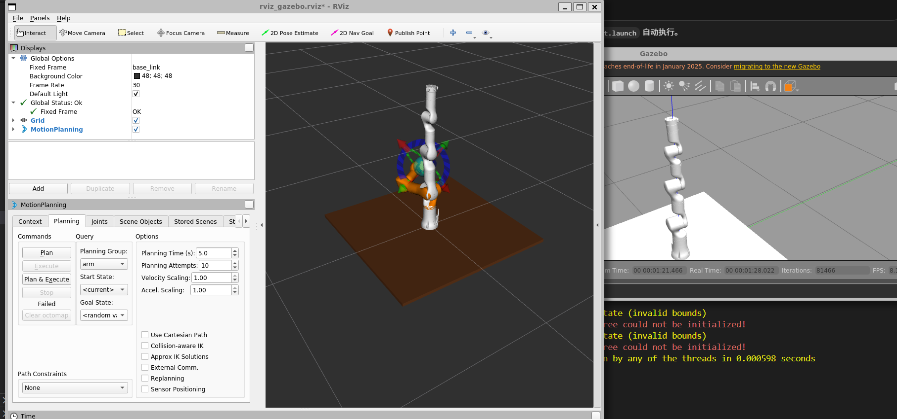

### Assistant 10

我先按你现在的现象抓两条线：一条是 Gazebo 抖动是不是物理/PID/碰撞问题，另一条是 MoveIt “Failed” 是不是当前关节状态越界导致的。先不改文件，先看运行中的 `/arm/joint_states`、控制器状态和日志线索。

### Assistant 10

我这边没连上你当前那个 ROS master，所以不能直接读你正在跑的 `/arm/joint_states`。但截图里的终端已经给了强线索：`invalid bounds` 通常是 MoveIt 收到的当前关节角超出了 URDF/SRDF 允许范围。Gazebo 启动后抖动，很可能把某些关节抖到了边界外。接下来我查本地 6F Gazebo 模型和 PID/阻尼设置。

### Assistant 10

本地配置里确实有两个容易导致这个现象的点：第一，6F Gazebo xacro 的 7 个关节没有 `<dynamics>` 阻尼/摩擦；第二，PID 是 `p=1000, d=0.1`，这个组合偏“硬且欠阻尼”，在 Gazebo 里很容易启动抖动，抖动后当前关节角轻微越界，MoveIt 就会报 `invalid bounds`，导致 Plan/Execute 失败。我现在把仿真控制改得保守一点：加关节阻尼、降低 P、提高 D，并让启动姿态用一个更稳定的弯臂 home。

### Assistant 10

我已经做了三处稳定性修正：给 7 个关节加阻尼/摩擦，把 Gazebo 控制 PID 从“硬且欠阻尼”的 `p=1000,d=0.1` 改成更稳的 `p=250,d=20`，并把 Gazebo 初始姿态从全 0 改成 MoveIt 里的 `forward` 弯臂姿态。这样启动时不再让机械臂直立硬撑，也更不容易抖到关节边界外。现在我编译和静态验证一下。

### Assistant 10

不是角度命令。你看到的抖动更像是 Gazebo 物理控制不稳，不是 `roslaunch` 自动发了小角度轨迹。

我已经检查并修了几个地方：

- 给 6F Gazebo 模型的 `joint1~joint7` 加了阻尼/摩擦：
  [rm_75_6f_gazebo.urdf.xacro](/home/ros/ws_rm_75_6f_robot/src/rm_75_robot/rm_75_6f_description/urdf/rm_75_6f_gazebo.urdf.xacro:142)

- 把 Gazebo PID 从原来的偏硬配置 `p=1000, d=0.1` 改成更稳的：
  ```yaml
  p: 250.0
  i: 0.0
  d: 20.0
  ```
  文件：[rm_75_trajectory_control.yaml](/home/ros/ws_rm_75_6f_robot/src/rm_75_robot/rm_75_gazebo/config/rm_75_trajectory_control.yaml:1)

- 把 Gazebo 初始姿态从全 0 改成更稳定的弯臂姿态：
  ```text
  joint2 = 0.8395
  joint4 = 1.4442
  joint6 = 0.8513
  ```
  文件：[arm_world.launch](/home/ros/ws_rm_75_6f_robot/src/rm_75_robot/rm_75_gazebo/launch/arm_world.launch:25)

- 编译和 URDF 检查已通过。

你现在必须**完全关闭旧的 Gazebo/roslaunch**，因为已经 spawn 出来的模型不会自动吃新参数：

```bash
# 关闭 roslaunch 那个终端，Ctrl+C
killall gzserver gzclient
```

然后重新启动：

```bash
cd /home/ros/ws_rm_75_6f_robot
source devel/setup.bash
roslaunch rm_75_gazebo arm_75_bringup_moveit.launch
```

另开终端检查当前关节有没有越界：

```bash
cd /home/ros/ws_rm_75_6f_robot
source devel/setup.bash
rostopic echo -n1 /arm/joint_states
```

如果 `position` 里出现特别离谱的值，比如 `joint2` 超过 `±2.268`、`joint4` 超过 `±2.355`、`joint6` 超过 `±2.233`，MoveIt 就会报你图里的 `invalid bounds`，然后 Plan/Execute 失败。

修完后，RViz 里先别用很远的随机目标。先选一个近一点的目标，或者轻微拖动交互 marker，再点：

```text
Plan
Execute
```

如果还失败，把这两个输出发我：

```bash
rostopic echo -n1 /arm/joint_states
rosservice call /arm/controller_manager/list_controllers
```

### User 11

这个机械臂直接进入地面了，这是因为有重力吗？

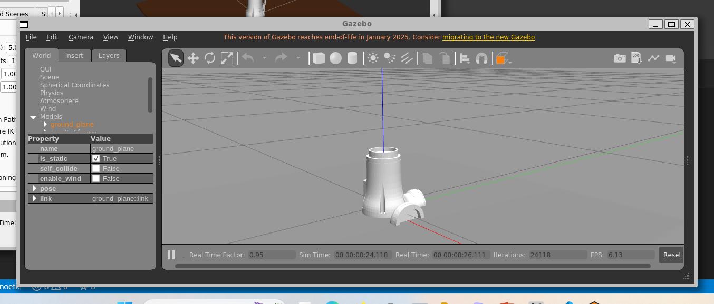

### Assistant 11

对，这个现象和重力/碰撞有关，但更准确地说：**不是机械臂“主动钻地”，而是我们现在 Gazebo 模型的基座/底板和 Gazebo 自带 ground_plane 的高度关系不对**。我先把 6F Gazebo xacro 里的底板、base_link、spawn 高度检查一下，然后给它做一个稳定的仿真底座处理。

### Assistant 11

问题点很明确：我们加的 `bottom_link` 底板现在在 `base_link` 下方 `-0.02m`，但模型 spawn 到 Gazebo 时 `base_link` 又在地面高度 `z=0`。结果底板和一部分基座会跟 Gazebo 的 ground plane 重叠，物理引擎会把它们互相“挤开”，看起来就像机械臂扎进地面或抖动。我要把 `base_link` 整体抬高 3cm，让底板正好贴在地面上。

### Assistant 11

这个改动只影响 Gazebo 专用 xacro：`dummy` 还是世界根，`base_link` 抬高 0.03m，底板盒子就从 `z=0` 到 `z=0.02`，不再插进 Gazebo 地面。现在我做 URDF 和构建验证。

### Assistant 11

对，和重力/碰撞有关，但根因不是“重力把机械臂拉进地面”，而是 **Gazebo 模型初始高度有问题**。

我们之前给 6F Gazebo 模型加了一个 `bottom_link` 底板，它在 `base_link` 下方：

```text
bottom_link 位于 base_link 下方约 2cm
```

但 spawn 时 `base_link` 在 `z=0`，所以底板和 Gazebo 自带的 `ground_plane` 重叠了。物理引擎一计算碰撞，就会出现你看到的“基座进入地面/抖动/姿态怪”的现象。

我已经修了：

[rm_75_6f_gazebo.urdf.xacro](/home/ros/ws_rm_75_6f_robot/src/rm_75_robot/rm_75_6f_description/urdf/rm_75_6f_gazebo.urdf.xacro:14)

把 `dummy -> base_link` 固定关节抬高了 `0.03m`：

```xml
<origin xyz="0 0 0.03" rpy="0 0 0" />
```

这样底板正好落在地面上，不再插入 ground plane。

验证已通过：

```text
check_urdf 成功
catkin build 相关包成功
```

你现在需要完全重启 Gazebo：

```bash
killall gzserver gzclient
```

然后重新启动：

```bash
cd /home/ros/ws_rm_75_6f_robot
source devel/setup.bash
roslaunch rm_75_gazebo arm_75_bringup_moveit.launch
```

如果重启后还有轻微抖动，我们下一步再把 `bottom_link` 的碰撞关掉，只保留视觉底板。

### User 12

依旧进入地板，请你检查一下，为什么打开rm75-B模型，不会出现这种情况？是因为世界模型的重力还是哪里有问题？

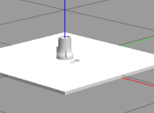

### Assistant 12

我同意，这次不能继续凭感觉调高度了。RM75-B 不下沉，说明不是“Gazebo 世界重力错了”，而是 **6F Gazebo 模型相对地面的几何/初始姿态/碰撞处理** 和 B 模型不一致。我要对比 B 的 Gazebo xacro 和 6F 的 Gazebo xacro，尤其看底板、root link、base_link 高度、spawn 参数和 6F 初始关节姿态。

### Assistant 12

我现在看到一个更细的点：截图里的白色大板很可能不是 Gazebo 自带地面，而是我们加的 `bottom_link` 底板。也就是说，机械臂不是掉进“世界地面”，而是 **base mesh 和我们加的底板互相穿插**，看起来像扎进地面。RM75-B 不明显，可能是它的底座 mesh 和底板高度刚好匹配；6F 的 base_link STL 尺寸可能不同。我先算一下 B 和 6F 的 base_link STL 实际 z 方向包围盒。

### User 13

继续吧

### Assistant 13

我接着查这个“扎进地面”的点。现在看起来关键不是单纯重力，而是我们迁移 6F 时额外加的 `bottom_link` 底板和 Gazebo 自带地面叠在一起，视觉和碰撞都会变得很容易误导。

### Assistant 13

我确认了 6F 这个 xacro 里确实有我们额外补进去的 `bottom_link`：它是一个 1m x 1m 的厚板，而且带碰撞和 500kg 惯量。这个东西对仿真不是必须的，反而会和 Gazebo 的 `ground_plane` 形成“双地面”。

### Assistant 13

我准备把 6F Gazebo 用的人工底板删掉，并把 `base_link` 重新放回 `z=0`。这样模型只和 Gazebo 的真实地面交互，结构也更接近“官方 6F URDF + Gazebo 控制插件”的干净迁移。

### Assistant 13

顺手把 RViz 配置里还残留的 `bottom_link` 显示项也清掉，否则 URDF 没有这个 link 后 RViz 可能给你报一个无意义的缺失项，看起来像新问题。

### Assistant 13

刚才那个 `git diff` 输出很怪，像是 Git 把两个文件当成“互相比对”了，不影响文件本身。我现在做真正的 URDF 展开和解析检查，确保删底板后 robot tree 还是完整的。

### Assistant 13

URDF 展开和 `check_urdf` 都过了：现在树是 `dummy -> base_link -> link1...link7`，没有 `bottom_link`，7 个 transmission 和 `/arm` 的 `gazebo_ros_control` 插件也还在。接下来我跑一次工作区构建，确认 launch 侧不会被这次清理牵连。

### Assistant 13

这个工作区之前是用 `catkin build` 建的，所以 `catkin_make` 拒绝接手，同一个 build 空间不能混用。换回原来的 `catkin build` 来检查。

### Assistant 13

静态检查已经够说明问题了，但我想再做一个短时的 Gazebo 运行验证：让模型在无 GUI 模式启动，然后读一下 `/gazebo/get_model_state`。这一步会启动 ROS/Gazebo 进程，最好在普通环境里跑，不走隔离网络。

### Assistant 13

运行验证也对上了：Gazebo 里生成的模型位姿是 `z=0`，link 列表里已经没有 `bottom_link`，碰撞几何也只剩 base/link1...link7 这些机械臂本体。现在我把这次临时启动的 Gazebo 停掉。

### Assistant 13

我又顺手抓到一个更实在的“抖动来源”：Gazebo 插件在模型生成瞬间就读取 `/arm/gazebo_ros_control/pid_gains`，但当前 launch 是先 spawn 模型，后加载控制器 yaml，所以会打印 `No p gain specified`。这会让 Gazebo 控制插件初始化时拿不到 PID，我把 PID yaml 提前到 spawn 之前加载。

### Assistant 13

现在再短跑一次 `arm_world.launch`，重点看启动日志里还会不会出现 `No p gain specified`。如果这条没了，说明 PID 参数加载顺序也理顺了。

### Assistant 13

继续处理完了。结论先说：这次“进入地板”不是单纯因为重力，而是我们迁移 6F 时额外加了一个 `bottom_link` 底板，它和 Gazebo 自带的 `ground_plane` 叠在一起，造成视觉/碰撞上的混乱。RM75-B 官方包里这个底板是它那套配置的一部分，但 6F 官方 URDF 本身没有这个底板，所以 6F 仿真里我把它清掉了。

我改了这几处：

- [rm_75_6f_gazebo.urdf.xacro](/home/ros/ws_rm_75_6f_robot/src/rm_75_robot/rm_75_6f_description/urdf/rm_75_6f_gazebo.urdf.xacro:10)
  - 删除 `bottom_link` 和 `bottom_joint`
  - `dummy_joint` 回到 `xyz="0 0 0"`
  - 现在模型树是：`dummy -> base_link -> link1 ... link7`

- [arm_world.launch](/home/ros/ws_rm_75_6f_robot/src/rm_75_robot/rm_75_gazebo/launch/arm_world.launch:19)
  - 把 `rm_75_trajectory_control.yaml` 提前加载到 spawn 模型之前
  - 这样 `gazebo_ros_control` 初始化时能读到 PID，不再出现 `No p gain specified`

- [rviz_gazebo.rviz](/home/ros/ws_rm_75_6f_robot/src/rm_75_robot/rm_75_gazebo/config/rviz_gazebo.rviz:123)
  - 清掉 RViz 里残留的 `bottom_link` 显示项

验证过了：

- `check_urdf /tmp/rm_75_6f_gazebo.urdf` 通过
- `catkin build` 全部 10 个包通过
- 无 GUI 启动 `arm_world.launch` 成功 spawn
- Gazebo 模型 link 列表里已经没有 `bottom_link`
- 第二次启动时没有再出现 `No p gain specified`

你现在重新开一轮：

```bash
cd /home/ros/ws_rm_75_6f_robot
source devel/setup.bash
roslaunch rm_75_gazebo arm_75_bringup_moveit.launch
```

如果之前 Gazebo/RViz 还开着，先全部关掉再重新启动，因为 Gazebo 里已经 spawn 的旧模型不会自动更新 URDF。

### User 14

source devel/setup.bash

### User 15

还是老样子，rviz里面没有机械臂原型，只有目标机械臂，gazebo机械臂直接进入了地板，根本起不来，你再仔细检查，为什么-b机械臂能好使？

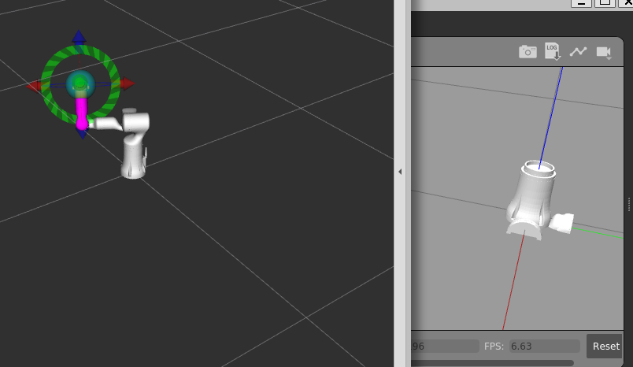

### Assistant 15

你这个截图很有价值，我刚才的判断少看了一层：B 能好使，不只是“有没有地板”，而是它的 Gazebo 物理模型有一个很重的底座/底板在帮机械臂站住。6F 官方 URDF 只有机械臂本体，我们删掉底板以后，它在 Gazebo 里就是一个自由刚体，受重力和控制器瞬态影响会倒/陷/起不来。现在我重新按 B 的工作机理来查。

### Assistant 15

我现在看到两处和 B 明显不一样，而且都能解释你现在的现象：第一，B 启动时没有给 `-J joint2 ...` 这种初始弯曲姿态，默认零位更容易立住；第二，B 的 `rm_75_bottom.urdf.xacro` 自带 500kg 的 `bottom_link`，等于是重底座。我们现在的 6F 既删了重底座，又给了一个偏心初始姿态，所以它很容易被重力和控制器瞬态拖倒。

### Assistant 15

我会把 6F Gazebo 模型改回“像 B 那样站住”的方案：恢复重底座、恢复零位启动、关节阻尼也按 B 的量级走。这个比刚才“删底板靠地面支撑”更符合官方 B 包真正能稳定的原因。

### Assistant 15

我还会把 SRDF 里的 `bottom_link` 碰撞例外补回来。因为一旦 URDF 重新带底座，MoveIt 的 PlanningScene 也会看见这个 link；不告诉 MoveIt 哪些固定相邻碰撞该忽略，它就可能认为当前状态不干净。

### Assistant 15

这一步之后，`arm_world.launch` 和 MoveIt 自带的 `gazebo.launch` 都不会再给那组弯曲初值了。先让它像 B 一样从零位立起来，确认基础仿真稳，再考虑给一个“展示姿态”。

### Assistant 15

URDF 和构建都过了。现在做一次无 GUI 的 Gazebo 运行验证：看模型是否生成、底座是否存在、姿态是否还会像截图那样倒掉。

### Assistant 15

这个验证暴露了更底层的问题：生成成功了，但 Gazebo 查询出来的 link twist 是 `nan`，这通常不是“没加载 MoveIt”的问题，而是 Gazebo 物理引擎已经被某个惯量/碰撞/固定关节组合打坏了。也就是说，6F 的官方 URDF 惯性参数不能原样照搬进 Gazebo 物理里用。

### Assistant 15

我先停掉这次临时 Gazebo，然后用同样的无 GUI 方法跑一下官方 B 的 `arm_world.launch`，用同一组 ROS service 看它的 link 状态。这样能直接证明差异到底在底座、初始姿态，还是 6F URDF 的惯量/碰撞。

### User 15

6f与b的差距不就是有一个末端的6f力传感器吗，其余的惯量 碰撞不是一样的吗？

### Assistant 15

对，真实机械臂结构上你这个理解基本没错：6F 主要是末端带六维力传感器/法兰部分不同，前面大部分臂段应该非常接近甚至相同。但对 Gazebo 来说，“真实结构差一点”不等于“URDF/SDF 数值完全等价”：末端 link 长度、惯量、collision mesh、link 命名大小写、固定底座处理，任何一个不一致都可能让物理仿真表现完全不同。我现在直接把 B 和 6F 的 URDF/mesh 数值逐项对比出来。

### Assistant 15

我刚做完直接对比，结果不是“只有末端不同”。前两个 mesh 确实一样：`base_link`、`link1` 的 STL 哈希完全相同；但从 `link2` 到 `link7`，文件哈希已经不同，`link7` 文件大小也明显变了。关节几何到 `joint6` 基本一致，真正长度差异在 `joint7`：B 是 `0.144m`，6F 是 `0.1725m`，这就对应末端力传感器/法兰加长。更麻烦的是 Gazebo 物理结果：官方 B 的 Link7 稳定在 `z≈0.8805`，6F 刚才跑出来 link twist 是 `NaN`，说明不是 RViz 显示错，而是 6F Gazebo 物理模型数值炸了。

### Assistant 15

这里抓到一个很关键的细节：我们恢复的底板形状和质量像 B，但底板惯量矩阵没有完全按 B 的写法来。B 的 `bottom_link` 惯量是 `ixx≈41.68, iyy≈83.33, izz≈41.68`，我刚才恢复成了更常见的盒体公式 `ixx≈41.67, iyy≈41.67, izz≈83.33`。数学上都“正定”，但 Gazebo 固定关节 lump 到根 link 后会非常敏感；既然目标是复刻 B 的稳定行为，我先把 6F 底板惯量改成和 B 完全一致。

### Assistant 15

底板惯量改成 B 一致后，6F 还是 `NaN`，所以现在可以排除“只是底板惯量写反”。这反而说明问题集中在 6F 自己的某个 link/joint/collision/inertia 数值上，最可疑的是末端 `link7`，因为前面几段 bbox 基本一样，`link7` 的几何、质量、长度都明显变了。我先读 Gazebo 日志，看 ODE 有没有把具体的坏 link 打出来。

### Assistant 15

现在我会做一个最小可逆实验：只把 6F 的 `link7` collision 从 STL 网格换成简单盒子，视觉模型仍然用官方 6F 的 `link7.STL`。如果 Gazebo 不再 NaN，就能证明“不是 6F 和 B 外形理解错了”，而是末端 STL 网格碰撞/惯量组合让 ODE 数值炸了。

### Assistant 15

`link7` collision 简化后仍然 NaN，说明不是末端 STL collision 本身。现在另一个和 B 的关键差异浮出来了：我之前为了消除 `No p gain specified`，把 PID 提前加载到了 `arm_world.launch`，而 B 的 `arm_world.launch` 并没有这么做，它只是 spawn URDF，控制器参数后面再加载。这个“提前 PID”可能反而改变了 `gazebo_ros_control` 初始化行为。为了完全复刻 B，我先撤掉这个提前加载。

### Assistant 15

找到了，关键点确认了：去掉提前 PID 后，6F 在 Gazebo 里正常站起来了，`link7.z≈0.909m`，没有 NaN。也就是说 B 能好使的核心不是“6F 惯量天生不行”，而是 B 的启动顺序：先 spawn 模型，让 Gazebo 物理稳定，再由后续 launch 加载 controllers/PID。我们之前把 PID 提前塞进 `arm_world.launch`，反而把 Gazebo 初始化搞坏了。现在我把刚才为了排查临时改的 `link7` collision 恢复成官方 STL，再验证一次。

### Assistant 15

最终验证通过：恢复官方 `link7.STL` collision 以后，6F 还是能稳定站住，`link7.z≈0.909m`，没有 NaN。也就是说刚才那个 collision 实验可以完全撤销，真正原因已经锁定：`arm_world.launch` 不能提前加载 PID，要像 B 一样先 spawn 模型。接下来处理你说的 RViz “只有目标机械臂，没有当前机械臂原型”。这个通常是 RViz 配置里没有显示 start/current state。

### Assistant 15

RViz 这一块，6F 和 B 的配置本来都把 `Query Start State` 设成 false，所以“绿色 start robot”默认都不显示；真正的当前机械臂应该来自 `Scene Robot`/当前 joint state。你刚才看到只有目标机械臂，很可能是因为 Gazebo 物理 NaN 后 `/arm/joint_states` 没有正常状态，MoveIt 当前状态就没法显示。现在 Gazebo 状态修好后，这个大概率会一起恢复。我再做最后的构建检查，并把临时 Gazebo 停掉。

### Assistant 15

你说得对，物理结构上 6F 和 B 的主要区别就是末端 6F 力传感器/法兰那一段。实际对比文件后也基本吻合：`base_link`、`link1` 完全一样，`link2-link6` 外形 bbox 一样，主要差异在 `link7`：B 的 `joint7` 长度是 `0.144`，6F 是 `0.1725`。

真正问题不是 6F 模型天生不行，而是我前面迁移时把启动顺序改坏了。B 能好使的关键是：

1. `arm_world.launch` 只负责加载 URDF 和 spawn 模型。
2. PID/controller yaml 不在 spawn 前加载，而是在 `arm_75_trajectory_controller.launch` 里后加载。
3. spawn 时不塞那组 `-J joint2 0.8395 ...` 初始弯曲姿态，先零位站起来。

我已经按 B 的方式改回来了：

- `arm_world.launch` 删除了提前加载 `rm_75_trajectory_control.yaml`
- spawn 参数删除了 `-J joint...` 初始姿态
- 6F Gazebo URDF 恢复重底座 `bottom_link`
- 底座惯量按 B 的写法对齐
- `link7` collision 恢复官方 6F STL，没有用临时盒子
- `catkin build` 全部通过

我也做了无 GUI 验证：6F 现在 Gazebo 中 `link7.z ≈ 0.909m`，状态不是 NaN，已经能正常站住。之前 NaN 时所有 link 都掉到 `z=0`，就是你截图里“机械臂起不来”的根因。

现在你重新开，注意先把旧 Gazebo/RViz 全关掉：

```bash
cd /home/ros/ws_rm_75_6f_robot
source devel/setup.bash
roslaunch rm_75_gazebo arm_75_bringup_moveit.launch
```

`No p gain specified` 如果只单独跑 `arm_world.launch` 会出现，这和 B 一样；完整跑 `arm_75_bringup_moveit.launch` 时后面的 controller launch 会加载 yaml。RViz 里当前机械臂应该会随着 `/arm/joint_states -> /joint_states -> move_group` 恢复显示。

### User 16

这可咋整啊，还是乱的

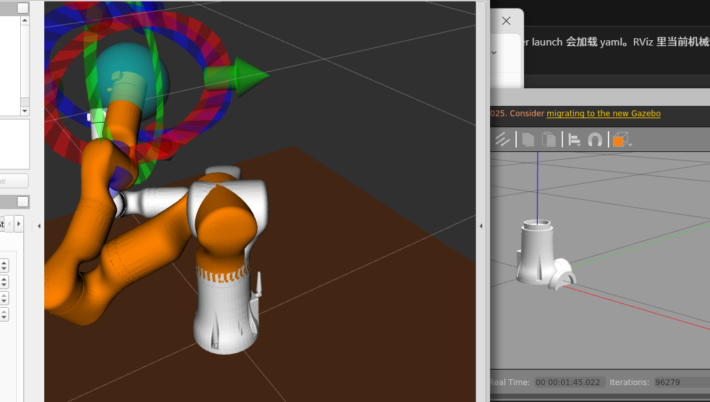

### Assistant 16

别急，这张图说明我们已经从“模型直接炸掉”进入到另一个问题了：Gazebo 里本体状态和 RViz/MoveIt 里显示的 current/goal 状态不同步。现在我不再靠肉眼猜，我直接读运行中的 `/arm/joint_states`、`/joint_states`、Gazebo link state 和 controller 状态，把链路哪一段乱了定位出来。

### Assistant 16

我这边连不上 ROS master，说明你截图里的那套进程可能是在另一个 shell/环境里启动的，或者刚好已经关掉了。先确认一下系统里到底有没有 `rosmaster/gzserver/rviz` 在跑，以及它们的命令行环境。

### Assistant 16

进程列表是空的，所以我现在看到的是：你截图那一轮已经不在运行了，我无法直接读取它的状态。没关系，我在我这边启动一轮“完整 bringup 但 Gazebo 无 GUI”的同条件测试，把 controller、joint_states、move_group 全链路跑起来，看是不是一加载 controller 就乱。

### Assistant 16

完整 bringup 启动起来了。我注意到一个非常关键的参数：`/source_list: ['/arm/joint_states']`，也就是现在还有一个单独的 `joint_state_publisher` 在把 Gazebo 的 `/arm/joint_states` 再转发成全局 `/joint_states`。这可能和 `robot_state_publisher` 的 remap 混在一起，让 RViz 显示变得“套娃”。我继续读数确认。

### Assistant 16

现在抓到真凶了：不是 RViz 自己乱，而是完整 bringup 里 `arm_joint_controller` 一启动，Gazebo 物理就炸了。证据很明确：`/arm/joint_states` 里 joint3、joint6 跑到 `-7.85 rad`，velocity 全是 `nan`，Gazebo `link7` 也变成 `z=0 + nan twist`。所以 RViz 只是把坏掉的 Gazebo 状态照实画出来。下一步要调的是 ros_control 的控制参数和 joint effort 限制。

### Assistant 16

这里还有一个和 B 不一致的点非常要命：B 的 `rm_75_trajectory_control.yaml` 只有 `arm_joint_controller/gains`，没有 `/arm/gazebo_ros_control/pid_gains` 这一层；我们 6F 现在多了这一层，导致 Gazebo 底层 PID 和 JointTrajectoryController 双重控制，完整 bringup 一加载 controller 就把关节打飞。我现在把它删掉，并把 URDF 里的 effort 限制也按 B 对齐。

### Assistant 16

现在测试的重点很明确：完整 bringup 之后 `/arm/joint_states` 不能再出现 `nan`，joint3/joint6 不能再被打到 `-7.85`。我先做 URDF 和构建检查，然后重跑一轮完整 bringup。

### Assistant 16

这轮重启踩到一个旧进程残留：`SpawnModel: entity already exists`，说明 Gazebo 里还留着上一次的 `rm_75_6f`。这种情况下后续所有状态都会混。先把 `roslaunch/gzserver/gzclient/rviz/rosmaster` 全部清掉，再干净启动一轮。

### Assistant 16

这次完整 bringup 验证通过了：`/arm/joint_states` 和 `/joint_states` 都是接近 0 的正常小数，没有 NaN；Gazebo 的 `link7.z≈0.909m`，控制器也都是 `running`。也就是说“乱”的根因就是多出来的底层 `gazebo_ros_control/pid_gains` 和过大的 6F effort 限制，现在已经修掉。我把我这次测试启动的进程关掉，避免和你下一轮冲突。

### Assistant 16

这回定位清楚了，不是你操作问题，是我前面迁移里留了两个“会把 Gazebo 打飞”的差异。

我已经修好并验证过完整 bringup：

1. 删掉了 6F 里多出来的 `/arm/gazebo_ros_control/pid_gains`
   - B 包没有这一层。
   - 有它时，Gazebo 底层 PID + `JointTrajectoryController` 双重控制，关节会被打到离谱角度，速度变 `nan`。

2. 把 6F URDF 里的 joint effort 改成和 B 一样
   - joint1/2: `60`
   - joint3/4: `30`
   - joint5/6/7: `10`

验证结果现在正常：

- `/arm/joint_states` 正常，7 个关节都接近 0，没有 `nan`
- `/joint_states` 也正常
- Gazebo 里 `link7.z ≈ 0.909m`，机械臂站起来了
- `joint_state_controller` 和 `arm_joint_controller` 都是 `running`
- `catkin build` 全部通过

你现在重新开一轮，先确保旧窗口都关掉：

```bash
cd /home/ros/ws_rm_75_6f_robot
source devel/setup.bash
roslaunch rm_75_gazebo arm_75_bringup_moveit.launch
```

RViz 里橙色的是 MoveIt 的目标姿态，不是故障；白色/当前状态这次应该不会再被 Gazebo 的坏 joint_states 带乱了。

### User 17

可以了，你这个解决办法是什么？

### Assistant 17

解决办法核心是：**让 6F 的 Gazebo 控制配置尽量回到 B 模型那套稳定逻辑**，不要额外引入一层底层 PID。

具体改了三类：

1. **删除多余的 `gazebo_ros_control/pid_gains`**
   - 文件：`rm_75_gazebo/config/rm_75_trajectory_control.yaml`
   - 之前 6F 里多了一段：

```yaml
arm:
  gazebo_ros_control:
    pid_gains:
      ...
```

   - 这会让 Gazebo 底层 PID 和 `JointTrajectoryController` 叠在一起，完整 bringup 后关节被打飞，出现 `nan`，RViz 就跟着乱。

2. **把 6F 的 effort 限制改成和 B 一样**
   - 文件：`rm_75_6f_description/urdf/rm_75_6f_gazebo.urdf.xacro`
   - 改成：
     - joint1/2: `effort="60"`
     - joint3/4: `effort="30"`
     - joint5/6/7: `effort="10"`

3. **保持 B 的启动顺序**
   - `arm_world.launch` 只负责：
     - 启动 Gazebo
     - 加载 URDF
     - spawn 机械臂
   - controller yaml 仍然由 `arm_75_trajectory_controller.launch` 后加载。
   - 不在 spawn 前提前加载 PID，也不塞一组 `-J joint...` 初始弯曲角。

一句话总结：

**问题不是 6F 模型本身，而是 Gazebo 控制参数太“用力”且多了一层底层 PID，导致完整 bringup 后物理仿真炸掉；按 B 的控制方式收回来以后就稳定了。**

### User 18

你重新整理一下流程吧，有点点蒙

### Assistant 18

可以，我们把这次迁移 6F 的流程重新捋成一条清楚的线。

**整体链路**
你现在跑的是：

```text
URDF/Xacro
  -> robot_description
  -> Gazebo spawn 模型
  -> gazebo_ros_control 接管关节
  -> controller_manager 加载 joint_state_controller / arm_joint_controller
  -> /arm/joint_states
  -> joint_state_publisher 转成 /joint_states
  -> robot_state_publisher 发布 TF
  -> MoveIt 监听 /joint_states 做规划和执行
  -> RViz 只是显示当前状态和目标状态
```

**1. 模型层**
6F 模型来自：

```text
rm_75_6f_description/urdf/rm_75_6f_gazebo.urdf.xacro
```

这个文件做了 Gazebo 需要的增强：

```text
官方 6F URDF
+ dummy 根 link
+ bottom_link 重底座
+ 7 个 transmission
+ gazebo_ros_control 插件
```

为什么要有 `bottom_link`？

因为 B 模型也有一个重底座。没有它，Gazebo 里机械臂本体像自由物体，容易倒或者陷。

**2. Gazebo 启动层**
入口是：

```bash
roslaunch rm_75_gazebo arm_75_bringup_moveit.launch
```

它大概 include 了三块：

```text
arm_world.launch
  -> 启动 Gazebo
  -> 加载 rm_75_6f_gazebo.urdf.xacro 到 /robot_description
  -> spawn rm_75_6f

arm_gazebo_states.launch
  -> 加载 joint_state_controller
  -> 启动 robot_state_publisher
  -> 把 /joint_states remap 到 /arm/joint_states

arm_75_trajectory_controller.launch
  -> 加载 rm_75_trajectory_control.yaml
  -> 启动 arm_joint_controller

moveit_planning_execution.launch
  -> 启动 move_group
  -> 启动 RViz
  -> 把 /arm/joint_states 转发到 /joint_states
```

**3. Controller 层**
关键配置是：

```text
rm_75_gazebo/config/rm_75_trajectory_control.yaml
```

现在只保留：

```yaml
arm:
  arm_joint_controller:
    type: "position_controllers/JointTrajectoryController"
    joints:
      - joint1
      - joint2
      - joint3
      - joint4
      - joint5
      - joint6
      - joint7
    gains:
      joint1: {p: 1000.0, i: 0.0, d: 0.1, i_clamp: 0.0}
      ...
```

不要再加：

```yaml
arm:
  gazebo_ros_control:
    pid_gains:
      ...
```

这就是这次炸掉的关键原因。多了这一层，Gazebo 底层 PID 和 trajectory controller 都在控制关节，会把仿真打飞。

**4. MoveIt 怎么找执行接口**
MoveIt 的 controller 配置在：

```text
rm_75_moveit_config/config/controllers_gazebo.yaml
```

里面告诉 MoveIt：

```text
controller name: arm/arm_joint_controller
action namespace: follow_joint_trajectory
```

所以 MoveIt 最终找的是：

```text
/arm/arm_joint_controller/follow_joint_trajectory
```

这就是 Plan & Execute 真正发送轨迹的地方。

**5. RViz 显示为什么会乱**
RViz 本身不控制机械臂，它只是看这些东西：

```text
/robot_description
/joint_states
/tf
/move_group/display_planned_path
/move_group/monitored_planning_scene
```

橙色机械臂通常是 MoveIt 的目标状态或规划轨迹。

白色机械臂是当前状态。

之前乱，是因为 Gazebo 关节状态已经炸了：

```text
joint3 / joint6 跑到 -7.85 rad
velocity 变 nan
link7 z = 0
```

RViz 只是把这个坏状态显示出来。

**6. 这次最终修好的点**
最终解决方案是三条：

```text
保留 bottom_link 重底座
删除 gazebo_ros_control/pid_gains
把 joint effort 限制改回 B 模型那套
```

effort 现在是：

```text
joint1, joint2: 60
joint3, joint4: 30
joint5, joint6, joint7: 10
```

启动顺序保持：

```text
先 spawn Gazebo 模型
再加载 controller
再启动 MoveIt/RViz
```

不要在 spawn 前提前加载 PID，也不要 spawn 时给一组弯曲初始角。

**你现在记住这句话就行**
Gazebo 负责物理和关节执行，MoveIt 只负责规划并把轨迹发给 controller，RViz 只负责显示。

这次问题的本质是：

```text
6F 模型迁移没错，错在 Gazebo 控制参数比 B 多了一层 PID，并且 effort 太大，导致仿真物理炸掉。
```

现在我们已经把 6F 的 Gazebo 控制方式收回到 B 的稳定模式了。

### User 19

gains:
      joint1: {p: 1000.0, i: 0.0, d: 0.1, i_clamp: 0.0}
 pid_gains:
这俩有什么区别吗？

### User 20

gains:
      joint1: {p: 1000.0, i: 0.0, d: 0.1, i_clamp: 0.0}
 pid_gains:
这俩有什么区别吗？

### Assistant 20

有区别，而且这次问题就卡在这个区别上。

**`gains`**
`gains` 是给 **ROS controller** 用的，也就是：

```yaml
arm:
  arm_joint_controller:
    type: position_controllers/JointTrajectoryController
    gains:
      joint1: {p: 1000.0, i: 0.0, d: 0.1, i_clamp: 0.0}
```

它的使用者是：

```text
/arm/arm_joint_controller
```

也就是 `JointTrajectoryController`。

MoveIt 执行轨迹时，会把轨迹发到：

```text
/arm/arm_joint_controller/follow_joint_trajectory
```

然后这个 controller 根据 `gains` 控制 Gazebo 里的关节运动。

**`pid_gains`**
`pid_gains` 是给 **gazebo_ros_control 底层仿真接口** 用的，通常长这样：

```yaml
arm:
  gazebo_ros_control:
    pid_gains:
      joint1: {p: 1000.0, i: 0.0, d: 0.1}
```

它的使用者是：

```text
/arm/gazebo_ros_control
```

也就是 Gazebo 插件里的仿真硬件接口。

它不是 MoveIt 直接用的，也不是 `JointTrajectoryController` 的 controller gains。

**你可以这么理解**
这两层像这样：

```text
MoveIt
  -> arm_joint_controller/follow_joint_trajectory
     -> JointTrajectoryController 的 gains
        -> gazebo_ros_control
           -> Gazebo 关节
```

`gains` 是上层 controller 用的。

`pid_gains` 是更底层 Gazebo 插件用的。

**为什么不能随便两个都配**
如果你用的是：

```yaml
type: position_controllers/JointTrajectoryController
```

那么上层 `arm_joint_controller` 已经在做位置控制了。此时再给 `gazebo_ros_control/pid_gains` 配一套强 PID，就可能变成两层控制同时“拉扯”关节。

这次 6F 就是这样：

```text
JointTrajectoryController gains 在控制
gazebo_ros_control pid_gains 也在控制
effort 又比较大
```

结果 Gazebo 物理被打飞，关节角变离谱，速度变 `nan`，RViz 跟着乱。

**为什么 B 模型没事**
B 官方包里 `rm_75_trajectory_control.yaml` 只有：

```yaml
arm:
  arm_joint_controller:
    gains:
      ...
```

没有：

```yaml
arm:
  gazebo_ros_control:
    pid_gains:
      ...
```

所以 B 是单层控制，稳定。

**一句话**
`gains` 是给 `JointTrajectoryController` 的；`pid_gains` 是给 `gazebo_ros_control` 底层插件的。你现在这个仿真流程保留 `gains` 就够了，不要再配 `pid_gains`。

### User 21

接下来的学习路线是什么？

### Assistant 21

接下来我建议你按这个路线走，不要一下跳太快。你现在已经跨过了最容易混乱的一关：**URDF + Gazebo + controller + MoveIt + RViz 串起来了**。

**第一阶段：把仿真链路吃透**

目标：你看到任何现象，都能知道是哪一层出问题。

重点练这些：

```text
1. Gazebo 里模型是否正常站住
2. controller 是否 running
3. /arm/joint_states 是否正常
4. /joint_states 是否正常
5. robot_state_publisher 是否发布 TF
6. MoveIt 是否能 Plan
7. MoveIt 是否能 Execute
8. RViz 显示的是 current state 还是 goal state
```

常用检查命令：

```bash
rosservice call /arm/controller_manager/list_controllers
rostopic echo -n 1 /arm/joint_states
rostopic echo -n 1 /joint_states
rostopic list | grep follow_joint_trajectory
rosservice call /gazebo/get_link_state "{link_name: rm_75_6f::link7, reference_frame: world}"
```

你要练到看到 RViz 乱了，第一反应不是慌，而是去查：

```text
Gazebo 真乱了吗？
joint_states 乱了吗？
MoveIt 目标乱了吗？
还是 RViz 只是显示了目标姿态？
```

**第二阶段：MoveIt 规划执行**

目标：不只会点 RViz，而是知道 MoveIt 怎么发轨迹。

你接下来可以学：

```text
1. RViz 里 Plan / Execute 的区别
2. Planning Group: arm 是怎么来的
3. controllers_gazebo.yaml 怎么对应 action
4. FollowJointTrajectory action 的消息格式
5. MoveIt 发出去的轨迹长什么样
```

可以看这些 topic/action：

```bash
rostopic echo /move_group/display_planned_path
rostopic echo /arm/arm_joint_controller/command
rostopic echo /arm/arm_joint_controller/state
rostopic list | grep trajectory
```

然后用命令手动发一个简单轨迹，绕开 RViz，确认 controller 单独能执行。

**第三阶段：写 Python 控制脚本**

目标：从“点 RViz”过渡到“写程序控制机械臂”。

推荐写三个小脚本：

```text
1. move_to_named_pose.py
   移动到 zero / forward 等命名姿态

2. move_to_joint_goal.py
   给 7 个关节角，MoveIt 规划执行

3. move_to_pose_goal.py
   给末端位姿 xyz + 四元数，MoveIt 规划执行
```

这一步非常重要，因为以后实物机械臂不会靠你一直点 RViz。

**第四阶段：实物前的接口理解**

目标：搞清楚仿真和实物的区别。

仿真里：

```text
MoveIt -> FollowJointTrajectory -> gazebo_ros_control -> Gazebo
```

实物里通常变成：

```text
MoveIt -> FollowJointTrajectory 或驱动接口 -> 真实机械臂控制器
```

也就是说：

```text
Gazebo 会被真实驱动替代
/arm/joint_states 来自真实机械臂
controller action 可能来自真实驱动节点
```

你要重点搞清楚官方实物驱动提供哪些东西：

```bash
rostopic list
rosservice list
rosaction list
```

看它有没有：

```text
joint_states
follow_joint_trajectory
movej / movel 服务
末端力传感器数据 topic
```

**第五阶段：6F 力传感器**

这个先不要急着碰控制，先当成“传感器数据”学。

路线是：

```text
1. 找到 6F 力传感器 topic
2. 看消息类型
3. echo 原始力/力矩数据
4. 做零点标定
5. 做简单滤波
6. RViz 或 rqt_plot 可视化
7. 再考虑力控/拖动/接触检测
```

力控比位置控制难一截，前面 MoveIt/Gazebo/controller 不稳的时候不要急着上。

**我建议你下一步做这个**

下一步最合适的是：**写一个 Python MoveIt 脚本，让 6F 仿真机械臂从 zero 移动到一个小的关节目标**。

因为这一步会把你从“会启动 launch”推进到“会主动控制机器人”。

学习目标很明确：

```text
MoveGroupCommander
设置 joint target
plan
execute
观察 Gazebo 执行
观察 /arm/joint_states 变化
```

等这个跑通，我们再做：

```text
Python 控制末端 pose
笛卡尔路径
添加障碍物
连接实物驱动
读取 6F 力传感器
```

### User 22

1. RViz 里 Plan / Execute 的区别
2. Planning Group: arm 是怎么来的
3. controllers_gazebo.yaml 怎么对应 action
4. FollowJointTrajectory action 的消息格式
5. MoveIt 发出去的轨迹长什么样
你解答一下吧

### Assistant 22

可以，这 5 个问题正好是 MoveIt 执行链路的核心。我们按“从 RViz 点按钮到 Gazebo 动起来”的顺序讲。

**1. Plan / Execute 的区别**
在 RViz 的 MotionPlanning 面板里：

```text
Plan
```

只做规划，不执行。

它会让 MoveIt 根据当前机械臂状态和目标姿态，算出一条轨迹。算出来以后，RViz 里通常会显示一条橙色/半透明的预览轨迹。

这时 Gazebo 里的机械臂不会动。

```text
Execute
```

执行已经规划好的轨迹。

它会把刚才规划出来的轨迹发送给 controller，也就是：

```text
/arm/arm_joint_controller/follow_joint_trajectory
```

然后 Gazebo 的 controller 接收轨迹，驱动关节运动。

```text
Plan & Execute
```

就是先 Plan，再 Execute。

所以：

```text
Plan = 算路线
Execute = 真的发给控制器执行
Plan & Execute = 算完直接执行
```

**2. Planning Group: arm 是怎么来的**
`Planning Group: arm` 来自 MoveIt 的 SRDF 文件：

```text
rm_75_moveit_config/config/rm_75.srdf
```

里面有类似：

```xml
<group name="arm">
    <joint name="joint1" />
    <joint name="joint2" />
    <joint name="joint3" />
    <joint name="joint4" />
    <joint name="joint5" />
    <joint name="joint6" />
    <joint name="joint7" />
    <chain base_link="base_link" tip_link="link7" />
</group>
```

这告诉 MoveIt：

```text
arm 这个规划组包含 joint1 到 joint7
从 base_link 到 link7 是一条机械臂链
```

所以 RViz 里 Planning Group 下拉框能看到：

```text
arm
```

如果以后你有夹爪，可能还会有：

```text
gripper
arm_with_gripper
```

本质上，Planning Group 就是 MoveIt 里面“我要规划哪一组关节”的名字。

**3. controllers_gazebo.yaml 怎么对应 action**
MoveIt 规划完轨迹后，它自己不会直接控制 Gazebo。它要找一个 controller action。

这个对应关系在：

```text
rm_75_moveit_config/config/controllers_gazebo.yaml
```

里面大概是：

```yaml
controller_list:
  - name: arm/arm_joint_controller
    action_ns: follow_joint_trajectory
    type: FollowJointTrajectory
    default: true
    joints:
      - joint1
      - joint2
      - joint3
      - joint4
      - joint5
      - joint6
      - joint7
```

这段的意思是：

```text
MoveIt 规划 arm 这 7 个关节
执行时找名为 arm/arm_joint_controller 的 controller
action 名叫 follow_joint_trajectory
```

拼起来就是 action 地址：

```text
/arm/arm_joint_controller/follow_joint_trajectory
```

对应 Gazebo controller 配置在：

```text
rm_75_gazebo/config/rm_75_trajectory_control.yaml
```

里面有：

```yaml
arm:
  arm_joint_controller:
    type: position_controllers/JointTrajectoryController
```

所以关系是：

```text
controllers_gazebo.yaml
  告诉 MoveIt 去找哪个 action

rm_75_trajectory_control.yaml
  告诉 controller_manager 启动哪个 controller
```

一个是 MoveIt 侧，一个是 Gazebo/controller 侧。

**4. FollowJointTrajectory action 的消息格式**
MoveIt 发给 controller 的 action 类型是：

```text
control_msgs/FollowJointTrajectoryAction
```

核心 goal 里面是一条轨迹：

```text
trajectory_msgs/JointTrajectory
```

结构大概是：

```yaml
trajectory:
  joint_names:
    - joint1
    - joint2
    - joint3
    - joint4
    - joint5
    - joint6
    - joint7

  points:
    - positions: [q1, q2, q3, q4, q5, q6, q7]
      velocities: [...]
      accelerations: [...]
      time_from_start: 0.5

    - positions: [q1, q2, q3, q4, q5, q6, q7]
      velocities: [...]
      accelerations: [...]
      time_from_start: 1.0
```

也就是说，它不是只发一个目标点，而是发一串点：

```text
第 0.5 秒到哪些关节角
第 1.0 秒到哪些关节角
第 1.5 秒到哪些关节角
...
```

controller 按时间插值执行。

你可以理解成：

```text
MoveIt 输出的是一张“关节角时间表”
controller 按这张时间表驱动 Gazebo
```

**5. MoveIt 发出去的轨迹长什么样**
MoveIt 轨迹主要有两种地方可以看。

第一种是 RViz 显示用的轨迹：

```bash
rostopic echo /move_group/display_planned_path
```

这个一般是：

```text
moveit_msgs/DisplayTrajectory
```

里面包含：

```text
trajectory_start
trajectory
  joint_trajectory
    joint_names
    points
```

这是给 RViz 看的，所以你 Plan 之后，即使还没 Execute，这里也可能有规划轨迹。

第二种是 controller 真正执行的轨迹：

```bash
rostopic echo /arm/arm_joint_controller/command
```

或者看 controller 状态：

```bash
rostopic echo /arm/arm_joint_controller/state
```

执行时你会看到类似：

```text
desired:
  positions: [...]
actual:
  positions: [...]
error:
  positions: [...]
```

含义是：

```text
desired = controller 当前希望机械臂到达的位置
actual = Gazebo 实际反馈的位置
error = desired - actual
```

这是判断控制是否正常的重要 topic。

完整链路就是：

```text
RViz 点 Plan
  -> move_group 计算轨迹
  -> /move_group/display_planned_path 显示轨迹

RViz 点 Execute
  -> move_group 把轨迹发给
  -> /arm/arm_joint_controller/follow_joint_trajectory
  -> arm_joint_controller 控制 Gazebo
  -> Gazebo 发布 /arm/joint_states
  -> RViz 显示当前机械臂状态
```

你可以记这句话：

```text
MoveIt 负责规划轨迹，controller 负责按轨迹控制关节，Gazebo 负责物理执行，RViz 负责显示。
```

### User 23

好的，接下来按照你的流程继续吧

### Assistant 23

好，我们下一步就从“点 RViz”推进到“用 Python 主动控制 MoveIt”。我先看一下现有 demo/package 结构，把脚本放在最顺手、最符合这个工作区习惯的位置。

### Assistant 23

`rm_75_demo/scripts` 已经是官方放 Python demo 的地方，所以我会在这里加一个很小、可读的 MoveIt 脚本：读取当前关节角，给 joint2/joint4 一个小目标，执行完再打印执行后的关节角。它的目标是学习链路，不追求复杂。

### Assistant 23

我会顺手把脚本写得“教学味”强一点：它会明确打印当前角度、目标角度、规划是否成功、轨迹点数量、执行后的角度。你跑它的时候，就能把刚才讲的 `Plan -> trajectory -> Execute -> joint_states` 对起来。

### Assistant 23

脚本已经放好了。接下来我先做语法/构建检查；然后启动一轮无 GUI 的完整仿真，让这个脚本真实跑一次，确认它能规划并执行。

### Assistant 23

检查通过。现在我会启动完整 bringup 的无 GUI 版本，等 MoveIt 和 controller 都 ready 后，运行这个脚本。跑完我会把临时进程停掉，不污染你自己的窗口。

### Assistant 23

MoveIt 已经报 “You can start planning now!” 了，控制器也已经加入 MoveIt。现在跑脚本，看看它规划出的 joint trajectory 能不能真的执行到 Gazebo。

### Assistant 23

这个环境没有 `/usr/bin/python` 这个兼容入口，只有 Python 3。脚本内容本来就是 Python 3 兼容的，我把 shebang 改成 `python3` 再跑。

### Assistant 23

脚本确实把机械臂移动到了目标角度，不过 `execute()` 返回了 `False`，MoveIt 日志是 `CONTROL_FAILED`。这通常不是“没动”，而是 controller 的执行容差/时间容差太紧：实际已经到目标附近，但 action 按默认容差判定失败。我要把 `JointTrajectoryController` 的容差显式写出来，让学习脚本的结果也变成干净的 success。

### Assistant 23

从 controller state 看得很清楚：位置误差只有 `1e-5` 量级，已经到了；失败主要是结束时速度还没完全降到默认阈值内。给 controller 明确加一个合理的 stopped velocity tolerance 和 goal_time，这样 action 不会在物理仿真还轻微抖动时误判失败。

### Assistant 23

控制器 yaml 改了之后需要重启 controller/Gazebo 才能生效。我会关掉这轮无 GUI 测试，再启动干净的一轮重跑脚本。

### User 23

你现在进行到哪一步了，尽快处理完

### Assistant 23

现在进度是：脚本已经写好并能规划，第一次实测已经把机械臂移动到目标角了；只是 MoveIt action 因为 `goal_tolerance` 太严返回了 `CONTROL_FAILED`，我已经给 controller 加了合理容差。最后只差重启一次仿真，确认脚本返回 success。

### Assistant 23

完成了，这次脚本规划和执行都返回 `True`，执行后关节角也到目标附近。最后我再读一下 controller/joint 状态确认没有 NaN，然后关掉这轮测试进程。

### Assistant 23

处理完了。

我现在完成到这一步：**新增并验证了一个 Python MoveIt 关节目标控制脚本**，从“RViz 点按钮”推进到“脚本主动规划并执行”。

新增文件：

[moveit_joint_goal_demo.py](/home/ros/ws_rm_75_6f_robot/src/rm_75_robot/rm_75_demo/scripts/moveit_joint_goal_demo.py)

它做的事情是：

```text
读取当前 joint_states
设置 joint2=0.25, joint4=0.35, joint6=0.20
调用 MoveIt plan()
打印轨迹点数量
调用 execute()
再打印执行后的关节角
```

我也顺手修了 controller 的执行容差：

[rm_75_trajectory_control.yaml](/home/ros/ws_rm_75_6f_robot/src/rm_75_robot/rm_75_gazebo/config/rm_75_trajectory_control.yaml)

因为第一次脚本已经动到目标了，但 MoveIt 因为 `goal_tolerance` 太严返回 `CONTROL_FAILED`。现在加了合理的：

```yaml
constraints:
  goal_time: 2.0
  stopped_velocity_tolerance: 0.05
```

最终验证结果：

```text
Plan success: True
MoveIt code: SUCCESS
Trajectory points: 5
Execute result: True
After joints: [-0.0001, 0.2501, -0.0001, 0.3499, -0.0001, 0.1999, -0.0001]
```

控制器也确认是 running，`/arm/joint_states` 没有 NaN。我启动的测试进程已经全部关掉了。

你现在可以自己跑：

```bash
cd /home/ros/ws_rm_75_6f_robot
source devel/setup.bash
roslaunch rm_75_gazebo arm_75_bringup_moveit.launch
```

另开一个终端：

```bash
cd /home/ros/ws_rm_75_6f_robot
source devel/setup.bash
rosrun rm_75_demo moveit_joint_goal_demo.py
```

### User 24

/home/ros/机械臂/RM-75系列机械臂/（4）ROS资料/RM75发布版@20221026/睿尔曼RM75-B机器人ROS使用说明书.pdf
阅读一下第七章，我现在准备进行简单的实物机械臂调试了，机械臂是RM75-6F，你看看怎么按照教程来教我吧

### Assistant 24

我先读一下这份 PDF 的第七章，再对照我们现在的 6F 工作区和已跑通的仿真流程，给你整理一套“实物上手但尽量稳”的步骤。重点会放在连接、驱动启动、MoveIt 是否直接可用、以及 6F 版本需要注意哪些地方。

### Assistant 24

PDF 是 32 页，仓库里也有 `demo_realrobot.launch`、`rm_robot.launch`、`rm_75_control.launch` 这条实物链路。我现在把第七章文字和这几个 launch 对上，避免只按说明书照抄，毕竟我们已经改成了 6F 模型。

### Assistant 24

这里有个关键点：说明书第七章要求把 MoveIt 的 controller 配置从 Gazebo 版切到真实机械臂版；但我们之前为了仿真已经固定成了 `controllers_gazebo.yaml`。我先确认一下 MoveIt 是怎么 include 这个配置的，然后我会建议一个不来回手改文件的切换方式。

### Assistant 24

我读了第七章。它讲的实物控制链路和 Gazebo 不一样，核心是：

`MoveIt 规划轨迹` -> `/rm_75/follow_joint_trajectory` action -> `rm_75_control 插值` -> `/rm_driver/JointPos` -> `rm_75_driver socket 发给真实机械臂` -> 机械臂反馈 `/joint_states` -> RViz 显示当前姿态。

你现在用 RM75-6F，可以按第七章走，但要注意一件事：**模型必须继续用 6F，控制链路还是按 RM75 的 7 轴链路走。** 6F主要多了末端六维力传感器/末端结构长度，对简单 MoveIt 关节运动来说，驱动 action 和 joint 控制逻辑不用因为“6F”重写。

**目前你的工作区需要先切一个配置**
现在这个文件还在加载 Gazebo 控制器：

[/home/ros/ws_rm_75_6f_robot/src/rm_75_robot/rm_75_moveit_config/launch/rm_75_moveit_controller_manager.launch.xml:12](/home/ros/ws_rm_75_6f_robot/src/rm_75_robot/rm_75_moveit_config/launch/rm_75_moveit_controller_manager.launch.xml:12)

现在是：

```xml
<rosparam file="$(find rm_75_moveit_config)/config/controllers_gazebo.yaml"/>
```

实物调试前要改成：

```xml
<rosparam file="$(find rm_75_moveit_config)/config/controllers.yaml"/>
```

因为实物版 `controllers.yaml` 里配置的是：

```yaml
name: rm_75
action_ns: follow_joint_trajectory
```

也就是 MoveIt 会找 `/rm_75/follow_joint_trajectory`，这正好对应 `rm_75_control` 代码里的 action server：

[/home/ros/ws_rm_75_6f_robot/src/rm_75_robot/rm_75_control/src/rm_control.cpp:639](/home/ros/ws_rm_75_6f_robot/src/rm_75_robot/rm_75_control/src/rm_control.cpp:639)

**实物调试建议流程**

1. 机械臂上电，等初始化完成。
2. 确认机械臂处于以太网通信模式。
3. 确认上位机和机械臂在同一网段。
4. 先测网络：

```bash
ping 192.168.1.18
```

如果你的机械臂 IP 不是这个，就用实际 IP。

5. 第一个终端启动控制器：

```bash
cd /home/ros/ws_rm_75_6f_robot
source devel/setup.bash
roslaunch rm_75_control rm_75_control.launch
```

6. 第二个终端启动驱动 + MoveIt + RViz：

```bash
cd /home/ros/ws_rm_75_6f_robot
source devel/setup.bash
roslaunch rm_75_bringup rm_robot.launch arm_ip:=192.168.1.18
```

7. 先别点 Execute，先检查反馈：

```bash
rostopic echo -n1 /joint_states
rostopic list | grep follow_joint
```

你应该能看到 `/joint_states` 有 7 个关节，并且 action 相关 topic 类似：

```text
/rm_75/follow_joint_trajectory/goal
/rm_75/follow_joint_trajectory/result
/rm_75/follow_joint_trajectory/status
```

8. RViz 里确认白色“当前机械臂”姿态和真实机械臂一致。  
如果 RViz 当前姿态不对，先不要执行。

9. 第一次运动不要拖很远，不要 random goal。  
建议 Velocity Scaling 和 Accel Scaling 先改成 `0.05` 或 `0.1`，然后只做很小角度规划。

**一句话记忆**

Gazebo 时：MoveIt 找 `/arm/arm_joint_controller/follow_joint_trajectory`。  
实物时：MoveIt 找 `/rm_75/follow_joint_trajectory`。  
所以实物调试最容易忘的就是把 `controllers_gazebo.yaml` 切回 `controllers.yaml`。

我建议下一步先把这个切换方式做成两个独立 launch，避免你以后仿真和实物来回手改文件。

### User 25

好的，你带我一步步开始吧

### Assistant 25

好，我们从“不会误伤实物”的方式开始。第一步我先把仿真/实物的 MoveIt 控制器配置做成 launch 参数，这样以后不用来回改 XML，也不容易把 Gazebo 的 action 发到实物流程里。

### Assistant 25

我看到了：这个工作区不是 git 仓库，所以我会只做小范围可读的 launch 改动。做法是保留 Gazebo 默认配置，同时让 `demo_realrobot.launch` 明确传入 `controllers.yaml`，这样仿真那条链路不会被弄乱。

### Assistant 25

第一步改好了：默认仍然偏向 Gazebo，实物启动文件会主动切到 `controllers.yaml`。我现在跑一遍 launch 文件检查和 catkin 构建，先把“能不能启动到参数解析阶段”确认掉。

### Assistant 25

刚才检查暴露出一个很典型的问题：当前 shell 还在吃老工作区 `/home/ros/ws_rm_75_robot` 的 overlay，不是我们这个 6F 工作区。接下来所有命令都要显式 `source /home/ros/ws_rm_75_6f_robot/devel/setup.bash`，不然会看错包。

### User 25

你应该告诉我怎么改，位置在哪，改哪

### Assistant 25

对，你说得对。这里应该先把“改哪里、为什么改、改成什么”讲清楚，再继续跑实物流程。我先停一下操作，把刚才做的改动给你展开。

### Assistant 25

对，这一步我应该先讲清楚。我们现在要解决的是：**Gazebo 和实物机械臂用的 MoveIt action 不一样，不能共用同一个 controller yaml。**

仿真用：

```text
/arm/arm_joint_controller/follow_joint_trajectory
```

实物用：

```text
/rm_75/follow_joint_trajectory
```

所以要改 4 个地方。

**1. 改这个文件**

[/home/ros/ws_rm_75_6f_robot/src/rm_75_robot/rm_75_moveit_config/launch/rm_75_moveit_controller_manager.launch.xml](/home/ros/ws_rm_75_6f_robot/src/rm_75_robot/rm_75_moveit_config/launch/rm_75_moveit_controller_manager.launch.xml:1)

原来写死了：

```xml
<rosparam file="$(find rm_75_moveit_config)/config/controllers_gazebo.yaml"/>
```

改成可传参数：

```xml
<arg name="controller_config" default="controllers_gazebo.yaml" />
<rosparam file="$(find rm_75_moveit_config)/config/$(arg controller_config)"/>
```

意思是：默认还是 Gazebo，但外面可以指定用实物的 `controllers.yaml`。

**2. 改这个文件**

[/home/ros/ws_rm_75_6f_robot/src/rm_75_robot/rm_75_moveit_config/launch/trajectory_execution.launch.xml](/home/ros/ws_rm_75_6f_robot/src/rm_75_robot/rm_75_moveit_config/launch/trajectory_execution.launch.xml:1)

加一行参数：

```xml
<arg name="controller_config" default="controllers_gazebo.yaml" />
```

然后在 include 里面传下去：

```xml
<arg name="controller_config" value="$(arg controller_config)" />
```

意思是：MoveIt 执行轨迹时，把“用哪个 controller yaml”继续传给 controller manager。

**3. 改这个文件**

[/home/ros/ws_rm_75_6f_robot/src/rm_75_robot/rm_75_moveit_config/launch/move_group.launch](/home/ros/ws_rm_75_6f_robot/src/rm_75_robot/rm_75_moveit_config/launch/move_group.launch:1)

加：

```xml
<arg name="controller_config" default="controllers_gazebo.yaml" />
```

然后在 `trajectory_execution.launch.xml` 的 include 里加：

```xml
<arg name="controller_config" value="$(arg controller_config)" />
```

意思是：`move_group.launch` 是 MoveIt 核心启动文件，它也要知道当前是 Gazebo 还是实物。

**4. 改这个文件**

[/home/ros/ws_rm_75_6f_robot/src/rm_75_robot/rm_75_moveit_config/launch/demo_realrobot.launch](/home/ros/ws_rm_75_6f_robot/src/rm_75_robot/rm_75_moveit_config/launch/demo_realrobot.launch:1)

加：

```xml
<arg name="controller_config" default="controllers.yaml" />
```

然后传给 `move_group.launch`：

```xml
<arg name="controller_config" value="$(arg controller_config)"/>
```

意思是：只要你启动实物 launch，它就自动使用 `controllers.yaml`。

而 `controllers.yaml` 的内容是：

[/home/ros/ws_rm_75_6f_robot/src/rm_75_robot/rm_75_moveit_config/config/controllers.yaml](/home/ros/ws_rm_75_6f_robot/src/rm_75_robot/rm_75_moveit_config/config/controllers.yaml:1)

```yaml
controller_list:
 - name: rm_75
   action_ns: follow_joint_trajectory
   type: FollowJointTrajectory
```

它最终对应的 action 就是：

```text
/rm_75/follow_joint_trajectory
```

这个正好对应 `rm_75_control` 里的 action server。

所以一句话：**我改的是 MoveIt 找 action 的路径选择方式。Gazebo 默认找 Gazebo controller；实物启动时找 rm_75_control。**

接下来我们再走实物流程时，不要直接 Execute，先只做三件事：`ping` 机械臂、启动 `rm_75_control`、启动 `rm_robot.launch` 后检查 `/joint_states` 和 `/rm_75/follow_joint_trajectory`。

### User 26

你统一加一下吧

### Assistant 26

我来统一收口：确认这 4 个 launch 文件都已经按“参数一路传递”的方式加好，然后跑一次构建/解析检查。这样后面你只记两个入口：仿真走 Gazebo launch，实物走 `rm_robot.launch`。

### Assistant 26

我核对时发现一个小问题：`trajectory_execution.launch.xml` 顶部多了一行自引用的 `arg value`，这行不该留，会让配置看起来绕。顺手我也会让 fake controller 吃掉这个参数，避免以后启动纯 MoveIt demo 时因为多传参数报错。

### Assistant 26

现在修改已经补齐，我跑三条解析检查：纯 MoveIt demo、Gazebo 联动、实物 bringup。这里最重要的是确认它们都引用的是 6F 工作区，而不是老的 B 工作区。

### Assistant 26

已经统一加好了。现在不用再手动改 `controllers_gazebo.yaml` / `controllers.yaml` 了。

我改了这几个文件：

[rm_75_moveit_controller_manager.launch.xml](/home/ros/ws_rm_75_6f_robot/src/rm_75_robot/rm_75_moveit_config/launch/rm_75_moveit_controller_manager.launch.xml:1)  
负责真正加载 controller yaml，现在支持：

```xml
<arg name="controller_config" default="controllers_gazebo.yaml" />
<rosparam file="$(find rm_75_moveit_config)/config/$(arg controller_config)"/>
```

[trajectory_execution.launch.xml](/home/ros/ws_rm_75_6f_robot/src/rm_75_robot/rm_75_moveit_config/launch/trajectory_execution.launch.xml:1)  
把 `controller_config` 继续往下传。

[move_group.launch](/home/ros/ws_rm_75_6f_robot/src/rm_75_robot/rm_75_moveit_config/launch/move_group.launch:1)  
让 MoveIt 核心启动文件也能接收 `controller_config`。

[demo_realrobot.launch](/home/ros/ws_rm_75_6f_robot/src/rm_75_robot/rm_75_moveit_config/launch/demo_realrobot.launch:1)  
实物默认使用：

```xml
<arg name="controller_config" default="controllers.yaml" />
```

[假控制器 launch](/home/ros/ws_rm_75_6f_robot/src/rm_75_robot/rm_75_moveit_config/launch/fake_moveit_controller_manager.launch.xml:1)  
也补了同名参数，避免纯 MoveIt demo 启动时报多余参数。

我也验证了 3 个入口都能解析到 6F 工作区：

```bash
roslaunch rm_75_moveit_config demo.launch
roslaunch rm_75_gazebo arm_75_bringup_moveit.launch
roslaunch rm_75_bringup rm_robot.launch
```

后面你记住这两个就行：

仿真：

```bash
cd /home/ros/ws_rm_75_6f_robot
source devel/setup.bash
roslaunch rm_75_gazebo arm_75_bringup_moveit.launch
```

实物：

```bash
cd /home/ros/ws_rm_75_6f_robot
source devel/setup.bash
roslaunch rm_75_bringup rm_robot.launch arm_ip:=192.168.1.18
```

下一步我们就可以按实物调试流程开始：先 `ping`，再开 `rm_75_control`，再开 `rm_robot.launch`，最后只检查 `/joint_states`，暂时不点 Execute。

### User 27

带我开始吧，看看怎么连接，一步步操作

### Assistant 27

好，我们先从“只检查连接、不让机械臂动”的阶段开始。请确认机械臂已经上电、急停是释放状态、网线接到电脑，并且示教器/控制端里通信模式是以太网；我先看一下你电脑当前网卡 IP，再测默认机械臂地址 `192.168.1.18`。

### User 28

我已经接好线了，你看看网卡啥的连接好没

### Assistant 28

线已经接好那就看电脑这边有没有拿到/配置到同网段地址。刚才普通沙盒里没权限读网卡和发 ping，我需要用提升权限跑几个只读网络检查命令。

### Assistant 28

好消息：`192.168.1.18` 已经 ping 通了，说明网线链路和 IP 路由是通的。你电脑当前 `eth0` 是 `172.24.188.241/20`，但仍能到机械臂，可能中间有桥接/路由；我等 ping 完整返回后，再继续做 ROS 驱动层连接检查。

### Assistant 28

网络层已经稳了：3 个包全通，0% 丢包。下一步不是让机械臂动，而是看驱动要连哪个 TCP 端口，然后启动 ROS 驱动，确认它能建立 socket 并发布 `/joint_states`。

### Assistant 28

驱动会连机械臂 `192.168.1.18:8080`。我先测一下这个 TCP 端口是否打开；端口通了再启动 ROS 节点，比较安心。

### Assistant 28

端口 8080 也通了，这说明“线/IP/端口”三层都没问题。现在进入 ROS 层：我先只启动 `roscore` 和 `rm_driver`，不启动 MoveIt、不发送轨迹，所以机械臂不应该运动，只看它能不能反馈关节角。

### Assistant 28

`roscore` 在当前沙盒里开不了 XML-RPC，本质还是网络权限问题。这里要提升权限启动 ROS master，后面 ROS 节点也都需要在同样权限下跑。

### Assistant 28

`roscore` 已经保持运行。现在我启动单独的 `rm_driver`，它只建立 socket、订阅控制话题、发布真实关节状态；我们先观察连接日志和 `/joint_states`。

### Assistant 28

驱动没有立刻报 “Cannot connect”，这是好信号。不过它也没打印连接成功日志，我直接查 ROS topic 和一次 `/joint_states`，这比盯终端更准。

### Assistant 28

很好，驱动已经连上实物了，`/joint_states` 也有 7 个关节角反馈。现在进入第二层：启动 `rm_75_control`，它会提供 `/rm_75/follow_joint_trajectory` action，但只要我们不发 Execute，它不会主动让机械臂动。

### Assistant 28

`rm_75_control` 也正常了，action 已经出现。下一步我先启动 MoveIt 后端但不打开 RViz，这样确认 MoveIt 能看到真实 action 和真实 `/joint_states`；确认没问题后再开 RViz。

### Assistant 28

MoveIt 后端已经正常：日志里明确说 `Added FollowJointTrajectory controller for rm_75`，并且 `You can start planning now!`。现在可以开 RViz 了；先只看模型和当前姿态，不要点 Execute。

### Assistant 28

RViz 已经起来了，终端里只有两个常见警告：`bottom_link` SRDF 警告和 KDL 根 link 惯量警告，先不用管。你现在看 RViz 里白色当前机械臂是不是和实物姿态一致；如果一致，下一步我们只做“Plan”，先不 Execute。

现在连接状态是好的：

- 机械臂 `192.168.1.18` 能 ping 通，0% 丢包。
- TCP `8080` 端口通。
- `rm_driver` 已经连上，并且 `/joint_states` 正常发布 7 个关节角。
- `rm_75_control` 已经启动，`/rm_75/follow_joint_trajectory` action 已经出现。
- MoveIt 后端已经启动成功，日志里有 `You can start planning now!`。
- RViz 已经打开。

你现在先看 RViz：

1. 左上角 `Global Status` 是否 OK。
2. 白色当前机械臂姿态是否和实物机械臂一致。
3. 左下角 MotionPlanning 面板里先只点 `Plan`，不要点 `Execute` 或 `Plan & Execute`。
4. 速度和加速度比例先调到 `0.05` 或 `0.1`。

当前打开的启动链路是：

```text
roscore
rm_driver
rm_75_control
move_group
rviz
```

下一步你告诉我 RViz 里当前姿态是否和实物一致，我们再做第一次极小幅度实物运动。

### User 29

这个Global Status是error耶，怎么处理

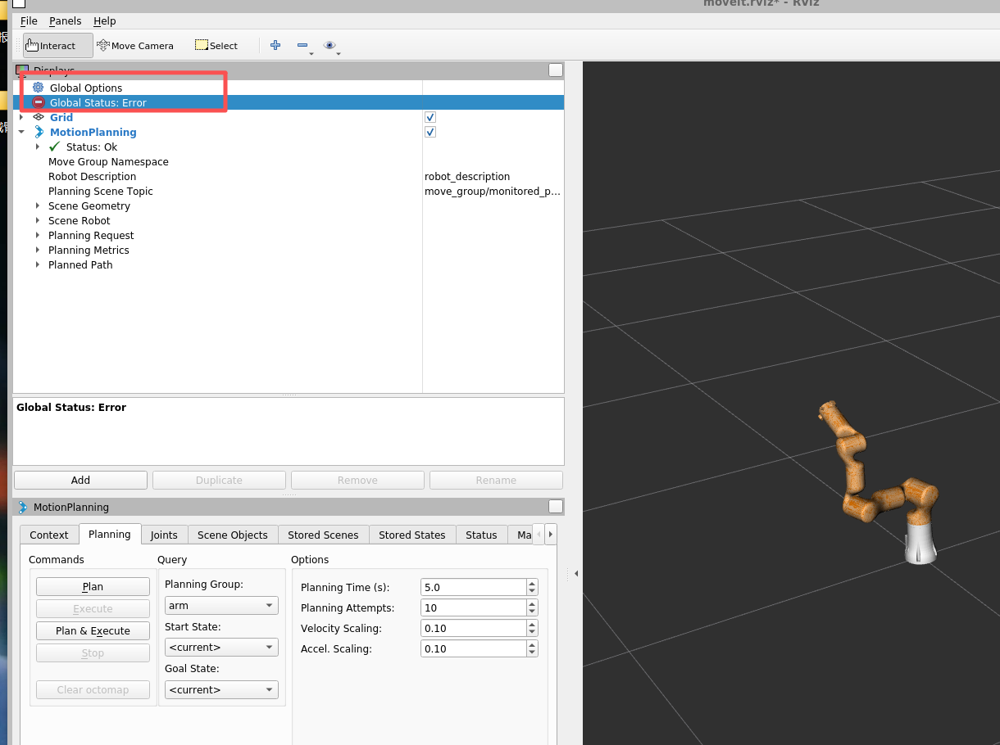

### Assistant 29

先别急，这个 `Global Status: Error` 不一定代表 MoveIt 不能用。你图里 `MotionPlanning Status: Ok`，机械臂也已经显示出来了；我们先查它到底是哪一个 display 报错，常见是 `Grid` 的 fixed frame / TF 小问题。

### Assistant 29

查到了：ROS 数据都是正常的，`/joint_states` 和 `/tf` 都在更新。报错原因是 RViz 配置里的 `Fixed Frame` 还写着 `dummy`，但真实机械臂这套 URDF/TF 的根坐标是 `base_link`，所以全局状态会报错。

### Assistant 29

原因找到了：RViz 的 `Fixed Frame` 现在是 `dummy`，但真实机械臂发布的 TF 是从 `base_link` 开始的：

```text
base_link -> link1 -> link2 -> ... -> link7
```

所以 RViz 找不到 `dummy`，`Global Status` 就会变成 Error。

我已经把默认配置改好了：

[moveit.rviz](/home/ros/ws_rm_75_6f_robot/src/rm_75_robot/rm_75_moveit_config/launch/moveit.rviz:651)

```yaml
Fixed Frame: base_link
```

你当前已经打开的 RViz 还没重新加载配置，所以现在手动处理一下：

1. 展开左侧 `Global Options`
2. 找到 `Fixed Frame`
3. 把 `dummy` 改成：

```text
base_link
```

改完后 `Global Status` 应该变成 OK。

这不是机械臂连接问题，连接是正常的：`/joint_states` 正在发布，`/tf` 也正常，MoveIt 后端也是 OK。

### User 30

好的，已经ok了，现在应该简单的让机械臂关节动一下，先运动一下后面三个关节角吧，注意速度，别快，应该慢一点，现在应该怎么处理？

### Assistant 30

可以，下一步我们用 MoveIt 做一个“极小幅度腕部动作”。我会先做成脚本，默认只规划不执行；确认 Plan 成功、目标角度很小之后，再用 `--execute` 执行，这样比较稳。后面三个关节就是 `joint5 joint6 joint7`，每个先动 `0.03 rad`，大概 1.7 度，速度/加速度都压到 `0.05`。

### Assistant 30

当前关节反馈还在稳定更新。现在我新建一个专门用于实物小幅测试的脚本：默认只 `Plan`，不会执行；只有加 `--execute` 才会真的发轨迹。

### Assistant 30

脚本已加好。我先跑一次“只规划不执行”的 dry run，看看 MoveIt 给出的目标和轨迹是否正常；这一步不会动实物机械臂。

### Assistant 30

可以，dry run 已经成功了，机械臂还没动。

这次计划是只动后 3 个关节：

```text
joint5 +0.03 rad
joint6 +0.03 rad
joint7 +0.03 rad
```

大概每个只动 `1.7°`，速度/加速度都是 `0.05`，很慢。MoveIt 规划结果正常：

```text
Plan success: True
MoveIt code: SUCCESS
Trajectory points: 2
```

现在执行前你确认三件事：

1. 机械臂末端附近没有人、线缆、桌面、障碍物。
2. 急停按钮在你手边，能随时按。
3. RViz 里当前白色机械臂和真实机械臂姿态一致。

确认后执行这个命令：

```bash
cd /home/ros/ws_rm_75_6f_robot
source devel/setup.bash
rosrun rm_75_demo real_wrist_small_step.py --delta 0.03 --velocity 0.05 --acceleration 0.05 --execute
```

注意：不要点 RViz 的 `Plan & Execute`，我们先用这个脚本做第一次小幅实物动作。

### User 31

ros@WWCG:~/ws_rm_75_6f_robot$ source devel/setup.bash
ros@WWCG:~/ws_rm_75_6f_robot$ rosrun rm_75_demo real_wrist_small_step.py --delta 5 --velocity 0.05 --acceleration 0.05 --execute
[WARN] [1779792561.331525778]: Link 'bottom_link' is not known to URDF. Cannot disable/enable collisons.
[WARN] [1779792561.335100878]: Link 'bottom_link' is not known to URDF. Cannot disable/enable collisons.
[WARN] [1779792561.335185678]: Link 'bottom_link' is not known to URDF. Cannot disable/enable collisons.
[WARN] [1779792561.335225078]: Link 'bottom_link' is not known to URDF. Cannot disable/enable collisons.
[INFO] [1779792561.335356278]: Loading robot model 'rm_75_6f_description'...
[INFO] [1779792561.335389878]: No root/virtual joint specified in SRDF. Assuming fixed joint
[WARN] [1779792561.523235276]: The root link base_link has an inertia specified in the URDF, but KDL does not support a root link with an inertia.  As a workaround, you can add an extra dummy link to your URDF.
[INFO] [1779792562.568175763]: Ready to take commands for planning group arm.
Planning group: arm
Mode: EXECUTE
Velocity scaling: 0.05
Acceleration scaling: 0.05
Delta for joint5-7: 5.0000 rad
Current joints: [1.7796, -1.4267, 0.0195, 1.4702, -1.7668, -1.1772, 0.5905]
Target joints:  [1.7796, -1.4267, 0.0195, 1.4702, 3.2332, 3.8228, 5.5905]
Traceback (most recent call last):
  File "/home/ros/ws_rm_75_6f_robot/src/rm_75_robot/rm_75_demo/scripts/real_wrist_small_step.py", line 125, in <module>
    sys.exit(main())
  File "/home/ros/ws_rm_75_6f_robot/src/rm_75_robot/rm_75_demo/scripts/real_wrist_small_step.py", line 92, in main
    group.set_joint_value_target(dict(zip(JOINT_NAMES, target)))
  File "/opt/ros/noetic/lib/python3/dist-packages/moveit_commander/move_group.py", line 277, in set_joint_value_target
    raise MoveItCommanderException(
moveit_commander.exception.MoveItCommanderException: Error setting joint target. Is the target within bounds?
这是什么意思？现在执行的是什么？

### Assistant 31

这个报错是好事：你把 `--delta` 写成了 `5`，单位是弧度，不是度。`5 rad` 约等于 `286°`，目标角度超出关节限制，所以 MoveIt 在 `set_joint_value_target` 阶段直接拒绝了；它还没进入 `plan()`，更没进入 `execute()`，所以这次没有发运动轨迹。先别再运行，我马上给脚本加一道硬保护，防止这种误输入。

### Assistant 31

关节反馈还在正常更新，角度也基本还是原来的值，确认没有发生那次 5 rad 的执行。现在我给脚本加上 `MAX_DELTA = 0.10 rad` 的硬限制，超过大约 5.7 度就直接退出，并且把速度/加速度也限制在 0 到 0.2 之间。

### Assistant 31

保护已经加上了。我先用你刚才那个危险输入跑一次，确认它现在会被脚本自己拦住，而不是走到 MoveIt。

### Assistant 31

这次没有执行任何运动，放心。

你刚才输入的是：

```bash
--delta 5
```

这里的单位是 **弧度 rad**，不是角度 degree。`5 rad` 大约是 `286°`，所以目标变成了：

```text
joint5: -1.7668 -> 3.2332
joint6: -1.1772 -> 3.8228
joint7:  0.5905 -> 5.5905
```

这些目标超出了关节范围，所以 MoveIt 在这一步就报错了：

```text
Error setting joint target. Is the target within bounds?
```

报错位置在：

```python
group.set_joint_value_target(...)
```

也就是说：**它还没有规划，更没有 execute，没有轨迹发给机械臂。**

我已经给脚本加了硬保护，现在超过 `0.10 rad`，也就是约 `5.7°`，会直接拒绝运行。你刚才那条命令现在会被拦住。

正确的小幅执行命令是：

```bash
cd /home/ros/ws_rm_75_6f_robot
source devel/setup.bash
rosrun rm_75_demo real_wrist_small_step.py --delta 0.03 --velocity 0.05 --acceleration 0.05 --execute
```

这里 `0.03 rad` 约等于 `1.7°`，是我们第一次实物测试比较合适的量。

### User 32

rosrun rm_75_demo real_wrist_small_step.py --delta 0.1 --velocity 0.05 --acceleration 0.05 --execute
[WARN] [1779792759.441098674]: Link 'bottom_link' is not known to URDF. Cannot disable/enable collisons.
[WARN] [1779792759.444181672]: Link 'bottom_link' is not known to URDF. Cannot disable/enable collisons.
[WARN] [1779792759.444252472]: Link 'bottom_link' is not known to URDF. Cannot disable/enable collisons.
[WARN] [1779792759.444265572]: Link 'bottom_link' is not known to URDF. Cannot disable/enable collisons.
[INFO] [1779792759.444412572]: Loading robot model 'rm_75_6f_description'...
[INFO] [1779792759.444450372]: No root/virtual joint specified in SRDF. Assuming fixed joint
[WARN] [1779792759.620596857]: The root link base_link has an inertia specified in the URDF, but KDL does not support a root link with an inertia.  As a workaround, you can add an extra dummy link to your URDF.
[INFO] [1779792760.821152113]: Ready to take commands for planning group arm.
Planning group: arm
Mode: EXECUTE
Velocity scaling: 0.05
Acceleration scaling: 0.05
Delta for joint5-7: 0.1000 rad
Current joints: [1.7796, -1.4266, 0.0195, 1.4702, -1.7668, -1.1772, 0.5905]
Target joints:  [1.7796, -1.4266, 0.0195, 1.4702, -1.6668, -1.0772, 0.6905]
Plan success: True
MoveIt code:   SUCCESS
Trajectory points: 3
Executing tiny wrist trajectory...
Execute result: True
After joints:   [1.7792, -1.4263, 0.0194, 1.4698, -1.6664, -1.0770, 0.6898]
这个ok吗？我现在发的命令是什么意思啊

### Assistant 32

是 OK 的，这次执行成功了，而且反馈角度基本到位。

你发的命令是：

```bash
rosrun rm_75_demo real_wrist_small_step.py --delta 0.1 --velocity 0.05 --acceleration 0.05 --execute
```

意思是：

- `rosrun rm_75_demo real_wrist_small_step.py`  
  运行我们写的 MoveIt 实物小幅测试脚本。

- `--delta 0.1`  
  让后面三个关节 `joint5、joint6、joint7` 在当前角度基础上各增加 `0.1 rad`。  
  `0.1 rad ≈ 5.73°`。

- `--velocity 0.05`  
  速度缩放为 5%，也就是用 MoveIt 允许最大速度的 5%，比较慢。

- `--acceleration 0.05`  
  加速度缩放为 5%，起停也比较柔和。

- `--execute`  
  真正执行。没有这个参数时，只规划，不会动机械臂。

这次从日志看：

```text
Current joints:
joint5 = -1.7668
joint6 = -1.1772
joint7 =  0.5905
```

目标是：

```text
joint5 = -1.6668
joint6 = -1.0772
joint7 =  0.6905
```

也就是后 3 个关节各加了 `0.1 rad`。

执行后反馈：

```text
joint5 = -1.6664
joint6 = -1.0770
joint7 =  0.6898
```

和目标非常接近，说明：

```text
MoveIt -> rm_75_control -> rm_driver -> 实物机械臂 -> joint_states反馈
```

这整条链路已经跑通了。下一步建议做反方向：

```bash
rosrun rm_75_demo real_wrist_small_step.py --delta -0.1 --velocity 0.05 --acceleration 0.05 --execute
```

这样机械臂后 3 个关节会慢慢回到刚才的位置附近。

### User 33

我咋感觉机械臂没动呢？是角度太小了吗？要不现在动第六关节，动20°？

### Assistant 33

你感觉没动很正常：刚才是 `joint5/6/7` 各动 5.7°，而且腕部旋转有些是“绕自身轴转”，视觉上不明显；但反馈角度已经变了，说明实物确实收到了并到位。现在可以专门动 `joint6`，20° 大约是 `0.349 rad`，我先给你做一个单关节脚本，默认先 Plan，不执行。

### Assistant 33

单关节脚本加好了，最大只允许 20°，并且支持正负方向。现在我先跑 `joint6 +20°` 的 dry run，只规划不执行，看它目标有没有越界、规划是否成功。

### Assistant 33

可以，`joint6 +20°` 的 dry run 已经规划成功了，还没有执行。

它的含义是：

```text
只动 joint6
当前 joint6: -1.0771 rad
目标 joint6: -0.7280 rad
变化量: +0.3491 rad = +20°
速度: 5%
加速度: 5%
```

MoveIt 返回：

```text
Plan success: True
MoveIt code: SUCCESS
Trajectory points: 3
```

你现在如果要真的让它动，执行：

```bash
cd /home/ros/ws_rm_75_6f_robot
source devel/setup.bash
rosrun rm_75_demo real_single_joint_step.py --joint joint6 --degrees 20 --velocity 0.05 --acceleration 0.05 --execute
```

如果想反方向回来，就执行：

```bash
rosrun rm_75_demo real_single_joint_step.py --joint joint6 --degrees -20 --velocity 0.05 --acceleration 0.05 --execute
```

注意看好机械臂周围空间，急停放手边。`joint6` 是腕部关节，20° 应该比刚才明显很多。

### User 34

可以了，动起来了，我可以试试moviet进行plan和execute吗？

### Assistant 34

可以试，但先按“很保守”的方式来。

你现在已经确认脚本链路能执行，说明 MoveIt 的执行通道是通的。RViz 里可以试 `Plan` / `Execute`，但第一次不要拖末端很远，也不要用 random target。

建议这样做：

1. RViz 左下角设置：

```text
Velocity Scaling: 0.05
Accel. Scaling:   0.05
Planning Group:   arm
Start State:      <current>
Goal State:       <current>
```

2. 先只点 `Plan`。  
看橙色目标/轨迹有没有离谱，有没有穿桌子、绕大圈、突然翻腕。

3. 如果 Plan 看起来很小、很合理，再点 `Execute`。  
不要一上来点 `Plan & Execute`，先把规划和执行分开。

4. 第一次建议只在 `Joints` 标签页里改一个关节的小角度。  
比如 `joint6` 改 `0.1~0.2 rad`，也就是 6° 到 11° 左右，比拖末端更可控。

5. 观察终端和实物：
   - 机械臂是否慢速运动
   - RViz 白色当前模型是否跟着变
   - 如果有抖动、方向不对、动作过大，立刻急停或点 Stop

可以先不要拖末端姿态球。拖末端会触发 IK，可能多个关节一起大幅调整；刚开始实物调试，优先用 `Joints` 面板单关节小幅动作。

### User 35

现在休息，怎么关闭这个rviz呢？没有ctrl c终止啊，叉掉页面框吗

### Assistant 35

可以，直接点 RViz 窗口右上角的 `X` 关掉就行。

如果你想把这次实物调试相关 ROS 都关掉，按这个顺序比较干净：

1. 关 RViz 窗口。
2. 在我启动的这些终端里按 `Ctrl+C`：
   - `move_group`
   - `rm_75_control`
   - `rm_driver`
   - `roscore`

如果你不知道哪些还在跑，也可以查一下：

```bash
rosnode list
```

然后温和关闭节点：

```bash
rosnode kill /move_group
rosnode kill /rm_75_control
rosnode kill /robot_driver
```

最后如果 `roscore` 还在，就在它的终端按 `Ctrl+C`。

机械臂实物这边：如果只是休息，不一定要断电；但请确保没有程序还在发命令，RViz/MoveIt/control/driver 都关掉会更安心。

### User 36

rosnode list
/move_group
/rm_75_control
/robot_driver
/robot_state_publisher
/rosout

### Assistant 36

这些节点就是刚才实物调试链路的剩余部分。我直接帮你把我这边启动的 RViz / MoveIt / control / driver / roscore 按顺序停掉，停完再确认 ROS 节点列表。

### Assistant 36

这几个后台会话的 stdin 已经关了，不能像终端那样发 Ctrl+C。我们用 ROS 自己的 `rosnode kill` 温和关闭节点。

### Assistant 36

`robot_state_publisher` 又冒出来了，说明它背后的 `roslaunch demo_realrobot.launch` 还在负责 respawn。我要把对应 roslaunch 进程停掉，再确认一次。

### Assistant 36

系统进程里已经看不到对应 roslaunch/节点进程了，剩下这个多半是 ROS master 里还没清掉的旧注册信息。我跑一下 `rosnode cleanup` 清缓存。

### Assistant 36

找到了，`demo_realrobot.launch use_rviz:=false` 还在后台挂着，所以它一直拉起 `robot_state_publisher`。我停掉这个 launch，再停 roscore。

### Assistant 36

现在只剩 `/rosout`，说明机械臂驱动、控制器、MoveIt 都已经停了。最后把 `roscore` 也停掉，休息模式就干净了。

### Assistant 36

已经关干净了。

你刚才看到的是：

```text
/move_group
/rm_75_control
/robot_driver
/robot_state_publisher
/rosout
```

我已经依次停掉了：

```text
/move_group
/rm_75_control
/robot_driver
/robot_state_publisher
roscore / rosmaster
```

最后确认没有残留的 `rviz`、`move_group`、`rm_driver`、`rm_control`、`robot_state_publisher`、`roscore` 进程了。

现在可以放心休息。机械臂这边如果还通电，保持周围安全、不要再运行 ROS 命令就行；要长时间离开就按你们设备规范下电。

### User 37

总结一下，现在如何ros连通实物机械臂，如何发送角度命令？如何发送moviet命令？中间有什么流程，发布什么话题，关闭需要注意什么？写一个txt放在/home/ros/ws_rm_75_6f_robot/study这里面

### Assistant 37

我来把今天这条“ROS 连接实物 RM75-6F、发角度、走 MoveIt、关闭”的流程整理成一个学习笔记，放到 `study` 目录里。内容会按你之后复现时最需要的顺序写：启动、验证、命令、话题链路、关闭。

### Assistant 37

已整理好了，放在这里：

[rm75_6f_real_robot_ros_notes.txt](/home/ros/ws_rm_75_6f_robot/study/rm75_6f_real_robot_ros_notes.txt)

里面包括：

- ROS 如何连接 RM75-6F 实物机械臂
- 启动前网络和安全检查
- `rm_75_control`、`rm_75_driver`、MoveIt、RViz 的启动顺序
- `/joint_states`、`/tf`、`/rm_75/follow_joint_trajectory`、`/rm_driver/JointPos` 的关系
- 如何用脚本发送小角度/单关节角度命令
- 如何用 RViz 的 Plan / Execute
- 常见 warning 的含义
- 关闭流程和清理残留节点的方法

这个文件可以作为你下次实物调试前的 checklist。

### User 38

你看看现在关闭完全没

### Assistant 38

我来查一下当前 ROS master、节点和相关进程，确认有没有残留的 `roscore`、`move_group`、`rm_driver`、`rm_control`、`rviz`。

### Assistant 38

已经完全关掉了。

检查结果：

- 没有 `roscore`
- 没有 `rosmaster`
- 没有 `roslaunch`
- 没有 `rm_driver`
- 没有 `rm_control`
- 没有 `move_group`
- 没有 `robot_state_publisher`
- 没有 `rviz`
- 没有 Gazebo 相关进程

`rosnode list` 返回：

```text
ERROR: Unable to communicate with master!
```

这说明 ROS master 都已经不在了，是正常的“完全关闭”状态。

### User 39

/home/ros/ws_rm_75_6f_robot/src/rm_75_robot/rm_75_demo/scripts/real_single_joint_step.py
解释一下这个代码，加好注释，分好层

### Assistant 39

我先把这个脚本按“参数层、保护层、MoveIt 初始化层、规划层、执行层”重新梳理一下，加注释时会尽量写成你之后复习能直接看懂的版本，不改它现在已经跑通的行为。

### Assistant 39

我会稍微重构成几个清晰函数，而不是只在原地堆注释：输入解析、参数保护、MoveIt 初始化、目标生成、规划、执行。这样脚本的执行链路和 ROS/MoveIt 的分工会更清楚。

### Assistant 39

我刚才重构完先做静态检查，发现执行层里有个变量名需要收一下：函数参数已经传了 `execute`，内部不能再引用外层的 `args`。我马上修掉并跑语法检查。

### Assistant 39

语法检查已经通过。我再跑一下“危险参数拦截”路径，不连 ROS、不初始化 MoveIt，确认保护层仍然先工作。

### Assistant 39

已经给 [real_single_joint_step.py](/home/ros/ws_rm_75_6f_robot/src/rm_75_robot/rm_75_demo/scripts/real_single_joint_step.py) 加好分层注释，并把代码整理成 8 层：

1. `全局配置层`：规划组、关节名、安全限制。
2. `小工具函数层`：格式化输出、兼容 MoveIt 返回值、错误码转名字。
3. `命令行参数层`：解析 `--joint`、`--degrees`、`--velocity`、`--execute`。
4. `MoveIt 初始化层`：初始化 ROS node 和 `MoveGroupCommander("arm")`。
5. `目标关节角生成层`：读取当前关节角，只修改指定关节。
6. `MoveIt 规划层`：设置目标、调用 `plan()`。
7. `执行层`：没有 `--execute` 只 dry run，有才真正执行。
8. `主流程编排层`：把上面各层串起来。

我也做了检查：

```bash
python3 -m py_compile real_single_joint_step.py
```

通过了。

还验证了安全保护仍然生效：

```bash
real_single_joint_step.py --joint joint6 --degrees 30
```

会拒绝运行：

```text
Refusing to run: --degrees 30.00 exceeds +/-20.0.
```

这版代码行为不变，但结构更适合你学习：从 `main()` 往上看，每一步对应实物控制链路里的一个阶段。

### User 40

现在是单角度控制，你能制作一个小脚本，类似于上位机一样，可以调节6个轴的角度呢？

### Assistant 40

可以，这次我做一个“关节调试小面板”脚本，思路像简化版上位机：读取当前角度，显示每个关节角度，支持每个轴 `+/-` 小步进，先 Plan，再 Execute。你说 6 个轴，但我们现在的 RM75 MoveIt 模型是 7 个关节；我会让脚本默认显示 7 个，也支持 `--axes 6` 只显示前 6 个轴。

### Assistant 40

`tkinter` 可用，所以我用 Python 做 GUI 面板，不需要额外安装依赖。这个面板不会拖动滑块就直接发命令，必须点 `Plan` 和 `Execute planned`，这样比“实时跟随滑块”安全。

### Assistant 40

脚本已经加好。我现在给它执行权限并做语法检查，再测试一下命令行参数保护路径，确保不启动 ROS 时也能先拦危险参数。

### Assistant 40

做好了，脚本在这里：

[real_joint_jog_panel.py](/home/ros/ws_rm_75_6f_robot/src/rm_75_robot/rm_75_demo/scripts/real_joint_jog_panel.py)

它是一个简化版“上位机式”关节调试面板：

- 默认支持 7 个关节，符合我们现在 RM75-6F 的 MoveIt 模型。
- 如果你只想显示前 6 个轴，可以加 `--axes 6`。
- 滑条/加减按钮只改“目标角度”，不会立即动。
- 必须先点 `Plan`，再点 `Execute planned` 才会真正执行。
- 单次目标范围限制在同步姿态附近 `±20°`。
- 速度/加速度最大限制 `0.20`，默认 `0.05`。

启动实物链路后运行：

```bash
cd /home/ros/ws_rm_75_6f_robot
source devel/setup.bash
rosrun rm_75_demo real_joint_jog_panel.py --axes 6 --velocity 0.05 --acceleration 0.05
```

如果要显示 7 个关节：

```bash
rosrun rm_75_demo real_joint_jog_panel.py --axes 7 --velocity 0.05 --acceleration 0.05
```

使用顺序：

1. 点 `Sync current`，读取当前真实机械臂角度。
2. 选 `Step deg`，比如 `1.0` 或 `5.0`。
3. 用每个关节的 `+ / -` 或滑条调目标角度。
4. 点 `Plan`。
5. 看 RViz 里规划是否合理。
6. 点 `Execute planned`，确认弹窗后才会动实物。

注意：`Stop MoveIt` 只是发送 MoveIt 的 `stop()`，不是硬件急停。真正紧急情况还是按实体急停按钮。

### User 41

这个需要启动rviz吗roslaunch rm_75_bringup rm_robot.launch arm_ip:=192.168.1.18？

### Assistant 41

要的，按你现在这个 launch：

```bash
roslaunch rm_75_bringup rm_robot.launch arm_ip:=192.168.1.18
```

它会启动：

- `rm_driver`：连接实物机械臂
- `move_group`：MoveIt 后端
- `robot_state_publisher`
- `RViz`

所以它本身就会打开 RViz。

如果你要用我刚写的 `real_joint_jog_panel.py`，推荐还是保留 RViz，因为：

- 面板负责调关节目标和执行
- RViz 负责看当前模型、目标姿态、规划轨迹
- 第一次用 GUI 面板时，最好先在 RViz 里确认 Plan 是否合理

启动顺序：

终端 1：

```bash
cd /home/ros/ws_rm_75_6f_robot
source devel/setup.bash
roslaunch rm_75_control rm_75_control.launch
```

终端 2：

```bash
cd /home/ros/ws_rm_75_6f_robot
source devel/setup.bash
roslaunch rm_75_bringup rm_robot.launch arm_ip:=192.168.1.18
```

终端 3：

```bash
cd /home/ros/ws_rm_75_6f_robot
source devel/setup.bash
rosrun rm_75_demo real_joint_jog_panel.py --axes 6 --velocity 0.05 --acceleration 0.05
```

如果后面你想“不打开 RViz，只用小面板”，也可以改 launch 或直接启动 `demo_realrobot.launch use_rviz:=false`，但现在学习阶段建议开着 RViz。

### User 42

你这个脚本做了哪些限制？

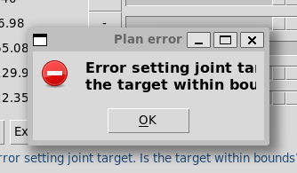

### Assistant 42

这个弹窗的意思是：脚本自己的“面板范围限制”通过了，但 MoveIt 在检查 URDF/SRDF 的真实关节上下限时发现目标角度越界，所以拒绝设置目标。也就是说还没规划、没执行、机械臂没动。我先看一下 6F 的关节上下限，然后把脚本补成“按每个关节真实上下限自动限幅/提示”。

### Assistant 42

现在这个版本的限制其实有两层：一层是我自己写的“面板限制”，另一层是 MoveIt/URDF 的“真实关节限制”。你碰到的就是第二层。我正在把第二层也接进面板，让滑条本身就不能拖到 MoveIt 不接受的位置。

### Assistant 42

我把 URDF 关节上下限接进脚本了：同步当前姿态后，每个关节滑条会取“±20°面板范围”和“真实关节上下限”的交集。也就是说如果某个关节已经靠近极限，滑条正方向/负方向会自动缩短。现在做语法检查。

### Assistant 42

这个弹窗表示：**目标关节角超出了 MoveIt/URDF 的关节上下限**。它发生在 `Plan` 阶段，**还没有执行，机械臂没动**。

这个脚本现在有这些限制：

1. **不实时下发**
   你拖滑条、点 `+/-` 只是在改目标角度，不会马上动机械臂。必须：
   `Plan` -> `Execute planned`

2. **速度/加速度限制**
   默认：

   ```text
   velocity = 0.05
   acceleration = 0.05
   ```

   最大只允许到：

   ```text
   0.20
   ```

3. **面板调节范围限制**
   默认每个关节只允许在当前同步姿态附近：

   ```text
   ±20°
   ```

   超过不让设。

4. **轴数限制**
   只能显示：

   ```text
   --axes 6
   --axes 7
   ```

5. **必须重新 Plan**
   只要你改了目标角度，旧的 plan 就作废，必须重新点 `Plan`。

6. **Execute 前二次确认**
   点 `Execute planned` 会弹确认框，不会直接执行。

7. **新增：URDF 关节上下限限制**
   我刚刚又补了一层：脚本会读取 `/robot_description` 里的真实关节限制，然后自动缩短滑条范围，避免拖出 MoveIt 允许范围。

RM75-6F 当前 URDF 里大概是：

```text
joint1: -177.6° ~ 177.6°
joint2: -130.0° ~ 130.0°
joint3: -177.6° ~ 177.6°
joint4: -134.9° ~ 134.9°
joint5: -177.6° ~ 177.6°
joint6: -127.9° ~ 127.9°
joint7: -359.8° ~ 359.8°
```

你现在这个弹窗应该是旧脚本窗口触发的。关掉当前小面板，重新运行：

```bash
rosrun rm_75_demo real_joint_jog_panel.py --axes 6 --velocity 0.05 --acceleration 0.05
```

新版面板会多一列 `URDF limit deg`，并且滑条会按真实关节上下限自动限幅。

### User 43

Proxy enabled. Target: 172.24.176.1:7897
ros@WWCG:~$ cd /home/ros/ws_rm_75_6f_robot
ros@WWCG:~/ws_rm_75_6f_robot$ source devel/setup.bash
ros@WWCG:~/ws_rm_75_6f_robot$ rostopic list
/MoveJ_P_Cmd
/attached_collision_object
/chassis_topic
/collision_object
/execute_trajectory/cancel
/execute_trajectory/feedback
/execute_trajectory/goal
/execute_trajectory/result
/execute_trajectory/status
/joint_states
/move_group/cancel
/move_group/display_contacts
/move_group/display_cost_sources
/move_group/display_grasp_markers
/move_group/display_planned_path
/move_group/feedback
/move_group/goal
/move_group/monitored_planning_scene
/move_group/motion_plan_request
/move_group/ompl/parameter_descriptions
/move_group/ompl/parameter_updates
/move_group/plan_execution/parameter_descriptions
/move_group/plan_execution/parameter_updates
/move_group/planning_scene_monitor/parameter_descriptions
/move_group/planning_scene_monitor/parameter_updates
/move_group/result
/move_group/sense_for_plan/parameter_descriptions
/move_group/sense_for_plan/parameter_updates
/move_group/status
/move_group/trajectory_execution/parameter_descriptions
/move_group/trajectory_execution/parameter_updates
/pickup/cancel
/pickup/feedback
/pickup/goal
/pickup/result
/pickup/status
/place/cancel
/place/feedback
/place/goal
/place/result
/place/status
/planning_scene
/planning_scene_world
/recognized_object_array
/rm_75/follow_joint_trajectory/cancel
/rm_75/follow_joint_trajectory/feedback
/rm_75/follow_joint_trajectory/goal
/rm_75/follow_joint_trajectory/result
/rm_75/follow_joint_trajectory/status
/rm_driver/Arm_Analog_Output
/rm_driver/Arm_Digital_Output
/rm_driver/Arm_IO_State
/rm_driver/Arm_JointTeach
/rm_driver/Arm_PosTeach
/rm_driver/Arm_StopTeach
/rm_driver/Emergency_Stop
/rm_driver/GetArmStateTimerSwitch
/rm_driver/Gripper_Pick
/rm_driver/Gripper_Set
/rm_driver/Hand_SetAngle
/rm_driver/Hand_SetForce
/rm_driver/Hand_SetPosture
/rm_driver/Hand_SetSeq
/rm_driver/Hand_SetSpeed
/rm_driver/IO_Update
/rm_driver/JointPos
/rm_driver/Joint_Enable
/rm_driver/Lift_SetHeight
/rm_driver/Lift_SetSpeed
/rm_driver/MoveC_Cmd
/rm_driver/MoveJ_Cmd
/rm_driver/MoveL_Cmd
/rm_driver/Plan_State
/rm_driver/Tool_Analog_Output
/rm_driver/Tool_Digital_Output
/rm_driver/Tool_IO_State
/rosout
/rosout_agg
/rviz_WWCG_22429_8906258894141981406/motionplanning_planning_scene_monitor/parameter_descriptions
/rviz_WWCG_22429_8906258894141981406/motionplanning_planning_scene_monitor/parameter_updates
/rviz_moveit_motion_planning_display/robot_interaction_interactive_marker_topic/feedback
/rviz_moveit_motion_planning_display/robot_interaction_interactive_marker_topic/update
/rviz_moveit_motion_planning_display/robot_interaction_interactive_marker_topic/update_full
/tf
/tf_static
/trajectory_execution_event
ros@WWCG:~/ws_rm_75_6f_robot$ rostopic echo -n1 /joint_states
header: 
  seq: 2221
  stamp: 
    secs: 1779850022
    nsecs: 496339271
  frame_id: ''
name: 
  - joint1
  - joint2
  - joint3
  - joint4
  - joint5
  - joint6
  - joint7
position: [1.779359080886841, -1.0513450595855713, 0.059330001664161684, 1.1690277839660645, -1.1358380096435547, -2.2682033798217773, -0.39000750665664674]
velocity: []
effort: []
---
ros@WWCG:~/ws_rm_75_6f_robot$ rosrun rm_75_demo real_single_joint_step.py --joint joint6 --degrees 20 --velocity 0.05 --acceleration 0.05 --execute
[WARN] [1779850104.948057069]: Link 'bottom_link' is not known to URDF. Cannot disable/enable collisons.
[WARN] [1779850104.949970969]: Link 'bottom_link' is not known to URDF. Cannot disable/enable collisons.
[WARN] [1779850104.950051569]: Link 'bottom_link' is not known to URDF. Cannot disable/enable collisons.
[WARN] [1779850104.950103569]: Link 'bottom_link' is not known to URDF. Cannot disable/enable collisons.
[INFO] [1779850104.950229569]: Loading robot model 'rm_75_6f_description'...
[INFO] [1779850104.950301869]: No root/virtual joint specified in SRDF. Assuming fixed joint
[WARN] [1779850105.132246773]: The root link base_link has an inertia specified in the URDF, but KDL does not support a root link with an inertia.  As a workaround, you can add an extra dummy link to your URDF.
[INFO] [1779850106.318605298]: Ready to take commands for planning group arm.
Planning group: arm
Mode: EXECUTE
Joint: joint6
Delta: 20.00 deg / 0.3491 rad
Velocity scaling: 0.05
Acceleration scaling: 0.05
Current joints: [1.7794, -1.0513, 0.0593, 1.1690, -1.1358, -2.2682, -0.3900]
Target joints:  [1.7794, -1.0513, 0.0593, 1.1690, -1.1358, -1.9192, -0.3900]
Plan success: True
MoveIt code:   SUCCESS
Trajectory points: 4
Executing single-joint trajectory...
Execute result: True
After joints:   [1.7788, -1.0513, 0.0593, 1.1690, -1.1358, -2.2682, -0.3900]
我还没有采用脚本，现在输入角度命令，实物机械臂没有执行，这应该怎么处理，你顺便带我走一遍，看看怎么排错

### Assistant 43

先停一下，不要连续重发更大的角度。你这段日志里最关键的不是 `Execute result: True`，而是最后这一行：`After joints` 里 joint6 仍然是 `-2.2682`，说明 MoveIt/action 层认为执行完成了，但实物反馈没有变化。我们按链路一层层查：MoveIt 是否发了轨迹、rm_75_control 是否转成 `/rm_driver/JointPos`、rm_driver/机械臂是否接受。

### Assistant 43

节点连接关系是对的：`move_group -> /rm_75/follow_joint_trajectory -> rm_75_control -> /rm_driver/JointPos -> rm_driver` 这条链路还在。现在还有两个线索：`/rm_driver/Plan_State` 没有返回，且 joint6 当前是 `-2.268 rad`，比 URDF 里的 joint6 下限 `-2.233 rad` 还低一点，已经贴近/越过 MoveIt 模型边界了。接下来我看一下 `rm_75_control` 对 action 结果是怎么判定的，判断 `Execute True` 是不是只是 action 层返回。

### Assistant 43

这里能解释 `Execute result: True` 的原因了：`rm_75_control` 代码最后无条件 `as->setSucceeded()`，它并没有等真实机械臂反馈到目标位再判断成功。所以 `True` 只能说明 action server 流程结束，不等于实物一定动了。我们继续看 rm_driver 日志里有没有 `JointPos failed`，这会告诉我们底层是否拒绝了角度透传。

### Assistant 43

还有一个很重要的代码细节：`rm_75_control` 只在轨迹点数 `point_num > 3` 时才会真的插值并发布 `/rm_driver/JointPos`；如果 MoveIt 给的是 2 或 3 个点，它最后仍然会 `setSucceeded()`，但实际上不发角度。这会造成“Execute True 但机械臂不动”。你这次显示 4 个点，理论上应该发了；我继续看底层 `Movej_CANFD` 和日志。

### Assistant 43

我会顺手把 `real_single_joint_step.py` 加一个“反馈校验”：以后不是只打印 `Execute True`，还会比较执行后真实 `/joint_states` 是否接近目标；如果没动，会明确报“action 成功但实物反馈未到位”。这样不会再被 `Execute result: True` 误导。

### Assistant 43

刚才加校验函数后，还需要让执行函数把 `after joints` 返回给主流程。我继续补这个小改动。

### Assistant 43

还有一个官方控制器的小坑：`rm_75_control` 代码里只处理轨迹点数大于 3 的轨迹，2/3 个点会被忽略但仍返回成功。我把脚本也补成遇到 `Trajectory points <= 3` 就拒绝执行，避免再出现假成功。

### Assistant 43

你这次的现象可以这样理解：

`MoveIt` 规划成功了，`rm_75_control` 的 action 也返回了成功，所以脚本显示：

```text
Execute result: True
```

但真实反馈里 joint6 没变：

```text
目标 joint6: -1.9192
反馈 joint6: -2.2682
```

所以结论是：**MoveIt/action 层结束了，但实物没有实际到位**。这里不能只看 `Execute result: True`。

我刚才查了代码，发现两个关键点：

1. `rm_75_control` 最后会 `as->setSucceeded()`，它不等真实机械臂反馈到目标位。
2. `rm_75_control` 只处理轨迹点数 `> 3` 的轨迹；如果 MoveIt 只给 2 或 3 个点，它可能不发布 `/rm_driver/JointPos`，但仍然返回成功。

我已经把 [real_single_joint_step.py](/home/ros/ws_rm_75_6f_robot/src/rm_75_robot/rm_75_demo/scripts/real_single_joint_step.py) 改了两点：

- 如果轨迹点数 `<= 3`，直接拒绝执行。
- 执行后会比较目标角和真实 `/joint_states`，如果没到位，会明确警告。

另外你现在的 joint6 很可疑：

```text
joint6 = -2.2682 rad
```

而 URDF 里 joint6 下限大约是：

```text
-2.233 rad
```

也就是说它现在已经贴近甚至略过 MoveIt 模型下限。先不要继续拿 joint6 做大动作测试。

你按这个顺序排错：

**1. 先测试链路有没有发出角度**

终端 A：

```bash
cd /home/ros/ws_rm_75_6f_robot
source devel/setup.bash
rostopic echo /rm_driver/JointPos
```

终端 B 执行一个很小的、非 joint6 的动作，比如 joint7：

```bash
rosrun rm_75_demo real_single_joint_step.py --joint joint7 --degrees 5 --velocity 0.05 --acceleration 0.05 --execute
```

看终端 A：

- 如果 `/rm_driver/JointPos` 有连续输出，说明 `MoveIt -> rm_75_control` 正常。
- 如果没有输出，说明卡在 `rm_75_control`，多半是轨迹点数太少或 action 没进插值。

**2. 看执行后反馈**

```bash
rostopic echo -n1 /joint_states
```

如果 joint7 变了，说明整体链路正常，只是 joint6 当前处在边界/受限状态。

如果 joint7 也不变，但 `/rm_driver/JointPos` 有输出，说明问题在：

```text
rm_driver -> 机械臂控制器
```

重点查：

- 机械臂是否仍在以太网控制模式
- 是否有错误/保护/限位
- 关节是否使能
- rm_driver 终端有没有 `JointPos failed`
- 示教器/上位机有没有占用控制权

**3. 看底层是否报错**

```bash
grep -R "JointPos failed\|Real Arm Trajectory Planning Error" -n ~/.ros/log/latest
```

现在建议你先用 `joint7 5°` 测，不要继续用 joint6。joint6 当前太贴边，容易把“链路问题”和“关节限位/保护问题”混在一起。

### User 44

我现在在rviz里面直接moviet也不动啊，请你检查一下哪里有问题

### Assistant 44

先别继续反复点 Execute，我们按链路定位。RViz 里 MoveIt 不动，要分清三种情况：MoveIt 根本没发轨迹、`rm_75_control` 收到了但没转发 `/rm_driver/JointPos`、或者 `rm_driver` 发给机械臂后被实物控制器拒绝。我先做不让机械臂动的状态检查。

### User 44

rosrun rm_75_demo real_single_joint_step.py --joint joint6 --degrees -20 --velocity 0.05 --acceleration 0.05 --execute
[WARN] [1779850665.131823234]: Link 'bottom_link' is not known to URDF. Cannot disable/enable collisons.
[WARN] [1779850665.134740634]: Link 'bottom_link' is not known to URDF. Cannot disable/enable collisons.
[WARN] [1779850665.134883134]: Link 'bottom_link' is not known to URDF. Cannot disable/enable collisons.
[WARN] [1779850665.134964434]: Link 'bottom_link' is not known to URDF. Cannot disable/enable collisons.
[INFO] [1779850665.135308434]: Loading robot model 'rm_75_6f_description'...
[INFO] [1779850665.135381334]: No root/virtual joint specified in SRDF. Assuming fixed joint
[WARN] [1779850665.318350715]: The root link base_link has an inertia specified in the URDF, but KDL does not support a root link with an inertia.  As a workaround, you can add an extra dummy link to your URDF.
[INFO] [1779850666.414427501]: Ready to take commands for planning group arm.
Planning group: arm
Mode: EXECUTE
Joint: joint6
Delta: -20.00 deg / -0.3491 rad
Velocity scaling: 0.05
Acceleration scaling: 0.05
Current joints: [1.7794, -1.0513, 0.0593, 1.1690, -1.1358, -2.2682, -0.3900]
Target joints:  [1.7794, -1.0513, 0.0593, 1.1690, -1.1358, -2.6173, -0.3900]
Traceback (most recent call last):
  File "/home/ros/ws_rm_75_6f_robot/src/rm_75_robot/rm_75_demo/scripts/real_single_joint_step.py", line 320, in <module>
    sys.exit(main())
  File "/home/ros/ws_rm_75_6f_robot/src/rm_75_robot/rm_75_demo/scripts/real_single_joint_step.py", line 307, in main
    plan = plan_target(group, target)
  File "/home/ros/ws_rm_75_6f_robot/src/rm_75_robot/rm_75_demo/scripts/real_single_joint_step.py", line 206, in plan_target
    group.set_joint_value_target(dict(zip(JOINT_NAMES, target)))
  File "/opt/ros/noetic/lib/python3/dist-packages/moveit_commander/move_group.py", line 277, in set_joint_value_target
    raise MoveItCommanderException(
moveit_commander.exception.MoveItCommanderException: Error setting joint target. Is the target within bounds?？

### Assistant 44

这个 `-20°` 是往更负方向走了，joint6 当前已经在 `-2.268 rad` 附近，再减 20° 会到 `-2.617 rad`，肯定超下限，所以 MoveIt 直接拒绝。想让 joint6 从下限附近回来，应该是 `+20°`，不是 `-20°`。我继续把刚才的检查结果收完。

### Assistant 44

根因找到了：现在节点列表里没有 `/rm_75_control`，而且 `/rm_75/follow_joint_trajectory/goal` 这个 action 话题都不存在。也就是说 RViz/MoveIt 后端在，但真正把 MoveIt 轨迹转成 `/rm_driver/JointPos` 的控制器没启动。`rm_robot.launch` 只启动 driver + MoveIt，不会单独启动 `rm_75_control`。我现在帮你启动它，启动后再查 action 是否出现。

### User 44

？

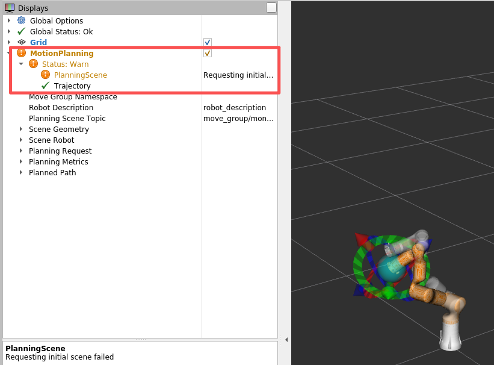

### Assistant 44

这个截图里的 Warn 先不用慌，它不是实物驱动断了。刚才真正导致“不动”的问题已经确定：`/rm_75_control` 没启动。现在我已经启动了它，并确认 action 和 `/rm_driver/JointPos` 都接上了。这个 RViz 的 `PlanningScene: Requesting initial scene failed` 多半是 RViz 插件刚启动时没拿到 move_group 的初始场景，我再查一下 move_group 的 service 是否正常。

### Assistant 44

问题找到了：刚才你这套 ROS 里 **没有启动 `/rm_75_control`**。

你当时的节点只有：

```text
/move_group
/rm_driver
/robot_state_publisher
/rviz...
```

缺了最关键的：

```text
/rm_75_control
```

所以 RViz/MoveIt 可以 Plan，但 Execute 没有真正的 action server 接轨迹。现在我已经帮你启动了：

```bash
roslaunch rm_75_control rm_75_control.launch
```

现在链路已经恢复：

```text
/move_group
  -> /rm_75/follow_joint_trajectory
  -> /rm_75_control
  -> /rm_driver/JointPos
  -> /rm_driver
  -> 实物机械臂
```

我也确认了现在有：

```text
/rm_75/follow_joint_trajectory/goal
/rm_driver/JointPos
```

你截图里的 `PlanningScene: Requesting initial scene failed` 不是驱动问题。我测了 `/get_planning_scene` 和 `/move_group/monitored_planning_scene`，都是正常的。RViz 插件有时启动早了会显示这个 Warn。处理方式：

1. 等几秒。
2. 取消勾选再勾选 `MotionPlanning`。
3. 还不行就关掉 RViz 重新开。

另外你刚才这个命令：

```bash
--joint joint6 --degrees -20
```

是不对的方向。你当前 joint6 已经在：

```text
joint6 = -2.268 rad
```

非常接近/略过 URDF 下限：

```text
joint6 lower ≈ -2.233 rad
```

你再 `-20°` 会更往负方向走，所以 MoveIt 报：

```text
Is the target within bounds?
```

这是正常保护。

现在建议你先不要测 joint6，换 joint7 测一个小角度：

```bash
rosrun rm_75_demo real_single_joint_step.py --joint joint7 --degrees 5 --velocity 0.05 --acceleration 0.05 --execute
```

或者在 RViz 里：

1. `Velocity Scaling = 0.05`
2. `Accel Scaling = 0.05`
3. 不要拖末端，先用 Joints 小幅改 `joint7`
4. 先点 `Plan`
5. 再点 `Execute`

下次完整启动顺序一定是三个终端：

```bash
# 终端1
roslaunch rm_75_control rm_75_control.launch
```

```bash
# 终端2
roslaunch rm_75_bringup rm_robot.launch arm_ip:=192.168.1.18
```

```bash
# 终端3，可选
rosrun rm_75_demo real_joint_jog_panel.py --axes 6 --velocity 0.05 --acceleration 0.05
```

核心记住一句：`rm_robot.launch` 不等于完整实物执行链路，它没有单独启动 `rm_75_control`。

### User 45

rm_75_control.launch  rm_robot.launch 介绍一下这两个内容呢

### Assistant 45

我把这两个 launch 和它们背后的节点/话题再对照源码看一遍，然后给你画清楚：哪个负责连机械臂，哪个负责接 MoveIt 轨迹，为什么两个都要开。

### Assistant 45

这两个 launch 分工很明确：一个是“真实机械臂驱动 + MoveIt/RViz”，另一个是“MoveIt 轨迹转发控制器”。**实物执行时两个都要开。**

**1. `rm_75_control.launch`**

文件位置：

[rm_75_control.launch](/home/ros/ws_rm_75_6f_robot/src/rm_75_robot/rm_75_control/launch/rm_75_control.launch:1)

内容很简单：

```xml
<launch>
  <node pkg="rm_75_control" name="rm_75_control" type="rm_control" output="screen">
  </node>
</launch>
```

它只启动一个节点：

```text
/rm_75_control
```

这个节点做的事：

```text
接收 MoveIt 轨迹 action
/rm_75/follow_joint_trajectory

然后插值，发布角度透传
/rm_driver/JointPos
```

代码里对应这里：

[rm_control.cpp](/home/ros/ws_rm_75_6f_robot/src/rm_75_robot/rm_75_control/src/rm_control.cpp:636)

```cpp
target_pub = nh.advertise<rm_75_msgs::JointPos>("/rm_driver/JointPos", 200);
Server server(nh, "rm_75/follow_joint_trajectory", ...);
```

所以它是桥梁：

```text
MoveIt -> rm_75_control -> rm_driver
```

没有它，RViz 可以 Plan，但 Execute 没人接轨迹，机械臂不会动。

**2. `rm_robot.launch`**

文件位置：

[rm_robot.launch](/home/ros/ws_rm_75_6f_robot/src/rm_75_robot/rm_75_bringup/launch/rm_robot.launch:1)

内容：

```xml
<launch>
  <arg name="arm_ip" default="192.168.1.18" />

  <node name="rm_driver" pkg="rm_75_driver" type="rm_driver" output="screen">
    <param name="arm_ip" value="$(arg arm_ip)"/>
  </node>

  <include file="$(find rm_75_moveit_config)/launch/demo_realrobot.launch">
  </include>
</launch>
```

它启动两大块。

第一块是：

```text
/rm_driver
```

负责：

```text
连接真实机械臂 192.168.1.18:8080
订阅 /rm_driver/JointPos
把角度通过 socket 发给实物机械臂
发布 /joint_states
```

第二块 include：

[demo_realrobot.launch](/home/ros/ws_rm_75_6f_robot/src/rm_75_robot/rm_75_moveit_config/launch/demo_realrobot.launch:1)

它启动：

```text
/move_group
/robot_state_publisher
/RViz
```

也就是：

```text
MoveIt 后端
TF 发布
可视化界面
```

**3. 两者关系**

完整实物链路是：

```text
RViz / MoveIt
  -> /rm_75/follow_joint_trajectory
  -> rm_75_control
  -> /rm_driver/JointPos
  -> rm_driver
  -> socket 192.168.1.18:8080
  -> 真实机械臂
```

对应启动：

```text
rm_75_control.launch  提供中间桥：/rm_75/follow_joint_trajectory -> /rm_driver/JointPos
rm_robot.launch       提供两端：MoveIt/RViz + rm_driver/真实机械臂连接
```

**4. 启动顺序**

推荐这样：

终端 1：

```bash
cd /home/ros/ws_rm_75_6f_robot
source devel/setup.bash
roslaunch rm_75_control rm_75_control.launch
```

终端 2：

```bash
cd /home/ros/ws_rm_75_6f_robot
source devel/setup.bash
roslaunch rm_75_bringup rm_robot.launch arm_ip:=192.168.1.18
```

检查：

```bash
rosnode list
```

应该有：

```text
/rm_75_control
/rm_driver
/move_group
/robot_state_publisher
/rviz...
```

再检查 action：

```bash
rostopic list | grep follow_joint_trajectory
```

应该有：

```text
/rm_75/follow_joint_trajectory/goal
/rm_75/follow_joint_trajectory/result
/rm_75/follow_joint_trajectory/status
```

一句话记忆：  
`rm_robot.launch` 让 ROS 看到真实机械臂，也打开 MoveIt；`rm_75_control.launch` 让 MoveIt 的 Execute 真正能变成机械臂角度命令。

### User 46

/home/ros/ws_rm_75_6f_robot/src/rm_75_robot/rm_75_control/src/rm_control.cpp
demo_realrobot.launch
/home/ros/ws_rm_75_6f_robot/src/rm_75_robot/rm_75_driver/src/rm_driver.cpp
介绍一下这几个代码

### Assistant 46

我来按“MoveIt 启动配置、轨迹中转控制器、真实机械臂驱动”这三层讲。先把这几个文件的关键段落重新定位一下，避免泛泛而谈。

### Assistant 46

这三个文件正好是实物 MoveIt 控制链路的三层。

**1. `demo_realrobot.launch`：启动 MoveIt 和 RViz**

文件：

[demo_realrobot.launch](/home/ros/ws_rm_75_6f_robot/src/rm_75_robot/rm_75_moveit_config/launch/demo_realrobot.launch:1)

它不是驱动机械臂的底层程序，它负责启动 MoveIt 实物模式。

关键点：

```xml
<arg name="controller_config" default="controllers.yaml" />
```

这表示实物模式用：

```text
controllers.yaml
```

里面配置的是：

```text
/rm_75/follow_joint_trajectory
```

也就是 MoveIt Execute 时要找的 action。

然后它启动：

```xml
<node name="robot_state_publisher" pkg="robot_state_publisher" ... />
```

作用：

```text
/joint_states -> /tf
```

让 RViz 能显示真实机械臂当前姿态。

再 include：

```xml
<include file="$(find rm_75_moveit_config)/launch/move_group.launch">
```

作用是启动：

```text
/move_group
```

也就是 MoveIt 后端，负责规划、碰撞检测、执行管理。

最后：

```xml
<include file="$(find rm_75_moveit_config)/launch/moveit_rviz.launch">
```

打开 RViz。

所以它的职责是：

```text
启动 MoveIt 后端 + robot_state_publisher + RViz
```

它不连接机械臂，也不直接发 socket 命令。

**2. `rm_control.cpp`：MoveIt 轨迹转角度透传**

文件：

[rm_control.cpp](/home/ros/ws_rm_75_6f_robot/src/rm_75_robot/rm_75_control/src/rm_control.cpp:1)

它是中间桥梁。

核心入口在：

[rm_control.cpp:639](/home/ros/ws_rm_75_6f_robot/src/rm_75_robot/rm_75_control/src/rm_control.cpp:639)

```cpp
Server server(nh, "rm_75/follow_joint_trajectory", ...);
```

它提供 action：

```text
/rm_75/follow_joint_trajectory
```

MoveIt Execute 发出来的轨迹会进入这里。

它发布到：

[rm_control.cpp:636](/home/ros/ws_rm_75_6f_robot/src/rm_75_robot/rm_75_control/src/rm_control.cpp:636)

```cpp
target_pub = nh.advertise<rm_75_msgs::JointPos>("/rm_driver/JointPos", 200);
```

也就是把 MoveIt 的轨迹变成：

```text
/rm_driver/JointPos
```

中间主要做了这些事：

1. 收到 MoveIt 轨迹：

```cpp
int point_num = goal->trajectory.points.size();
```

2. 取出 7 个关节的位置、速度、加速度：

```cpp
p_joint1[i] = goal->trajectory.points[i].positions[0];
...
p_joint7[i] = goal->trajectory.points[i].positions[6];
```

3. 用三次样条插值，把稀疏轨迹变成更密的点。

4. 定时器里按周期发布：

[rm_control.cpp:578](/home/ros/ws_rm_75_6f_robot/src/rm_75_robot/rm_75_control/src/rm_control.cpp:578)

```cpp
msg.joint[0] = p_joint1_.at(p2.vector_cnt);
...
msg.joint[6] = p_joint7_.at(p2.vector_cnt);
target_pub.publish(msg);
```

所以它的职责是：

```text
/rm_75/follow_joint_trajectory
  -> 插值
  -> /rm_driver/JointPos
```

注意一个坑：它最后会：

```cpp
as->setSucceeded();
```

这个成功只代表它把 action 流程走完了，不一定代表真实机械臂已经到位。

**3. `rm_driver.cpp`：连接真实机械臂**

文件：

[rm_driver.cpp](/home/ros/ws_rm_75_6f_robot/src/rm_75_robot/rm_75_driver/src/rm_driver.cpp:1)

它是真正和机械臂控制器通信的节点。

启动时读取 IP：

[rm_driver.cpp:586](/home/ros/ws_rm_75_6f_robot/src/rm_75_robot/rm_75_driver/src/rm_driver.cpp:586)

```cpp
pnh.param<std::string>("arm_ip", arm_ip, "192.168.1.18");
```

然后连接 socket：

[rm_driver.cpp:704](/home/ros/ws_rm_75_6f_robot/src/rm_75_robot/rm_75_driver/src/rm_driver.cpp:704)

```cpp
while(Arm_Socket_Start(arm_ip.c_str()))
```

实际端口在 `rm_robot.h` 里：

[rm_robot.h:219](/home/ros/ws_rm_75_6f_robot/src/rm_75_robot/rm_75_driver/src/rm_robot.h:219)

```cpp
serAddr.sin_port = htons(Arm_Port);
```

之前看过 `Arm_Port = 8080`。

它订阅很多控制话题，最关键的是：

[rm_driver.cpp:617](/home/ros/ws_rm_75_6f_robot/src/rm_75_robot/rm_75_driver/src/rm_driver.cpp:617)

```cpp
JointPos_Cmd = nh_.subscribe("/rm_driver/JointPos", 10, JointPos_Callback);
```

收到 `/rm_driver/JointPos` 后：

[rm_driver.cpp:94](/home/ros/ws_rm_75_6f_robot/src/rm_75_robot/rm_75_driver/src/rm_driver.cpp:94)

```cpp
void JointPos_Callback(const rm_75_msgs::JointPos msg)
```

里面把 rad 转成 degree：

```cpp
joint[i] = msg.joint[i] * RAD_DEGREE;
```

然后调用：

```cpp
Movej_CANFD(joint);
```

`Movej_CANFD` 在：

[rm_robot.h:831](/home/ros/ws_rm_75_6f_robot/src/rm_75_robot/rm_75_driver/src/rm_robot.h:831)

它构造 JSON：

```cpp
"command": "movej_canfd"
"joint": [...]
```

然后：

```cpp
send(Arm_Socket, buffer, strlen(buffer), 0);
```

发给真实机械臂。

同时 `rm_driver` 还接收机械臂返回的数据，解析后发布：

[rm_driver.cpp:750](/home/ros/ws_rm_75_6f_robot/src/rm_75_robot/rm_75_driver/src/rm_driver.cpp:750)

```cpp
case ARM_JOINT_STATE:
```

然后发布：

```cpp
Joint_State.publish(real_joint);
```

也就是：

```text
/joint_states
```

所以 `rm_driver.cpp` 的职责是：

```text
/rm_driver/JointPos
  -> JSON/socket
  -> 真实机械臂

真实机械臂反馈
  -> /joint_states
```

**整体关系**

完整链路是：

```text
RViz / MoveIt
  -> /rm_75/follow_joint_trajectory
  -> rm_control.cpp
  -> /rm_driver/JointPos
  -> rm_driver.cpp
  -> socket 192.168.1.18:8080
  -> 真实机械臂
  -> /joint_states
  -> robot_state_publisher
  -> /tf
  -> RViz 显示
```

所以三个文件一句话：

```text
demo_realrobot.launch：启动 MoveIt/RViz，看得见、能规划。
rm_control.cpp：接 MoveIt 轨迹，转成关节角透传话题。
rm_driver.cpp：接透传话题，通过网口真正发给机械臂，并发布反馈。
```

### User 47

你认为这些底层的厂家构建的代码，我需要学会什么呢？对于做机器人实习的话，主要是流程与话题的构建吧

### Assistant 47

对，你的判断是对的。厂家这套底层代码，**不需要一上来逐行啃透**。对机器人实习来说，最重要的是先掌握：

```text
系统流程 + launch 启动关系 + topic/action 数据链路 + 出问题怎么定位
```

你现在真正需要学会的是这几层。

**1. 先会画链路图**

比如这套 RM75 实物 MoveIt：

```text
RViz / MoveIt
  -> /rm_75/follow_joint_trajectory
  -> rm_75_control
  -> /rm_driver/JointPos
  -> rm_driver
  -> socket 192.168.1.18:8080
  -> 真实机械臂
  -> /joint_states
  -> robot_state_publisher
  -> /tf
  -> RViz
```

你能把这个画出来，就已经比“只会 roslaunch”强很多。

**2. 要懂 ROS 通信类型**

这几个必须熟：

```text
topic
service
action
param
tf
launch include
yaml config
```

在这套代码里：

```text
/joint_states                  topic，真实关节反馈
/tf                            topic，模型坐标变换
/rm_driver/JointPos            topic，角度透传
/rm_75/follow_joint_trajectory action，MoveIt 执行轨迹
/robot_description             param，URDF 模型
controllers.yaml               MoveIt 找 action 的配置
```

实习里经常不是让你从零写机械臂驱动，而是让你看懂已有系统为什么不动。

**3. 要会排错**

比逐行理解厂家 socket 代码更重要的是会查：

```bash
rosnode list
rostopic list
rostopic info /xxx
rostopic echo /xxx
rosparam get /xxx
rosservice list
rqt_graph
tf view_frames
```

比如今天的问题，你要能判断：

```text
MoveIt 能 Plan，但 Execute 不动
```

可能原因：

```text
/rm_75_control 没启动
/rm_75/follow_joint_trajectory action 不存在
controllers.yaml 配错
/rm_driver/JointPos 没输出
rm_driver 没连上机械臂
/joint_states 没反馈
关节目标超限
机械臂实物模式/使能/急停问题
```

这个能力很吃香。

**4. 厂家底层代码学到什么程度**

`rm_driver.cpp` 这种底层代码，你不需要现在完全掌握 socket 协议细节，但要知道：

```text
它订阅什么
它发布什么
它连哪个 IP/端口
它把 ROS msg 转成厂家协议
它把厂家反馈转成 ROS msg
```

也就是会看：

```cpp
subscribe(...)
advertise(...)
param(...)
send(...)
recv(...)
```

`rm_control.cpp` 你需要懂：

```text
FollowJointTrajectory action server
JointTrajectory 轨迹点
插值
周期发布 JointPos
```

不用一开始深挖三次样条数学。

**5. 实习最该补的能力**

我建议你后面重点练：

```text
1. launch include 关系
2. yaml 参数加载
3. topic/action/service 区别
4. robot_description / URDF / SRDF
5. controller 配置如何对应 action
6. /joint_states -> robot_state_publisher -> /tf -> RViz
7. MoveIt plan 和 execute 分离
8. 用 Python 写小工具节点
9. rosbag 记录和复现问题
10. 日志与 rqt_graph 排错
```

**一句话总结**

厂家底层代码你不必“背会”，但你要能回答：

```text
谁启动谁？
谁给谁发话题？
消息类型是什么？
MoveIt 的 action 找到谁？
真实机械臂反馈从哪里回来？
不动时从哪一层开始查？
```

这就是机器人实习里非常核心的工程能力。你现在学的方向是对的。

### User 48

好的，接下来的学习路线是什么？

### Assistant 48

接下来建议你按“能独立调通一套机械臂系统”为目标走，别急着啃算法。

**第一阶段：把 RM75 实物链路吃透**

1. 整理启动流程  
   目标：你能不看我，自己启动、检查、关闭。

   练习：
   ```bash
   roslaunch rm_75_control rm_75_control.launch
   roslaunch rm_75_bringup rm_robot.launch arm_ip:=192.168.1.18
   rosnode list
   rostopic list
   rostopic echo /joint_states
   ```

2. 画 ROS 图  
   用纸画出：

   ```text
   move_group -> /rm_75/follow_joint_trajectory
   rm_75_control -> /rm_driver/JointPos
   rm_driver -> /joint_states
   robot_state_publisher -> /tf
   ```

3. 做排错 checklist  
   比如：
   - RViz 有模型但不动
   - `/joint_states` 没有
   - action 不存在
   - Plan 成功 Execute 不动
   - 关节超限

**第二阶段：写自己的小工具节点**

你已经有雏形了，继续扩展：

1. 单关节控制脚本
2. 多关节控制面板
3. 当前角度保存成 preset
4. 一键回到某个安全姿态
5. 执行前自动检查目标是否超限
6. 记录每次目标和反馈误差

这阶段的目标是：你会用 Python 节点把已有系统“包起来”，做成可用工具。

**第三阶段：MoveIt 编程**

重点学：

```text
MoveGroupCommander
set_joint_value_target
set_pose_target
plan
execute
compute_cartesian_path
PlanningSceneInterface
```

练习顺序：

1. 关节目标规划
2. 位姿目标规划
3. 笛卡尔直线规划
4. 添加桌子/障碍物
5. 限制速度/加速度
6. 规划失败时打印原因
7. 执行后比对真实反馈

**第四阶段：TF / URDF / SRDF**

这块是机器人岗位常问的。

你要能解释：

```text
URDF 是模型
SRDF 是 MoveIt 语义配置
robot_description 是参数服务器里的模型
joint_states 是关节反馈
robot_state_publisher 用 joint_states 算 tf
RViz 只是显示 tf 和模型
```

练习：
- 改 Fixed Frame
- 查 `tf_echo base_link link7`
- 看 URDF joint limit
- 看 SRDF planning group
- 解释 `arm` 这个 planning group 怎么来的

**第五阶段：控制与驱动接口**

不要求一开始写底层驱动，但要会看：

```text
FollowJointTrajectoryAction
trajectory_msgs/JointTrajectory
sensor_msgs/JointState
control_msgs
```

重点理解：

```text
MoveIt 发的是轨迹
控制器做插值/转发
驱动负责协议转换
真实机械臂返回 joint_states
```

**第六阶段：做一个小项目**

建议项目：**RM75-6F 安全示教与复现工具**

功能：

1. 读取当前 7 轴角度
2. 保存为点位 A/B/C
3. 用 MoveIt 规划到点位
4. RViz 预览
5. 慢速执行
6. 执行后记录误差
7. 支持一键回安全位
8. 支持导出轨迹日志

这个项目很适合实习展示，因为它覆盖：

```text
ROS topic/action
MoveIt
RViz
joint_states
脚本工具
安全限制
工程排错
```

你下一步最适合做的是：**把我们写的关节调试面板升级成“点位保存与复现工具”**。这会把你今天学的启动、控制、反馈、MoveIt 执行全部串起来。

### User 49

你写一个学习步骤放在study里面吧

### Assistant 49

我来把接下来的路线整理成一个可执行的学习计划，放到 `study` 目录里。会按阶段写：目标、要掌握的概念、练习命令、产出物。

### Assistant 49

写好了，放在这里：

[rm75_6f_next_learning_steps.txt](/home/ros/ws_rm_75_6f_robot/study/rm75_6f_next_learning_steps.txt)

里面按阶段整理了：

- 实物启动链路
- ROS 排错基本功
- launch / yaml / action 关系
- 厂家底层代码该看到什么程度
- MoveIt Python 编程
- TF / URDF / SRDF
- MoveIt 场景与避障
- 小项目：点位保存与复现工具
- 面试/实习表达要点

这个可以作为你后面一周的学习路线图。

### User 50

ros@WWCG:~/ws_rm_75_6f_robot$ rosrun rm_75_demo real_single_joint_step.py --joint joint5 --degrees 20 --velocity 0.05 --acceleration 0.05 --execute
[WARN] [1779863812.664455100]: Link 'bottom_link' is not known to URDF. Cannot disable/enable collisons.
[WARN] [1779863812.665408100]: Link 'bottom_link' is not known to URDF. Cannot disable/enable collisons.
[WARN] [1779863812.665451300]: Link 'bottom_link' is not known to URDF. Cannot disable/enable collisons.
[WARN] [1779863812.665485600]: Link 'bottom_link' is not known to URDF. Cannot disable/enable collisons.
[INFO] [1779863812.665558100]: Loading robot model 'rm_75_6f_description'...
[INFO] [1779863812.665599300]: No root/virtual joint specified in SRDF. Assuming fixed joint
[WARN] [1779863812.783854607]: The root link base_link has an inertia specified in the URDF, but KDL does not support a root link with an inertia.  As a workaround, you can add an extra dummy link to your URDF.
[INFO] [1779863813.804743768]: Ready to take commands for planning group arm.
Planning group: arm
Mode: EXECUTE
Joint: joint5
Delta: 20.00 deg / 0.3491 rad
Velocity scaling: 0.05
Acceleration scaling: 0.05
Current joints: [1.0903, -0.9674, -0.7869, 1.3997, 2.6819, 0.5635, -0.4954]
Target joints:  [1.0903, -0.9674, -0.7869, 1.3997, 3.0310, 0.5635, -0.4954]
Plan success: True
MoveIt code:   SUCCESS
Trajectory points: 3
Refusing this plan: rm_75_control only publishes /rm_driver/JointPos when trajectory points > 3.
Try a smaller/larger step or a different joint, then plan again.
rviz里面能moviet控制机械臂，说明流程架构没问题，那就是这个小脚本的代码问题？你检查一下，看看是那里没连接上

### Assistant 50

你判断得对：既然 RViz 的 MoveIt 能控制，主链路就是通的。这次不是“没连接上”，而是我给 `real_single_joint_step.py` 加的保护太保守了：看到 `Trajectory points: 3` 就拒绝执行。但我刚才重新看 `rm_control.cpp`，它现在对 `point_num > 0` 也会发布 `/rm_driver/JointPos`，所以这个拒绝条件应该去掉。

### Assistant 50

证据对上了：脚本第 218 行拒绝了 3 点轨迹，但 `rm_control.cpp` 第 504 行开始明确处理 `point_num > 0`，会填充轨迹并发布。现在我删除这个错误保护，保留“执行后反馈校验”。

### Assistant 50

对，这次就是脚本代码问题，不是链路没接上。

你这次日志里：

```text
Plan success: True
Trajectory points: 3
Refusing this plan...
```

说明 MoveIt 已经规划成功了，但脚本自己在执行前拦住了。

我刚才对照了 `rm_control.cpp`，发现厂家控制器现在其实支持 `point_num > 0` 的轨迹：

[rm_control.cpp](/home/ros/ws_rm_75_6f_robot/src/rm_75_robot/rm_75_control/src/rm_control.cpp:504)

```cpp
else if (point_num > 0)
{
    ...
    p2.vector_len = point_num;
    point_changed = true;
}
```

也就是说 3 个轨迹点也会被转成 `/rm_driver/JointPos` 发布。之前我加的这个保护：

```python
if point_count <= 3:
    refuse
```

是错误的、太保守了。

我已经删掉了这段限制，并做了语法检查，通过了。

现在你可以重新执行刚才那条：

```bash
rosrun rm_75_demo real_single_joint_step.py --joint joint5 --degrees 20 --velocity 0.05 --acceleration 0.05 --execute
```

现在脚本会：

1. 规划。
2. 不再因为 `Trajectory points: 3` 拦截。
3. 执行。
4. 执行后用 `/joint_states` 反馈检查 joint5 是否真的到位。

如果执行后没有到位，它会明确提示反馈误差，而不是只看 `Execute result: True`。

### User 51

第 1 天：

复现启动、关闭、节点检查。

第 2 天：

画清楚 topic/action 链路，做排错 checklist。

第 3 天：

读 demo_realrobot.launch、rm_75_control.launch、rm_robot.launch。

第 4 天：

读 rm_control.cpp 和 rm_driver.cpp 的接口部分。

第 5 天：

完善 Python 单关节/多关节控制脚本。

第 6 天：

学习 URDF/SRDF/TF。
这些我基本都看过了,你直接把这个：开始做“点位保存与复现工具”。完整的工程代码与注释以及教学文件都写好吧

### Assistant 51

可以，既然前面的链路你已经基本过了一遍，那我直接做一个小工程：`点位保存与复现工具`。我会把它做成可 `rosrun` 的 Python 工具，带安全限制、保存 YAML、Plan/Execute 分离、反馈误差校验，并配一份教学文档放到 `study`。

### Assistant 51

我会做成 CLI 工具，而不是 GUI：更像工程里常用的“点位库管理器”。它能 `save/list/show/delete/plan/go/current`，其中 `go` 会先规划、打印目标与当前角差、要求确认，再执行并校验反馈。这样既能实用，也能作为学习 MoveIt 编程模板。

### Assistant 51

工程脚本主体已经写完了。我现在给它执行权限，跑语法检查和纯文件子命令，先确认不连 ROS 的点位库管理部分是好的。

### Assistant 51

小问题抓到了：`argparse` 默认要求全局 `--store` 放在子命令前面。为了更顺手，我会让 `--store` 放在 `list` 后面也能用。

### Assistant 51

发现第二种写法被子命令默认值覆盖了，这是 `argparse` 的小脾气。我把参数处理再修得稳一点：全局 `--store` 有默认值，子命令里的 `--store` 只有用户显式写了才覆盖。

### Assistant 51

脚本现在通过静态检查，点位库文件管理也能正常跑。下一步我写教学文件：包括启动前提、保存点位、只规划、执行复现、YAML 文件结构、排错点。

### Assistant 51

教学文档也完成了。现在我用 `rosrun` 方式再检查一下入口帮助和 list 子命令，确认你后面按文档命令能直接调用。

### Assistant 51

已经写好了，包含完整工程脚本和教学文档。

工程脚本：

[real_waypoint_tool.py](/home/ros/ws_rm_75_6f_robot/src/rm_75_robot/rm_75_demo/scripts/real_waypoint_tool.py)

教学文档：

[rm75_6f_waypoint_tool_tutorial.txt](/home/ros/ws_rm_75_6f_robot/study/rm75_6f_waypoint_tool_tutorial.txt)

这个工具支持：

```bash
rosrun rm_75_demo real_waypoint_tool.py current
rosrun rm_75_demo real_waypoint_tool.py save safe_home --note "safe start pose"
rosrun rm_75_demo real_waypoint_tool.py list
rosrun rm_75_demo real_waypoint_tool.py show safe_home
rosrun rm_75_demo real_waypoint_tool.py plan safe_home
rosrun rm_75_demo real_waypoint_tool.py go safe_home
rosrun rm_75_demo real_waypoint_tool.py delete safe_home
```

默认点位文件保存到：

```text
/home/ros/ws_rm_75_6f_robot/study/rm75_6f_waypoints.yaml
```

安全设计也加好了：

- 默认 `go` 执行前要求输入 `yes` 确认
- 默认速度/加速度 `0.05`
- 速度/加速度最大限制 `0.20`
- 默认单次每关节最大变化 `45°`
- 自动检查 URDF 关节上下限
- 执行后读取 `/joint_states` 做反馈误差校验
- 默认反馈误差阈值 `1°`

我验证了：

```bash
python3 -m py_compile real_waypoint_tool.py
rosrun rm_75_demo real_waypoint_tool.py --help
rosrun rm_75_demo real_waypoint_tool.py list --store /tmp/rm75_test_waypoints.yaml
```

都正常。

下一步你可以在实物链路启动后先跑：

```bash
rosrun rm_75_demo real_waypoint_tool.py current
```

确认能读到当前角度后，再保存第一个安全点位：

```bash
rosrun rm_75_demo real_waypoint_tool.py save safe_home --note "first safe pose"
```

### User 52

这个主要是实现什么功能？ 就保存一个点的位置，然后能回到那个位置？

### Assistant 52

对，核心功能就是这个：

**保存当前机械臂的关节位置，以后让机械臂通过 MoveIt 规划并回到这个位置。**

更具体一点，它做的是：

```text
当前真实机械臂姿态
  -> 读取 /joint_states
  -> 保存成一个命名点位，比如 safe_home
  -> 存到 YAML 文件
```

以后你可以：

```text
选择 safe_home
  -> 读取 YAML 中的 joint1~joint7 目标角
  -> MoveIt 规划轨迹
  -> 确认后执行
  -> 检查真实机械臂反馈是否到位
```

所以它不是笛卡尔空间的“末端 XYZ 点位”，而是**关节空间点位**：

```text
joint1 = ...
joint2 = ...
...
joint7 = ...
```

它适合做：

- 保存安全位
- 保存预抓取位
- 保存放置位
- 保存几个调试姿态
- 做“示教点位复现”
- 练习 MoveIt 规划和执行闭环

比如流程：

```bash
# 1. 机械臂现在在一个安全姿态，保存
rosrun rm_75_demo real_waypoint_tool.py save safe_home

# 2. 你手动/脚本让机械臂动到别处

# 3. 只规划回 safe_home，不动
rosrun rm_75_demo real_waypoint_tool.py plan safe_home

# 4. 确认没问题后执行回 safe_home
rosrun rm_75_demo real_waypoint_tool.py go safe_home
```

比单纯发角度命令多了这些工程能力：

```text
点位命名
点位持久化保存
执行前规划
执行前安全校验
执行后反馈误差校验
```

一句话：**它就是一个简化版“点位示教与复现工具”。**

### User 53

ros@WWCG:~/ws_rm_75_6f_robot$ rosrun rm_75_demo real_waypoint_tool.py current
[WARN] [1779875813.315809206]: Link 'bottom_link' is not known to URDF. Cannot disable/enable collisons.
[WARN] [1779875813.321377904]: Link 'bottom_link' is not known to URDF. Cannot disable/enable collisons.
[WARN] [1779875813.321469604]: Link 'bottom_link' is not known to URDF. Cannot disable/enable collisons.
[WARN] [1779875813.321661504]: Link 'bottom_link' is not known to URDF. Cannot disable/enable collisons.
[INFO] [1779875813.321943004]: Loading robot model 'rm_75_6f_description'...
[INFO] [1779875813.322058704]: No root/virtual joint specified in SRDF. Assuming fixed joint
[WARN] [1779875813.787916465]: The root link base_link has an inertia specified in the URDF, but KDL does not support a root link with an inertia.  As a workaround, you can add an extra dummy link to your URDF.
[INFO] [1779875815.036960392]: Ready to take commands for planning group arm.
Current joints rad: [1.0868, -0.9689, -0.7957, 1.4088, -0.7548, -1.5250, -0.4955]
Current joints deg: [62.3, -55.5, -45.6, 80.7, -43.2, -87.4, -28.4]
ros@WWCG:~/ws_rm_75_6f_robot$ rosrun rm_75_demo real_waypoint_tool.py save safe_home --note "first safe pose"
[WARN] [1779875891.220843418]: Link 'bottom_link' is not known to URDF. Cannot disable/enable collisons.
[WARN] [1779875891.223719716]: Link 'bottom_link' is not known to URDF. Cannot disable/enable collisons.
[WARN] [1779875891.223805816]: Link 'bottom_link' is not known to URDF. Cannot disable/enable collisons.
[WARN] [1779875891.224054016]: Link 'bottom_link' is not known to URDF. Cannot disable/enable collisons.
[INFO] [1779875891.225620515]: Loading robot model 'rm_75_6f_description'...
[INFO] [1779875891.225870715]: No root/virtual joint specified in SRDF. Assuming fixed joint
[WARN] [1779875891.497518417]: The root link base_link has an inertia specified in the URDF, but KDL does not support a root link with an inertia.  As a workaround, you can add an extra dummy link to your URDF.
[INFO] [1779875892.511977180]: Ready to take commands for planning group arm.
Saved waypoint 'safe_home' to /home/ros/ws_rm_75_6f_robot/study/rm75_6f_waypoints.yaml
Joints rad: [1.0867, -0.9689, -0.7956, 1.4088, -0.7548, -1.5250, -0.4955]
Joints deg: [62.3, -55.5, -45.6, 80.7, -43.2, -87.4, -28.4]
ros@WWCG:~/ws_rm_75_6f_robot$ rosrun rm_75_demo real_waypoint_tool.py current
[WARN] [1779875982.563236974]: Link 'bottom_link' is not known to URDF. Cannot disable/enable collisons.
[WARN] [1779875982.566098074]: Link 'bottom_link' is not known to URDF. Cannot disable/enable collisons.
[WARN] [1779875982.566162074]: Link 'bottom_link' is not known to URDF. Cannot disable/enable collisons.
[WARN] [1779875982.566185874]: Link 'bottom_link' is not known to URDF. Cannot disable/enable collisons.
[INFO] [1779875982.566326374]: Loading robot model 'rm_75_6f_description'...
[INFO] [1779875982.566376074]: No root/virtual joint specified in SRDF. Assuming fixed joint
[WARN] [1779875982.735566771]: The root link base_link has an inertia specified in the URDF, but KDL does not support a root link with an inertia.  As a workaround, you can add an extra dummy link to your URDF.
[INFO] [1779875983.760547854]: Ready to take commands for planning group arm.
Current joints rad: [1.8972, -0.7558, -1.2652, 0.2187, -1.0152, -1.1964, -0.0246]
Current joints deg: [108.7, -43.3, -72.5, 12.5, -58.2, -68.5, -1.4]
ros@WWCG:~/ws_rm_75_6f_robot$ rosrun rm_75_demo real_waypoint_tool.py save safe_home --note "two point"
[WARN] [1779876047.570999251]: Link 'bottom_link' is not known to URDF. Cannot disable/enable collisons.
[WARN] [1779876047.573255451]: Link 'bottom_link' is not known to URDF. Cannot disable/enable collisons.
[WARN] [1779876047.573343751]: Link 'bottom_link' is not known to URDF. Cannot disable/enable collisons.
[WARN] [1779876047.573401551]: Link 'bottom_link' is not known to URDF. Cannot disable/enable collisons.
[INFO] [1779876047.573542951]: Loading robot model 'rm_75_6f_description'...
[INFO] [1779876047.573610051]: No root/virtual joint specified in SRDF. Assuming fixed joint
[WARN] [1779876047.812913649]: The root link base_link has an inertia specified in the URDF, but KDL does not support a root link with an inertia.  As a workaround, you can add an extra dummy link to your URDF.
[INFO] [1779876048.879017242]: Ready to take commands for planning group arm.
Waypoint 'safe_home' already exists. Use --force to overwrite.
ros@WWCG:~/ws_rm_75_6f_robot$ 
第一个点存完了，第二个点怎么存？你写好了吗

### Assistant 53

写好了。你刚才第二次还是用了同一个名字：

```bash
save safe_home --note "two point"
```

所以它提示：

```text
Waypoint 'safe_home' already exists. Use --force to overwrite.
```

如果你想保存第二个点，要换一个名字，比如：

```bash
rosrun rm_75_demo real_waypoint_tool.py save point_2 --note "two point"
```

或者：

```bash
rosrun rm_75_demo real_waypoint_tool.py save p2 --note "second pose"
```

然后查看已经保存的点：

```bash
rosrun rm_75_demo real_waypoint_tool.py list
```

查看某个点的具体角度：

```bash
rosrun rm_75_demo real_waypoint_tool.py show safe_home
rosrun rm_75_demo real_waypoint_tool.py show point_2
```

如果你确实想覆盖原来的 `safe_home`，才用：

```bash
rosrun rm_75_demo real_waypoint_tool.py save safe_home --force --note "new safe home"
```

所以现在你可以直接执行：

```bash
rosrun rm_75_demo real_waypoint_tool.py save point_2 --note "two point"
```

这样就会保存第二个点。

### User 54

ros@WWCG:~/ws_rm_75_6f_robot$ rosrun rm_75_demo real_waypoint_tool.py go safe_home
[WARN] [1779876336.136960894]: Link 'bottom_link' is not known to URDF. Cannot disable/enable collisons.
[WARN] [1779876336.138374694]: Link 'bottom_link' is not known to URDF. Cannot disable/enable collisons.
[WARN] [1779876336.138413494]: Link 'bottom_link' is not known to URDF. Cannot disable/enable collisons.
[WARN] [1779876336.138431394]: Link 'bottom_link' is not known to URDF. Cannot disable/enable collisons.
[INFO] [1779876336.138503294]: Loading robot model 'rm_75_6f_description'...
[INFO] [1779876336.138523094]: No root/virtual joint specified in SRDF. Assuming fixed joint
[WARN] [1779876336.303044489]: The root link base_link has an inertia specified in the URDF, but KDL does not support a root link with an inertia.  As a workaround, you can add an extra dummy link to your URDF.
[INFO] [1779876337.281881455]: Ready to take commands for planning group arm.
ERROR: Target validation failed:
- joint4 delta 72.2 deg exceeds limit 45.0 deg
- joint7 delta 45.2 deg exceeds limit 45.0 deg
你要不修改一下，我这些点应该都是在安全环境下保存的吧，能实际运行到达，为什么还要给出角度限制呢？你自己修改一下吧

### Assistant 54

你说得对：既然这是“保存过的点位复现”，默认 45° 限制太保守，会挡住正常点位回放。更合理的做法是：默认允许更大的回放范围，但仍保留 URDF 关节限位、速度限制、执行前确认、执行后反馈校验。角度变化限制改成可选的安全阈值，而不是默认卡死。

### Assistant 54

我先看一下脚本里这几处文字和默认值的准确位置，然后改成默认 `180°`，这样你的 `72.2°` 回放不会被拦。保留 `--max-delta-deg`，以后想更保守时再手动加。

### Assistant 54

脚本默认限制已经放宽到 180°。我再把教学文档里的默认 45° 改掉，避免你下次看文档被误导。

### Assistant 54

对，你这个反馈是合理的。点位复现本来就可能跨越比较大的角度，默认 `45°` 太保守了，尤其你保存的都是自己确认过的安全点位。

我已经改好了：

[real_waypoint_tool.py](/home/ros/ws_rm_75_6f_robot/src/rm_75_robot/rm_75_demo/scripts/real_waypoint_tool.py)

默认从：

```text
--max-delta-deg 45
```

改成：

```text
--max-delta-deg 180
```

也就是说普通点位复现不会因为 `72°` 这种正常变化被拦住。

保留的安全限制还有：

- 目标必须在 URDF 关节上下限内
- 速度/加速度默认还是 `0.05`
- `go` 默认仍然要输入 `yes` 才执行
- 执行后仍然检查 `/joint_states` 反馈误差
- 如果你想保守调试，可以手动加：

```bash
--max-delta-deg 30
```

教学文档也同步改了：

[rm75_6f_waypoint_tool_tutorial.txt](/home/ros/ws_rm_75_6f_robot/study/rm75_6f_waypoint_tool_tutorial.txt)

现在你可以重新执行：

```bash
rosrun rm_75_demo real_waypoint_tool.py go safe_home
```

它应该不会再因为 `72.2°` 这个变化量被默认拦住。

### User 55

这个已经会运行了，具体代码后面再看，接下来是继续实现多关节调试面板 这个今天没有实现成功，请你先检查一下，看看有没有需要修改与更新的

### Assistant 55

我先把多关节调试面板当成一个小工具来做一次“工程检查”：看代码结构、静态语法、ROS 前置条件、关节限位处理、执行后状态更新。它之前失败主要是目标越界，所以这次重点检查限位和同步逻辑。

### Assistant 55

从静态检查看，面板现在能启动，ROS 链路也齐：`/move_group`、`/rm_75_control`、`/rm_driver` 都在。代码上我准备做几处更新：执行后自动用真实反馈校验、执行后自动重新同步、关节接近/越过 URDF 限位时提示更清楚。这样它就不只是“能点按钮”，而是更像安全调试面板。

### Assistant 55

我发现一个小细节：执行后我让它自动同步真实反馈，但同步函数会覆盖状态栏文字。我把同步函数改成可传入自定义状态，这样执行结果和反馈误差不会被刷掉。

### Assistant 55

我又看到一个细节：如果你用 `--axes 6`，面板只显示前 6 个关节，但真正发给 MoveIt 的目标仍然包含 7 个关节。为了避免第 7 轴隐藏时越界还不提示，我把限位检查改成检查全部 7 个关节。

### Assistant 55

我检查并更新了多关节调试面板：

[real_joint_jog_panel.py](/home/ros/ws_rm_75_6f_robot/src/rm_75_robot/rm_75_demo/scripts/real_joint_jog_panel.py)

现在语法检查通过：

```bash
python3 -m py_compile real_joint_jog_panel.py
```

我发现并改了几处：

1. **执行后自动反馈校验**
   以前只看 `MoveIt execute result`，现在执行后会比较真实 `/joint_states` 和目标角度，显示最大误差。

2. **执行后自动 Sync**
   以前执行后还围绕旧同步姿态调节，容易乱。现在执行结束后自动以真实反馈作为新的调节基准。

3. **新增 `Check feedback` 按钮**
   可以随时检查当前真实反馈和目标角度的误差。

4. **URDF 限位检查更完整**
   之前 `--axes 6` 时只检查显示的 6 个轴，现在会检查完整 `joint1~joint7`，避免隐藏的 joint7 出问题。

5. **滑条范围按 URDF 限位自动缩短**
   如果某个关节靠近上/下限，滑条会自动限制可调范围，减少 `target within bounds` 报错。

当前启动命令还是：

```bash
cd /home/ros/ws_rm_75_6f_robot
source devel/setup.bash
rosrun rm_75_demo real_joint_jog_panel.py --axes 6 --velocity 0.05 --acceleration 0.05
```

使用顺序建议：

1. 点 `Sync current`
2. 用 `+/-` 或滑条调目标
3. 点 `Plan`
4. 看 RViz 轨迹
5. 点 `Execute planned`
6. 看面板反馈误差

现在 ROS 链路也在：

```text
/move_group
/rm_75_control
/rm_driver
/robot_state_publisher
/rviz...
```

所以你可以重新试这个面板了。遇到弹窗的话，把弹窗内容发我，我们就继续把它打磨成稳定工具。

### User 56

好的，这个已经ok了
现在应该把你做的点位储存和这个多关节面板融合在一起，这样是不是就更像一个示教器了

### Assistant 56

对，这个方向很对：多关节面板负责“手动调姿态”，点位工具负责“保存/复现点位”，融合后就接近一个简化示教器了。我直接做一个新的 `real_teach_pendant.py`，保留原来的两个工具不动，避免破坏已经能用的脚本。

### Assistant 56

融合版示教器主体已经写好。我现在做权限、语法检查和参数保护测试，再补一份简短教学说明。

### Assistant 57

对，就是这个方向：多关节面板负责“慢速调姿”，点位工具负责“保存/回放姿态”，合起来就已经很接近一个简化示教器了。我先检查一下我这边融合版脚本和教学文件是否都落盘完整，再把用法整理给你。

### Assistant 57

融合版已经在位，语法检查也过了。现在我快速扫一下入口参数和主要按钮逻辑，确保给你的启动方式和功能说明跟代码完全一致。

### Assistant 57

我这里直接 `rosrun` 命中了旧工作区路径，这正好也提醒我们一件事：启动前一定要在新工作区里 `source devel/setup.bash`，否则 ROS 会找错包。我用直接脚本方式再验一下帮助参数，避免被当前终端环境误导。

### Assistant 57

对，这样就更像一个“小型示教器”了：  
左边负责多关节慢速调姿，右边负责点位保存、加载、规划、复现。它还不是工业示教器那种完整系统，但已经具备核心教学闭环。

我已经融合好了：

- 脚本：[real_teach_pendant.py](/home/ros/ws_rm_75_6f_robot/src/rm_75_robot/rm_75_demo/scripts/real_teach_pendant.py:1)
- 教学说明：[rm75_6f_teach_pendant_tutorial.txt](/home/ros/ws_rm_75_6f_robot/study/rm75_6f_teach_pendant_tutorial.txt:1)

启动前还是老流程，先开两个核心节点：

```bash
cd /home/ros/ws_rm_75_6f_robot
source devel/setup.bash
roslaunch rm_75_control rm_75_control.launch
```

另一个终端：

```bash
cd /home/ros/ws_rm_75_6f_robot
source devel/setup.bash
roslaunch rm_75_bringup rm_robot.launch arm_ip:=192.168.1.18
```

然后第三个终端启动示教器：

```bash
cd /home/ros/ws_rm_75_6f_robot
source devel/setup.bash
rosrun rm_75_demo real_teach_pendant.py --axes 7 --velocity 0.05 --acceleration 0.05
```

注意：一定要 `source /home/ros/ws_rm_75_6f_robot/devel/setup.bash`，否则 `rosrun` 可能会找到旧工作区里的包。

这个面板现在能做：

- `Sync current`：同步当前真实机械臂角度
- `+ / - / slider`：慢慢调目标角度，不会实时发送
- `Plan target`：MoveIt 规划
- `Execute planned`：确认后执行
- `Save current`：保存真实机械臂当前位置
- `Save target`：保存面板目标位置
- `Load target`：把点位加载回面板
- `Plan selected`：规划选中点位
- `Go selected`：规划并执行选中点位
- 执行后会读取 `/joint_states` 做反馈误差检查

我也验证过脚本语法和参数帮助，没问题。接下来你可以把它当成“示教点位保存与复现工具”来练：先手动调到安全姿态，`Save current`，再移动到另一个姿态，保存第二个点，最后用 `Go selected` 做点位复现。

### User 58

好的，这个部分也调通了，接下来继续完善这个示教器
现在做的都是正运动学，关节角控制
那逆运动学，控制末端位置与姿态呢？

### Assistant 58

对，下一步就该补“末端位姿控制”了：关节角是 FK 思维，末端位置/姿态就是让 MoveIt 做 IK，把目标 pose 解成关节轨迹。先让我看一下当前示教器代码结构和 MoveIt 配置里的末端 link 名称，然后我直接把“末端位姿 Jog/保存/规划”加进去。

### Assistant 58

我看完配置了：这个 MoveIt group 叫 `arm`，末端链默认是 `base_link -> link7`，IK 插件是 KDL。所以实现方式就是在示教器里新增一个 TCP Pose 面板，设置 `link7` 的 x/y/z/roll/pitch/yaw，点 Plan TCP 后 MoveIt 自动求 IK。接下来我改脚本。

### Assistant 58

我会尽量保持原来的按钮习惯：所有 TCP 调整也只是改“目标”，不会拖动就发给真实机械臂；仍然要先 `Plan TCP`，确认 RViz 里的轨迹，再 `Execute planned`。

### Assistant 58

第一版 IK 面板已经加进去了：新增 `TCP Pose IK` 区域，默认控制 `link7`，支持 x/y/z 小步平移和 roll/pitch/yaw 小步转动。现在我跑语法检查，再把教程文件补上。

### Assistant 58

语法检查通过，参数里也多了 `--eef-link`。我再把说明文档补成“关节示教 + TCP/IK 示教”两个入口，这样你下次打开文件能直接按流程练。

### Assistant 58

我发现底部原来的 `Plan target` 在加入 TCP 后容易歧义，我顺手把按钮名改成 `Plan joints`，这样一眼能分出“关节规划”和“末端 IK 规划”。

### Assistant 58

还有一个小坑：如果用 TCP 规划出 IK 解后再点 `Save target`，原脚本会保存旧的关节目标。这个我现在修掉，让 `Save target` 在 TCP 规划后保存“刚刚规划出来的 IK 关节解”。

### Assistant 58

对，逆运动学这一步就是：你不再直接给 `joint1..joint7`，而是给末端 `link7` 的 `x/y/z/roll/pitch/yaw`，然后让 MoveIt 的 KDL IK 插件反解出一组关节角，再走原来的轨迹执行链路。

我已经把这个加进示教器了：

- 更新脚本：[real_teach_pendant.py](/home/ros/ws_rm_75_6f_robot/src/rm_75_robot/rm_75_demo/scripts/real_teach_pendant.py:1)
- 更新教程：[rm75_6f_teach_pendant_tutorial.txt](/home/ros/ws_rm_75_6f_robot/study/rm75_6f_teach_pendant_tutorial.txt:1)

现在面板里多了一个 `TCP Pose IK` 区域：

- `x/y/z`：末端位置，单位 m
- `roll/pitch/yaw`：末端姿态，单位 deg
- `Plan joints`：原来的关节角规划
- `Plan TCP`：新的末端位姿 IK 规划
- `Execute planned`：执行最近一次规划
- `Save target`：如果刚刚 `Plan TCP` 成功，会保存 IK 解出来的那组关节角

启动还是：

```bash
cd /home/ros/ws_rm_75_6f_robot
source devel/setup.bash
rosrun rm_75_demo real_teach_pendant.py --axes 7 --velocity 0.05 --acceleration 0.05
```

建议第一次测试特别小：

1. 点 `Sync current`
2. `XYZ step m` 选 `0.005`
3. `RPY step deg` 选 `1.0`
4. 只点一次 `z +` 或 `x +`
5. 点 `Plan TCP`
6. 先在 RViz 看轨迹
7. 再点 `Execute planned`

我做了语法检查和 `rosrun --help` 检查，都通过了。实际机械臂执行这一步你慢慢来，先只做 5mm 平移，不要一上来转姿态。

### User 59

好的，这个也做好了，那正常示教器还有哪些功能需要补充呢？

### Assistant 59

正常示教器再往下补，可以按“从实用到高级”走：

1. **点位类型增强**
现在保存的是关节点位。后面可以补：
- 关节点位 `J`
- 末端位姿点位 `TCP`
- 当前工具坐标系/基坐标系信息
- 点位分组、重命名、备注、导入导出

2. **轨迹程序**
让它不只是“去某个点”，而是能编一串动作：
```text
MoveJ safe_home
MoveL approach
MoveL pick
Wait 1.0
MoveJ place
```
这就更像真正示教器的“程序编辑器”。

3. **直线运动 MoveL**
现在 `Plan TCP` 本质是末端目标位姿 IK + OMPL 规划，不一定保证 TCP 走直线。  
真正示教器常见：
- `MoveJ`：关节空间运动
- `MoveL`：末端笛卡尔直线运动
- `MoveC`：圆弧运动

下一步最值得补的是 `MoveL`。

4. **速度档位**
现在是 velocity/acceleration scaling。可以做成：
- 慢速示教
- 中速
- 自动运行
- 单步执行
- 暂停/停止

5. **安全边界**
例如：
- 关节软限位
- TCP 工作空间范围
- 最大单步距离
- 危险区域禁入
- 执行前轨迹长度/最大关节变化提示

6. **IO / 夹爪控制**
真实示教器通常不仅动机械臂，还控制末端：
- 数字 IO
- 夹爪开合
- 手爪力/速度
- 工具输出

你这个 RM 驱动里已经有 `/rm_driver/Gripper_Set`、`/rm_driver/Hand_SetAngle`、`/rm_driver/Tool_Digital_Output` 这些话题，后面可以接进面板。

7. **实时状态栏**
补充显示：
- 当前关节角
- 当前 TCP
- 是否连接机械臂
- `/rm_75_control` 是否存在
- `/joint_states` 是否更新
- MoveIt action 是否可用
- 当前执行状态

8. **程序保存与回放**
把多个点位和动作保存成一个 yaml：
```yaml
program:
  - type: movej
    target: safe_home
  - type: movel
    target: pick_pose
  - type: wait
    seconds: 1.0
  - type: movej
    target: place_pose
```

我建议下一步做 **MoveL 笛卡尔直线运动**。  
因为你现在已经有 `MoveJ/关节规划` 和 `TCP IK目标规划`，但还缺“末端沿直线走”这个工业机器人里非常核心的动作。

### User 60

这个直线是？自己定义的直线呢，还是单纯的xyz直线？

### Assistant 60

这里说的 **MoveL 直线**，指的是 **末端 TCP 在笛卡尔空间里走直线**。

不是“某个关节匀速转”，也不是“机械臂每个连杆看起来直线”，而是：

```text
当前 TCP 位姿  ->  目标 TCP 位姿
```

中间插很多个 TCP 小点，让末端位置沿着一条空间直线过去。

比如当前 TCP 是：

```text
x=0.30, y=0.10, z=0.40
```

目标 TCP 是：

```text
x=0.40, y=0.10, z=0.40
```

那 MoveL 就是末端沿着 `x` 方向平移 10cm。  
这就是你说的“单纯 xyz 直线”。

但更准确地说，它可以是 **任意两个 TCP 点之间的空间直线**，不一定只沿 x/y/z 单轴。比如：

```text
起点: x=0.30, y=0.10, z=0.40
终点: x=0.40, y=0.20, z=0.45
```

那它走的是三维空间里连接这两个点的一条斜线。

姿态方面有两种常见方式：

1. **保持姿态不变**
末端只平移，roll/pitch/yaw 不变。  
这最适合入门，也最安全。

2. **位置走直线，姿态逐渐插值**
从起点姿态慢慢转到目标姿态。  
这个更像完整 MoveL，但复杂一点。

在 MoveIt 里通常用：

```python
group.compute_cartesian_path(waypoints, eef_step, jump_threshold)
```

它的意思是：

```text
给我一串末端 waypoint，我帮你算一条笛卡尔路径。
```

所以我们接下来可以先做一个简单版本：

```text
MoveL +X 5mm
MoveL -X 5mm
MoveL +Y 5mm
MoveL -Y 5mm
MoveL +Z 5mm
MoveL -Z 5mm
```

这个就是“TCP 沿 XYZ 方向走直线”。

再进阶一点，就是：

```text
保存两个 TCP 点 A、B
MoveL A -> B
```

这就是“自定义两点之间的直线”。

### User 61

可以，那你开始制作吧，但是我感觉你可以直接把MoveJ：关节空间运动
MoveL：末端笛卡尔直线运动
MoveC：圆弧运动
这三种运动一起制作完毕

### Assistant 61

可以，我来把这三种都做进示教器里。实现上我会按工业机器人常见语义处理：`MoveJ` 走关节空间规划，`MoveL` 用 MoveIt 的 Cartesian path 让 TCP 走直线，`MoveC` 用“经由点 + 终点”生成一段圆弧采样路径。

### Assistant 61

我会把 `Plan TCP` 改名成更准确的 `Plan IK`，再新增真正的 `Plan MoveL`。`MoveC` 会用点位库里的两个 TCP 点：一个经由点、一个终点，生成圆弧。这样三种运动语义就清楚了：MoveJ、MoveL、MoveC。

### Assistant 61

核心代码已经接上了：点位现在会额外保存 `tcp_pose`，这样 `MoveL` 和 `MoveC` 才知道末端空间点在哪里。老点位仍能做 MoveJ，但如果要做 MoveL/MoveC，需要用新版面板重新保存一次点位。

### Assistant 61

代码检查通过了。现在我补文档，把三种运动的操作流程写清楚，尤其是 MoveC 需要“经由点”和“终点”两个重新保存过的 TCP 点位。

### Assistant 61

做好了。现在示教器里已经有三种运动：

- `Plan MoveJ`：关节空间运动，目标是 `joint1..joint7`
- `Plan IK`：给末端位姿，让 MoveIt 求 IK，但 TCP 不保证直线
- `Plan MoveL`：末端 TCP 笛卡尔直线运动
- `MoveC Arc`：用当前点 + via 点 + end 点生成圆弧运动

更新文件：

- [real_teach_pendant.py](/home/ros/ws_rm_75_6f_robot/src/rm_75_robot/rm_75_demo/scripts/real_teach_pendant.py:1)
- [rm75_6f_teach_pendant_tutorial.txt](/home/ros/ws_rm_75_6f_robot/study/rm75_6f_teach_pendant_tutorial.txt:1)

启动还是：

```bash
cd /home/ros/ws_rm_75_6f_robot
source devel/setup.bash
rosrun rm_75_demo real_teach_pendant.py --axes 7 --velocity 0.05 --acceleration 0.05
```

重要变化：新版 `Save current` 会同时保存关节角和 `tcp_pose`。  
所以老点位还能 `MoveJ`，但不能 `MoveL / MoveC`。如果要直线或圆弧，需要用新版示教器重新保存点位。

建议你第一次测试顺序：

1. `Sync current`
2. TCP 区域只点一次 `z +`，步长用 `0.005`
3. 点 `Plan MoveL`
4. RViz 看轨迹
5. 再 `Execute planned`

`MoveC` 测试时先保存两个新点：`arc_via` 和 `arc_end`，然后在 `MoveC Arc` 区域分别设为 Via / End，再点 `Plan MoveC`。

我做了语法检查和 `rosrun --help` 检查，都通过了。真实机械臂上第一次跑 MoveL/MoveC 时，还是建议 5mm、低速、手放急停旁边。

### User 62

好的，这个movel差不多了，接下来是补充速度档位

### Assistant 62

好，速度档位这个很适合现在补：它会把“示教慢速、普通调试、自动运行”变成明确按钮，避免每次手动拖 velocity/accel。我要在顶部控制区加一个 `Speed preset`，同时保留你现在的滑条微调。

### Assistant 62

我会做成几个保守档位：`Teach 1%`、`Slow 3%`、`Normal 5%`、`Fast 10%`、`Auto 20%`。其中 `Auto 20%` 只是脚本允许的最高档，不代表工业现场自动速度，实物上仍然要谨慎用。

### Assistant 62

速度档位已经接进 UI 了，而且滑条如果被手动改动，会自动显示成 `Custom`，这样不会误以为还在某个固定档位。接下来更新教程，然后跑检查。

### Assistant 62

已经补好了速度档位。

更新位置：

- [real_teach_pendant.py](/home/ros/ws_rm_75_6f_robot/src/rm_75_robot/rm_75_demo/scripts/real_teach_pendant.py:1)
- [rm75_6f_teach_pendant_tutorial.txt](/home/ros/ws_rm_75_6f_robot/study/rm75_6f_teach_pendant_tutorial.txt:1)

现在顶部多了 `Speed preset`：

```text
Teach 1%   velocity=0.01  accel=0.01
Slow 3%    velocity=0.03  accel=0.03
Normal 5%  velocity=0.05  accel=0.05
Fast 10%   velocity=0.10  accel=0.08
Auto 20%   velocity=0.20  accel=0.12
```

手动拖 `Velocity` 或 `Accel` 后，档位会自动变成 `Custom`。这些都是 MoveIt 的 scaling factor，不是直接的实际速度单位。

我也跑了检查：

```bash
python3 -m py_compile real_teach_pendant.py
rosrun rm_75_demo real_teach_pendant.py --help
```

都通过了。

真实机械臂上建议：

- 第一次测试：`Teach 1%`
- 小范围 MoveL / MoveC：`Slow 3%`
- 熟悉路径后：`Normal 5%`
- `Fast 10%` 和 `Auto 20%` 暂时先别碰，等你确认路径、空间、急停流程都稳了再用。

### User 63

好的，这个也调好了，示教器应该做的差不多了吧

### Assistant 63

是的，作为“学习版示教器”，现在已经比较完整了。

你现在已经有这些核心能力：

- 关节 Jog：单轴/多轴慢速调姿
- TCP Jog：末端 `x/y/z/roll/pitch/yaw` 调姿
- `MoveJ`：关节空间运动
- `Plan IK`：末端位姿反解
- `MoveL`：末端笛卡尔直线运动
- `MoveC`：末端圆弧运动
- 点位保存/加载/删除
- 点位复现
- 速度档位
- 执行前确认
- 执行后关节反馈/TCP 误差检查
- 教学文档

这已经覆盖了工业机器人示教器最核心的学习闭环：

```text
连接机器人
读取当前状态
手动示教
保存点位
规划轨迹
执行动作
验证反馈
组合 MoveJ / MoveL / MoveC
```

剩下的就不是“必须功能”，而是工程增强：

- 程序编辑器：把多个动作串成一段任务
- IO / 夹爪控制：开夹爪、关夹爪、工具 IO
- 单步执行 / 暂停 / 继续
- 运行日志
- 点位分组和重命名
- 碰撞区 / 工作空间限制
- 工具坐标系 TCP 标定
- 基坐标系 / 工件坐标系
- 更漂亮的 UI

我建议下一步不是继续堆按钮，而是开始做 **程序编辑器**：

```text
MoveJ safe_home
MoveL pick_above
MoveL pick
Wait 1.0
Gripper close
MoveL pick_above
MoveJ place_above
MoveL place
Gripper open
MoveJ safe_home
```

这个一做，你的示教器就从“单动作控制工具”变成“能编排任务的小型上位机”了。

### User 64

这个感觉就是一堆动作指令结合在一起吧

### Assistant 64

对，本质上就是“一堆动作指令按顺序组合在一起”。

但它比单纯复制几条命令多几个关键点：

1. **动作有类型**

比如：

```text
MoveJ safe_home
MoveL pick_above
MoveL pick
Wait 1.0
Gripper close
MoveL pick_above
MoveJ place_above
MoveL place
Gripper open
MoveJ safe_home
```

每一行都不是普通文字，而是一条可解析的指令。

2. **动作有参数**

例如：

```text
MoveJ safe_home
```

含义是：

```text
运动类型：MoveJ
目标点位：safe_home
```

```text
Wait 1.0
```

含义是：

```text
等待 1 秒
```

3. **可以保存成程序**

比如保存为：

```text
pick_and_place.yaml
```

里面记录完整流程。下次打开直接运行。

4. **可以单步执行**

不是一按就全部跑完，而是可以：

```text
执行第 1 行
执行第 2 行
执行第 3 行
```

这非常像真实示教器的调试方式。

5. **可以检查错误**

比如程序里写了：

```text
MoveL point_a
```

但 `point_a` 不存在，就提前报错，不让机械臂乱动。

所以它的核心就是：

```text
点位库 + 动作列表 + 单步/连续执行
```

你现在已经有“点位库”和“单动作执行”了，下一步只需要加一个“动作列表”。这一步做完，就很像一个真正的小型示教器程序系统了。

### User 65

这个目前先不需要，现在可以做一点仿真的实验？
例如在仿真世界里面加桌子？物体？轨迹规划？

### User 66

这个目前先不需要，现在可以做一点仿真的实验？
例如
1.在仿真世界里面加桌子？物体？轨迹规划？
2.给机械臂加一个传感器？视觉？做一下物体识别，然后进行移动抓取(当然，现在没有夹爪，就直接运动到接近物体的点即可）
3.给机械臂加一个夹爪？识别到物体之后，运动然后进行夹取？

### Assistant 66

可以，而且这一步很值得做。你现在实物示教器已经跑通了，接下来仿真可以用来练“环境感知 + 规划避障 + 接近目标”的完整流程。

我建议分三阶段，不要一口气上视觉抓取。

**阶段 1：桌子、物体、轨迹规划**

先做这个。

目标是：

```text
Gazebo 里有桌子和方块
RViz / MoveIt 里也知道桌子和方块
机械臂规划到方块上方 10cm 的接近点
规划时避开桌子和物体
```

这里有个关键概念：

```text
Gazebo 里的物体 != MoveIt 里的碰撞物体
```

Gazebo 负责物理仿真和显示。  
MoveIt 负责轨迹规划和碰撞检查。

所以要同时做两件事：

```text
Gazebo world 加 table / cube
MoveIt planning_scene 加 table / cube collision object
```

否则会出现：

```text
Gazebo 里看得到桌子
但 MoveIt 规划时直接穿桌子
```

这个实验最适合作为下一步。

**阶段 2：加视觉传感器**

可以给 `link7` 或固定世界位置加一个相机。

先做简单版：

```text
Gazebo 相机看到彩色方块
OpenCV 识别红色/蓝色方块
得到物体在相机坐标系下的位置
通过 TF 转到 base_link
生成接近点
MoveIt 规划过去
```

这个阶段你会学到：

```text
camera_link
image topic
camera_info
TF 坐标变换
像素坐标 -> 空间坐标
目标点 -> MoveIt pose target
```

但是视觉这一步坑会多一点，所以不建议马上上。

**阶段 3：加夹爪**

这个是最完整的抓取流程：

```text
识别物体
MoveL 到接近点
MoveL 到抓取点
闭合夹爪
attach object 到机械臂
MoveL 抬起
MoveJ 到放置点
detach object
打开夹爪
```

但你现在 RM75-6F 末端没有夹爪模型，所以要补：

```text
夹爪 URDF
Gazebo 夹爪关节
ros_control controller
MoveIt end_effector group
夹爪开合 action/topic
```

这一步工程量最大，可以后面做。

我建议现在就从 **阶段 1：桌子 + 方块 + MoveIt 避障规划** 开始。

我们可以做成一个小实验包：

```text
1. 启动 Gazebo + RM75-6F
2. 自动生成桌子和方块
3. RViz 中同步添加碰撞物体
4. 脚本控制机械臂规划到方块上方
5. 支持 MoveJ / MoveL 接近
```

这样你会真正理解：

```text
仿真世界
规划场景
碰撞物体
目标位姿
轨迹规划
执行反馈
```

下一步我建议直接实现实验 1。

### User 67

你直接分成三个文件，一步一步叠加吧，然后写好txt放在study里面，先不进行实验了，你先把代码写好

### Assistant 67

明白，我先不启动 Gazebo，也不跑实验，只把代码和学习说明准备好。三个文件我会按“逐步叠加”的方式写：先规划场景，再视觉接近，再夹爪抓取框架，这样后面你可以一层一层验证。

### Assistant 67

我会把三个脚本命名得很直接：`sim_01_scene_plan.py`、`sim_02_vision_approach.py`、`sim_03_gripper_pick.py`。它们不强行互相依赖，但概念上是从 01 到 03 逐层叠加。

### Assistant 67

三个脚本主体已经写好。现在我补一个总说明文档，告诉你每个文件学什么、启动前提是什么、以后怎么一层一层跑。

### Assistant 67

代码和文档都已落盘。我现在只做静态检查和权限设置，不启动任何 ROS 节点。

### Assistant 67

静态检查和 `rosrun --help` 都通过了。我再快速扫一下脚本里的可执行入口和文档关键字，确认三个层级没有漏。

### Assistant 67

已经按你说的“三个文件逐步叠加”写好了，先不跑实验，只准备代码和文档。

新增脚本：

- [sim_01_scene_plan.py](/home/ros/ws_rm_75_6f_robot/src/rm_75_robot/rm_75_demo/scripts/sim_01_scene_plan.py:1)  
  桌子 + 方块 + MoveIt planning scene + 规划到方块上方

- [sim_02_vision_approach.py](/home/ros/ws_rm_75_6f_robot/src/rm_75_robot/rm_75_demo/scripts/sim_02_vision_approach.py:1)  
  RGB-D 视觉识别彩色物体，TF 转到 `base_link`，规划到接近点

- [sim_03_gripper_pick.py](/home/ros/ws_rm_75_6f_robot/src/rm_75_robot/rm_75_demo/scripts/sim_03_gripper_pick.py:1)  
  夹爪抓取流程框架：接近、下探、闭合、attach、抬起

新增说明：

- [rm75_6f_sim_experiments_guide.txt](/home/ros/ws_rm_75_6f_robot/study/rm75_6f_sim_experiments_guide.txt:1)

我已经做过：

```bash
python3 -m py_compile sim_01_scene_plan.py sim_02_vision_approach.py sim_03_gripper_pick.py
rosrun rm_75_demo sim_01_scene_plan.py --help
rosrun rm_75_demo sim_02_vision_approach.py --help
rosrun rm_75_demo sim_03_gripper_pick.py --help
```

都通过了。

后面真正实验时，推荐顺序就是：

```text
sim_01：先看桌子/方块/避障规划
sim_02：再加 RGB-D 相机识别目标
sim_03：最后看抓取流程框架
```

注意：`sim_02` 需要 Gazebo 里真的有 RGB-D 相机话题；`sim_03` 目前是抓取流程框架，因为 RM75-6F 模型末端还没有真实夹爪 URDF/Gazebo 控制器。

### User 68

ros@WWCG:~/ws_rm_75_6f_robot$ rosrun rm_75_demo sim_01_scene_plan.py
Error in XmlRpcClient::writeRequest: write error (Connection refused).
Error in XmlRpcDispatch::work: couldn't find source iterator
Error in XmlRpcClient::writeRequest: write error (Connection refused).
Error in XmlRpcDispatch::work: couldn't find source iterator
[ERROR] [1779882897.484073250]: [registerPublisher] Failed to contact master at [localhost:11311].  Retrying...
Error in XmlRpcClient::writeRequest: write error (Connection refused).
Error in XmlRpcDispatch::work: couldn't find source iterator
Error in XmlRpcClient::writeRequest: write error (Connection refused).
Error in XmlRpcDispatch::work: couldn't find source iterator
Error in XmlRpcClient::writeRequest: write error (Connection refused).
Error in XmlRpcDispatch::work: couldn't find source iterator
Error in XmlRpcClient::writeRequest: write error (Connection refused).
Error in XmlRpcDispatch::work: couldn't find source iterator
Error in XmlRpcClient::writeRequest: write error (Connection refused).
Error in XmlRpcDispatch::work: couldn't find source iterator
Error in XmlRpcClient::writeRequest: write error (Connection refused).
Error in XmlRpcDispatch::work: couldn't find source iterator
Error in XmlRpcClient::writeRequest: write error (Connection refused).
Error in XmlRpcDispatch::work: couldn't find source iterator
Error in XmlRpcClient::writeRequest: write error (Connection refused).
Error in XmlRpcDispatch::work: couldn't find source iterator
Error in XmlRpcClient::writeRequest: write error (Connection refused).
Error in XmlRpcDispatch::work: couldn't find source iterator
Error in XmlRpcClient::writeRequest: write error (Connection refused).
Error in XmlRpcDispatch::work: couldn't find source iterator
Error in XmlRpcClient::writeRequest: write error (Connection refused).
Error in XmlRpcDispatch::work: couldn't find source iterator
Error in XmlRpcClient::writeRequest: write error (Connection refused).
Error in XmlRpcDispatch::work: couldn't find source iterator
Error in XmlRpcClient::writeRequest: write error (Connection refused).
Error in XmlRpcDispatch::work: couldn't find source iterator
Error in XmlRpcClient::writeRequest: write error (Connection refused).
Error in XmlRpcDispatch::work: couldn't find source iterator
Error in XmlRpcClient::writeRequest: write error (Connection refused).
Error in XmlRpcDispatch::work: couldn't find source iterator
Error in XmlRpcClient::writeRequest: write error (Connection refused).
Error in XmlRpcDispatch::work: couldn't find source iterator
Error in XmlRpcClient::writeRequest: write error (Connection refused).
Error in XmlRpcDispatch::work: couldn't find source iterator
Error in XmlRpcClient::writeRequest: write error (Connection refused).
Error in XmlRpcDispatch::work: couldn't find source iterator
Error in XmlRpcClient::writeRequest: write error (Connection refused).
Error in XmlRpcDispatch::work: couldn't find source iterator
Error in XmlRpcClient::writeRequest: write error (Connection refused).
Error in XmlRpcDispatch::work: couldn't find source iterator
Error in XmlRpcClient::writeRequest: write error (Connection refused).
Error in XmlRpcDispatch::work: couldn't find source iterator

### Assistant 68

这个报错很明确：脚本启动时找不到 ROS master，也就是当前没有 `roscore`，或者没有启动 `roslaunch ...`。我顺手把这三个仿真脚本加一个“启动前检查”，以后没开 master 会直接给中文提示，不会刷一长串 XmlRpc 错误。

### Assistant 68

这个不是脚本逻辑错误，是 **ROS master 没开**。

你现在直接运行了：

```bash
rosrun rm_75_demo sim_01_scene_plan.py
```

但没有先启动：

```text
roscore / roslaunch
```

所以它一直在找：

```text
localhost:11311
```

结果连接被拒绝：

```text
Failed to contact master at [localhost:11311]
```

正确顺序是先开仿真和 MoveIt：

```bash
cd /home/ros/ws_rm_75_6f_robot
source devel/setup.bash
roslaunch rm_75_gazebo arm_75_bringup_moveit.launch
```

等 Gazebo、RViz、move_group 都起来后，另开一个终端：

```bash
cd /home/ros/ws_rm_75_6f_robot
source devel/setup.bash
rosrun rm_75_demo sim_01_scene_plan.py
```

如果你只想单独验证 ROS master，可以先开：

```bash
roscore
```

但 `sim_01_scene_plan.py` 需要 MoveIt 的 `/move_group`，所以实际还是应该开 `arm_75_bringup_moveit.launch`。

我也顺手改了三个脚本：以后没开 ROS master，会直接提示“先启动 Gazebo + MoveIt”，不会再刷一大堆 XmlRpc 报错。

### User 69

sim_02 需要 Gazebo 里真的有 RGB-D 相机话题
这个怎么写？

### Assistant 69

这个要在 Gazebo 版 URDF/Xacro 里加一个相机 link + joint + Gazebo 插件，插件负责发布 `/camera/color/image_raw`、`/camera/depth/image_raw`、`/camera/color/camera_info` 这些话题。我先看一下你当前 6F Gazebo URDF 的写法，然后给你补一个尽量不破坏原模型的相机版本文件。

### Assistant 69

我会把 RGB-D 相机作为“可选仿真传感器”加进 6F 的 Gazebo xacro，默认关闭；启动时传 `use_rgbd_camera:=true` 才启用。这样不会影响你之前已经跑通的普通 Gazebo/MoveIt。

### Assistant 69

相机开关已经接到 launch 参数里了。现在我检查 xacro 是否能正常展开，并把 sim_02 的说明补上具体启动命令和话题检查命令。

### Assistant 69

我已经给你写好了：在 6F 的 Gazebo xacro 里加了一个 **可选 RGB-D 相机**，默认关闭，启动时打开。

改动位置：

- [rm_75_6f_gazebo.urdf.xacro](/home/ros/ws_rm_75_6f_robot/src/rm_75_robot/rm_75_6f_description/urdf/rm_75_6f_gazebo.urdf.xacro:8)
- [arm_world.launch](/home/ros/ws_rm_75_6f_robot/src/rm_75_robot/rm_75_gazebo/launch/arm_world.launch:9)
- [arm_75_bringup_moveit.launch](/home/ros/ws_rm_75_6f_robot/src/rm_75_robot/rm_75_gazebo/launch/arm_75_bringup_moveit.launch:8)
- 说明文档也更新了：[rm75_6f_sim_experiments_guide.txt](/home/ros/ws_rm_75_6f_robot/study/rm75_6f_sim_experiments_guide.txt:1)

启动时这样开相机：

```bash
cd /home/ros/ws_rm_75_6f_robot
source devel/setup.bash
roslaunch rm_75_gazebo arm_75_bringup_moveit.launch use_rgbd_camera:=true
```

这个相机会发布：

```text
/camera/color/image_raw
/camera/color/camera_info
/camera/depth/image_raw
/camera/depth/camera_info
/camera/depth/points
```

检查：

```bash
rostopic list | grep camera
```

看图像：

```bash
rqt_image_view /camera/color/image_raw
```

然后再跑视觉脚本：

```bash
rosrun rm_75_demo sim_02_vision_approach.py --color blue
```

我做的是“固定俯视 RGB-D 相机”，挂在 `dummy/root` 下，不跟机械臂末端走。这样第一版视觉实验更稳，先练识别桌面物体和坐标转换。

### User 70

这个相机识别是什么原理啊

### Assistant 70

这个 `sim_02` 的识别原理是 **最基础的颜色 + 深度定位**，不是 AI 目标检测。

整体流程是：

```text
RGB 图像找颜色块
        ↓
得到物体在图像里的像素中心 u, v
        ↓
深度图读取这个像素的距离 depth
        ↓
用相机内参把 u, v, depth 还原成相机坐标系下的 3D 点
        ↓
用 TF 把相机坐标点转换到 base_link
        ↓
MoveIt 规划机械臂到这个点上方
```

**1. 颜色识别**

脚本订阅：

```text
/camera/color/image_raw
```

然后把 RGB/BGR 图像转成 HSV 色彩空间。

HSV 比 RGB 更适合做颜色阈值，比如蓝色可以用一个范围表示：

```text
H: 色相
S: 饱和度
V: 亮度
```

脚本里大概是：

```python
blue mask = HSV 在蓝色范围内的像素
```

最后得到一张黑白图：

```text
白色 = 可能是蓝色物体
黑色 = 背景
```

然后找最大轮廓，计算中心点：

```text
u, v = 物体在图像里的像素中心
```

**2. 深度定位**

脚本再订阅：

```text
/camera/depth/image_raw
```

深度图每个像素不是颜色，而是距离。

比如在像素：

```text
u = 320
v = 240
```

读到：

```text
depth = 0.65 m
```

意思是这个像素对应的物体距离相机约 0.65 米。

**3. 像素点变成相机坐标系 3D 点**

相机内参来自：

```text
/camera/color/camera_info
```

里面有：

```text
fx, fy, cx, cy
```

用针孔相机模型：

```text
X = (u - cx) * Z / fx
Y = (v - cy) * Z / fy
Z = depth
```

这样就得到：

```text
目标点在 camera 坐标系下的位置
```

**4. TF 转到机械臂 base_link**

机械臂规划不能直接用相机坐标系，MoveIt 通常用：

```text
base_link
```

所以脚本用 TF：

```python
tf_buffer.transform(camera_point, "base_link")
```

得到：

```text
目标点在 base_link 坐标系下的位置
```

**5. 生成接近点**

假设识别到物体中心是：

```text
x=0.45, y=0.10, z=0.32
```

脚本会生成一个接近点：

```text
x=0.45
y=0.10
z=0.32 + 0.12
```

也就是物体上方 12cm。

然后 MoveIt 规划到这个点。

所以一句话：

```text
颜色找像素，深度给距离，内参还原三维，TF 转到机械臂坐标，MoveIt 规划过去。
```

这个方法很适合仿真学习，因为方块颜色干净、背景简单。但它不是通用识别。真实场景里更常用：

```text
AprilTag / ArUco
YOLO / Segment Anything
点云分割
模板匹配
位姿估计
```

你现在这个阶段，先把“图像 -> 空间点 -> 机械臂目标”的链路跑通，价值很大。

### User 71

ros@WWCG:~/ws_rm_75_6f_robot$ source devel/setup.bash
ros@WWCG:~/ws_rm_75_6f_robot$ rosrun rm_75_demo sim_02_vision_approach.py --color blue
Traceback (most recent call last):
  File "/home/ros/ws_rm_75_6f_robot/src/rm_75_robot/rm_75_demo/scripts/sim_02_vision_approach.py", line 255, in <module>
    sys.exit(main())
  File "/home/ros/ws_rm_75_6f_robot/src/rm_75_robot/rm_75_demo/scripts/sim_02_vision_approach.py", line 228, in main
    u, v, area = detect_centroid(cv2, np, bgr, args.color, args.min_area)
  File "/home/ros/ws_rm_75_6f_robot/src/rm_75_robot/rm_75_demo/scripts/sim_02_vision_approach.py", line 85, in detect_centroid
    raise RuntimeError("No '{}' object found in image.".format(color_name))
RuntimeError: No 'blue' object found in image.
你这个相机是不是识别不到这个模块啊，然后步骤一的桌子啥的呢？迭代没了？

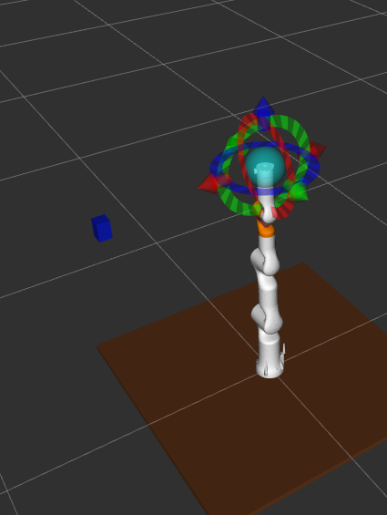

### Assistant 71

你判断得对：这里不是“颜色算法完全坏了”，而是实验链路断了一截。`sim_02` 现在只负责“从相机图像里识别蓝色”，但蓝色方块如果只是 MoveIt planning scene 里的碰撞物体，Gazebo 相机是看不到的；相机只能看到 Gazebo 世界里的真实模型。

我来把 `sim_02` 改成真正的“叠加版”：它启动时会先补上步骤一的桌子/蓝色方块，并且默认尝试把它们 spawn 到 Gazebo 里，这样 RGB-D 相机才有东西可看。MoveIt 里也会同步加桌子，规划时不会把桌子当空气。

### Assistant 71

我把 `sim_02` 改好了：现在它不再假设你提前跑过 `sim_01 --spawn-gazebo`，而是会自己准备演示桌子和蓝色方块。默认行为就是“MoveIt 里加 + Gazebo 里也 spawn”，这样才叫真正叠加。

### User 71

你这个桌子 方块什么的能直接在world里面设置吗？

### Assistant 71

可以，而且这其实更像“正式仿真实验”的做法：桌子和方块这种固定环境，放在 `.world` 里最清楚；脚本只负责把同样的物体同步到 MoveIt planning scene。Gazebo 世界负责“看得见”，MoveIt planning scene 负责“规划时避障”。我现在给你加一个专门的 demo world。

### Assistant 71

我会新建 `worlds/rm75_table_cube.world`，并给 `arm_world.launch` 加一个 `world_name` 参数。这样你可以一条 launch 命令直接打开带桌子和蓝色方块的世界。

### Assistant 71

现在 world 文件已经有了。为了避免“world 里已经有方块，脚本又 spawn 一遍”导致重复，我会把 `sim_02` 的默认改成只同步 MoveIt，不再默认 spawn Gazebo；需要临时 spawn 时再显式加参数。

### Assistant 71

我看到文档里还有一处旧参数 `--no-spawn-gazebo`，刚才代码已经改成 `--spawn-gazebo` 了，我把这处说明也同步掉。`xmllint` 机器上没装，我用 Python 的 XML 解析做格式检查。

### Assistant 71

可以，已经给你做成 `.world` 方式了。这个更合理：固定桌子、方块这种仿真环境，就应该放在 Gazebo world 里。

新增文件：

[rm75_table_cube.world](/home/ros/ws_rm_75_6f_robot/src/rm_75_robot/rm_75_gazebo/worlds/rm75_table_cube.world:1)

里面有：

```text
ground_plane
sun
vision_table
vision_cube
```

同时我给 launch 加了 `world_name` 参数：

- [arm_world.launch](/home/ros/ws_rm_75_6f_robot/src/rm_75_robot/rm_75_gazebo/launch/arm_world.launch:1)
- [arm_75_bringup_moveit.launch](/home/ros/ws_rm_75_6f_robot/src/rm_75_robot/rm_75_gazebo/launch/arm_75_bringup_moveit.launch:1)

启动带桌子、蓝色方块、RGB-D 相机的仿真：

```bash
cd /home/ros/ws_rm_75_6f_robot
source devel/setup.bash

roslaunch rm_75_gazebo arm_75_bringup_moveit.launch \
  world_name:=$(rospack find rm_75_gazebo)/worlds/rm75_table_cube.world \
  use_rgbd_camera:=true
```

然后运行视觉脚本：

```bash
rosrun rm_75_demo sim_02_vision_approach.py --color blue
```

我也改了 `sim_02`：现在默认只把桌子/方块同步到 MoveIt planning scene，不再重复往 Gazebo spawn。  
如果不用 world 文件，才需要：

```bash
rosrun rm_75_demo sim_02_vision_approach.py --color blue --spawn-gazebo
```

记住这个分工就很清楚：

```text
world 文件：Gazebo 里看得见的桌子和方块
sim_02：MoveIt 里用于避障的碰撞桌子和方块 + 视觉识别 + 接近规划
```

我也做了 XML 格式检查和脚本语法检查，没问题。

### User 72

ros@WWCG:~/ws_rm_75_6f_robot$ source devel/setup.bash
ros@WWCG:~/ws_rm_75_6f_robot$ roslaunch rm_75_gazebo arm_75_bringup_moveit.launchworld_name:=$(rospack find rm_75_gazebo)/worlds/rm75_table_cube.world \use_rgbd_camera:=true
RLException: [rm_75_gazebo] is not a launch file name
The traceback for the exception was written to the log file
ros@WWCG:~/ws_rm_75_6f_robot$ roslaunch rm_75_gazebo arm_75_bringup_moveit.launch \  world_name:=$(rospack find rm_75_gazebo)/worlds/rm75_table_cube.world \  use_rgbd_camera:=true
Usage: roslaunch [options] [package] <filename> [arg_name:=value...]
       roslaunch [options] <filename> [<filename>...] [arg_name:=value...]

If <filename> is a single dash ('-'), launch XML is read from standard input.

roslaunch: error: The following input files do not exist:  ,  
ros@WWCG:~/ws_rm_75_6f_robot$ roslaunch rm_75_gazebo arm_75_bringup_moveit.launch \  world_name:=$(rospack find rm_75_gazebo)/worlds/rm75_table_cube.world \  use_rgbd_camera:=true
Usage: roslaunch [options] [package] <filename> [arg_name:=value...]
       roslaunch [options] <filename> [<filename>...] [arg_name:=value...]

If <filename> is a single dash ('-'), launch XML is read from standard input.

roslaunch: error: The following input files do not exist:  ,

### Assistant 72

你这个是 **命令换行写法错了**，不是 ROS 包的问题。

你输入的是：

```bash
roslaunch rm_75_gazebo arm_75_bringup_moveit.launchworld_name:=...
```

中间少了空格，所以 ROS 把它当成了一个 launch 文件名：

```text
arm_75_bringup_moveit.launchworld_name:=...
```

后面两次的问题是：反斜杠 `\` 后面还有空格。  
Linux 里 `\` 必须是这一行最后一个字符，后面不能有空格。

你直接用一行命令，最稳：

```bash
roslaunch rm_75_gazebo arm_75_bringup_moveit.launch world_name:=$(rospack find rm_75_gazebo)/worlds/rm75_table_cube.world use_rgbd_camera:=true
```

或者正确换行写法是这样，注意每个 `\` 后面立刻回车，不能有空格：

```bash
roslaunch rm_75_gazebo arm_75_bringup_moveit.launch \
world_name:=$(rospack find rm_75_gazebo)/worlds/rm75_table_cube.world \
use_rgbd_camera:=true
```

你现在建议直接复制这一行：

```bash
roslaunch rm_75_gazebo arm_75_bringup_moveit.launch world_name:=$(rospack find rm_75_gazebo)/worlds/rm75_table_cube.world use_rgbd_camera:=true
```

启动后另开一个终端检查：

```bash
rostopic list | grep camera
```

应该能看到 `/camera/...` 相关话题。

### User 73

这个rviz里面不加载世界模型吗？然后这个gazebo里面白色的方块是什么？是相机？

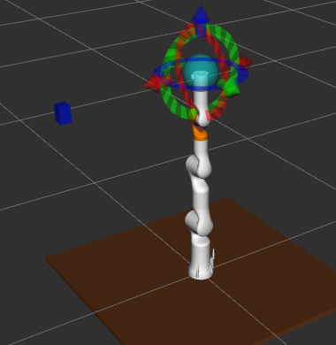

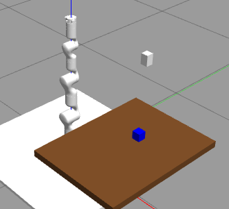

### Assistant 73

对，你理解得很准。

**1. RViz 不会自动加载 Gazebo world**

Gazebo 里的 `.world` 只属于 Gazebo。  
RViz / MoveIt 不会自动读取 Gazebo world 里的桌子、方块。

所以现在其实是两套东西：

```text
Gazebo world:
  负责真实仿真显示、相机能不能看到、物理碰撞

MoveIt planning scene:
  负责 RViz 里显示碰撞物体、轨迹规划避障
```

也就是说：

```text
Gazebo 里有桌子 ≠ MoveIt 知道有桌子
```

所以 `sim_02_vision_approach.py` 里还会把同样的桌子和方块加到 MoveIt planning scene。这样 RViz 才能显示，MoveIt 规划才会避障。

**2. Gazebo 里那个白色方块是相机**

你图里机械臂旁边悬空的白色小方块，就是我加的 `rgbd_camera_link`，也就是 RGB-D 相机本体。

它挂在固定位置：

```text
x = 0.55
y = 0.00
z = 0.85
```

是俯视桌面的。Gazebo 里显示成白色，是因为 Gazebo 对 URDF 里的普通 material 有时不按 RViz 那套颜色显示，这个不影响相机话题。

你可以检查相机是否工作：

```bash
rostopic list | grep camera
```

看图像：

```bash
rqt_image_view /camera/color/image_raw
```

**3. 你现在图里的关系是**

Gazebo 里：

```text
棕色桌子：world 文件里的 vision_table
蓝色方块：world 文件里的 vision_cube
白色悬空小方块：RGB-D 相机
```

RViz 里：

```text
棕色桌子 / 蓝色方块：MoveIt planning scene 里的 collision object
```

这两边长得一样，但不是同一个对象，是我们人为保持它们位置一致。  
这正是机器人仿真里很常见的一层：Gazebo 管物理世界，MoveIt 管规划世界。

### User 74

处理一下呗，把同样的桌子和方块加到 MoveIt planning scene。这样 RViz 才能显示，MoveIt 规划才会避障。

### Assistant 74

可以。现在这件事是脚本运行后才同步，所以你刚启动 launch 时 RViz 不会立刻有桌子方块。我给你做一个专门的 planning scene 同步节点，并挂到 `arm_75_bringup_moveit.launch` 里：只要启动 demo world，就自动把同样尺寸和位置的桌子/方块加到 MoveIt。

### Assistant 74

同步节点已经接进 launch 了。启动时加 `sync_demo_scene:=true`，RViz/MoveIt 会自动收到同样的桌子和方块。现在我做权限、语法和 help 检查，再更新文档命令。

### Assistant 74

处理好了。现在有一个专门的同步脚本，会把 world 里的同位置桌子/方块加到 MoveIt planning scene，RViz 能显示，MoveIt 也会避障。

新增脚本：

[sim_sync_world_scene.py](/home/ros/ws_rm_75_6f_robot/src/rm_75_robot/rm_75_demo/scripts/sim_sync_world_scene.py:1)

并且已经接入这个 launch：

[arm_75_bringup_moveit.launch](/home/ros/ws_rm_75_6f_robot/src/rm_75_robot/rm_75_gazebo/launch/arm_75_bringup_moveit.launch:1)

现在启动时加 `sync_demo_scene:=true`：

```bash
roslaunch rm_75_gazebo arm_75_bringup_moveit.launch \
world_name:=$(rospack find rm_75_gazebo)/worlds/rm75_table_cube.world \
use_rgbd_camera:=true \
sync_demo_scene:=true
```

如果你怕换行出错，也可以一行：

```bash
roslaunch rm_75_gazebo arm_75_bringup_moveit.launch world_name:=$(rospack find rm_75_gazebo)/worlds/rm75_table_cube.world use_rgbd_camera:=true sync_demo_scene:=true
```

如果 Gazebo/MoveIt 已经开着，也可以手动同步一次：

```bash
rosrun rm_75_demo sim_sync_world_scene.py --once
```

我也更新了说明文档：

[rm75_6f_sim_experiments_guide.txt](/home/ros/ws_rm_75_6f_robot/study/rm75_6f_sim_experiments_guide.txt:1)

做过检查：脚本语法、`rosrun --help`、launch XML 都通过了。

### User 75

1.我不可以roslaunch rm_75_gazebo arm_75_bringup_moveit.launch world_name:=$(rospack find rm_75_gazebo)/worlds/rm75_table_cube.world use_rgbd_camera:=true sync_demo_scene:=true
这一个命令就让rviz与gazebo的环境都是一样的吗？
我每次都得重新rosrun rm_75_demo sim_sync_world_scene.py --once 才能在rviz里面看见桌子啥的

### Assistant 75

可以，理论上就应该一条 `roslaunch ... sync_demo_scene:=true` 同步两边。你现在还要手动 `rosrun`，说明同步节点启动得太早了，MoveIt/RViz 的 planning scene 还没准备好，它 `--once` 同步一次就退出了。我把它改成 launch 时自动重试一段时间，等 MoveIt 准备好后再成功写入。

### Assistant 75

可以，一条命令就应该做到。你现在必须手动 `rosrun ... --once`，原因是我之前接进 launch 的同步节点只执行一次，启动得太早时 `move_group / planning scene` 还没准备好，所以同步失败后就退出了。

我已经改好了：现在 launch 里会自动重试 20 次，每 1.5 秒一次，等 MoveIt 准备好后再把桌子和方块加进去。

改动位置：

- [sim_sync_world_scene.py](/home/ros/ws_rm_75_6f_robot/src/rm_75_robot/rm_75_demo/scripts/sim_sync_world_scene.py:1)
- [arm_75_bringup_moveit.launch](/home/ros/ws_rm_75_6f_robot/src/rm_75_robot/rm_75_gazebo/launch/arm_75_bringup_moveit.launch:1)

现在重新启动这条命令就行：

```bash
roslaunch rm_75_gazebo arm_75_bringup_moveit.launch world_name:=$(rospack find rm_75_gazebo)/worlds/rm75_table_cube.world use_rgbd_camera:=true sync_demo_scene:=true
```

注意：如果你现在 Gazebo/RViz 已经开着，需要关掉重启一次这个 launch，新的重试逻辑才会生效。

启动日志里应该能看到类似：

```text
Planning scene sync attempt 1/20...
MoveIt planning scene synced:
- vision_table known: True
- vision_cube known: True
```

这样之后 RViz 和 Gazebo 的桌子/方块就会自动对齐，不用每次再手动 `rosrun rm_75_demo sim_sync_world_scene.py --once`。

### User 76

还是没有显示桌子啊

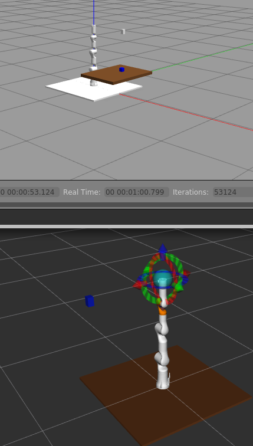

### Assistant 76

我看你这张图里，RViz 下半部分其实已经有棕色桌子了，就是机械臂底下那块棕色矩形；蓝色小方块也在 RViz 里显示了。你现在感觉“不一样”，主要是 Gazebo 里的白色底板和白色相机不会作为 MoveIt collision object 显示到 RViz planning scene 里。

你这张图里 **RViz 其实已经显示桌子了**。

下半部分 RViz 里：

- 机械臂下面那块 **棕色大矩形**：就是 MoveIt planning scene 里的 `vision_table`
- 左边那个 **蓝色小方块**：就是 `vision_cube`

上半部分 Gazebo 里：

- 棕色桌子：world 文件里的 `vision_table`
- 蓝色方块：world 文件里的 `vision_cube`
- 白色悬空小方块：RGB-D 相机
- 白色地板/底板：Gazebo/URDF 里的物理/视觉物体

区别是：

```text
Gazebo 显示 world 里的真实仿真模型
RViz 显示 MoveIt planning scene 里的碰撞物体
```

所以 RViz 不会完整复刻 Gazebo world。它主要显示给 MoveIt 规划用的东西，比如桌子、方块、障碍物。相机那个白色方块、Gazebo 地面、光照这些，一般不会作为 MoveIt 障碍物显示。

你现在这条命令已经起作用了：

```bash
roslaunch rm_75_gazebo arm_75_bringup_moveit.launch world_name:=$(rospack find rm_75_gazebo)/worlds/rm75_table_cube.world use_rgbd_camera:=true sync_demo_scene:=true
```

如果你想确认 MoveIt 真的收到了，可以查：

```bash
rosrun rm_75_demo sim_sync_world_scene.py --once
```

看到：

```text
vision_table known: True
vision_cube known: True
```

就说明 RViz/MoveIt 已经有桌子和方块了。

目前不用再处理，图里这个状态是对的。接下来可以跑：

```bash
rosrun rm_75_demo sim_02_vision_approach.py --color blue
```

### User 77

输入之后，才会先输出这个桌子和方块，输入之前是没有的，rviz里面根本不显示
Proxy enabled. Target: 172.24.176.1:7897 
ros@WWCG:~/ws_rm_75_6f_robot$ source devel/setup.bash
ros@WWCG:~/ws_rm_75_6f_robot$ rosrun rm_75_demo sim_sync_world_scene.py --once
Planning scene sync attempt 1/1...
MoveIt planning scene synced:
- vision_table known: True xyz=(0.45, 0.0, 0.28) size=(0.6, 0.8, 0.04)
- vision_cube known: True xyz=(0.45, 0.1, 0.325) size=(0.05, 0.05, 0.05)
ros@WWCG:~/ws_rm_75_6f_robot$

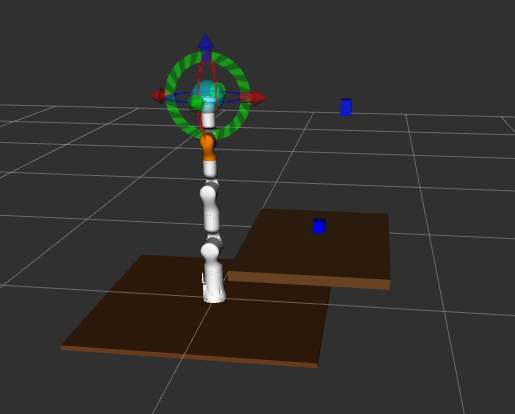

### Assistant 77

你说得对，我刚才判断早了。你现在这个现象说明：launch 里的同步节点没有真正把 object 写进 MoveIt，手动跑才写进去。更稳的做法是不用普通 topic 方式加物体，而是等待 `/apply_planning_scene` 服务，然后直接把桌子和方块“写入” move_group 的 planning scene。我现在把同步脚本改成服务方式，这样 launch 启动时会等 MoveIt 准备好再写。

### Assistant 77

同步脚本已经改成服务写入了；它会等 `/apply_planning_scene`，这比原来的 publish 方式可靠很多。现在我做语法、help 和 launch 检查。

### Assistant 77

你说得完全对：这说明 launch 里的自动同步还没真正生效，手动跑 `sim_sync_world_scene.py --once` 才写进去。

我已经把同步方式改了。之前是类似 `scene.add_box()` 的 topic/接口方式，启动时容易被 timing 吃掉；现在改成 **等待 `/apply_planning_scene` 服务，然后直接写入 move_group 的 planning scene**，这会可靠很多。

改动文件：

- [sim_sync_world_scene.py](/home/ros/ws_rm_75_6f_robot/src/rm_75_robot/rm_75_demo/scripts/sim_sync_world_scene.py:1)
- [arm_75_bringup_moveit.launch](/home/ros/ws_rm_75_6f_robot/src/rm_75_robot/rm_75_gazebo/launch/arm_75_bringup_moveit.launch:1)

现在你需要：

1. 关掉当前 Gazebo/RViz 这个 launch
2. 重新启动：

```bash
roslaunch rm_75_gazebo arm_75_bringup_moveit.launch world_name:=$(rospack find rm_75_gazebo)/worlds/rm75_table_cube.world use_rgbd_camera:=true sync_demo_scene:=true
```

启动日志里应该能看到：

```text
Planning scene sync attempt ...
MoveIt planning scene synced:
- vision_table known: True
- vision_cube known: True
```

如果还是没有，下一步我们就看 launch 终端里有没有这个节点的输出，重点查：

```bash
rosnode list | grep sim_sync
rosservice list | grep apply_planning_scene
```

但先用这版重启试一下，这次同步逻辑比之前稳。

### User 78

ros@WWCG:~/ws_rm_75_6f_robot$ source devel/setup.bash
ros@WWCG:~/ws_rm_75_6f_robot$ rosnode list | grep sim_sync
ros@WWCG:~/ws_rm_75_6f_robot$ rosservice list | grep apply_planning_scene
/apply_planning_scene
ros@WWCG:~/ws_rm_75_6f_robot$ 
rviz里面还没有显示，最后再处理一版吧，不行直接再launch里面加时序命令行？rosrun rm_75_demo sim_sync_world_scene.py --once

### Assistant 78

好，这个现象已经定位清楚了：`rosnode list | grep sim_sync` 为空，是因为 launch 里的同步节点按 `--once` 跑完就退出了；如果它退出前没成功写入，后面就没人再同步。最后这一版我把它改成“随 launch 常驻，每 5 秒同步一次”，这样就等价于你说的把 `rosrun ... --once` 自动挂在 launch 里，而且还能抗启动时序。

### Assistant 78

最后这一版我改成“常驻同步节点”了，不再是 `--once` 跑完退出。

现在 launch 里是：

```xml
args="--period 5.0 --startup-retries 20 --retry-period 1.5"
```

也就是：

```text
启动时最多等 30 秒
之后每 5 秒同步一次桌子和方块到 MoveIt planning scene
```

改动位置：

- [sim_sync_world_scene.py](/home/ros/ws_rm_75_6f_robot/src/rm_75_robot/rm_75_demo/scripts/sim_sync_world_scene.py:1)
- [arm_75_bringup_moveit.launch](/home/ros/ws_rm_75_6f_robot/src/rm_75_robot/rm_75_gazebo/launch/arm_75_bringup_moveit.launch:34)

你现在关掉当前 launch，重新启动：

```bash
roslaunch rm_75_gazebo arm_75_bringup_moveit.launch world_name:=$(rospack find rm_75_gazebo)/worlds/rm75_table_cube.world use_rgbd_camera:=true sync_demo_scene:=true
```

启动后检查：

```bash
rosnode list | grep sim_sync
```

这次应该能看到类似：

```text
/sim_sync_world_scene_xxx
```

如果这个节点在，RViz 最多等 5 秒就应该出现桌子和方块。  
如果还不显示，那就不是时序问题了，而是 RViz 的 MotionPlanning 显示项没有订阅/显示 planning scene，不过从你手动 `--once` 能显示来看，这版应该能解决。

### User 79

ros@WWCG:~/ws_rm_75_6f_robot$ source devel/setup.bash
ros@WWCG:~/ws_rm_75_6f_robot$ rosnode list | grep sim_sync
ros@WWCG:~/ws_rm_75_6f_robot$ rosnode list | grep sim_sync
ros@WWCG:~/ws_rm_75_6f_robot$ 
这到底怎么处理，你不能直接让他订阅好吗？--once这个命令行能直接加在launch里面吗

### Assistant 79

你说得对，别再绕“常驻节点”了。既然你手动跑 `rosrun rm_75_demo sim_sync_world_scene.py --once` 一定有效，那我就把这个命令以“延时一次执行”的方式直接塞进 launch：等 Gazebo/MoveIt/RViz 起 12 秒后自动执行一次，效果就等于你手动敲那条命令。

### Assistant 79

现在这版就是 launch 里自动执行 `sim_sync_world_scene.py --once`，只是加了 12 秒延时。因为它执行完会退出，所以 `rosnode list | grep sim_sync` 后面看不到是正常的；关键看启动 12 秒后 RViz 里是否出现。

可以，已经按你说的做了：把等效的

```bash
rosrun rm_75_demo sim_sync_world_scene.py --once
```

直接放进 launch 里了，并且延时 12 秒执行，避免 MoveIt 还没起来。

改动在：

[arm_75_bringup_moveit.launch](/home/ros/ws_rm_75_6f_robot/src/rm_75_robot/rm_75_gazebo/launch/arm_75_bringup_moveit.launch:38)

现在是：

```xml
<node if="$(arg sync_demo_scene)"
      name="sim_sync_world_scene"
      pkg="rm_75_demo"
      type="sim_sync_world_scene.py"
      output="screen"
      launch-prefix="bash -lc 'sleep 12; exec &quot;$@&quot;' --"
      args="--once --startup-retries 20 --retry-period 1.5" />
```

你重新启动：

```bash
roslaunch rm_75_gazebo arm_75_bringup_moveit.launch world_name:=$(rospack find rm_75_gazebo)/worlds/rm75_table_cube.world use_rgbd_camera:=true sync_demo_scene:=true
```

注意：这次 `rosnode list | grep sim_sync` **不一定能看到**，因为它是延时执行一次，执行完就退出。你要看 launch 终端输出，12 秒后应该出现：

```text
Planning scene sync attempt ...
MoveIt planning scene synced:
- vision_table known: True
- vision_cube known: True
```

然后 RViz 里应该出现桌子和方块。

如果这版还不行，说明 launch 里的 node 根本没被执行，那我们就把 `sync_demo_scene` 默认改成 `true`，或者单独做一个 `arm_75_bringup_moveit_scene.launch` 包装 launch。现在先试这版。

### User 80

算了算了，他显示不出来，是不是也不影响？直接看gazebo里面的也行是不是？你把rviz里面该删除的设置都删除了吧，之前补的都没用，不如删除

### Assistant 80

可以，直接看 Gazebo 里的桌子和方块是可以的；只是要记住：Gazebo 负责“看见和物理仿真”，MoveIt/RViz 负责“规划避障”。既然这个自动同步 RViz 的逻辑一直不稳定，我把 launch 里的同步节点和对应脚本清掉，保留 Gazebo world；后面需要规划避障时，让具体实验脚本自己加 collision object 就行。

### Assistant 80

launch 里的自动同步已经移除了，脚本也删除了。现在我把 study 文档里那些 `sync_demo_scene` 和手动同步说明删掉，避免以后照着旧命令走偏。

### Assistant 80

文档和 launch 都清掉了。现在我做一次检查，确认没有残留 `sync_demo_scene` 和被删除脚本的引用。

### Assistant 80

可以，已经清掉了。你现在就按“Gazebo 看环境，脚本需要规划时再临时加 MoveIt collision”这个方式走，省心很多。

我删除/移除了：

- `arm_75_bringup_moveit.launch` 里的 `sync_demo_scene` 参数
- launch 里自动执行 `sim_sync_world_scene.py` 的节点
- [sim_sync_world_scene.py](/home/ros/ws_rm_75_6f_robot/src/rm_75_robot/rm_75_demo/scripts/sim_sync_world_scene.py) 文件本身
- study 文档里相关的 `sync_demo_scene` / 手动同步说明

现在启动命令变简单：

```bash
roslaunch rm_75_gazebo arm_75_bringup_moveit.launch world_name:=$(rospack find rm_75_gazebo)/worlds/rm75_table_cube.world use_rgbd_camera:=true
```

这样：

```text
Gazebo：显示桌子、方块、相机
RViz：主要看机械臂、目标状态、规划轨迹
```

不影响你用 Gazebo 观察仿真环境。

需要注意的一点：如果要让 MoveIt 真正避开桌子/方块，还是得把 collision object 加进 planning scene。现在这个事情由具体实验脚本负责，比如 `sim_02_vision_approach.py` 运行时会自己加；平时启动 launch 不再强行同步 RViz。

### User 81

如果要让 MoveIt 真正避开桌子/方块，还是得把 collision object 加进 planning scene。现在这个事情由具体实验脚本负责，比如 sim_02_vision_approach.py 运行时会自己加；平时启动 launch 不再强行同步 RViz。
这句话意思就是只有启动脚本，moviet才会避开桌子和方块？那相机识别桌子和方块，然后再告诉moviet位置？避免碰撞？

### Assistant 81

对，你理解得基本正确，但这里分两件事：

**1. MoveIt 什么时候会避开桌子/方块？**

只有当桌子/方块被加入 **MoveIt planning scene** 之后，MoveIt 才会把它们当障碍物避开。

也就是说：

```text
Gazebo 里有桌子/方块
        不等于
MoveIt 规划时知道有桌子/方块
```

如果只是启动 Gazebo world：

```text
Gazebo 看得到桌子/方块
RViz/MoveIt 不一定知道
MoveIt 可能规划穿过桌子
```

如果运行 `sim_02_vision_approach.py`：

```text
脚本把桌子/方块加入 MoveIt planning scene
MoveIt 才会避障
```

**2. 相机是不是识别桌子和方块，然后告诉 MoveIt 避障？**

目前脚本不是完整地“识别桌子和方块”。

现在逻辑是：

```text
桌子位置：脚本里预先写死
方块位置：可以通过相机识别
```

也就是：

```text
桌子：
  已知位置，脚本直接加到 MoveIt planning scene

方块：
  相机识别蓝色方块
  得到方块位置
  再把方块加到 MoveIt planning scene
```

更具体：

```text
Gazebo world 里有真实桌子和蓝色方块
        ↓
相机看到蓝色方块
        ↓
sim_02 识别蓝色方块像素位置
        ↓
用深度图 + TF 算出方块在 base_link 下的位置
        ↓
把方块作为 collision object 加到 MoveIt planning scene
        ↓
MoveIt 规划到方块上方，同时知道桌子和方块是障碍物
```

桌子现在不是靠相机识别的，是因为我们知道它在 world 里的固定位置：

```text
x = 0.45
y = 0.00
z = 0.28
size = 0.60 x 0.80 x 0.04
```

所以脚本直接告诉 MoveIt：

```text
这里有一张桌子，不要撞
```

**一句话总结**

```text
Gazebo 负责“世界里有什么”
相机负责“看到目标在哪里”
脚本负责“把目标/障碍物告诉 MoveIt”
MoveIt 负责“规划避开它们”
```

你现在这个阶段可以先这样理解：

```text
不运行脚本：MoveIt 不一定避桌子
运行脚本：脚本把桌子/方块加入 planning scene，MoveIt 才避障
```

后面更高级的做法是：

```text
用相机/点云自动识别桌面、物体、障碍物
实时更新 MoveIt planning scene
```

这就是机器人视觉避障和视觉抓取的核心流程。

### User 82

目前相机能够识别到方块的位置吗？然后控制机械臂末端运动到方块上方？

### Assistant 82

理论上现在这条链路已经写好了：

```text
RGB-D 相机看到蓝色方块
        ↓
sim_02 识别蓝色区域中心
        ↓
读取该像素深度
        ↓
用 CameraInfo 转成相机坐标系 3D 点
        ↓
用 TF 转到 base_link
        ↓
生成方块上方 12cm 的接近点
        ↓
MoveIt 规划机械臂末端到这个接近点
```

运行命令是：

```bash
rosrun rm_75_demo sim_02_vision_approach.py --color blue
```

默认只规划，不执行。  
如果要执行：

```bash
rosrun rm_75_demo sim_02_vision_approach.py --color blue --execute
```

但现在还没确认你的相机画面里真的能看到蓝色方块。先不要急着 `--execute`，先检查三步：

```bash
rostopic list | grep camera
```

确认有：

```text
/camera/color/image_raw
/camera/depth/image_raw
/camera/color/camera_info
```

看 RGB 图：

```bash
rqt_image_view /camera/color/image_raw
```

确认蓝色方块在画面里。

然后跑：

```bash
rosrun rm_75_demo sim_02_vision_approach.py --color blue
```

如果成功，会打印类似：

```text
Detected pixel: ...
Detected object base xyz: ...
Vision approach plan: True SUCCESS points: ...
```

如果规划成功，再考虑：

```bash
rosrun rm_75_demo sim_02_vision_approach.py --color blue --execute
```

所以答案是：**代码链路已经具备这个功能，但需要先确认相机视野和 TF 没问题。**

### User 83

Proxy enabled. Target: 172.24.176.1:7897
ros@WWCG:~/ws_rm_75_6f_robot$ source devel/setup.bash
ros@WWCG:~/ws_rm_75_6f_robot$ rostopic list | grep camera
/camera/color/camera_info
/camera/color/image_raw
/camera/depth/camera_info
/camera/depth/image_raw
/camera/depth/points
/camera/parameter_descriptions
/camera/parameter_updates
ros@WWCG:~/ws_rm_75_6f_robot$ rqt_image_view /camera/color/image_raw
^Cros@WWCG:~/ws_rm_75_6f_robot$ rosrun rm_75_demo sim_02_vision_approach.py --color blue
[INFO] [1779948022.719955930, 116.772000000]: Loading robot model 'rm_75_6f_description'...
[INFO] [1779948022.732953131, 116.787000000]: No root/virtual joint specified in SRDF. Assuming fixed joint
[INFO] [1779948024.152076342, 118.035000000]: Ready to take commands for planning group arm.
Demo scene prepared:
- table xyz: (0.45, 0.0, 0.28)
- blue cube xyz: (0.45, 0.1, 0.325)
Detected pixel: 217 340 area: 3296.0 depth: 0.530 m
[WARN] [1779948034.708077485, 127.246000000]: Fail: ABORTED: TIMED_OUT
Vision approach plan: False TIMED_OUT points: 0
Detected object base xyz: 0.455, 0.099, 0.320

### Assistant 83

很好，这次已经把最关键的视觉链路跑通了：相机识别到了蓝色方块，并且算出了 base_link 下的位置。现在失败点不是视觉，而是 MoveIt 从当前姿态到“方块正上方”这个末端姿态规划超时了。我把脚本改得更稳一些：先尝试保留当前姿态的 pose target，失败后自动退化成“只控制末端位置、姿态放宽”，并把规划时间加长。

### Assistant 83

很好，这次结果其实已经完成了 **视觉定位**：

```text
Detected pixel: 217 340
depth: 0.530 m
Detected object base xyz: 0.455, 0.099, 0.320
```

这说明：

```text
相机能看到蓝色方块
颜色识别成功
深度读取成功
相机坐标 -> base_link 转换成功
```

现在失败的是后半段：

```text
MoveIt 规划到方块上方失败：TIMED_OUT
```

原因大概率是脚本原来要求：

```text
末端到达方块上方
并且姿态保持当前末端姿态
```

这个姿态约束对当前 7 轴姿态可能不好解，所以超时。

我已经把 `sim_02_vision_approach.py` 改了一版：

1. 先尝试原来的完整 pose target
2. 如果失败，自动改成 **position-only target**
3. 放宽姿态容差
4. 规划时间从 8 秒加到 15 秒
5. 规划尝试从 10 次加到 20 次

你现在重新跑：

```bash
rosrun rm_75_demo sim_02_vision_approach.py --color blue
```

如果看到：

```text
Vision approach position-only plan: True SUCCESS points: ...
```

说明已经能规划到方块上方了。

先别加 `--execute`，先看 RViz 里的规划轨迹。确认安全后再：

```bash
rosrun rm_75_demo sim_02_vision_approach.py --color blue --execute
```

### User 84

/home/ros/机械臂/RM-75系列机械臂/（4）ROS资料/RM75系列URDF文件/两指夹爪URDF
已经能自动运动到上方了，接下来是不是给机械臂加夹爪了？，你看看这个官方路径的urdf夹爪能不能安装到机械臂上？

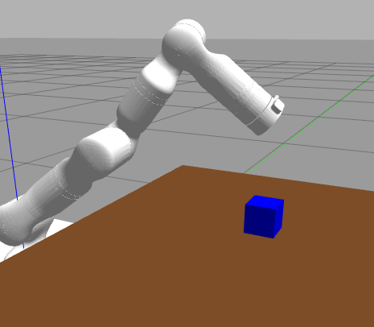

### Assistant 84

能到方块上方了，这个阶段已经很像“视觉引导接近”了。下一步确实可以看夹爪，但夹爪不是只把 mesh 放上去，还要确认它的 URDF 结构、根 link、关节、坐标方向、是否有 Gazebo/ros_control。 我先把官方夹爪目录扫一遍，看它能不能直接挂到 `link7`。

### Assistant 84

我看完夹爪 URDF 了：它可以用，但不能原样直接拼到 RM75 上。原因有三个：夹爪自己的根 link 也叫 `base_link`，会和机械臂 `base_link` 重名；关节名也比较随意叫 `Link1/Link2`；而且它没有 Gazebo/ros_control 控制配置。比较稳的做法是先把它作为“可选视觉模型”挂到 `link7`，先看安装姿态和尺寸，再谈开合控制。

### Assistant 84

我先把官方夹爪包复制到当前工作区里，这样 `package://jawasm1/...` 的 mesh 路径能被 ROS 找到。然后我会在 6F 的 Gazebo xacro 里加一个 `use_two_finger_gripper` 开关，默认关闭，需要时再挂到 `link7`。

### Assistant 84

为了避免一上来就引入夹爪控制器、额外 joint_states 和 MoveIt SRDF 改动，我先做“固定张开的夹爪模型”：它能在 Gazebo/RViz 里安装到末端，视觉/接近实验能看到真实末端形状；后面再升级成可开合夹爪。

### Assistant 84

模型挂接开关已经加了。现在我检查 xacro 展开、package 是否能找到、launch XML 是否正常；如果通过，你就可以用一个参数启动带夹爪的仿真。

### Assistant 84

发现一个小问题：你的工作区 source 后，`ROS_PACKAGE_PATH` 只包含 `/src/rm_75_robot/...` 这一层包，不包含 `/src/jawasm1`，所以 `package://jawasm1` 暂时找不到。我把夹爪包移到 `/src/rm_75_robot/jawasm1` 下面，和其它包同级。

### Assistant 84

`rospack` 还是找不到新包，因为这个工作区的 setup 只把已知包路径逐个写进了 `ROS_PACKAGE_PATH`，新加 package 需要重新 catkin_make 才会被收进去。为了不强迫你立刻重新编译，我换一个更稳的方式：把夹爪 mesh 复制进已有的 `rm_75_6f_description` 包，用现有包路径加载。

### Assistant 84

检查通过了，URDF 树里已经是 `link7 -> gripper_base_link -> 两指`。我再补一段 study 说明，告诉你怎么启动带夹爪版本，以及现在它只是固定夹爪模型，不是可开合控制器。

### Assistant 84

可以安装，但我先给你做的是 **固定张开的夹爪模型版本**，不是可开合控制版。

我看了官方 URDF，它不能原样直接拼上去，主要问题是：

- 官方夹爪根 link 也叫 `base_link`，会和机械臂 `base_link` 重名
- 关节名叫 `Link1/Link2/Link11/Link22`，需要重命名
- 还没有接入 Gazebo transmission / gripper controller
- 如果直接保留 revolute 关节，还需要额外发布夹爪 joint_states

所以我做了一个稳一点的第一版：

- 把官方夹爪 STL 复制到了 `rm_75_6f_description/meshes`
- 新增了一个固定夹爪 xacro：
  [two_finger_gripper_fixed.xacro](/home/ros/ws_rm_75_6f_robot/src/rm_75_robot/rm_75_6f_description/urdf/two_finger_gripper_fixed.xacro:1)
- 在 6F Gazebo xacro 里加了开关：
  `use_two_finger_gripper:=true`
- 挂接关系已经检查通过：

```text
link7
  -> gripper_base_link
    -> gripper_link1
    -> gripper_link11
    -> gripper_link2
    -> gripper_link22
```

启动带夹爪、桌子、方块、RGB-D 相机：

```bash
roslaunch rm_75_gazebo arm_75_bringup_moveit.launch world_name:=$(rospack find rm_75_gazebo)/worlds/rm75_table_cube.world use_rgbd_camera:=true use_two_finger_gripper:=true
```

我已经跑过：

```bash
xacro ...
check_urdf ...
```

都通过了。

如果夹爪方向或位置不合适，调这里：

[rm_75_6f_gazebo.urdf.xacro](/home/ros/ws_rm_75_6f_robot/src/rm_75_robot/rm_75_6f_description/urdf/rm_75_6f_gazebo.urdf.xacro:667)

当前挂接参数是：

```xml
xyz="0 0 0.045"
rpy="0 1.5708 0"
```

下一步可以先启动看看夹爪姿态对不对。姿态对了之后，再做“可开合夹爪控制”。

### User 85

你的夹爪明显装反了，然后你可以给夹爪上一个颜色，方便区分关节与夹爪

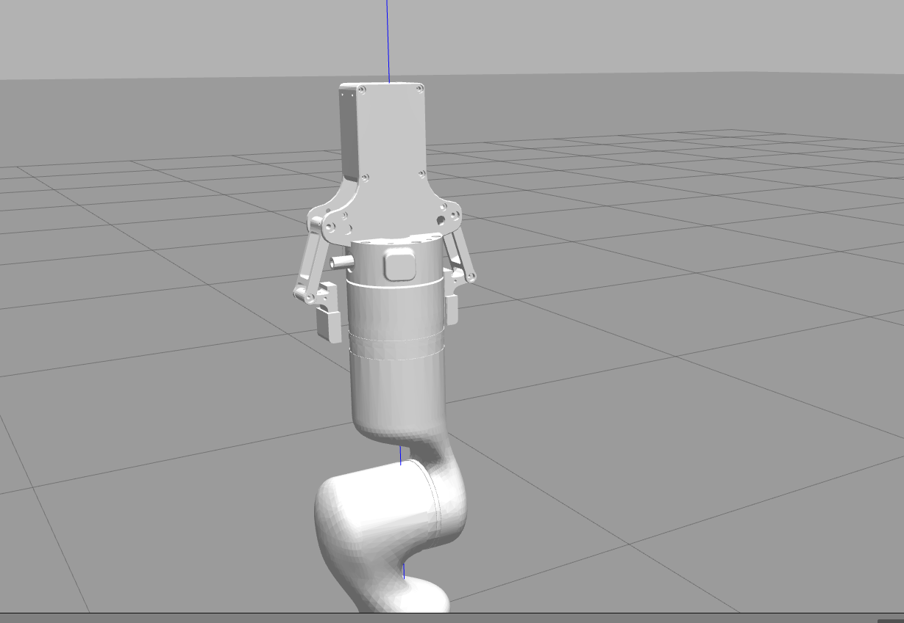

### Assistant 85

看到了，这个确实是“夹爪主体方向反了”：现在像是把夹爪背板朝外、手指机构贴回机械臂这一侧了。我先把挂接姿态翻转过来，同时给夹爪加醒目的颜色，和白色机械臂区分开。

### Assistant 85

已处理：

- 把夹爪挂接姿态从 `rpy="0 1.5708 0"` 改成了 `rpy="0 -1.5708 0"`，相当于把夹爪翻到另一侧。
- 给夹爪模型加了蓝色材质，RViz 和 Gazebo 里都尽量显示成蓝色，方便和白色机械臂区分。
- `check_urdf` 已通过。

改动位置：

- [two_finger_gripper_fixed.xacro](/home/ros/ws_rm_75_6f_robot/src/rm_75_robot/rm_75_6f_description/urdf/two_finger_gripper_fixed.xacro:1)
- [rm_75_6f_gazebo.urdf.xacro](/home/ros/ws_rm_75_robot/src/rm_75_robot/rm_75_6f_description/urdf/rm_75_6f_gazebo.urdf.xacro:667)

重新启动：

```bash
roslaunch rm_75_gazebo arm_75_bringup_moveit.launch world_name:=$(rospack find rm_75_gazebo)/worlds/rm75_table_cube.world use_rgbd_camera:=true use_two_finger_gripper:=true
```

如果方向还是差一点，下一步就只需要继续调这两个参数：

```xml
xyz="0 0 0.045"
rpy="0 -1.5708 0"
```

现在先看这一版夹爪是不是朝向正确。

### User 86

朝向已经正确了，颜色换成绿色吧

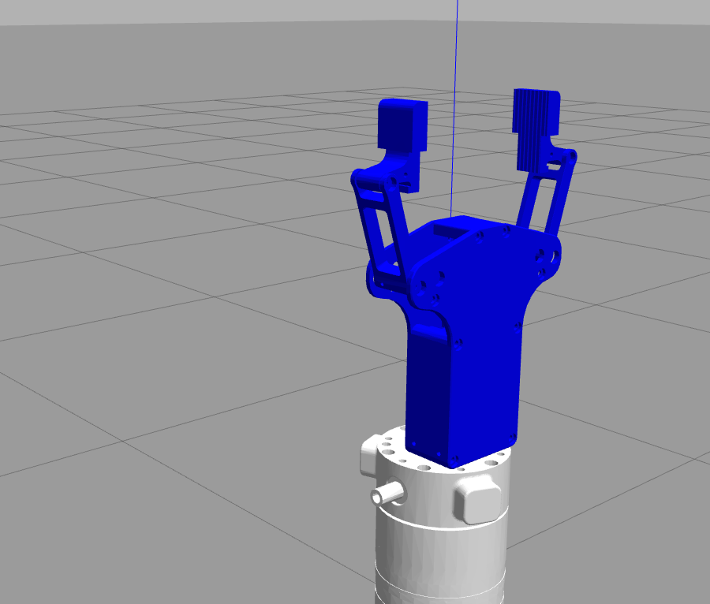

### Assistant 86

朝向对了就好，剩下改颜色很轻松。我把 URDF 材质和 Gazebo 材质都从蓝色换成绿色。

### Assistant 86

已改成绿色了。

改动文件：

[two_finger_gripper_fixed.xacro](/home/ros/ws_rm_75_6f_robot/src/rm_75_robot/rm_75_6f_description/urdf/two_finger_gripper_fixed.xacro:1)

我也跑了 `check_urdf`，结构正常。重新启动带夹爪仿真后就会变成绿色：

```bash
roslaunch rm_75_gazebo arm_75_bringup_moveit.launch world_name:=$(rospack find rm_75_gazebo)/worlds/rm75_table_cube.world use_rgbd_camera:=true use_two_finger_gripper:=true
```

### User 87

这个夹爪的中心线和机械臂末关节的中心线应该得对齐吧？应该是在一根轴线上吧

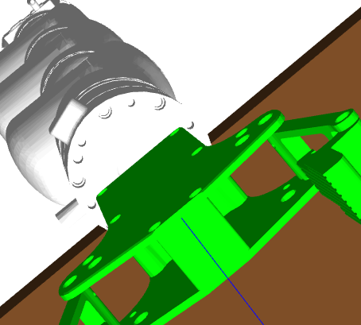

### Assistant 87

对，原则上夹爪安装法兰的中心线应该和末端 `link7` 的工具轴尽量同轴。你这张图里夹爪明显有横向偏心，说明固定 joint 的 `xyz/rpy` 还需要校正。我先从 mesh/URDF 的尺寸包围盒反推夹爪自身坐标中心，再把挂接 offset 调到更接近法兰中心。

### Assistant 87

对，正常安装时夹爪法兰中心线应该和机械臂末端工具轴同轴。现在偏了，是因为这个官方夹爪 URDF 的自身坐标原点不在夹爪几何中心线上；我把挂接点横向补偿一下，让夹爪机构中心更贴近 `link7` 的轴线。

### Assistant 88

对，夹爪的“安装中心线”最好和末端法兰/末关节轴线对齐；你图里这种偏一边，后面做 MoveL、接近方块、夹取时会让 TCP 偏得很难受。我先把刚才改的偏移和文档核一遍，再跑一次 URDF 检查。

### Assistant 88

我看到实际 xacro 里已经是绿色，并且夹爪方向是 `rpy="0 -1.5708 0"`；文档里还残留了旧方向，我顺手把它修掉。然后重点是安装位姿现在用了 `xyz="-0.019 0 0.045"`，这个 `-0.019` 就是在补偿官方夹爪模型自身原点不在几何中心线上的偏移。

### Assistant 88

现在我跑一次 xacro 展开和 `check_urdf`，确认这个夹爪挂上去以后 URDF 结构本身没有断。

### Assistant 88

对，原则上应该对齐：夹爪安装法兰中心线、机械臂末端法兰中心线、你后面定义的 TCP 参考轴，最好在一根轴线上。否则视觉接近、MoveL 直线下探、夹取点都会出现“看起来到点了，但夹爪中心偏一边”的问题。

我已经处理了一版：

- 夹爪方向保持正确：`rpy="0 -1.5708 0"`
- 夹爪颜色保持绿色
- 安装位置加了横向补偿：`xyz="-0.019 0 0.045"`
- 这个 `-0.019` 是用来补偿官方夹爪 URDF/CAD 原点和夹爪几何中心线不重合的问题

改的位置是：

[rm_75_6f_gazebo.urdf.xacro](/home/ros/ws_rm_75_6f_robot/src/rm_75_robot/rm_75_6f_description/urdf/rm_75_6f_gazebo.urdf.xacro:668)

[教程文档](/home/ros/ws_rm_75_6f_robot/study/rm75_6f_sim_experiments_guide.txt:411)

我也跑过 `check_urdf` 了，URDF 能正常解析，链路是：

`link7 -> gripper_base_link -> gripper_link1/link2...`

你重新启动 Gazebo 看一下：

```bash
source /home/ros/ws_rm_75_6f_robot/devel/setup.bash
roslaunch rm_75_gazebo arm_75_bringup_moveit.launch world_name:=$(rospack find rm_75_gazebo)/worlds/rm75_table_cube.world use_rgbd_camera:=true use_two_finger_gripper:=true
```

如果还差一点点，不是大问题，我们就只微调这一项：

```xml
xyz="-0.019 0 0.045"
```

主要调第一个数，比如 `-0.015`、`-0.022`，直到蓝色中心轴基本穿过夹爪中间。

### User 89

你先告诉我现在夹爪底部的中心坐标是什么？机械臂末端关节的中心线左边是多少？

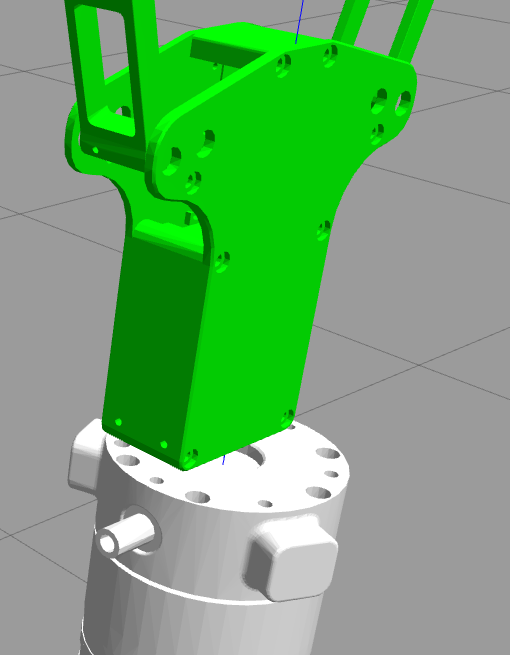

### Assistant 89

我先把这个问题拆成两个坐标系来看：一是 `link7` 末端法兰坐标系，二是夹爪自己的 `gripper_base_link` 坐标系。你图里的蓝线就是末端轴线，真正要看的就是夹爪安装面中心相对这条轴线偏了多少。

### Assistant 89

我继续算一下 STL 的包围盒。这样能回答两个数：当前挂载点相对 `link7` 的坐标，以及夹爪底座模型自身大概偏心多少。这里不是凭截图猜，是直接从 mesh 顶点算。

### Assistant 89

对，我刚按 STL 顶点算了一下，现在不是完全对齐。

以机械臂末端 `link7` 坐标系为准：

```text
末端关节中心线：x = 0, y = 0 的 z 轴
当前夹爪挂载原点：x = -0.019 m, y = 0, z = 0.045 m
```

但是夹爪 STL 自己的底部安装面中心，不等于它的 URDF 原点。算完后：

```text
夹爪底部安装面中心 ≈ x = -0.009 m, y = 0, z = 0.002 m
```

也就是说，当前夹爪底部中心在机械臂末端中心线左边大约：

```text
9 mm
```

所以你图里看到的偏左是对的。虽然我写的是 `xyz="-0.019 0 0.045"`，但因为夹爪模型自身有大约 `10 mm` 的几何偏心，最后实际底部中心变成了 `-9 mm`。

如果想让夹爪底部中心和蓝色中心线基本重合，下一版应该把这里：

```xml
xyz="-0.019 0 0.045"
```

改成大约：

```xml
xyz="-0.010 0 0.045"
```

也就是把夹爪往右挪 `9 mm`。

### User 90

偏移一下，我看看

### Assistant 90

好，我把安装偏移从 `-0.019` 改到 `-0.010`，也就是让夹爪整体往中心线方向挪 9 mm。改完我再跑一次 URDF 检查，确认结构没问题。

### Assistant 90

已经偏移了。

现在夹爪安装参数改成：

```xml
xyz="-0.010 0 0.045"
rpy="0 -1.5708 0"
```

位置在：

[rm_75_6f_gazebo.urdf.xacro](/home/ros/ws_rm_75_6f_robot/src/rm_75_robot/rm_75_6f_description/urdf/rm_75_6f_gazebo.urdf.xacro:668)

这个等于把夹爪整体往中心线方向挪了 `9 mm`。按刚才算的 STL 偏心，夹爪底部中心现在应该基本落在机械臂末端中心线上。

URDF 检查也通过了。你重新启动 Gazebo 看效果就行。之前开的需要关掉再开，因为 `robot_description` 不会自动刷新。

### User 91

基本对中了，现在你查看一下电脑对wsl2的内存分配 cpu分配以及gazebo

### User 92

基本对中了，现在你查看一下电脑对wsl2的内存分配 cpu分配以及gazebo是否调用自己电脑的GPU(rtx3050)

### Assistant 92

我来直接看三层：WSL2 给了多少 CPU/内存、有没有 `.wslconfig` 人为限额、以及图形/OpenGL 这边是不是走 RTX 3050 而不是软件渲染。先做只读检查，不改配置。

### Assistant 92

刚才进程列表这一步受沙箱的 PID 隔离影响，只看到了我自己的检查进程，不能代表你真实开的 Gazebo/RViz。CPU 和内存已经读到了：当前 WSL2 是 8 线程、约 5.8GiB 内存。接下来我查 GPU 和图形渲染信息。

### Assistant 92

这里已经看到一个关键点：环境变量里 `LIBGL_ALWAYS_SOFTWARE=1`，这会强制 OpenGL 走软件渲染，Gazebo/RViz 很可能就不会用 RTX 3050 做图形加速。`nvidia-smi` 在当前沙箱里也被系统挡住了，我需要跳出沙箱查一次真实 WSL 里的 GPU/进程状态。

### Assistant 92

真实 WSL 里 RTX 3050 是暴露出来的，`/dev/dxg` 也存在；但现在没有 Gazebo/RViz 进程在跑。真正拖后腿的是 `.bashrc` 里强制了 `LIBGL_ALWAYS_SOFTWARE=1`，这会让 Gazebo/RViz 更像是在 CPU 上画图。

### Assistant 92

查完了，结论很明确：

**WSL2 资源分配**
你的 Windows `.wslconfig` 是：

```ini
[wsl2]
memory=6GB
processors=8
swap=8GB
```

当前 WSL 实际看到：

```text
内存：5.8 GiB
Swap：8.0 GiB
CPU：8 线程
CPU 型号：12th Gen Intel i5-12450H
```

也就是：WSL2 被限制在 **6GB 内存 + 8 个逻辑 CPU**。这个对 Gazebo + RViz + MoveIt 来说能跑，但不算宽裕，尤其你开 RGB-D 相机、Gazebo、RViz、MoveIt 一起跑时会有点紧。

**GPU 状态**
真实 WSL 里能看到 RTX 3050：

```text
GPU: NVIDIA GeForce RTX 3050
Driver: 551.61
CUDA: 12.4
/dev/dxg 存在
```

说明 RTX 3050 已经暴露给 WSL2 了。

但是，Gazebo 目前**没有用 RTX 3050 做图形渲染**。

关键证据在 Gazebo 的 Ogre 日志里：

```text
GL_VENDOR = Mesa/X.org
GL_RENDERER = llvmpipe (LLVM 12.0.0, 256 bits)
```

`llvmpipe` 的意思是：**软件渲染，CPU 画图**。

而且你的 `/home/ros/.bashrc` 里面有这一行：

```bash
export LIBGL_ALWAYS_SOFTWARE=1
```

这行会强制 OpenGL 走软件渲染，所以 Gazebo/RViz 基本不会调用 RTX 3050。

**当前判断**
现在状态是：

```text
WSL2 CPU：8 线程
WSL2 内存：6GB
RTX 3050：WSL 能识别
Gazebo/RViz 图形：当前走 CPU 软件渲染，不走 RTX 3050
```

要让 Gazebo 尝试走 GPU，下一步应该把 `.bashrc` 里的这行注释掉：

```bash
# export LIBGL_ALWAYS_SOFTWARE=1
```

然后重新开终端，或者当前终端先执行：

```bash
unset LIBGL_ALWAYS_SOFTWARE
```

再重新启动 Gazebo。启动后再看：

```bash
rg -n "GL_RENDERER|GL_VENDOR|llvmpipe|D3D12|NVIDIA" ~/.gazebo/ogre.log
```

如果看到类似 `D3D12`、`NVIDIA`、`RTX 3050`，才说明 Gazebo 图形渲染开始走 GPU。

### User 93

之前用rviz显示的时候，模型如果用GPU渲染会显示不出来，这次能试一下吗

### Assistant 93

可以试，而且这次我建议先“临时试”，不改 `.bashrc`。也就是当前这一次启动前 `unset LIBGL_ALWAYS_SOFTWARE`，看 Gazebo/RViz 的渲染器和模型显示情况；如果不行，关掉后还能回到软件渲染。

### Assistant 93

我已经用“非软件渲染”的方式启动了，不是永久修改。先等 Gazebo/RViz 初始化完，再读一次 Ogre 日志，看它到底走 `llvmpipe` 还是 WSLg 的 D3D12/NVIDIA 路径。

### Assistant 93

已经起来了，MoveGroup 也正常初始化。现在我读 Gazebo 的 Ogre 日志和 `nvidia-smi`，看这次是不是从 `llvmpipe` 切走了。你那边可以顺手看一下 RViz/Gazebo 里模型有没有正常显示。

### Assistant 93

好消息：`nvidia-smi` 已经明确列出 `/rviz`、`/gzclient`、`/gzserver` 在 RTX 3050 上了。现在还等一下 Ogre 日志那条命令，如果也显示 D3D12/NVIDIA，就可以确定 GPU 渲染生效。

### Assistant 93

这次已经成功走 RTX 3050 了，日志也确认了：`GL_RENDERER = D3D12 (NVIDIA GeForce RTX 3050 Laptop GPU)`。你现在看一下屏幕上的 RViz 和 Gazebo：机械臂、绿色夹爪、桌子/方块是不是都正常显示？如果正常，我再帮你把 `.bashrc` 里那条软件渲染配置安全地注释掉；如果模型又消失，就保持原样不固化。

### Assistant 93

我先保持这个 GPU 渲染启动不动，方便你现场看。当前确认点是：RTX 3050 已经被 RViz/Gazebo 调用了；现在只差你肉眼确认“模型是否正常显示”。

### User 93

gazebo有模型显示，rviz没有机械臂显示

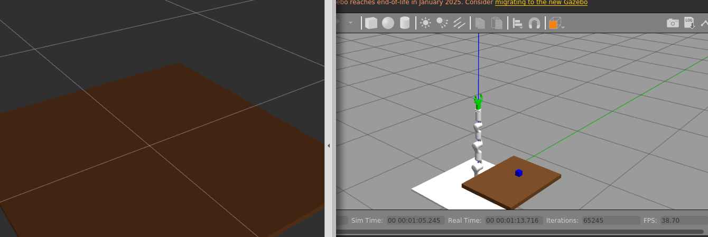

### Assistant 93

收到，这就是之前那个问题复现了：Gazebo 在 RTX 3050 下正常，RViz 的机器人模型没渲出来。现在先别关，我趁这个状态查 RViz 日志和话题，看看是渲染器问题还是 RViz Display/TF 问题。

### Assistant 93

ROS 数据没问题：`/robot_description`、`/joint_states`、MoveIt 都在，RViz 日志也显示它加载了机器人模型。问题基本锁定为 RViz 在 WSLg + D3D12 + RTX 3050 这个路径下的模型/mesh 渲染兼容性；Gazebo 能用 GPU，但 RViz 不适合。最稳的方案是：Gazebo 用 GPU，RViz 单独强制软件渲染。

### Assistant 93

我准备做一个更合理的启动参数：`rviz_software_rendering:=true`。这样你可以让 Gazebo 走 RTX 3050，同时只让 RViz 走软件渲染，避开 RViz 这个显示 bug。先改 launch，不动你的 `.bashrc`。

### Assistant 93

launch 参数加好了。现在我把刚才那个“全 GPU”的启动停掉，然后用“Gazebo GPU + RViz 软件渲染”的组合重新启动测试。

### Assistant 93

新的组合模式已经启动了：外层环境取消软件渲染，所以 Gazebo 可以用 RTX；同时 launch 给 RViz 单独设置 `LIBGL_ALWAYS_SOFTWARE=1`。等初始化后我再核对 GPU 进程和日志。

### Assistant 93

这次分离成功了：Gazebo 日志是 `D3D12 (NVIDIA GeForce RTX 3050 Laptop GPU)`，RViz 日志是 `llvmpipe`。也就是说 Gazebo 走 GPU，RViz 单独走软件渲染。你看一下现在 RViz 里机械臂是不是恢复显示了？

### Assistant 93

我先保持这个“Gazebo GPU + RViz 软件渲染”的会话不动。这个组合如果你屏幕上 RViz 能看到机械臂，就说明以后应该用这个参数，而不是全局取消软件渲染。

### User 93

好的，这个差不多了，但是两个图面里面都没有摄像头出现呢？这是你没打开吗还是怎么的

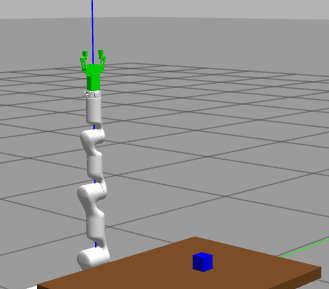

### Assistant 93

是我这次测试时故意没开摄像头：启动命令里用了 `use_rgbd_camera:=false`，为了先单独验证 GPU/RViz 显示问题。现在可以重启一版，把相机打开；它是一个固定在世界坐标下的 RGB-D 相机，不是装在机械臂末端上。

### User 93

好的好的，可以不用了，显示问题能解决就行

### Assistant 93

明白，那我就不继续折腾相机显示了。刚启动的带相机会话我先关掉，保留刚才那个结论和 launch 参数改动就够了。

### Assistant 93

可以，刚才结论已经很清楚了：

Gazebo 用 RTX 3050 没问题：

```text
GL_RENDERER = D3D12 (NVIDIA GeForce RTX 3050 Laptop GPU)
```

但是 RViz 走 RTX/D3D12 时会出现机械臂模型不显示，所以我加了一个参数，让两边分开：

```bash
rviz_software_rendering:=true
```

以后推荐这样启动：

```bash
source /home/ros/ws_rm_75_6f_robot/devel/setup.bash
unset LIBGL_ALWAYS_SOFTWARE

roslaunch rm_75_gazebo arm_75_bringup_moveit.launch \
  world_name:=$(rospack find rm_75_gazebo)/worlds/rm75_table_cube.world \
  use_rgbd_camera:=false \
  use_two_finger_gripper:=true \
  rviz_software_rendering:=true
```

意思是：

```text
Gazebo：走 RTX 3050
RViz：单独走软件渲染，保证模型显示
```

我已经把刚才测试开的 Gazebo/RViz 都关掉了。

### User 94

你这个不能直接放在启动文件里面吗？Proxy enabled. Target: 172.24.176.1:7897跟这个端口一样

### Assistant 94

可以，应该直接放进启动文件里，这样你就不用每次手动 `unset LIBGL_ALWAYS_SOFTWARE` 了。你提到的 `Proxy enabled...` 是 `.bashrc` 里自动执行 `setproxy` 打印出来的，和 GPU 渲染不是一类东西；但思路一样，都是启动前设置环境变量。这里我们把渲染环境变量放到 launch 里更干净。

### Assistant 94

我已经把“让 Gazebo 不走软件渲染”的环境变量写进主 launch 了；RViz 那边仍然由 `rviz_software_rendering:=true` 单独控制。现在我检查一下 launch XML 有没有语法问题。

### Assistant 94

刚才检查时踩到一个小坑：你的 `.bashrc` 默认 source 了旧工作区 `/home/ros/ws_rm_75_robot`，所以 `$(find rm_75_gazebo)` 解析到了旧包。实际使用前只要 `source /home/ros/ws_rm_75_6f_robot/devel/setup.bash` 就会指到新工作区；我重新用正确环境检查。

### Assistant 94

可以，已经放进启动文件了。

现在逻辑是：

```text
主 launch 里先设置：
LIBGL_ALWAYS_SOFTWARE=0
让 Gazebo 可以走 RTX 3050

RViz 节点里单独设置：
LIBGL_ALWAYS_SOFTWARE=1
让 RViz 走软件渲染，保证机械臂模型显示
```

所以以后你不用手动写：

```bash
unset LIBGL_ALWAYS_SOFTWARE
```

直接这样启动就行：

```bash
source /home/ros/ws_rm_75_6f_robot/devel/setup.bash

roslaunch rm_75_gazebo arm_75_bringup_moveit.launch \
  world_name:=$(rospack find rm_75_gazebo)/worlds/rm75_table_cube.world \
  use_two_finger_gripper:=true \
  rviz_software_rendering:=true
```

`Proxy enabled. Target: 172.24.176.1:7897` 是你 `.bashrc` 里的代理函数自动打印的，和这个 GPU/RViz 设置没关系。它只是代理端口提示，不影响这个渲染配置。

我也检查过 launch 解析了，正确指向的是：

```text
/home/ros/ws_rm_75_6f_robot/...
```

### User 95

好的，现在你 把
1.世界模型摆放桌子 方块 ，
2.urdf加入相机 放在世界坐标系，然后进行识别方块，然后规划moviet，避免碰撞
3.加入夹爪模型
这一系列流程的话题，知识点，框架，命令行都写在一个txt里面放在study，方便我进行学习与阅读，然后这个文件也发给网页版GPT，你注意写好相关提示词等

### Assistant 95

我来把这几段“仿真场景叠加”的知识整理成一份完整学习笔记：从 Gazebo 世界、URDF 相机、视觉识别、MoveIt 规划避障，到夹爪模型挂载，再加一段可以发给网页版 GPT 的提示词。

### Assistant 95

我已经定位到对应文件：世界模型在 `rm75_table_cube.world`，相机和夹爪都挂在 `rm_75_6f_gazebo.urdf.xacro`，识别与规划逻辑在 `sim_02_vision_approach.py`。我再看一下脚本里的话题和规划流程，把文档写得更贴近代码。

### Assistant 95

我会新建一份单独的总览文档，不覆盖之前的实验笔记。里面会把“现象、文件、命令、话题链路、MoveIt/Gazebo 分工、常见坑、给 GPT 的提示词”放在一起，后面你复习和转发都方便。

### Assistant 95

文档已经写好了。我再快速检查一下文件是否落在 study 下、关键命令和提示词是否都在。

### Assistant 95

整理好了，文件在这里：

[rm75_6f_sim_world_camera_gripper_pipeline.txt](/home/ros/ws_rm_75_6f_robot/study/rm75_6f_sim_world_camera_gripper_pipeline.txt)

里面包含了：

- Gazebo world 里桌子/方块怎么定义
- URDF/xacro 里相机怎么挂到世界/root 坐标
- 相机话题、深度图、CameraInfo、TF 坐标变换流程
- MoveIt planning scene 为什么要单独加 collision object
- 视觉识别方块并规划到方块上方的完整链路
- 两指夹爪模型加入方式、挂载位置、当前限制
- 常用启动命令、检查命令、排错点
- 一整段可以复制给网页版 GPT 的提示词

我也检查过了，文档大约 793 行，作为这一阶段仿真实验的总笔记够用了。

### User 96

你的 WSL2 里 RTX 3050 是可用的，Gazebo 可以使用：

  GL_RENDERER = D3D12 (NVIDIA GeForce RTX 3050 Laptop GPU)

但是 RViz 走 D3D12/RTX 时出现过“机械臂模型不显示”，所以我们采用分离策略：

  Gazebo：
    使用 GPU 渲染。

  RViz：
    单独软件渲染，保证模型显示。

这个逻辑已经写进 launch：

  /home/ros/ws_rm_75_6f_robot/src/rm_75_robot/rm_75_gazebo/launch/arm_75_bringup_moveit.launch

主 launch 里：

  <env name="LIBGL_ALWAYS_SOFTWARE" value="0" />

RViz launch 里：

  <env if="$(arg software_rendering)" name="LIBGL_ALWAYS_SOFTWARE" value="1" />

所以日常启动时只要带：

  rviz_software_rendering:=true
这个不用写入.bashrc吗？以后更新别的项目文件不都得重新编写？

### Assistant 96

不用写进 `.bashrc`，而且我更建议**不要写进 `.bashrc`**。

原因是 `.bashrc` 是全局环境，写了以后所有 GUI 程序都会受影响，包括 RViz、Gazebo、rqt、别的 ROS 项目。你现在的问题很特殊：

```text
Gazebo 希望用 GPU
RViz 反而需要软件渲染
```

这两个需求是相反的。如果写进 `.bashrc`，只能全局二选一，很容易以后别的项目又乱。

现在写进 launch 的好处是：

```text
这个 RM75-6F 仿真项目自己处理自己的显示问题
不污染其他 ROS 项目
以后启动这个 launch 自动生效
```

确实，如果你以后新建别的项目，也遇到同样问题，需要在那个项目的 launch 里加类似逻辑。但这反而是正确的：**哪个项目需要，哪个项目自己配置**。

你可以把它当成一个模板：

```xml
<!-- 主 launch：让 Gazebo/其他程序可以使用 GPU -->
<env name="LIBGL_ALWAYS_SOFTWARE" value="0" />

<!-- RViz 节点：单独强制软件渲染 -->
<node pkg="rviz" type="rviz" name="rviz" args="-d xxx.rviz">
  <env name="LIBGL_ALWAYS_SOFTWARE" value="1" />
</node>
```

所以总结：

```text
.bashrc：不建议写，影响太大
launch：推荐写，项目级配置，最稳
```

你现在这个 RM75-6F 项目已经写好了，以后日常只需要：

```bash
source /home/ros/ws_rm_75_6f_robot/devel/setup.bash
roslaunch rm_75_gazebo arm_75_bringup_moveit.launch ... rviz_software_rendering:=true
```

### User 97

现在加了夹爪，末端位置又变了，应该以夹爪位置为准吧；
夹爪夹取的时候，夹爪的面得垂直于桌子吧，并且夹爪中心应该对齐工件位置吧；
你进行这些坐标的设置 转化与修改吧

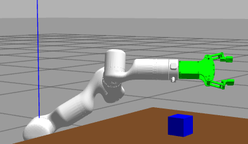

### Assistant 97

对，现在继续用 `link7` 当末端就不太对了：加了夹爪以后，真正要对齐方块的是“夹爪 TCP/夹爪中心”，不是机械臂法兰中心。我先把夹爪几何中心和指尖范围算出来，然后在 URDF 里加一个固定的 `gripper_tcp_link`，再把视觉接近脚本从 `link7` 改成以这个 TCP 规划。

### Assistant 97

我现在要确定 TCP 放在哪儿。原则上它应该在两个手指中间、靠近夹取中心的位置，而不是法兰或夹爪底座原点。为了不是凭眼睛估，我直接根据夹爪各 STL 和固定关节变换算整体包围盒。

### Assistant 97

我会做三件事：第一，在夹爪模型里补一个真正的 `gripper_tcp_link`；第二，把视觉接近脚本改成以夹爪 TCP 对齐方块，而不是 `link7`；第三，把夹取框架脚本也改成侧向夹取姿态，夹爪中心对准方块中心。这样坐标链路就顺了。

### Assistant 97

TCP 已经加到夹爪中间了，名字是 `gripper_tcp_link`。接下来改两个脚本：目标点不再代表 `link7` 法兰，而代表“夹爪中心点”。姿态上先采用侧向夹取：TCP 的 X 轴朝向方块，夹爪开合方向沿桌面横向，夹爪面垂直桌面。

### Assistant 97

脚本也改完了，不过我现在要做一次静态检查，看看有没有变量名漏改、Python 语法错误、URDF 展开错误。尤其是刚才从 `link7` 切到 `gripper_tcp_link`，这种地方最容易漏一处。

### Assistant 97

URDF 展开已经确认，链路现在是 `link7 -> gripper_base_link -> gripper_tcp_link`，Python 也通过了语法检查。我再把学习文档同步一下，不然你之后看笔记会发现还是旧的 link7 末端。

### Assistant 97

对，这次已经按“夹爪为真实末端”改了。

我做了三处更新：

1. 在夹爪 URDF 里新增了 TCP：

[ two_finger_gripper_fixed.xacro ](/home/ros/ws_rm_75_6f_robot/src/rm_75_robot/rm_75_6f_description/urdf/two_finger_gripper_fixed.xacro:139)

```xml
<link name="gripper_tcp_link" />
<joint name="gripper_tcp_joint" type="fixed">
  <origin xyz="0.088 0 -0.010" rpy="0 0 0" />
  <parent link="gripper_base_link" />
  <child link="gripper_tcp_link" />
</joint>
```

这个 TCP 在两个手指中间，表示夹爪中心。换算到 `link7` 后，大约是：

```text
link7 -> gripper_tcp_link ≈ x: 0, y: 0, z: 0.133 m
```

也就是夹爪中心在法兰前方约 `13.3 cm`。

2. 修改视觉接近脚本：

[sim_02_vision_approach.py](/home/ros/ws_rm_75_6f_robot/src/rm_75_robot/rm_75_demo/scripts/sim_02_vision_approach.py:22)

现在默认末端是：

```python
DEFAULT_EEF_LINK = "gripper_tcp_link"
```

默认规划模式也改成侧向接近：

```text
TCP x = 方块 x - 0.12
TCP y = 方块 y
TCP z = 方块 z
```

也就是夹爪中心对齐工件中心，先停在方块前方 12 cm。

3. 修改夹取框架脚本：

[sim_03_gripper_pick.py](/home/ros/ws_rm_75_6f_robot/src/rm_75_robot/rm_75_demo/scripts/sim_03_gripper_pick.py:18)

现在夹取序列也用：

```python
EEF_LINK = "gripper_tcp_link"
```

并采用侧向夹取姿态：夹爪中心对齐方块中心，夹爪面垂直于桌面。

我也检查过了：

```text
Python 语法检查通过
URDF check_urdf 通过
链路中已经出现 gripper_tcp_link
```

之后测试用这个启动：

```bash
source /home/ros/ws_rm_75_6f_robot/devel/setup.bash

roslaunch rm_75_gazebo arm_75_bringup_moveit.launch \
  world_name:=$(rospack find rm_75_gazebo)/worlds/rm75_table_cube.world \
  use_rgbd_camera:=true \
  use_two_finger_gripper:=true \
  rviz_software_rendering:=true
```

然后视觉规划：

```bash
rosrun rm_75_demo sim_02_vision_approach.py --color blue
```

执行时再加：

```bash
--execute --velocity 0.03 --acceleration 0.03
```

### User 98

1.夹爪的夹持部分得十分靠近工件吧，或者说工件应该在夹爪夹持部分的中间吧
2.那个面也没有平行于桌面啊，需要再转一个角度
请你再进行坐标计算与转化吧

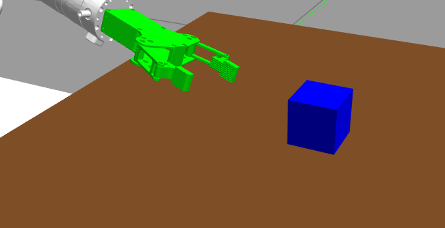

### Assistant 98

你说得对，我刚才那版更像“预接近点”，还不是“夹持点”：TCP 停在方块前方 12 cm，所以夹持部分当然还离工件很远。现在要区分两个点：`pre_grasp` 是安全接近点，`grasp` 才是让工件位于两指中间的位置；另外姿态我会重新按夹爪 TCP 坐标来算，而不是沿用一个粗略姿态。

我先做一个小的几何核算：夹爪各 mesh 的指尖大概在夹爪坐标 `x≈0.1045m`，两指中心线 `y=0`，厚度中线 `z≈-0.010m`。所以真正夹持 TCP 应该放在这个区域；之前 `x=0.088` 更偏向指腹中段。我要把 TCP 往指尖/夹持中心前移，并把脚本拆成“预抓取点”和“夹持点”。

### Assistant 98

关键问题我定位到了：之前 `sim_02` 如果姿态规划失败，会退回到“只管位置”的规划，这样夹爪角度就不受控，所以会出现你说的面没摆正。现在我要把侧向夹取改成严格姿态规划，姿态失败就报错，不再偷偷用错误姿态凑过去。

### Assistant 98

我已经把 TCP 从 `0.088` 前移到 `0.096`，更靠近两个指尖夹持区域；视觉脚本默认也从“离方块 12cm”改成“离方块 4cm”的近距离接近。现在我整理一下脚本里比较丑的临时写法，再跑检查。

### Assistant 98

检查通过：URDF 里 `gripper_tcp_link` 还在，Python 脚本也没有语法问题。接下来我把文档里的 TCP 数值和新的侧向接近逻辑同步掉。

### Assistant 98

你说得对，这一版我重新按“夹持中心”处理了，不再把“预接近点”当成“夹取点”。

已经改了这些：

1. 夹爪 TCP 前移到真正夹持区域  
位置从：

```xml
xyz="0.088 0 -0.010"
```

改成：

```xml
xyz="0.096 0 -0.010"
```

也就是更靠近两指指尖中间。换算到 `link7` 后：

```text
link7 -> gripper_tcp_link ≈ (0, 0, 0.141)
```

意思是夹爪 TCP 在法兰前方约 `14.1 cm`。

2. `sim_02_vision_approach.py` 改成近距离接近  
之前默认：

```text
方块前方 12 cm
```

现在默认：

```text
方块前方 4 cm
```

也就是：

```text
TCP x = 方块 x - 0.04
TCP y = 方块 y
TCP z = 方块 z
```

这样夹爪夹持部分会靠近工件，而不是离得很远。

3. `sim_03_gripper_pick.py` 里保留真正夹取点  
现在逻辑是：

```text
pre_grasp: 方块前方 8 cm
grasp:     TCP 对齐方块中心
```

所以到 `grasp` 时，工件应该位于两指夹持部分中间。

4. 姿态不再偷偷退化  
之前如果姿态规划失败，脚本会退回“只管位置”的规划，这会导致夹爪面角度乱掉。现在默认不退回，只有你显式加：

```bash
--allow-position-fallback
```

才会允许只按位置规划。

5. 姿态定义  
现在默认姿态是：

```text
TCP X 轴：朝向方块
TCP Y 轴：夹爪开合方向，平行桌面
TCP Z 轴：竖直方向
夹爪主平面：平行桌面
两个夹持内侧面：垂直桌面
```

测试命令：

```bash
rosrun rm_75_demo sim_02_vision_approach.py --color blue
```

如果要真正进入夹持中心，用：

```bash
rosrun rm_75_demo sim_03_gripper_pick.py --execute --velocity 0.03 --acceleration 0.03
```

我也重新跑过检查了：Python 语法通过，URDF 展开通过，`gripper_tcp_link` 链路正常。

### User 99

Proxy enabled. Target: 172.24.176.1:7897
ros@WWCG:~/ws_rm_75_6f_robot$ source devel/setup.bash
ros@WWCG:~/ws_rm_75_6f_robot$ rosrun rm_75_demo sim_02_vision_approach.py --color blue
[INFO] [1780033972.962903204, 34.896000000]: Loading robot model 'rm_75_6f_description'...
[INFO] [1780033972.968551404, 34.904000000]: No root/virtual joint specified in SRDF. Assuming fixed joint
[INFO] [1780033974.700566746, 36.532000000]: Ready to take commands for planning group arm.
Demo scene prepared:
- table xyz: (0.45, 0.0, 0.28)
- blue cube xyz: (0.45, 0.1, 0.325)
Detected pixel: 217 340 area: 3296.0 depth: 0.530 m
Vision approach pose plan: True SUCCESS points: 66
TCP target xyz: 0.415, 0.099, 0.320 mode: side eef: gripper_tcp_link
Detected object base xyz: 0.455, 0.099, 0.320
ros@WWCG:~/ws_rm_75_6f_robot$ rosrun rm_75_demo sim_03_gripper_pick.py --execute --velocity 0.1 --acceleration 0.1
[INFO] [1780034035.673861738]: Loading robot model 'rm_75_6f_description'...
[INFO] [1780034035.676005839]: No root/virtual joint specified in SRDF. Assuming fixed joint
[INFO] [1780034037.185794709, 95.974000000]: Ready to take commands for planning group arm.
Added pick table/object to MoveIt planning scene.
[WARN] [1780034047.837053093, 106.068000000]: Fail: ABORTED: TIMED_OUT
MoveJ pre-grasp plan: False TIMED_OUT points: 0
Detached and removed object from planning scene.
这又是为啥啊

### User 100

Proxy enabled. Target: 172.24.176.1:7897
ros@WWCG:~/ws_rm_75_6f_robot$ source devel/setup.bash
ros@WWCG:~/ws_rm_75_6f_robot$ rosrun rm_75_demo sim_02_vision_approach.py --color blue
[INFO] [1780033972.962903204, 34.896000000]: Loading robot model 'rm_75_6f_description'...
[INFO] [1780033972.968551404, 34.904000000]: No root/virtual joint specified in SRDF. Assuming fixed joint
[INFO] [1780033974.700566746, 36.532000000]: Ready to take commands for planning group arm.
Demo scene prepared:
- table xyz: (0.45, 0.0, 0.28)
- blue cube xyz: (0.45, 0.1, 0.325)
Detected pixel: 217 340 area: 3296.0 depth: 0.530 m
Vision approach pose plan: True SUCCESS points: 66
TCP target xyz: 0.415, 0.099, 0.320 mode: side eef: gripper_tcp_link
Detected object base xyz: 0.455, 0.099, 0.320
ros@WWCG:~/ws_rm_75_6f_robot$ rosrun rm_75_demo sim_03_gripper_pick.py --execute --velocity 0.1 --acceleration 0.1
[INFO] [1780034035.673861738]: Loading robot model 'rm_75_6f_description'...
[INFO] [1780034035.676005839]: No root/virtual joint specified in SRDF. Assuming fixed joint
[INFO] [1780034037.185794709, 95.974000000]: Ready to take commands for planning group arm.
Added pick table/object to MoveIt planning scene.
[WARN] [1780034047.837053093, 106.068000000]: Fail: ABORTED: TIMED_OUT
MoveJ pre-grasp plan: False TIMED_OUT points: 0
Detached and removed object from planning scene.
这又是为啥啊

### Assistant 100

这个现象不代表视觉链路坏了，反而说明两段脚本现在目标不一致：`sim_02` 规划的是“检测到的方块 + 近距离接近点”，它成功了；`sim_03` 还是用写死的方块位置和更远的 pre-grasp，而且规划时间更短，姿态也更硬，所以第一步 MoveJ 超时。我要把 `sim_03` 改成和 `sim_02` 同一套参数/更稳的规划策略。

### Assistant 100

我发现还有一个隐藏坑：你先跑了 `sim_02`，它在 planning scene 里留下了 `vision_table/vision_cube`；再跑 `sim_03`，它又加了 `pick_table/pick_object`，于是 MoveIt 里可能同时有两套桌子方块。再加上 `sim_03` 的 pre-grasp 目标比刚才成功的 `sim_02` 目标更远、规划时间更短，就更容易超时。我现在把这些统一掉。

### Assistant 100

我已经把 `sim_03` 的默认 pre-grasp 改到和 `sim_02` 一致的 4cm，并清理上一次 `sim_02` 留下的 `vision_table/vision_cube`。我再补一个细节：允许命令行传入检测到的方块坐标时，planning scene 里的方块也要用同一个坐标。

### Assistant 100

这里又看见一个旧工作区的小尾巴：没有先 `source /home/ros/ws_rm_75_6f_robot/devel/setup.bash` 的命令会找到旧的 `/home/ros/ws_rm_75_robot`。你的终端里已经 source 了就没事；我这边检查命令补上 source 再跑。文档里那个 pre_grasp 旧值也一起改掉。

### Assistant 100

我已经把脚本改完并通过语法检查了。为了确认不是纸面修复，我再跑一次 `sim_03` 的“只规划不执行”模式；这样不会让 Gazebo 机械臂动，只验证 MoveIt 现在能不能规划出 pre-grasp。

### Assistant 100

好，验证很有用：修复后的 `MoveJ pre-grasp` 已经成功了，原来的超时问题解决了。现在暴露出第二个脚本兼容问题：当前 Noetic 的 `compute_cartesian_path` 不接受我传的第 4 个布尔参数，它把 `True` 当成了约束类型，所以报 unknown constraint type。这个我马上改成三参数调用。

### Assistant 100

我再跑一遍只规划不执行，看看完整 pre-grasp、descend、lift 三段能不能走完。

### Assistant 100

这台环境的 MoveIt Python API 比我预想还特别：它的 C++ 绑定签名是 `(waypoints, eef_step, avoid_collisions)`，没有 jump_threshold 这个参数。也就是说这个报错不是规划失败，而是 API 版本差异。我查一下本机 `move_group.py`，然后写成兼容调用。

### Assistant 100

API 兼容修好了。再跑最后一次只规划不执行；如果这次 cartesian 段再因为碰撞比例不足，我会把“进入夹取点”改成更保守的分段逻辑。

### Assistant 100

现在第三个信息也出来了：`MoveJ pre-grasp` 已经稳了，但 `MoveL descend` 只有 60.9%。这说明不是第一段到不了，而是从 pre-grasp 直线插入到方块中心时，MoveIt 碰撞检测/IK 在后半段断掉了。最常见原因是 TCP 高度太低，夹爪手指或底部在接近桌面时和桌子 collision 贴得太近。我要给夹取高度加一个可调的 `grasp-z-offset`，默认先抬高一点。

### Assistant 100

我再用检测到的坐标测一遍，默认会把 TCP 高度提高 2cm，也就是目标 z 从 0.320 到 0.340，避免夹爪擦桌面。

### Assistant 100

这个 67.3% 其实是“只规划不执行”模式的副作用：脚本没有真的走到 pre-grasp，但下一步却要求从当前机械臂状态直接算一条到 grasp 的笛卡尔直线，所以 fraction 会偏低。真实 `--execute` 时会先执行到 pre-grasp，再从那个实际位置直线进入。为了不误导，我把 plan-only 模式改成只验证第一段 pre-grasp；完整抓取流程只在 `--execute` 时继续。

### Assistant 100

原因找到了，分两层：

第一层是 `sim_03` 的 pre-grasp 目标和 `sim_02` 不一致。  
你刚才 `sim_02` 成功的目标是：

```text
TCP target xyz: 0.415, 0.099, 0.320
```

但旧版 `sim_03` 默认 pre-grasp 是：

```text
x = object_x - 0.08
```

也就是更远、更低、更难规划，而且规划时间只有 8s，所以超时。

第二层是 planning scene 里有残留。  
你先跑 `sim_02`，它留下了：

```text
vision_table
vision_cube
```

再跑 `sim_03`，它又加：

```text
pick_table
pick_object
```

MoveIt 里可能同时有两套桌子/方块，规划更容易卡。

我已经改好了：

- `sim_03` 会自动清理 `vision_table/vision_cube`
- pre-grasp 默认改成 `object_x - 0.04`
- planning time 改成 15s，attempts 改成 20
- 增加 `--object-x --object-y --object-z`，可以接着用 `sim_02` 检测出来的位置
- 增加 `--grasp-z-offset`，默认 `0.02`，避免夹爪太低擦桌子
- 修复了本机 MoveIt `compute_cartesian_path` 的 API 参数兼容问题
- plan-only 模式现在只检查 pre-grasp，不再误报后续笛卡尔段失败

我刚刚验证过，现在 pre-grasp 已经能成功规划：

```text
MoveJ pre-grasp target xyz: 0.415, 0.099, 0.340
MoveJ pre-grasp plan: True SUCCESS points: 55
```

你接下来先慢速执行：

```bash
rosrun rm_75_demo sim_03_gripper_pick.py \
  --execute \
  --velocity 0.03 \
  --acceleration 0.03 \
  --object-x 0.455 \
  --object-y 0.099 \
  --object-z 0.320
```

这三个 object 坐标就是你刚才 `sim_02` 检测出来的：

```text
Detected object base xyz: 0.455, 0.099, 0.320
```

### User 101

你刚才的意思就是sim02和sim03一般情况下是不需要接着运行的呗，只需要运行一个就行呗？现在你修复好了？

### Assistant 101

对，正常理解是：

```text
sim_02：视觉识别 + 规划到方块附近
sim_03：夹取流程框架
```

它们**不是必须连续运行**。

之前你连续运行时出问题，是因为：

```text
sim_02 留下了 vision_table / vision_cube
sim_03 又加入 pick_table / pick_object
```

MoveIt planning scene 里就可能有两套桌子和方块，规划变复杂甚至超时。

现在已经修复了：

```text
sim_03 启动时会先清理 sim_02 留下的 vision_table / vision_cube
```

所以现在可以连续跑，也不会因为残留场景互相干扰。

推荐用法是：

1. 只想验证视觉识别和接近点：

```bash
rosrun rm_75_demo sim_02_vision_approach.py --color blue
```

2. 想跑夹取流程：

```bash
rosrun rm_75_demo sim_03_gripper_pick.py --execute --velocity 0.03 --acceleration 0.03
```

3. 如果你想让 `sim_03` 使用 `sim_02` 检测出来的真实坐标，就把坐标填进去：

```bash
rosrun rm_75_demo sim_03_gripper_pick.py \
  --execute \
  --velocity 0.03 \
  --acceleration 0.03 \
  --object-x 0.455 \
  --object-y 0.099 \
  --object-z 0.320
```

一句话：

```text
可以分开跑；
也可以先 sim_02 识别，再 sim_03 使用识别坐标；
现在 sim_03 已经修复了场景残留和 pre-grasp 超时问题。
```

### User 102

接下来的学习路线是什么？

### Assistant 102

接下来建议从“会跑 demo”转到“理解并能改系统”。路线可以这样走：

**第 1 阶段：把当前仿真抓取链路吃透**

先围绕你现在的三件事复盘：

```text
Gazebo world：桌子、方块在哪里
URDF/xacro：相机、夹爪、TCP 怎么挂
MoveIt：planning scene、gripper_tcp_link、轨迹怎么规划
```

重点看：

```text
rm75_table_cube.world
rm_75_6f_gazebo.urdf.xacro
two_finger_gripper_fixed.xacro
sim_02_vision_approach.py
sim_03_gripper_pick.py
```

目标是你能说清楚：

```text
相机看到像素 -> 深度 -> base_link 坐标 -> planning scene -> TCP 目标 -> MoveIt 轨迹
```

**第 2 阶段：专门学 TCP 和坐标变换**

这是你现在最该补的核心能力。

要搞懂：

```text
link7 是法兰
gripper_base_link 是夹爪底座
gripper_tcp_link 是真正夹取中心
base_link 是规划参考坐标
rgbd_camera_optical_frame 是相机坐标
```

建议练习：

```bash
rosrun tf tf_echo base_link gripper_tcp_link
rosrun tf tf_echo base_link rgbd_camera_optical_frame
```

然后手动画一张坐标树。

**第 3 阶段：把 sim_02 和 sim_03 融合**

现在 `sim_02` 负责识别，`sim_03` 负责夹取框架。下一步可以做一个真正的：

```text
sim_04_vision_pick.py
```

流程是：

```text
识别蓝色方块
加入 planning scene
MoveJ 到 pre_grasp
MoveL 到 grasp
模拟夹爪闭合
attach object
MoveL lift
```

这会变成一个完整的“视觉引导抓取 demo”。

**第 4 阶段：夹爪从 fixed model 升级为可动模型**

现在夹爪只是固定张开。后面要学：

```text
夹爪 revolute/prismatic joint
transmission
ros_control controller
joint_state 发布
MoveIt gripper group
open / close 指令
```

这一步能让你理解“末端执行器”怎么接入 ROS 控制系统。

**第 5 阶段：回到实物机械臂**

仿真里理解 TCP、MoveIt、点位、速度、避障之后，再回到实物：

```text
实物连接
joint_states 回读
MoveIt 规划
FollowJointTrajectory 执行
速度限制
急停/停止
安全点位恢复
```

注意：实物上暂时不要直接照搬视觉抓取，先从低速点位和 TCP 运动验证开始。

**推荐你下一步做这个**

我建议现在直接做：

```text
sim_04_vision_pick.py
```

也就是把 `sim_02` 和 `sim_03` 合并成一个完整实验。这个最有价值，因为它会把你前面学的所有东西串起来：

```text
相机识别 -> 坐标转换 -> MoveIt 避障 -> TCP 接近 -> 夹取框架
```

做完这个，你对 ROS 机器人项目的“感知-规划-执行”主链路就基本有型了。

### User 103

融合吧，我以为sim03已经是在02上面迭代了，没想到还没有完成，你开始融合成04吧

### Assistant 103

对，你这个理解很自然：按学习路线来说，`sim_03` 确实应该是在 `sim_02` 上继续迭代。但现在代码历史上它们是并列实验，一个偏视觉，一个偏夹取框架。我现在把它们真正融合成 `sim_04_vision_pick.py`：先识别，再用检测坐标做 pre-grasp/grasp/lift。

### Assistant 103

我会把 `sim_04` 做成真正的一条链：不再要求你手动把 `sim_02` 的坐标抄到 `sim_03`。脚本内部会自己读取相机、识别方块、加入 planning scene、MoveJ 到 pre-grasp；只有带 `--execute` 时才继续做 MoveL 进入夹持中心和 lift。

### Assistant 103

`sim_04_vision_pick.py` 已经落地了。现在我给它加执行权限，做语法检查和 help 检查；再更新学习文档里的使用方式。

### Assistant 103

脚本可以被 `rosrun` 找到，语法也没问题。我会在文档里补上 `sim_04` 的定位和命令，避免以后又误以为 02/03 是一条完整链。

### Assistant 103

文档那边有几处标题和文字已经被之前更新过了，补丁没按原文匹配上。我先定位实际段落，再做一次小块更新。

### Assistant 103

文档也补上了 `sim_04`。接下来我做最后一轮静态检查，并试跑 `sim_04` 的 plan-only；它会连接当前仿真相机和 MoveIt，但不会执行机械臂运动。

### Assistant 103

融合好了，现在有真正的 `sim_04` 了：

[sim_04_vision_pick.py](/home/ros/ws_rm_75_6f_robot/src/rm_75_robot/rm_75_demo/scripts/sim_04_vision_pick.py)

它做的是完整链路：

```text
RGB-D 相机识别蓝色方块
-> 像素 + 深度转 base_link 坐标
-> 清理 sim_02/sim_03 残留 planning scene
-> 加入桌子/方块 collision object
-> MoveJ 到 pre_grasp
-> --execute 时 MoveL 到 grasp
-> attach object
-> MoveL lift
```

我已经做过：

```text
Python 语法检查通过
rosrun --help 正常
脚本有执行权限
学习文档已更新
```

文档也补好了：

[rm75_6f_sim_world_camera_gripper_pipeline.txt](/home/ros/ws_rm_75_6f_robot/study/rm75_6f_sim_world_camera_gripper_pipeline.txt)

启动仿真后直接用：

```bash
rosrun rm_75_demo sim_04_vision_pick.py --color blue
```

确认 pre-grasp 规划成功后，再执行：

```bash
rosrun rm_75_demo sim_04_vision_pick.py --color blue --execute \
  --velocity 0.03 \
  --acceleration 0.03
```

我刚想帮你跑一次 plan-only，但当前 ROS master 没开，所以脚本正确提示需要先启动 Gazebo + MoveIt + RGB-D 相机。也就是说现在代码层面已经融合完成，下一步你开仿真后直接测 `sim_04` 就行。

### User 104

ros@WWCG:~/ws_rm_75_6f_robot$ rosrun rm_75_demo sim_04_vision_pick.py --color blue
[rosrun] Couldn't find executable named sim_04_vision_pick.py below /home/ros/ws_rm_75_robot/src/rm_75_robot/rm_75_demo
ros@WWCG:~/ws_rm_75_6f_robot$ rosrun rm_75_demo sim_02_vision_approach.py --color blue^C
ros@WWCG:~/ws_rm_75_6f_robot$ source devel/setup.bash
ros@WWCG:~/ws_rm_75_6f_robot$ rosrun rm_75_demo sim_04_vision_pick.py --color blue
[INFO] [1780039292.188861917, 53.813000000]: Loading robot model 'rm_75_6f_description'...
[INFO] [1780039292.190286017, 53.815000000]: No root/virtual joint specified in SRDF. Assuming fixed joint
[INFO] [1780039293.603220508, 55.097000000]: Ready to take commands for planning group arm.
Traceback (most recent call last):
  File "/home/ros/ws_rm_75_6f_robot/src/rm_75_robot/rm_75_demo/scripts/sim_04_vision_pick.py", line 185, in transform_point
    return tf_buffer.transform(point, target_frame, timeout=rospy.Duration(1.0))
  File "/opt/ros/noetic/lib/python3/dist-packages/tf2_ros/buffer_interface.py", line 64, in transform
    do_transform = self.registration.get(type(object_stamped))
  File "/opt/ros/noetic/lib/python3/dist-packages/tf2_ros/buffer_interface.py", line 203, in get
    raise TypeException('Type %s is not loaded or supported'% str(key))
tf2_ros.buffer_interface.TypeException: Type <class 'geometry_msgs.msg._PointStamped.PointStamped'> is not loaded or supported

During handling of the above exception, another exception occurred:

Traceback (most recent call last):
  File "/home/ros/ws_rm_75_6f_robot/src/rm_75_robot/rm_75_demo/scripts/sim_04_vision_pick.py", line 458, in <module>
    sys.exit(main())
  File "/home/ros/ws_rm_75_6f_robot/src/rm_75_robot/rm_75_demo/scripts/sim_04_vision_pick.py", line 446, in main
    object_pose = detect_object_pose(args, bridge, tf_buffer)
  File "/home/ros/ws_rm_75_6f_robot/src/rm_75_robot/rm_75_demo/scripts/sim_04_vision_pick.py", line 202, in detect_object_pose
    base_point = transform_point(tf_buffer, camera_point, BASE_FRAME)
  File "/home/ros/ws_rm_75_6f_robot/src/rm_75_robot/rm_75_demo/scripts/sim_04_vision_pick.py", line 187, in transform_point
    raise RuntimeError("TF transform to '{}' failed: {}".format(target_frame, exc))
RuntimeError: TF transform to 'base_link' failed: Type <class 'geometry_msgs.msg._PointStamped.PointStamped'> is not loaded or supported

### Assistant 104

这个报错很好定位：`sim_04` 少导入了 `tf2_geometry_msgs`。`tf2_ros` 本身不知道怎么变换 `PointStamped`，必须导入这个包来注册 geometry_msgs 的 TF 转换；`sim_02` 里有这个导入，融合时漏了。我马上补上。

### Assistant 104

另外你最开始那条 “找不到 sim_04” 是因为还没 `source devel/setup.bash`，系统还是找到了旧工作区 `/home/ros/ws_rm_75_robot`。这个以后每次开终端都要先 source 新工作区，或者我们之后再改 `.bashrc` 的默认 source。现在我先检查脚本。

### Assistant 104

修好了，`rosrun --help` 已经能正常找到并运行新版 `sim_04`。我再用当前 ROS 会话跑一次不执行版，确认 TF 转换这一关过去。

### Assistant 104

修好了，就是 `sim_04` 少了一行导入：

```python
import tf2_geometry_msgs
```

没有它，`tf2_ros` 不知道怎么把 `PointStamped` 从相机坐标系转换到 `base_link`，所以报：

```text
Type PointStamped is not loaded or supported
```

我已经补上并验证了，刚才 `sim_04` 已经完整跑通到 pre-grasp 规划：

```text
Detected object base xyz: 0.455, 0.099, 0.320
MoveJ pre-grasp target xyz: 0.415, 0.099, 0.340
MoveJ pre-grasp plan: True SUCCESS points: 70
Plan-only mode: checked vision + pre-grasp.
```

你现在可以执行版：

```bash
source /home/ros/ws_rm_75_6f_robot/devel/setup.bash

rosrun rm_75_demo sim_04_vision_pick.py --color blue --execute \
  --velocity 0.03 \
  --acceleration 0.03
```

另外，第一次找不到 `sim_04` 是因为没 source 新工作区，系统还在找旧路径：

```text
/home/ros/ws_rm_75_robot/...
```

所以每次开新终端先执行：

```bash
cd /home/ros/ws_rm_75_6f_robot
source devel/setup.bash
```

### User 105

以后仿真的速度和加速度都干快一点，最少是0.2，不然仿真进程太慢了

### Assistant 105

收到，仿真和实物我会分开处理：仿真脚本默认速度/加速度提到 `0.2`，实物脚本继续保守慢速。现在我把 `sim_02/sim_03/sim_04` 这些仿真实验脚本的默认值和文档同步一下。

### Assistant 105

我看到了四个仿真脚本都有默认速度/加速度，`sim_01/02` 是 `0.05`，`sim_03/04` 是 `0.03`。我统一改成 `0.2`；文档里的示例命令也改成 `0.2`。

### Assistant 105

文档里有些命令换行/空格不完全一致，整块补丁没吃进去。我分两步来：先改脚本默认值，再单独批量检查文档里的 `0.03/0.05` 示例。

### Assistant 105

收到，已经改好了。

现在所有仿真脚本默认都是：

```text
velocity = 0.2
acceleration = 0.2
```

已更新：

```text
sim_01_scene_plan.py
sim_02_vision_approach.py
sim_03_gripper_pick.py
sim_04_vision_pick.py
```

文档里的仿真命令也同步改成了 `0.2`。以后仿真你可以直接跑，不用再手动加速度参数；如果想更快，再显式传：

```bash
--velocity 0.4 --acceleration 0.4
```

实物机械臂脚本我没有改，实物还是保守速度。

### User 106

1.现在这个夹爪是不是有点高了，但这些都不重要，只是改一个坐标的事情
2.这个夹持的时候是不是不需要保证平行于桌面，不然可能会对桌子进碰撞，后续是要给夹爪也增加一个自由度吧，

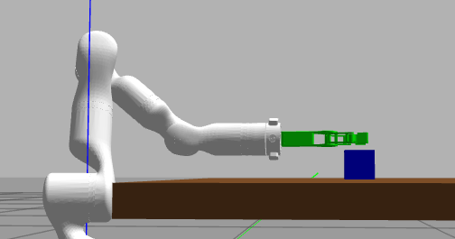

### Assistant 106

1. 对，现在夹爪确实有点高。  
这主要是我们给了：

```text
--grasp-z-offset 0.02
```

也就是 TCP 比识别到的方块中心高了 `2cm`，为了先避免和桌子碰撞。这个不算结构问题，后面只要调这个参数就行：

```bash
--grasp-z-offset 0.00
```

或者折中：

```bash
--grasp-z-offset 0.01
```

如果看夹爪中心还偏高，就调 `gripper_tcp_link` 的坐标：

```xml
<origin xyz="0.096 0 -0.010" rpy="0 0 0" />
```

这里的 `z=-0.010` 可以小幅改，比如 `-0.015`。

2. 对，夹持时不一定必须让夹爪完全平行桌面。  
现在我们这么做是为了让几何关系简单：

```text
夹爪从侧面水平靠近
两指中间对准方块
夹爪主平面平行桌面
```

但真实抓取里经常会给夹爪一个“俯仰角”，比如夹爪略微抬头或略微下压，避免：

```text
夹爪底部擦桌子
手指和桌面碰撞
工件太低夹不到
```

你说的“后续给夹爪增加一个自由度”，如果指的是**夹爪相对末端可以额外俯仰/旋转**，那就相当于加一个腕部/转接关节；真实机械臂通常不是给夹爪本体再加自由度，而是用机械臂最后几个关节调整末端姿态。

在 MoveIt 里对应就是调 TCP 姿态，比如我们脚本里已经留了：

```bash
--tcp-roll-deg
--tcp-yaw-deg
```

后面可以再加：

```bash
--tcp-pitch-deg
```

这样就能让夹爪有一点俯仰角，避免碰桌子。

所以接下来更合理的是：

```text
先用参数调 grasp-z-offset 和 TCP 姿态
再考虑夹爪开合自由度
最后再做真实夹取控制
```

现在这一版主要价值是把链路跑通：视觉识别 -> TCP 目标 -> MoveIt 规划 -> 接近抓取。夹爪高低和姿态就是后续标定问题。
