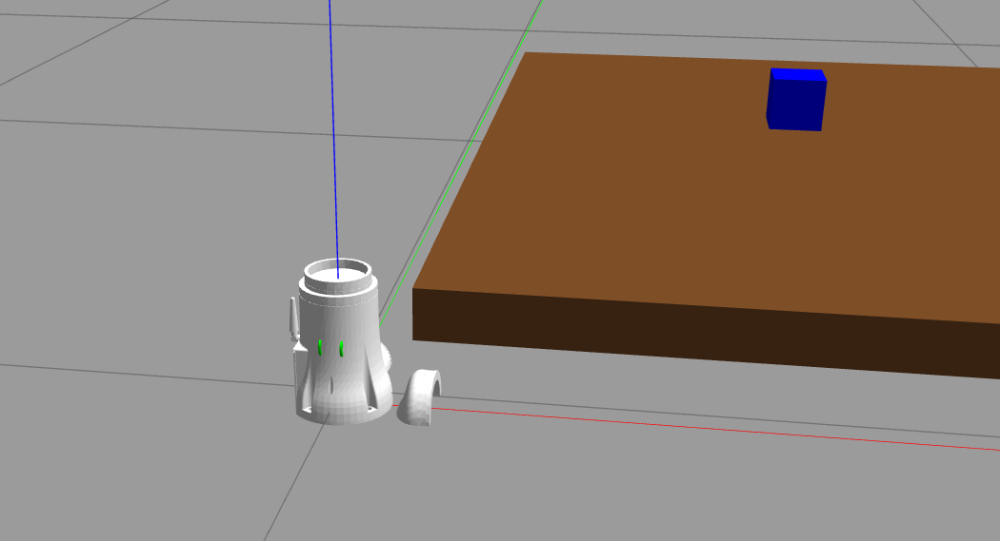
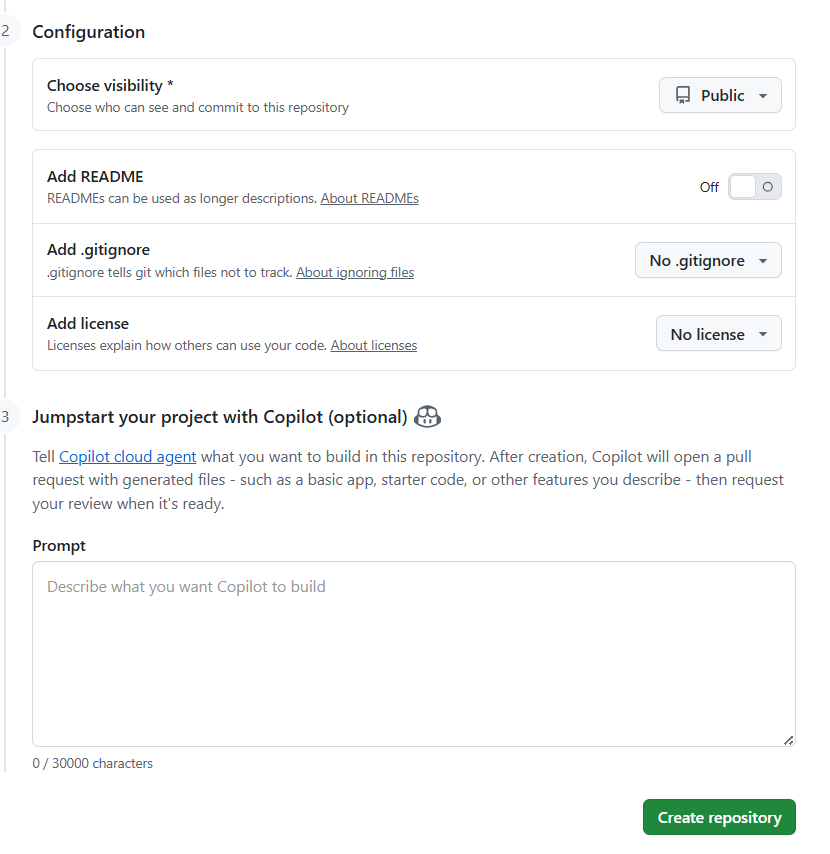
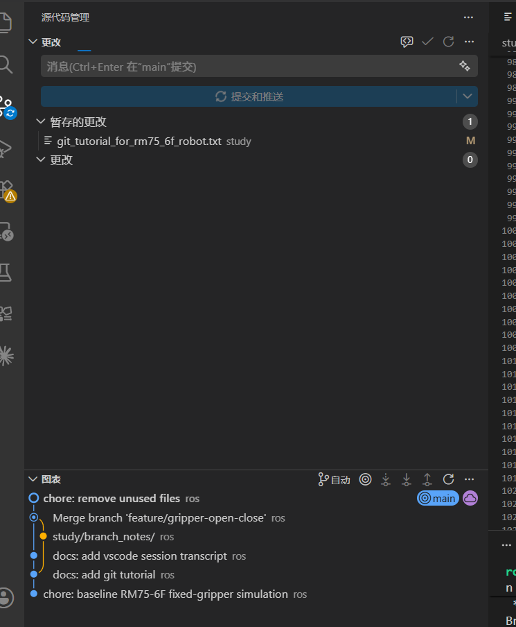

# 学习机械臂

## Transcript

### User 1

<environment_context>
  <cwd>/home/ros/ws_rm_75_6f_robot</cwd>
  <shell>bash</shell>
  <current_date>2026-05-29</current_date>
  <timezone>Asia/Shanghai</timezone>
</environment_context>

# Context from my IDE setup:

## Open tabs:
- transcript.md: study/2026-05-25-0917_vscode_019e5e6d-1b61-7031-a321-af320e71281a_Files-mentioned-by-the-user/transcript.md
- rm75_6f_sim_world_camera_gripper_pipeline.txt: study/rm75_6f_sim_world_camera_gripper_pipeline.txt
- rm75_6f_next_learning_steps.txt: study/rm75_6f_next_learning_steps.txt

# Files mentioned by the user:

## transcript.md: /home/ros/ws_rm_75_6f_robot/study/2026-05-25-0917_vscode_019e5e6d-1b61-7031-a321-af320e71281a_Files-mentioned-by-the-user/transcript.md

## My request for Codex:
阅读一下工作区的资料与发给你的对话内容，现在在学习机械臂

### Assistant 1

我会先快速扫一遍工作区结构和你提到的学习资料，抓住这个项目现在的上下文：机械臂型号、仿真/相机/夹爪管线、以及你前面对话里已经学到哪一步。

### Assistant 1

我看到这是一个 ROS/catkin 工作区，不是 git 仓库；资料主要集中在 `study/` 和 `src/rm_75_robot/`。接下来我会只读关键学习笔记和 transcript 的结构，不把编译产物噪声带进来。

### Assistant 1

这几份笔记已经很清楚地把学习线分成了两条：仿真线和真机线。仿真线现在不只是“让机械臂动”，而是已经叠到了 Gazebo 世界、RGB-D 视觉、MoveIt 避障、夹爪 TCP 这些比较完整的抓取流程。

### Assistant 1

我也把 transcript 的关键节点抓到了：你们是从官方 RM75-B 第六章仿真链路，逐步迁移到 RM75-6F，后来又加了 Gazebo 稳定性、RGB-D 相机、桌面方块、夹爪 TCP，最后融合成 `sim_04_vision_pick.py`。现在学习状态已经不是零基础搭环境，而是在把“视觉引导抓取”这条链真正吃透。

### Assistant 1

实物线也已经有笔记：真机连接曾验证过 `/joint_states`、`/rm_75/follow_joint_trajectory`、MoveIt 执行链路；不过当前最适合继续学的仍然是仿真抓取，因为它同时锻炼坐标系、TCP、planning scene 和执行安全。

### Assistant 1

我读过了。当前工作区的主线很清楚：你现在在学 **RM75-6F 机械臂的 ROS + MoveIt + Gazebo + 视觉抓取链路**，不是单纯跑 demo。

核心资料我已经对上了：

- 总笔记：[rm75_6f_sim_world_camera_gripper_pipeline.txt](/home/ros/ws_rm_75_6f_robot/study/rm75_6f_sim_world_camera_gripper_pipeline.txt)
- 后续路线：[rm75_6f_next_learning_steps.txt](/home/ros/ws_rm_75_6f_robot/study/rm75_6f_next_learning_steps.txt)
- 之前对话：[transcript.md](/home/ros/ws_rm_75_6f_robot/study/2026-05-25-0917_vscode_019e5e6d-1b61-7031-a321-af320e71281a_Files-mentioned-by-the-user/transcript.md)
- 当前融合脚本：[sim_04_vision_pick.py](/home/ros/ws_rm_75_6f_robot/src/rm_75_robot/rm_75_demo/scripts/sim_04_vision_pick.py:22)

我理解你现在的状态是：

1. 已经从官方 RM75-B 学过 MoveIt/Gazebo 基本链路。
2. 已经迁移到独立的 `/home/ros/ws_rm_75_6f_robot`。
3. RM75-6F 的模型、MoveIt、Gazebo 联动已经跑通。
4. 仿真里已经加了桌子、蓝色方块、RGB-D 相机、两指夹爪。
5. 现在重点在理解：
   `相机识别 -> 深度点 -> TF 到 base_link -> planning scene -> gripper_tcp_link -> MoveIt 规划 -> 夹取/抬升`

目前最值得继续学的点，不是马上接真机视觉抓取，而是把仿真里的 `sim_04_vision_pick.py` 吃透。特别是这几个概念：

- `link7` 是法兰末端，不是真正夹取点。
- `gripper_tcp_link` 才是夹爪中心/TCP。
- Gazebo 里的桌子方块不等于 MoveIt 知道的障碍物，需要脚本加入 planning scene。
- 视觉检测出来的是物体坐标，真正规划的是 TCP 的目标位姿。
- 夹爪高度、俯仰角、预抓取距离都是后续标定参数，不是系统结构问题。

推荐你下一步继续围绕这条命令做实验：

```bash
cd /home/ros/ws_rm_75_6f_robot
source devel/setup.bash

roslaunch rm_75_gazebo arm_75_bringup_moveit.launch \
  world_name:=$(rospack find rm_75_gazebo)/worlds/rm75_table_cube.world \
  use_rgbd_camera:=true \
  use_two_finger_gripper:=true \
  rviz_software_rendering:=true
```

然后先只规划：

```bash
rosrun rm_75_demo sim_04_vision_pick.py --color blue
```

稳定后再执行：

```bash
rosrun rm_75_demo sim_04_vision_pick.py --color blue --execute \
  --velocity 0.2 --acceleration 0.2
```

我后面会按这个上下文接着帮你，不会把仿真、真机、旧 RM75-B 工作区混在一起。

### User 2

# Context from my IDE setup:

## Open tabs:
- transcript.md: study/2026-05-25-0917_vscode_019e5e6d-1b61-7031-a321-af320e71281a_Files-mentioned-by-the-user/transcript.md
- rm75_6f_sim_world_camera_gripper_pipeline.txt: study/rm75_6f_sim_world_camera_gripper_pipeline.txt
- rm75_6f_next_learning_steps.txt: study/rm75_6f_next_learning_steps.txt

## My request for Codex:
现在增加一个开合的夹爪自由度啊

### Assistant 2

好，我们把夹爪从“固定张开模型”推进到“有一个可控开合自由度”。我先看现有夹爪 xacro、MoveIt SRDF 和 Gazebo 控制器配置，确定最小改动面：让仿真里两个手指跟随同一个开合关节动起来。

### Assistant 2

现有文件里夹爪确实是 `two_finger_gripper_fixed`：四个手指相关关节全是 fixed，所以现在只能看见张开的几何，不能动。比较稳的做法是把两个近端关节改成主动/被动联动：一个 `gripper_joint` 作为控制入口，另一侧用 mimic 镜像；远端连杆也用 mimic 保持平行夹爪机构。

### Assistant 2

这里有一个工程取舍：URDF 的 `mimic` 能让 TF/RViz 理解“一个关节带动另一个关节”，但 Gazebo 物理通常不会自动执行 mimic 约束。为了让 Gazebo 里也真的开合，我会用四个实际 revolute 关节保留原机构，再提供一个脚本把它们按一个 opening 参数同步发布；对学习来说仍然是“一个开合自由度”，只是底层用四个控制器实现。

### Assistant 2

我准备改四块：夹爪 xacro 从固定关节变可动关节并补 transmission；Gazebo 控制器 launch/yaml 增加四个夹爪位置控制器；加一个 `sim_gripper_control.py` 方便单独开合；再把 `sim_04` 执行流程接上“先张开、抓取点闭合、再 attach/lift”。

### Assistant 2

先动模型文件：我会保留现有 link、mesh 和 TCP 名称不变，只把四个夹爪关节从 fixed 改成 revolute。这样 `gripper_tcp_link` 和已有视觉脚本不需要重新认名字。

### Assistant 2

模型层已经有了可动关节和 transmission。接下来接 Gazebo 控制器：只在 `use_two_finger_gripper:=true` 时启动夹爪控制器，避免不带夹爪启动时 controller_manager 因为找不到关节报错。

### Assistant 2

控制器配置接好了。现在加一个小脚本，提供 `--open`、`--close`、`--position` 三种用法；它发布四个底层关节命令，但对你来说就是一个夹爪开合量。

### Assistant 2

单独开合脚本已加好。下一步把完整视觉抓取脚本接上夹爪动作：执行模式下先张开，直线进入 grasp 后闭合，再把物体 attach 到 TCP，最后 lift。

### Assistant 2

脚本层也接好了。现在我同步学习笔记，把“固定夹爪”改成“可动仿真夹爪”，并写清楚四个底层关节如何被当作一个开合量来用。

### Assistant 2

文档也同步了。现在做静态验证：先检查 Python 语法和 launch 展开，再展开带相机+夹爪的 xacro 用 `check_urdf` 验 URDF 树，最后编译相关包。

### Assistant 2

到目前为止语法和 launch 展开都正常；xacro 展开成功，只是 rospack 想写 `~/.ros` 缓存时被沙箱拦了一下，这不影响生成 URDF。继续跑 `check_urdf` 和构建。

### Assistant 2

URDF 树已经通过，能看到 `gripper_base_link` 下挂了四个 revolute 关节和 TCP；这说明模型结构是通的。构建还在跑，我等它结束再看有没有控制器或包依赖问题。

### Assistant 2

构建通过了。最后再做两项轻量检查：确认新脚本能被 `rosrun` 找到，以及总 launch 带 `use_two_finger_gripper:=true` 时会展开夹爪 controller spawner。

### Assistant 2

静态检查已经很干净：`rosrun` 能找到新脚本，总 launch 也会展开 `/arm/gripper_controller_spawner`。我再尝试一次短时 headless 运行，确认 controller_manager 里真的能加载四个夹爪控制器；跑完会收掉进程。

### Assistant 2

运行级验证发现一个老问题现在又被放大了：控制器虽然已经全部加载并启动，但 `gazebo_ros_control` 在启动时提示缺 `/arm/gazebo_ros_control/pid_gains/...`。我顺手把机械臂 7 轴和夹爪 4 轴的底层 PID gains 补到同一个 yaml 里，让日志干净，也避免物理控制发硬。

### Assistant 2

我已经把上一次 headless 验证进程完整关掉了。现在重跑一个自动超时的短验证，重点看启动日志里是否还出现 “No p gain specified”，以及夹爪控制器是否仍能加载。

### Assistant 2

已经加上了：现在仿真夹爪不再只是固定模型，而是有可控开合了。

主要改动：

- [two_finger_gripper_fixed.xacro](/home/ros/ws_rm_75_6f_robot/src/rm_75_robot/rm_75_6f_description/urdf/two_finger_gripper_fixed.xacro)  
  把四个夹爪关节改成 `revolute`，并补了 `transmission`。逻辑开合量 `q` 的映射是：
  `link1=q, link11=-q, link2=-q, link22=q`。

- [rm_75_trajectory_control.yaml](/home/ros/ws_rm_75_6f_robot/src/rm_75_robot/rm_75_gazebo/config/rm_75_trajectory_control.yaml)  
  增加四个夹爪 `JointPositionController`，并补了 `/arm/gazebo_ros_control/pid_gains`，启动日志不再报缺 PID gain。

- [arm_75_trajectory_controller.launch](/home/ros/ws_rm_75_6f_robot/src/rm_75_robot/rm_75_gazebo/launch/arm_75_trajectory_controller.launch)  
  只有 `use_two_finger_gripper:=true` 时才启动夹爪控制器。

- 新增 [sim_gripper_control.py](/home/ros/ws_rm_75_6f_robot/src/rm_75_robot/rm_75_demo/scripts/sim_gripper_control.py)  
  可以单独测试开合：

```bash
rosrun rm_75_demo sim_gripper_control.py --open
rosrun rm_75_demo sim_gripper_control.py --close
rosrun rm_75_demo sim_gripper_control.py --position 0.35
```

- [sim_04_vision_pick.py](/home/ros/ws_rm_75_6f_robot/src/rm_75_robot/rm_75_demo/scripts/sim_04_vision_pick.py)  
  `--execute` 时现在会自动：
  `open -> pre_grasp -> grasp -> close -> attach -> lift`  
  如需跳过仿真夹爪动作，可加 `--skip-sim-gripper-motion`。

我也更新了学习笔记：[rm75_6f_sim_world_camera_gripper_pipeline.txt](/home/ros/ws_rm_75_6f_robot/study/rm75_6f_sim_world_camera_gripper_pipeline.txt)。

验证已做：

- Python 语法检查通过。
- xacro 展开 + `check_urdf` 通过，能看到四个夹爪 revolute joint。
- `catkin build rm_75_6f_description rm_75_gazebo rm_75_demo --summarize` 通过。
- 短时 headless Gazebo 验证通过，四个夹爪控制器成功 `Started controllers`，并且补 PID 后没有再出现 “No p gain specified”。

### User 3

# Context from my IDE setup:

## Open tabs:
- transcript.md: study/2026-05-25-0917_vscode_019e5e6d-1b61-7031-a321-af320e71281a_Files-mentioned-by-the-user/transcript.md
- rm75_6f_sim_world_camera_gripper_pipeline.txt: study/rm75_6f_sim_world_camera_gripper_pipeline.txt
- rm75_6f_next_learning_steps.txt: study/rm75_6f_next_learning_steps.txt

## My request for Codex:
我现在的命令行流程是什么？

### Assistant 3

现在按这个流程跑：

**1. 启动仿真环境**

```bash
cd /home/ros/ws_rm_75_6f_robot
source devel/setup.bash

roslaunch rm_75_gazebo arm_75_bringup_moveit.launch \
  world_name:=$(rospack find rm_75_gazebo)/worlds/rm75_table_cube.world \
  use_rgbd_camera:=true \
  use_two_finger_gripper:=true \
  rviz_software_rendering:=true
```

这个会启动：

- Gazebo 桌子 + 蓝色方块
- RM75-6F
- RGB-D 相机
- 可开合两指夹爪
- MoveIt
- RViz

**2. 单独测试夹爪开合，可选**

另开一个终端：

```bash
cd /home/ros/ws_rm_75_6f_robot
source devel/setup.bash

rosrun rm_75_demo sim_gripper_control.py --open
```

```bash
rosrun rm_75_demo sim_gripper_control.py --close
```

或者指定闭合量：

```bash
rosrun rm_75_demo sim_gripper_control.py --position 0.35
```

**3. 只做视觉识别 + 预抓取规划**

```bash
cd /home/ros/ws_rm_75_6f_robot
source devel/setup.bash

rosrun rm_75_demo sim_04_vision_pick.py --color blue
```

这一步不会执行机械臂运动，只检查：

```text
相机识别 -> 坐标转换 -> planning scene -> pre_grasp 规划
```

**4. 执行完整视觉抓取**

```bash
rosrun rm_75_demo sim_04_vision_pick.py --color blue --execute \
  --velocity 0.2 --acceleration 0.2
```

现在完整流程是：

```text
识别蓝色方块
-> 加桌子/方块到 MoveIt planning scene
-> 打开夹爪
-> MoveJ 到 pre_grasp
-> MoveL 到 grasp
-> 闭合夹爪
-> attach 方块
-> MoveL 抬升
```

如果夹爪闭合太多或太少，可以调：

```bash
rosrun rm_75_demo sim_04_vision_pick.py --color blue --execute \
  --velocity 0.2 --acceleration 0.2 \
  --gripper-close-position 0.45
```

常用调参还有：

```bash
--grasp-z-offset 0.02
--pre-grasp-offset 0.04
--tcp-roll-deg 5
```

最小推荐流程就是：先开第 1 条 launch，然后跑第 3 条确认规划，再跑第 4 条执行。

### User 4

机械臂又进入地面了，之前出现这种情况是因为两个pid 的gains同时出现了，你检查一下，看看怎么解决



### Assistant 4

我先按你这个线索查两块：一是 `rm_75_trajectory_control.yaml` 里现在到底有几套 gains，二是 Gazebo xacro 里 `dummy -> base_link` 的高度有没有被我前面改回了 `0`。你这张图看起来确实像底座高度/控制参数被改乱后，模型和地面发生了穿插。

### Assistant 4

查到了，确实有两处问题叠在一起：第一，`rm_75_trajectory_control.yaml` 现在同时有 `/arm/gazebo_ros_control/pid_gains` 和 `arm_joint_controller/gains`，这就是你说的“两套 gains”；第二，文档里说 `dummy_joint` 应该把 `base_link` 抬高 `0.03m`，但实际 xacro 里现在是 `0`，底盘会插进地面。我马上把这两处恢复到之前稳定形态。

### Assistant 4

两处已经修掉：现在只保留 controller 自己的 `gains/pid`，不再额外塞 `/arm/gazebo_ros_control/pid_gains`；同时 `base_link` 又抬回 `z=0.03`。我做一下静态展开和构建验证。

### Assistant 4

我再校准一下这个判断：更稳的结构应该是只保留 `/arm/gazebo_ros_control/pid_gains` 这一套底层 Gazebo PID，把 `arm_joint_controller/gains` 那套旧的 `p=1000,d=0.1` 删掉。刚才我先删了顶层 gains，但那会把 “No p gain specified” 警告带回来；不如保留之前稳定用的 `p=250,d=20`，删除轨迹控制器里的第二套 gains。现在改成这个版本。

### Assistant 4

现在配置已经变成“一套 Gazebo 底层 PID”：机械臂和夹爪都在 `/arm/gazebo_ros_control/pid_gains` 下，轨迹控制器和夹爪 position controller 不再各自再放一套 gains/pid。接下来验证 yaml、URDF 和构建。

### Assistant 4

静态验证通过。为了确认删掉第二套 gains 后 controller 还能正常加载，我再做一次短时 headless 启动验证；重点看 `arm_joint_controller` 和四个 `gripper_*_position_controller` 是否都能 started。

### Assistant 4

我刚又对了一遍你发来的旧 transcript，里面明确记录过稳定方案：**保留 `JointTrajectoryController gains`，删除 `/arm/gazebo_ros_control/pid_gains`**。你说得对，6F 这套之前就是多出底层 `pid_gains` 后把关节打飞。所以我按旧稳定方案最终修：删掉 `pid_gains`，保留 controller gains，同时保留刚修回来的 `base_link z=0.03`。

### Assistant 4

最终配置现在和旧结论一致：没有 `/arm/gazebo_ros_control/pid_gains`，只有 `arm_joint_controller/gains`；夹爪只有自己的四个 position controller PID。现在重新做 grep、URDF 和构建验证。

### Assistant 4

你判断是对的，我查到了：问题主要就是 **PID gains 又变成两套了**，再加上 `base_link` 高度也被改回了 `0`。

我已经修了两处：

1. 删除多出来的 `/arm/gazebo_ros_control/pid_gains`  
   现在 [rm_75_trajectory_control.yaml](/home/ros/ws_rm_75_6f_robot/src/rm_75_robot/rm_75_gazebo/config/rm_75_trajectory_control.yaml) 只保留：

```yaml
arm_joint_controller:
  gains:
    joint1: {p: 1000.0, i: 0.0, d: 0.1, i_clamp: 0.0}
    ...
```

夹爪四个 position controller 只保留各自的 `pid`，没有再加一套 `gazebo_ros_control/pid_gains`。

2. 把底座高度恢复  
   [rm_75_6f_gazebo.urdf.xacro](/home/ros/ws_rm_75_6f_robot/src/rm_75_robot/rm_75_6f_description/urdf/rm_75_6f_gazebo.urdf.xacro) 里现在是：

```xml
<origin xyz="0 0 0.03" rpy="0 0 0" />
```

也就是 `dummy -> base_link` 抬高 `3cm`，底盘不会再插进 ground plane。

我验证了：

- `xacro + check_urdf` 通过
- `catkin build rm_75_6f_description rm_75_gazebo --summarize` 通过
- grep 确认当前配置里没有 `gazebo_ros_control/pid_gains`

你现在一定要把旧的 Gazebo/roslaunch 完全关掉再重启，因为已经 spawn 出来的模型不会自动更新：

```bash
# 先在当前 roslaunch 终端 Ctrl+C
```

然后重新启动：

```bash
cd /home/ros/ws_rm_75_6f_robot
source devel/setup.bash

roslaunch rm_75_gazebo arm_75_bringup_moveit.launch \
  world_name:=$(rospack find rm_75_gazebo)/worlds/rm75_table_cube.world \
  use_rgbd_camera:=true \
  use_two_finger_gripper:=true \
  rviz_software_rendering:=true
```

这次关键点是：**不要再同时存在 `arm_joint_controller/gains` 和 `/arm/gazebo_ros_control/pid_gains` 两套。**

### User 5

还是没有解决，先回到之前的状态，没有加入夹爪的自由度那一个版本

### Assistant 5

明白，先不继续在可动夹爪上纠缠。我要把刚才“夹爪自由度”相关改动撤回到固定夹爪版本：夹爪关节改回 fixed、去掉夹爪控制器和单独开合脚本，`sim_04` 也回到只做 attach/lift 的版本。

### Assistant 5

我已经定位到需要回退的文件了。现在开始实际恢复：先把夹爪 xacro 还原成固定四个关节、删 transmission；然后删掉 Gazebo 夹爪控制器和 launch 透传。

### Assistant 5

控制器这边已回到只有机械臂 `arm_joint_controller`。接下来处理脚本：删除 `sim_gripper_control.py`，并把 `sim_04` 里自动发布仿真夹爪开合命令的逻辑去掉。

### Assistant 5

脚本和控制器已经回到固定夹爪链路了。我顺手把学习笔记里“可开合”的描述也改回去，避免你后面照着笔记误跑不存在的开合脚本。

### Assistant 5

回退完成了。接下来我做静态验证：确认 URDF 中夹爪关节都是 fixed、没有夹爪 transmission；launch 不再启动 gripper controller；`sim_04` 不再引用仿真夹爪开合。

### Assistant 5

已回退到“固定夹爪版本”了，也就是没有加入夹爪开合自由度的状态。

我撤回了这些内容：

- 夹爪四个关节已从 `revolute` 改回 `fixed`：
  [two_finger_gripper_fixed.xacro](/home/ros/ws_rm_75_6f_robot/src/rm_75_robot/rm_75_6f_description/urdf/two_finger_gripper_fixed.xacro)

- 删除夹爪 `transmission` 和 Gazebo 夹爪控制器配置：
  [rm_75_trajectory_control.yaml](/home/ros/ws_rm_75_6f_robot/src/rm_75_robot/rm_75_gazebo/config/rm_75_trajectory_control.yaml)

- `arm_75_trajectory_controller.launch` 不再启动 `gripper_controller_spawner`

- 删除了 `sim_gripper_control.py`

- `sim_04_vision_pick.py` 不再发布仿真夹爪开合命令，只保留原来的视觉抓取/attach/lift 框架

- 学习笔记也改回“固定夹爪，目前不控制开合”

我验证过：

```bash
check_urdf
python3 -m py_compile
catkin build rm_75_6f_description rm_75_gazebo rm_75_demo --summarize
```

都通过了。展开后的 URDF 里现在是：

```text
gripper_link1_joint  fixed
gripper_link11_joint fixed
gripper_link2_joint  fixed
gripper_link22_joint fixed
```

另外我保留了 `dummy -> base_link` 的 `z=0.03` 抬高修正，避免底座和地面穿插。

你现在先彻底关掉旧 Gazebo/roslaunch，再重新启动：

```bash
cd /home/ros/ws_rm_75_6f_robot
source devel/setup.bash

roslaunch rm_75_gazebo arm_75_bringup_moveit.launch \
  world_name:=$(rospack find rm_75_gazebo)/worlds/rm75_table_cube.world \
  use_rgbd_camera:=true \
  use_two_finger_gripper:=true \
  rviz_software_rendering:=true
```

### User 6

好的，我还没有用过git 和 GitHub来管理自己的代码，就像刚才迭代出现了很多bug，就只能让你帮忙回退，你现在给我介绍一下吧，然后带我git一下现在的稳定版本

### Assistant 6

当然，这正好是 Git 最有价值的场景：每做完一个“稳定小版本”就拍一张快照，后面改坏了可以清楚地比较、回退。我先检查当前工作区有没有 Git、有哪些顶层目录，然后给你建立一个适合 ROS 工作区的本地仓库。

### Assistant 6

小插曲：当前目录里出现了一个只读的 `.git` 占位目录，但它不是有效 Git 仓库，所以 `git status` 仍然显示“不是 git repository”。我先确认这个目录内容，再决定是否需要用提升权限初始化真正的仓库。

### Assistant 6

Git 仓库已经初始化好了。下一步我会加一个 ROS 工作区专用的 `.gitignore`：只提交 `src/`、`study/` 这类源文件和笔记，不提交 `build/`、`devel/`、`logs/` 这些能重新生成的产物。

### Assistant 6

忽略规则生效了，现在 Git 只看到 `.gitignore`、`src/`、`study/`。这个范围很合适：源代码和学习资料会进版本库，编译产物不会。当前还没有 Git 用户名邮箱，我给这个仓库设置一个本地身份，之后你可以换成自己的 GitHub 邮箱。

### Assistant 6

Git 的本地身份已经设好。现在我会把当前稳定版本纳入暂存区，再提交一个基线版本。提交信息会写清楚这是“RM75-6F 仿真固定夹爪稳定版”。

### Assistant 6

回退验证已经通过：URDF 展开后夹爪四个关节都是 `fixed`，launch 节点里也没有 `gripper_controller_spawner`。因为你前面说想把稳定版本 Git 起来，我现在把这个“回退后的稳定状态”重新加入暂存区并提交，避免提交到刚才那个有可动夹爪的中间状态。

### Assistant 6

我确认暂存区现在是固定夹爪版本：没有 `sim_gripper_control.py`、没有 `gripper_controller_spawner`、没有夹爪 transmission，URDF 里四个夹爪关节都是 `fixed`。现在提交这个稳定快照。

### Assistant 6

已经帮你把当前稳定版本 Git 起来了。

当前仓库状态：

```bash
git status
```

是干净的，没有未提交改动。

刚才创建的稳定提交是：

```bash
ee562b0 chore: baseline RM75-6F fixed-gripper simulation
```

也就是说，现在这个点就是你的“固定夹爪稳定版”。以后如果又改乱了，就可以回到这个提交。

**Git 是什么**
Git 是本地版本管理工具。你可以把它理解成“代码存档系统”：

```text
工作区改代码
-> git add 选择要保存的文件
-> git commit 创建一个稳定快照
```

以后可以看历史、比较变化、回到旧版本。

**GitHub 是什么**
GitHub 是云端代码仓库。Git 是本地工具，GitHub 是远程备份/同步平台。

```text
你的电脑 Git 仓库
-> push
-> GitHub 远程仓库
```

我现在已经做完的是：**本地 Git 仓库 + 第一个稳定提交**。还没有推到 GitHub，因为需要你自己的 GitHub 账号和远程仓库地址。

**我帮你做了什么**

初始化 Git 仓库：

```bash
git init
```

添加了 `.gitignore`，忽略这些不该提交的东西：

```text
build/
devel/
logs/
.catkin_tools/
__pycache__/
*.pyc
```

然后提交了：

```bash
git add .gitignore src study
git commit -m "chore: baseline RM75-6F fixed-gripper simulation"
```

**以后你的日常流程**

每次改完一个小功能，先看状态：

```bash
git status
```

看具体改了什么：

```bash
git diff
```

确认没问题后提交：

```bash
git add src study
git commit -m "说明这次做了什么"
```

看历史：

```bash
git log --oneline
```

如果只是想撤销还没提交的乱改：

```bash
git restore 文件路径
```

如果以后想回到这次稳定版，可以用这个提交号：

```bash
git reset --hard ee562b0
```

这个命令会丢掉当前未保存改动，用的时候要谨慎。

下一步如果你要上 GitHub，就在 GitHub 新建一个空仓库，然后我可以带你执行：

```bash
git remote add origin 你的GitHub仓库地址
git push -u origin master
```

### User 7

# Context from my IDE setup:

## Active file: .gitignore

## Open tabs:
- .gitignore: .gitignore

## My request for Codex:
你先带我自己手敲一遍git吧，我自己试试，不用你后台运行cli

### Assistant 7

好，我们手敲一遍。你现在已经有一个 Git 仓库和一次稳定提交了，所以这次我们做“练习流程”：查看状态、看历史、做一个小改动、提交，再看日志。

**第 1 步：确认在仓库根目录**
你在终端敲：

```bash
cd /home/ros/ws_rm_75_6f_robot
pwd
```

应该看到：

```text
/home/ros/ws_rm_75_6f_robot
```

**第 2 步：看当前状态**

```bash
git status
```

如果是干净状态，会看到类似：

```text
On branch master
nothing to commit, working tree clean
```

这句话意思是：当前代码和上一次提交完全一致。

**第 3 步：看提交历史**

```bash
git log --oneline
```

应该能看到一条：

```text
ee562b0 chore: baseline RM75-6F fixed-gripper simulation
```

这就是刚才保存的稳定版本。

**第 4 步：做一个很小的练习改动**

比如在 `.gitignore` 最下面加一行注释：

```text
# Git practice line
```

保存后敲：

```bash
git status
```

应该看到 `.gitignore` 被修改了。

**第 5 步：看具体改了什么**

```bash
git diff
```

你应该能看到新增了那一行注释。

**第 6 步：把改动加入暂存区**

```bash
git add .gitignore
```

然后再看：

```bash
git status
```

这时 `.gitignore` 应该在 “Changes to be committed” 下面。

**第 7 步：提交**

```bash
git commit -m "docs: practice git workflow"
```

提交成功后再看历史：

```bash
git log --oneline
```

你会看到两条提交，最新的是：

```text
docs: practice git workflow
```

**第 8 步：练习撤销一个未提交改动**

再随便改 `.gitignore` 一行，比如再加：

```text
# temporary test
```

保存，然后敲：

```bash
git status
git diff
```

如果你不想要这个改动，就敲：

```bash
git restore .gitignore
```

再看：

```bash
git status
```

应该又干净了。

最核心就这 5 个命令：

```bash
git status
git diff
git add 文件名
git commit -m "说明"
git log --oneline
```

你先从第 1 步敲到第 3 步，把终端输出发我，我陪你继续往下走。

### User 8

# Context from my IDE setup:

## Active file: .gitignore

## Open tabs:
- .gitignore: .gitignore

## My request for Codex:
ros@WWCG:~/ws_rm_75_6f_robot$ pwd
/home/ros/ws_rm_75_6f_robot
ros@WWCG:~/ws_rm_75_6f_robot$ git status
On branch master
nothing to commit, working tree clean
ros@WWCG:~/ws_rm_75_6f_robot$ git log --online
fatal: unrecognized argument: --online
ros@WWCG:~/ws_rm_75_6f_robot$

### Assistant 8

很好，前两步完全对。

这里是一个小拼写问题：

你敲的是：

```bash
git log --online
```

正确的是：

```bash
git log --oneline
```

少了一个 `n`，是 `one line` 连在一起：`oneline`。

你现在敲：

```bash
git log --oneline
```

应该会看到类似：

```text
ee562b0 chore: baseline RM75-6F fixed-gripper simulation
```

顺便记一下：

```bash
git status
```

看当前有没有改动。

```bash
git log --oneline
```

用一行一个提交的方式看历史。

你继续敲这个正确命令，把输出发我。

### User 9

# Context from my IDE setup:

## Active file: .gitignore

## Open tabs:
- .gitignore: .gitignore

## My request for Codex:
ros@WWCG:~/ws_rm_75_6f_robot$ git log --oneline
ee562b0 (HEAD -> master) chore: baseline RM75-6F fixed-gripper simulation
ros@WWCG:~/ws_rm_75_6f_robot$ git status
On branch master
Changes not staged for commit:
  (use "git add <file>..." to update what will be committed)
  (use "git restore <file>..." to discard changes in working directory)
        modified:   .gitignore

no changes added to commit (use "git add" and/or "git commit -a")
ros@WWCG:~/ws_rm_75_6f_robot$ git diff
diff --git a/.gitignore b/.gitignore
index b6164da..f02084f 100644
--- a/.gitignore
+++ b/.gitignore
@@ -30,3 +30,5 @@ core
 # OS noise
 .DS_Store
 Thumbs.db
+# Git practice line
+# Git practice line
ros@WWCG:~/ws_rm_75_6f_robot$ git add .gitignore
ros@WWCG:~/ws_rm_75_6f_robot$ git status
On branch master
Changes to be committed:
  (use "git restore --staged <file>..." to unstage)
        modified:   .gitignore

ros@WWCG:~/ws_rm_75_6f_robot$ git commit -m "docs: practice git workflow"
[master 6454ed7] docs: practice git workflow
 1 file changed, 2 insertions(+)
ros@WWCG:~/ws_rm_75_6f_robot$ git log --oneline
6454ed7 (HEAD -> master) docs: practice git workflow
ee562b0 chore: baseline RM75-6F fixed-gripper simulation
ros@WWCG:~/ws_rm_75_6f_robot$ git status
On branch master
Changes not staged for commit:
  (use "git add <file>..." to update what will be committed)
  (use "git restore <file>..." to discard changes in working directory)
        modified:   .gitignore

no changes added to commit (use "git add" and/or "git commit -a")
ros@WWCG:~/ws_rm_75_6f_robot$ git diff
diff --git a/.gitignore b/.gitignore
index f02084f..52ede57 100644
--- a/.gitignore
+++ b/.gitignore
@@ -32,3 +32,4 @@ core
 Thumbs.db
 # Git practice line
 # Git practice line
+# temporary test
ros@WWCG:~/ws_rm_75_6f_robot$ git restore .gitignore
ros@WWCG:~/ws_rm_75_6f_robot$ git status
On branch master
nothing to commit, working tree clean
ros@WWCG:~/ws_rm_75_6f_robot$ 
已经敲完了，你可以解释一下这些回复是什么意思？

### Assistant 9

敲得很好，这一遍你已经把 Git 最核心的工作流走通了。

你看到的内容可以这样理解：

**1. `git log --oneline`**

```text
6454ed7 (HEAD -> master) docs: practice git workflow
ee562b0 chore: baseline RM75-6F fixed-gripper simulation
```

这表示现在有两个提交：

```text
6454ed7  你刚才练习提交的版本
ee562b0  之前的稳定基线版本
```

`HEAD -> master` 的意思是：你当前所在的位置是 `master` 分支的最新提交，也就是 `6454ed7`。

**2. `git status` 显示 modified**

```text
Changes not staged for commit:
        modified:   .gitignore
```

意思是：`.gitignore` 被你改了，但还没有放进“准备提交区”。

Git 有三个区域：

```text
工作区 working tree：你正在编辑的文件
暂存区 staging area：准备下次 commit 的文件
版本库 repository：已经 commit 保存的历史
```

当你刚改完 `.gitignore`，它只在工作区。

**3. `git diff`**

```diff
+# Git practice line
+# Git practice line
```

`+` 表示新增的行。

这里你加了两行一样的注释，所以 Git 告诉你新增了两行。

**4. `git add .gitignore`**

这一步的意思是：把 `.gitignore` 这个文件的当前改动放进暂存区。

所以后面 `git status` 变成：

```text
Changes to be committed:
        modified:   .gitignore
```

意思是：这个改动已经准备好提交了。

**5. `git commit -m "docs: practice git workflow"`**

```text
[master 6454ed7] docs: practice git workflow
 1 file changed, 2 insertions(+)
```

意思是：Git 创建了一个新快照，编号是 `6454ed7`，这次提交改了 1 个文件，新增 2 行。

**6. 后面你又加了 `# temporary test`**

所以 `git status` 又显示 `.gitignore` 被修改。

`git diff` 显示：

```diff
+# temporary test
```

意思是这次新增了这一行，但还没提交。

**7. `git restore .gitignore`**

这个命令把“未提交的工作区改动”丢掉了，让 `.gitignore` 回到上一次 commit 的状态。

所以最后：

```text
nothing to commit, working tree clean
```

意思是：现在工作区干净，没有任何未保存改动。

你已经掌握了第一组核心命令：

```bash
git status          # 看状态
git diff            # 看改了什么
git add 文件名       # 放入暂存区
git commit -m "说明" # 提交快照
git log --oneline   # 看历史
git restore 文件名   # 撤销未提交改动
```

小提醒：你刚才练习提交里有两行 `# Git practice line`。如果你想保持仓库干净，下一步可以学 `git revert` 或 `git reset`，把练习提交撤掉。

### User 10

# Context from my IDE setup:

## Active file: .gitignore

## Open tabs:
- .gitignore: .gitignore

## My request for Codex:
继续吧，带我手敲

### Assistant 10

好，继续。我们这一步学两个很重要的东西：

```text
git restore --staged  撤出暂存区
git reset --soft      回退提交但保留改动
```

先从安全的开始。

**第 1 步：制造一个小改动**

在 `.gitignore` 最下面加一行：

```text
# staged test
```

保存后敲：

```bash
git status
```

你应该看到：

```text
modified: .gitignore
```

**第 2 步：加入暂存区**

```bash
git add .gitignore
```

再看：

```bash
git status
```

你会看到：

```text
Changes to be committed:
  modified: .gitignore
```

这表示它已经进暂存区了。

**第 3 步：把它从暂存区拿出来，但不丢改动**

```bash
git restore --staged .gitignore
```

再看：

```bash
git status
```

你会看到它又回到：

```text
Changes not staged for commit:
  modified: .gitignore
```

意思是：改动还在文件里，只是不准备提交了。

**第 4 步：丢掉这个练习改动**

```bash
git restore .gitignore
```

再看：

```bash
git status
```

应该又干净：

```text
nothing to commit, working tree clean
```

你先敲到这里，把输出发我。  
这一步很关键：`restore --staged` 是“撤出暂存区”，`restore 文件` 是“丢掉未提交改动”。

### User 11

# Context from my IDE setup:

## Active file: .gitignore

## Open tabs:
- .gitignore: .gitignore

## My request for Codex:
ros@WWCG:~/ws_rm_75_6f_robot$ git status
On branch master
Changes not staged for commit:
  (use "git add <file>..." to update what will be committed)
  (use "git restore <file>..." to discard changes in working directory)
        modified:   .gitignore

no changes added to commit (use "git add" and/or "git commit -a")
ros@WWCG:~/ws_rm_75_6f_robot$ git add .gitignore
ros@WWCG:~/ws_rm_75_6f_robot$ git status
On branch master
Changes to be committed:
  (use "git restore --staged <file>..." to unstage)
        modified:   .gitignore

ros@WWCG:~/ws_rm_75_6f_robot$ git restore --staged .gitignore
ros@WWCG:~/ws_rm_75_6f_robot$ git status
On branch master
Changes not staged for commit:
  (use "git add <file>..." to update what will be committed)
  (use "git restore <file>..." to discard changes in working directory)
        modified:   .gitignore

no changes added to commit (use "git add" and/or "git commit -a")
ros@WWCG:~/ws_rm_75_6f_robot$ git restore .gitignore
ros@WWCG:~/ws_rm_75_6f_robot$ git status
On branch master
nothing to commit, working tree clean
ros@WWCG:~/ws_rm_75_6f_robot$

### Assistant 11

漂亮，这一段完全正确。你刚刚学会了一个非常实用的“后悔药”流程。

刚才发生的是：

```bash
git add .gitignore
```

把改动放进暂存区，意思是“我准备提交这个文件”。

然后：

```bash
git restore --staged .gitignore
```

把它从暂存区拿出来，但文件内容还保留改动。

最后：

```bash
git restore .gitignore
```

把文件本身恢复到上一次提交的样子，改动被丢掉。

可以记成：

```text
git restore --staged 文件名
= 我不想提交它了，但改动先留着

git restore 文件名
= 我不要这个改动了，直接恢复
```

现在继续学一个更有用的：**撤销刚刚那次练习提交**。

你现在有两个提交：

```bash
git log --oneline
```

应该类似：

```text
6454ed7 docs: practice git workflow
ee562b0 chore: baseline RM75-6F fixed-gripper simulation
```

那个 `6454ed7` 是练习提交。我们现在用最安全的方式撤销它：`git revert`。

`git revert` 的意思不是删除历史，而是新建一个“反向提交”，把上一次提交的内容抵消掉。适合初学，安全。

现在你敲：

```bash
git revert HEAD
```

它可能会打开一个编辑器。如果打开了一个奇怪的文本界面，不慌，直接保存退出：

如果是 `nano`：

```text
Ctrl + O
Enter
Ctrl + X
```

如果是 `vim`：

```text
按 Esc
输入 :wq
回车
```

为了避免打开编辑器，也可以直接敲这个更省心的版本：

```bash
git revert --no-edit HEAD
```

我建议你用这个：

```bash
git revert --no-edit HEAD
```

然后再敲：

```bash
git log --oneline
git status
git diff HEAD~1 HEAD -- .gitignore
```

把输出发我。  
这一步你会看到历史里多出一个 “Revert …” 提交。

### User 12

# Context from my IDE setup:

## Active file: .gitignore

## Open tabs:
- .gitignore: .gitignore

## My request for Codex:
git revert HEAD
[master 028b348] Revert "docs: practice git workflow"
 1 file changed, 2 deletions(-)
ros@WWCG:~/ws_rm_75_6f_robot$ git revert --no-edit HEAD
[master c8cad67] Revert "Revert "docs: practice git workflow""
 Date: Fri May 29 17:07:54 2026 +0800
 1 file changed, 2 insertions(+)
ros@WWCG:~/ws_rm_75_6f_robot$ git log --oneline
c8cad67 (HEAD -> master) Revert "Revert "docs: practice git workflow""
028b348 Revert "docs: practice git workflow"
6454ed7 docs: practice git workflow
ee562b0 chore: baseline RM75-6F fixed-gripper simulation
ros@WWCG:~/ws_rm_75_6f_robot$ git status
On branch master
nothing to commit, working tree clean
ros@WWCG:~/ws_rm_75_6f_robot$ git diff HEAD~1 HEAD -- .gitignore
diff --git a/.gitignore b/.gitignore
index b6164da..f02084f 100644
--- a/.gitignore
+++ b/.gitignore
@@ -30,3 +30,5 @@ core
 # OS noise
 .DS_Store
 Thumbs.db
+# Git practice line
+# Git practice line
ros@WWCG:~/ws_rm_75_6f_robot$ 
解释一下

### Assistant 12

很好，这里你刚好遇到了一个特别典型的 Git 现象：**revert 可以反复反转**。

你先执行了：

```bash
git revert HEAD
```

当时 `HEAD` 指向的是：

```text
6454ed7 docs: practice git workflow
```

所以 Git 新建了这个提交：

```text
028b348 Revert "docs: practice git workflow"
```

它做的事情是：删除那两行 `# Git practice line`。

然后你又执行了：

```bash
git revert --no-edit HEAD
```

这时 `HEAD` 已经不是 `6454ed7` 了，而是：

```text
028b348 Revert "docs: practice git workflow"
```

所以你第二次 revert 的意思变成了：

```text
撤销“撤销练习提交”
```

也就是把那两行又加回来了。

所以现在历史是：

```text
c8cad67 Revert "Revert "docs: practice git workflow""
028b348 Revert "docs: practice git workflow"
6454ed7 docs: practice git workflow
ee562b0 baseline
```

逐个翻译：

```text
ee562b0
稳定基线

6454ed7
添加了两行 Git practice line

028b348
撤销 6454ed7，删除这两行

c8cad67
撤销 028b348，又把这两行加回来
```

所以你现在的 `.gitignore` 里又有：

```text
# Git practice line
# Git practice line
```

你这个命令：

```bash
git diff HEAD~1 HEAD -- .gitignore
```

比较的是：

```text
HEAD~1 = 028b348
HEAD   = c8cad67
```

所以它显示：从 028b348 到 c8cad67，新增了两行。

这不是错误，反而说明你理解 Git 的“历史是链条”会很快。

现在如果你想让仓库回到真正干净的基线，有两个选择：

**安全做法：再 revert 一次**

```bash
git revert --no-edit HEAD
```

这会再创建一个提交，删除那两行。历史会多一条，但安全。

**整理历史做法：reset 回基线**

```bash
git reset --hard ee562b0
```

这会直接把历史回到最初稳定版，删掉后面三个练习提交。这个命令比较强，会丢弃当前历史，所以一般自己本地练习可以用，但团队协作要谨慎。

我建议你现在先练安全做法。敲：

```bash
git revert --no-edit HEAD
git log --oneline
git status
tail -n 8 .gitignore
```

然后把输出发我。

### User 13

# Context from my IDE setup:

## Active file: .gitignore

## Open tabs:
- .gitignore: .gitignore

## My request for Codex:
git revert --no-edit HEAD
[master 4777044] Revert "Revert "Revert "docs: practice git workflow"""
 Date: Fri May 29 17:19:31 2026 +0800
 1 file changed, 2 deletions(-)
ros@WWCG:~/ws_rm_75_6f_robot$ git log --oneline
4777044 (HEAD -> master) Revert "Revert "Revert "docs: practice git workflow"""
c8cad67 Revert "Revert "docs: practice git workflow""
028b348 Revert "docs: practice git workflow"
6454ed7 docs: practice git workflow
ee562b0 chore: baseline RM75-6F fixed-gripper simulation
ros@WWCG:~/ws_rm_75_6f_robot$ git status
On branch master
nothing to commit, working tree clean
ros@WWCG:~/ws_rm_75_6f_robot$ tail -n 8 .gitignore
*.log
*.bag
*.active
core

# OS noise
.DS_Store
Thumbs.db
ros@WWCG:~/ws_rm_75_6f_robot$ git reset --hard ee562b0
HEAD is now at ee562b0 chore: baseline RM75-6F fixed-gripper simulation
ros@WWCG:~/ws_rm_75_6f_robot$ git log --oneline
ee562b0 (HEAD -> master) chore: baseline RM75-6F fixed-gripper simulation
ros@WWCG:~/ws_rm_75_6f_robot$

### Assistant 13

很好，你这一步把两种“回退方式”都练到了。

前半段：

```bash
git revert --no-edit HEAD
```

创建了一个新的反向提交：

```text
4777044 Revert "Revert "Revert "docs: practice git workflow"""
```

虽然名字看起来绕，但它的实际效果很简单：**删除那两行练习注释**。

所以：

```bash
tail -n 8 .gitignore
```

看到最后只有：

```text
# OS noise
.DS_Store
Thumbs.db
```

说明文件内容已经回干净了。

然后你又执行了：

```bash
git reset --hard ee562b0
```

这个是“整理历史”的强力回退。它不是新增一个反向提交，而是直接把当前分支指针移回：

```text
ee562b0 chore: baseline RM75-6F fixed-gripper simulation
```

所以现在：

```bash
git log --oneline
```

只剩一条：

```text
ee562b0 (HEAD -> master) chore: baseline RM75-6F fixed-gripper simulation
```

这就是最干净的稳定基线状态。

你现在可以这样理解：

```text
git revert
= 新增一个提交，用来抵消旧提交
= 安全，保留历史

git reset --hard 提交号
= 直接回到某个提交
= 历史会被剪掉，未保存改动也会丢
= 自己本地练习可以用，重要工作前要谨慎
```

你现在仓库已经回到了最开始那个稳定版本，非常干净。

下一步建议学分支：

```text
master/main：稳定版本
feature/gripper-motion：实验夹爪开合
```

以后你想试新功能，就在分支上折腾。坏了直接删分支，不影响稳定版。

### User 14

# Context from my IDE setup:

## Active file: study/rm75_6f_sim_world_camera_gripper_pipeline.txt

## Open tabs:
- rm75_6f_sim_world_camera_gripper_pipeline.txt: study/rm75_6f_sim_world_camera_gripper_pipeline.txt

## My request for Codex:
你现在在study里面写一个git的教程吧，完整详细

### Assistant 14

好，我给你在 `study/` 里写一份面向你这个 ROS 工作区的 Git 教程，不写成抽象手册，而是按你刚才实际敲过的流程来：状态、diff、add、commit、restore、revert、reset、分支、GitHub 推送，以及机械臂项目怎么用 Git 管稳定版本。

### Assistant 14

我会新建一份独立教程文件，并把它挂到 `study/index.md` 里。内容会偏“能照着敲”的版本，尤其强调哪些命令安全、哪些命令会丢改动。

### Assistant 15

教程正文已经写进 `study` 了。我先把它挂到 `study/index.md` 里，再做一个很轻的检查，确保文件能直接从资料索引里找到。

### Assistant 15

新教程目前 822 行，内容比较完整，覆盖了你刚才练过的 `add`、`restore`、`revert`、`reset`，也专门放进了机械臂项目里常见的“改 PID/夹爪/launch 前先存档”的流程。接下来只补一个索引链接。

### Assistant 15

写好了，放在这里：

[study/git_tutorial_for_rm75_6f_robot.txt](/home/ros/ws_rm_75_6f_robot/study/git_tutorial_for_rm75_6f_robot.txt)

我也把它加进了资料索引：

[study/index.md](/home/ros/ws_rm_75_6f_robot/study/index.md)

当前 `git status --short` 是：

```bash
 M study/index.md
?? study/git_tutorial_for_rm75_6f_robot.txt
```

意思是：教程文件是新文件，索引文件被修改了，还没有提交。你可以继续自己手敲一遍提交流程：

```bash
git status
git add study/git_tutorial_for_rm75_6f_robot.txt study/index.md
git status
git commit -m "docs: add git tutorial"
git log --oneline
```

这份教程我按你现在的机械臂项目来写的，里面包含：Git/GitHub 区别、暂存区、`restore`、`revert`、`reset`、分支实验、GitHub 远程仓库、以及以后改 PID、夹爪、launch 前应该怎么保存稳定版本。

### User 15

<environment_context>
  <current_date>2026-06-01</current_date>
  <timezone>Asia/Shanghai</timezone>
</environment_context>

### User 16

# Context from my IDE setup:

## Active file: study/git_tutorial_for_rm75_6f_robot.txt

## Open tabs:
- git_tutorial_for_rm75_6f_robot.txt: study/git_tutorial_for_rm75_6f_robot.txt
- rm75_6f_sim_world_camera_gripper_pipeline.txt: study/rm75_6f_sim_world_camera_gripper_pipeline.txt

## My request for Codex:
接下来是学分支吧，你带我手敲一个分支，这个分支做开合夹爪(后续补充代码）

### Assistant 16

对，接下来学分支。这个思路非常适合机械臂项目：`master` 保持稳定版本，夹爪自由度这种容易改坏仿真的内容，放到新分支里做。

先不要急着创建分支，因为你现在大概率还有刚才 Git 教程的未提交改动。先把当前资料提交到稳定主线，然后再开夹爪分支。

你按顺序手敲：

```bash
git status
```

如果你看到类似：

```bash
 M study/index.md
?? study/git_tutorial_for_rm75_6f_robot.txt
```

就继续敲：

```bash
git add study/git_tutorial_for_rm75_6f_robot.txt study/index.md
git commit -m "docs: add git tutorial"
```

然后确认主线干净：

```bash
git status
```

应该看到：

```bash
nothing to commit, working tree clean
```

接下来创建夹爪分支：

```bash
git switch -c feature/gripper-open-close
```

看一下当前在哪个分支：

```bash
git branch
```

你应该看到类似：

```bash
* feature/gripper-open-close
  master
```

星号 `*` 表示你当前就在这个分支上。

再看日志：

```bash
git log --oneline --decorate
```

现在这个夹爪分支和 `master` 指向同一个稳定提交。后面我们补开合夹爪代码时，所有改动都会落在 `feature/gripper-open-close` 上，不会污染稳定的 `master`。

你先敲到这里，把终端输出贴给我，我继续带你看每一步是什么意思。

### User 17

# Context from my IDE setup:

## Open tabs:
- index.md: study/index.md
- git_tutorial_for_rm75_6f_robot.txt: study/git_tutorial_for_rm75_6f_robot.txt
- rm75_6f_sim_world_camera_gripper_pipeline.txt: study/rm75_6f_sim_world_camera_gripper_pipeline.txt

## My request for Codex:
ros@WWCG:~/ws_rm_75_6f_robot$ git status
On branch master
Changes not staged for commit:
  (use "git add <file>..." to update what will be committed)
  (use "git restore <file>..." to discard changes in working directory)
        modified:   study/index.md

Untracked files:
  (use "git add <file>..." to include in what will be committed)
        study/2026-05-29-0743_vscode_019e72af-1b9f-76d3-8fd7-6b0fcecdf0e1_session/
        study/git_tutorial_for_rm75_6f_robot.txt

no changes added to commit (use "git add" and/or "git commit -a")
ros@WWCG:~/ws_rm_75_6f_robot$ git add study/git_tutorial_for_rm75_6f_robot.txt
ros@WWCG:~/ws_rm_75_6f_robot$ git commit -m "docs: add git tutorial"
[master ae63470] docs: add git tutorial
 1 file changed, 822 insertions(+)
 create mode 100644 study/git_tutorial_for_rm75_6f_robot.txt
ros@WWCG:~/ws_rm_75_6f_robot$ git status
On branch master
Changes not staged for commit:
  (use "git add <file>..." to update what will be committed)
  (use "git restore <file>..." to discard changes in working directory)
        modified:   study/index.md

Untracked files:
  (use "git add <file>..." to include in what will be committed)
        study/2026-05-29-0743_vscode_019e72af-1b9f-76d3-8fd7-6b0fcecdf0e1_session/

no changes added to commit (use "git add" and/or "git commit -a")
ros@WWCG:~/ws_rm_75_6f_robot$ git add  study/2026-05-29-0743_vscode_019e72af-1b9f-76d3-8fd7-6b0fcecdf0e1_session/
ros@WWCG:~/ws_rm_75_6f_robot$ git status
On branch master
Changes to be committed:
  (use "git restore --staged <file>..." to unstage)
        new file:   study/2026-05-29-0743_vscode_019e72af-1b9f-76d3-8fd7-6b0fcecdf0e1_session/assets/019e72af-1b9f-76d3-8fd7-6b0fcecdf0e1-turn4-user-image-001-fbaa0144b8.png
        new file:   study/2026-05-29-0743_vscode_019e72af-1b9f-76d3-8fd7-6b0fcecdf0e1_session/transcript.md

Changes not staged for commit:
  (use "git add/rm <file>..." to update what will be committed)
  (use "git restore <file>..." to discard changes in working directory)
        deleted:    study/index.md

ros@WWCG:~/ws_rm_75_6f_robot$ 
接下来呢？

### Assistant 17

先停一下，别 commit。你现在处在一个很典型的 Git 练习现场：有东西已经进了“暂存区”，同时 `study/index.md` 又显示成了删除状态。

现在最稳的做法是先把状态整理干净，再开分支。

你先敲这两条：

```bash
git restore --staged study/2026-05-29-0743_vscode_019e72af-1b9f-76d3-8fd7-6b0fcecdf0e1_session/
```

这句的意思是：把刚才误 `git add` 进去的 session 文件夹从暂存区拿出来，但不删除文件。

然后敲：

```bash
git restore study/index.md
```

这句的意思是：把 `study/index.md` 从“被删除/被修改”的状态恢复回来。

接着看状态：

```bash
git status
```

你理想中应该看到只剩这个未跟踪目录：

```bash
Untracked files:
  study/2026-05-29-0743_vscode_019e72af-1b9f-76d3-8fd7-6b0fcecdf0e1_session/
```

这个目录先不用管，它不影响我们开分支。

然后创建夹爪实验分支：

```bash
git switch -c feature/gripper-open-close
```

再确认：

```bash
git branch
git status
```

你先敲到这里，把输出贴给我。现在的关键点是：不要把 `study/index.md` 的删除提交进去，也不要误把 session 文件夹混到这次分支练习里。

### User 18

# Context from my IDE setup:

## Open tabs:
- index.md: study/index.md
- git_tutorial_for_rm75_6f_robot.txt: study/git_tutorial_for_rm75_6f_robot.txt
- rm75_6f_sim_world_camera_gripper_pipeline.txt: study/rm75_6f_sim_world_camera_gripper_pipeline.txt

## My request for Codex:
ros@WWCG:~/ws_rm_75_6f_robot$ git restore --staged study/2026-05-29-0743_vscode_019e72af-1b9f-76d3-8fd7-6b0fcecdf0e1_session/
ros@WWCG:~/ws_rm_75_6f_robot$ git restore study/index.md
ros@WWCG:~/ws_rm_75_6f_robot$ git status
On branch master
Untracked files:
  (use "git add <file>..." to include in what will be committed)
        study/2026-05-29-0743_vscode_019e72af-1b9f-76d3-8fd7-6b0fcecdf0e1_session/

nothing added to commit but untracked files present (use "git add" to track)
ros@WWCG:~/ws_rm_75_6f_robot$ git switch -c feature/gripper-open-close
Switched to a new branch 'feature/gripper-open-close'
ros@WWCG:~/ws_rm_75_6f_robot$ git branch
* feature/gripper-open-close
  master
ros@WWCG:~/ws_rm_75_6f_robot$ git status
On branch feature/gripper-open-close
Untracked files:
  (use "git add <file>..." to include in what will be committed)
        study/2026-05-29-0743_vscode_019e72af-1b9f-76d3-8fd7-6b0fcecdf0e1_session/

nothing added to commit but untracked files present (use "git add" to track)
ros@WWCG:~/ws_rm_75_6f_robot$

### Assistant 18

很好，你已经成功创建并切到了夹爪实验分支。

现在状态可以这样理解：

```bash
* feature/gripper-open-close
  master
```

`*` 表示当前分支是 `feature/gripper-open-close`。以后我们补“开合夹爪自由度”的代码，只要你在这个分支上改，就不会影响 `master` 那个稳定版本。

现在还有一个未跟踪目录：

```bash
study/2026-05-29-0743_vscode_019e72af-1b9f-76d3-8fd7-6b0fcecdf0e1_session/
```

这不是错误，只是 Git 看到一个新文件夹，还没决定是否纳入版本管理。我们先不加它。

接下来你可以手敲这几条，观察分支和提交历史：

```bash
git log --oneline --decorate --graph --all
```

然后创建一个“分支说明”文件，先不写夹爪代码，只记录这个分支要做什么：

```bash
mkdir -p study/branch_notes
nano study/branch_notes/feature_gripper_open_close.txt
```

在 nano 里写入：

```text
分支：feature/gripper-open-close

目标：
在不影响 master 稳定版本的前提下，实验开合夹爪自由度。

计划：
1. 先检查当前固定夹爪的 xacro、controller、launch 配置。
2. 增加夹爪关节自由度。
3. 增加夹爪控制器。
4. 验证 Gazebo 中机械臂不会掉进地面。
5. 验证 MoveIt 与视觉抓取脚本仍能运行。

注意：
如果实验失败，可以切回 master，稳定版本不受影响。
```

保存退出后继续：

```bash
git status
git add study/branch_notes/feature_gripper_open_close.txt
git commit -m "docs: add gripper branch notes"
git log --oneline --decorate --graph --all
```

这一步的意义是：我们先在新分支上做一个很小、很安全的提交，证明“分支上的提交只属于分支”。  
你敲完把输出贴我，我再带你看 `master` 和 `feature/gripper-open-close` 开始分叉的样子。

### User 19

# Context from my IDE setup:

## Active file: study/branch_notes/1.txt

## Open tabs:
- 1.txt: study/branch_notes/1.txt
- index.md: study/index.md
- git_tutorial_for_rm75_6f_robot.txt: study/git_tutorial_for_rm75_6f_robot.txt
- rm75_6f_sim_world_camera_gripper_pipeline.txt: study/rm75_6f_sim_world_camera_gripper_pipeline.txt

## My request for Codex:
mkdir -p study/branch_notes
ros@WWCG:~/ws_rm_75_6f_robot$ git status
On branch feature/gripper-open-close
Untracked files:
  (use "git add <file>..." to include in what will be committed)
        study/2026-05-29-0743_vscode_019e72af-1b9f-76d3-8fd7-6b0fcecdf0e1_session/
        study/branch_notes/

nothing added to commit but untracked files present (use "git add" to track)
ros@WWCG:~/ws_rm_75_6f_robot$ git add study/branch_notes/feature_gripper_open_close.txt
fatal: pathspec 'study/branch_notes/feature_gripper_open_close.txt' did not match any files
ros@WWCG:~/ws_rm_75_6f_robot$ git add study/branch_notes/
ros@WWCG:~/ws_rm_75_6f_robot$ git commit -m study/branch_notes/
[feature/gripper-open-close 27e43d8] study/branch_notes/
 1 file changed, 14 insertions(+)
 create mode 100644 study/branch_notes/1.txt
ros@WWCG:~/ws_rm_75_6f_robot$ git log --oneline --decorate --graph --all
* 27e43d8 (HEAD -> feature/gripper-open-close) study/branch_notes/
* ae63470 (master) docs: add git tutorial
* ee562b0 chore: baseline RM75-6F fixed-gripper simulation
ros@WWCG:~/ws_rm_75_6f_robot$

### Assistant 19

很好，这一步已经成功了，而且你真的看到了分支开始“长出自己的提交”。

现在这张图的意思是：

```bash
* 27e43d8 (HEAD -> feature/gripper-open-close) study/branch_notes/
* ae63470 (master) docs: add git tutorial
* ee562b0 chore: baseline RM75-6F fixed-gripper simulation
```

解释一下：

`HEAD -> feature/gripper-open-close`  
表示你当前站在夹爪实验分支上。

`27e43d8 study/branch_notes/`  
这是你刚才在夹爪分支上新提交的说明文件。

`ae63470 (master) docs: add git tutorial`  
这是 `master` 目前停留的位置。注意，`master` 没有包含 `27e43d8`。

也就是说：

```text
master:                     ee562b0 -> ae63470
feature/gripper-open-close: ee562b0 -> ae63470 -> 27e43d8
```

你刚才有两个小地方值得记一下：

第一，原来我让你加的是：

```bash
git add study/branch_notes/feature_gripper_open_close.txt
```

但你实际创建的是：

```bash
study/branch_notes/1.txt
```

所以 Git 报：

```bash
fatal: pathspec ... did not match any files
```

意思是：这个路径下没有这个文件。

第二，你敲了：

```bash
git commit -m study/branch_notes/
```

这是可以成功的，但提交信息就变成了：

```text
study/branch_notes/
```

更推荐以后写成有意义的句子，比如：

```bash
git commit -m "docs: add gripper branch notes"
```

不过这次不用改，作为练习提交完全可以。

接下来你可以手敲验证“切回 master 看不到这个分支提交”：

```bash
git switch master
git log --oneline --decorate --graph --all
ls study/branch_notes
```

你大概率会看到 `ls` 报不存在，或者看不到 `1.txt`。这正是分支隔离的效果。

然后再切回来：

```bash
git switch feature/gripper-open-close
ls study/branch_notes
```

这时 `1.txt` 又会回来。

你敲完贴输出，我们再继续学：怎么比较两个分支的差异。

### User 20

# Context from my IDE setup:

## Active file: study/branch_notes/1.txt

## Open tabs:
- 1.txt: study/branch_notes/1.txt
- index.md: study/index.md
- git_tutorial_for_rm75_6f_robot.txt: study/git_tutorial_for_rm75_6f_robot.txt
- rm75_6f_sim_world_camera_gripper_pipeline.txt: study/rm75_6f_sim_world_camera_gripper_pipeline.txt

## My request for Codex:
 git switch master
Switched to branch 'master'
ros@WWCG:~/ws_rm_75_6f_robot$ git log --oneline --decorate --graph --all
* 27e43d8 (feature/gripper-open-close) study/branch_notes/
* ae63470 (HEAD -> master) docs: add git tutorial
* ee562b0 chore: baseline RM75-6F fixed-gripper simulation
ros@WWCG:~/ws_rm_75_6f_robot$ ls study/branch_notes
ls: cannot access 'study/branch_notes': No such file or directory
ros@WWCG:~/ws_rm_75_6f_robot$ git switch feature/gripper-open-close
Switched to branch 'feature/gripper-open-close'
ros@WWCG:~/ws_rm_75_6f_robot$ ls study/branch_notes
1.txt

### Assistant 20

完美，这就是分支隔离最直观的一次验证。

你刚才看到的现象是：

在 `master` 上：

```bash
ls study/branch_notes
ls: cannot access 'study/branch_notes': No such file or directory
```

说明 `master` 没有你的夹爪分支说明文件。

切回 `feature/gripper-open-close` 后：

```bash
ls study/branch_notes
1.txt
```

说明这个文件只存在于夹爪实验分支。

再看这张图：

```bash
* 27e43d8 (feature/gripper-open-close) study/branch_notes/
* ae63470 (HEAD -> master) docs: add git tutorial
* ee562b0 chore: baseline RM75-6F fixed-gripper simulation
```

虽然你当时人在 `master`，但 `--all` 会把所有分支都画出来，所以还能看到 `feature/gripper-open-close` 上的 `27e43d8`。真正判断当前分支看 `HEAD -> master`。

接下来学“比较两个分支差异”。你现在已经切回夹爪分支了，手敲：

```bash
git status
git diff master..feature/gripper-open-close --stat
git diff master..feature/gripper-open-close
```

这三条分别看：

`git status`：当前工作区干不干净。  
`--stat`：两个分支差了哪些文件，简略版。  
最后一条：完整差异，能看到 `1.txt` 的具体内容。

如果完整 diff 很长，可以按 `q` 退出。

然后再敲：

```bash
git branch --contains 27e43d8
```

它会告诉你哪个分支包含刚才那个提交。现在应该只有：

```bash
* feature/gripper-open-close
```

你贴输出后，我们下一步可以学两个方向之一：  
1. 合并分支：把这个说明文件合回 `master`。  
2. 继续留在分支：正式开始检查夹爪自由度要改哪些文件。

### User 21

# Context from my IDE setup:

## Active file: study/branch_notes/1.txt

## Open tabs:
- 1.txt: study/branch_notes/1.txt
- index.md: study/index.md
- git_tutorial_for_rm75_6f_robot.txt: study/git_tutorial_for_rm75_6f_robot.txt
- rm75_6f_sim_world_camera_gripper_pipeline.txt: study/rm75_6f_sim_world_camera_gripper_pipeline.txt

## My request for Codex:
合并怎么合并？我刚切回主支

### Assistant 21

可以，现在你已经切回 `master`，合并就是把 `feature/gripper-open-close` 分支上的提交拿到当前分支来。

先确认你真的在主支、工作区干净：

```bash
git status
```

如果看到：

```bash
On branch master
nothing to commit, working tree clean
```

就执行合并：

```bash
git merge feature/gripper-open-close
```

这次大概率会是 `Fast-forward`，因为 `master` 只是落后于夹爪分支，没有产生自己的新提交。

合并后看日志：

```bash
git log --oneline --decorate --graph --all
```

你应该会看到类似：

```bash
* 27e43d8 (HEAD -> master, feature/gripper-open-close) study/branch_notes/
* ae63470 docs: add git tutorial
* ee562b0 chore: baseline RM75-6F fixed-gripper simulation
```

关键看这里：

```bash
HEAD -> master, feature/gripper-open-close
```

这表示两个分支现在指向同一个提交了。

再检查文件：

```bash
ls study/branch_notes
```

现在在 `master` 上也能看到：

```bash
1.txt
```

完整手敲顺序就是：

```bash
git status
git merge feature/gripper-open-close
git log --oneline --decorate --graph --all
ls study/branch_notes
```

你敲完贴输出，我带你看 `Fast-forward` 是什么意思，以及合并后分支要不要删除。

### User 22

# Context from my IDE setup:

## Active file: study/branch_notes/1.txt

## Open tabs:
- 1.txt: study/branch_notes/1.txt
- index.md: study/index.md
- git_tutorial_for_rm75_6f_robot.txt: study/git_tutorial_for_rm75_6f_robot.txt
- rm75_6f_sim_world_camera_gripper_pipeline.txt: study/rm75_6f_sim_world_camera_gripper_pipeline.txt

## My request for Codex:
git status
On branch master
Untracked files:
  (use "git add <file>..." to include in what will be committed)
        study/2026-05-29-0743_vscode_019e72af-1b9f-76d3-8fd7-6b0fcecdf0e1_session/

nothing added to commit but untracked files present (use "git add" to track)
ros@WWCG:~/ws_rm_75_6f_robot$ git add study/2026-05-29-0743_vscode_019e72af-1b9f-76d3-8fd7-6b0fcecdf0e1_session/
ros@WWCG:~/ws_rm_75_6f_robot$ git status
On branch master
Changes to be committed:
  (use "git restore --staged <file>..." to unstage)
        new file:   study/2026-05-29-0743_vscode_019e72af-1b9f-76d3-8fd7-6b0fcecdf0e1_session/assets/019e72af-1b9f-76d3-8fd7-6b0fcecdf0e1-turn4-user-image-001-fbaa0144b8.png
        new file:   study/2026-05-29-0743_vscode_019e72af-1b9f-76d3-8fd7-6b0fcecdf0e1_session/transcript.md

ros@WWCG:~/ws_rm_75_6f_robot$ git commit -m new file:   study/2026-05-29-0743_vscode_019e72af-1b9f-76d3-8fd7-6b0fcecdf0e1_session/assets/019e72af-1b9f-76d3-8fd7-6b0fcecdf0e1-turn4-user-image-001-fbaa0144b8.png
error: pathspec 'file:' did not match any file(s) known to git
ros@WWCG:~/ws_rm_75_6f_robot$         new file:   study/2026-05-29-0743_vscode_019e72af-1b9f-76d3-8fd7-6b0fcecdf0e1_session/transcript.md

Command 'new' not found, but can be installed with:

sudo apt install mmh  # version 0.4-2, or
sudo apt install nmh  # version 1.7.1-6

ros@WWCG:~/ws_rm_75_6f_robot$ git status
On branch master
Changes to be committed:
  (use "git restore --staged <file>..." to unstage)
        new file:   study/2026-05-29-0743_vscode_019e72af-1b9f-76d3-8fd7-6b0fcecdf0e1_session/assets/019e72af-1b9f-76d3-8fd7-6b0fcecdf0e1-turn4-user-image-001-fbaa0144b8.png
        new file:   study/2026-05-29-0743_vscode_019e72af-1b9f-76d3-8fd7-6b0fcecdf0e1_session/transcript.md

ros@WWCG:~/ws_rm_75_6f_robot$ 
你帮我把这几个提交一下吧

### Assistant 22

可以，我来接手这一步。你刚才只是把 `git status` 输出里的提示文字当成了提交信息的一部分，所以 shell 把 `new file:` 当成了参数；我会只提交当前已经 staged 的这两个 session 文件。

### Assistant 22

这两个文件已经提交到 `master` 了。接下来我看一下当前分支图，因为你本来正准备合并夹爪分支，现在 `master` 多了一个新提交，合并时就不再是刚才那种最简单的 fast-forward 场景了。

### Assistant 22

已经帮你提交好了：

```bash
3f76558 docs: add vscode session transcript
```

提交了这两个文件：

```text
study/2026-05-29-0743_vscode_019e72af-1b9f-76d3-8fd7-6b0fcecdf0e1_session/assets/...
study/2026-05-29-0743_vscode_019e72af-1b9f-76d3-8fd7-6b0fcecdf0e1_session/transcript.md
```

当前工作区是干净的。

现在分支图变成了这样：

```bash
* 3f76558 (HEAD -> master) docs: add vscode session transcript
| * 27e43d8 (feature/gripper-open-close) study/branch_notes/
|/  
* ae63470 docs: add git tutorial
* ee562b0 chore: baseline RM75-6F fixed-gripper simulation
```

这很有教学价值：`master` 和 `feature/gripper-open-close` 现在真的分叉了。

接下来如果你要把夹爪分支合进 `master`，手敲：

```bash
git merge feature/gripper-open-close
```

这次大概率会产生一个 merge commit，而不是 fast-forward。合并后再看：

```bash
git log --oneline --decorate --graph --all -n 8
```

### User 23

# Context from my IDE setup:

## Active file: study/branch_notes/1.txt

## Open tabs:
- 1.txt: study/branch_notes/1.txt
- index.md: study/index.md
- git_tutorial_for_rm75_6f_robot.txt: study/git_tutorial_for_rm75_6f_robot.txt
- rm75_6f_sim_world_camera_gripper_pipeline.txt: study/rm75_6f_sim_world_camera_gripper_pipeline.txt

## My request for Codex:
git status
On branch master
nothing to commit, working tree clean
ros@WWCG:~/ws_rm_75_6f_robot$ git merge feature/gripper-open-close
Merge made by the 'recursive' strategy.
 study/branch_notes/1.txt | 14 ++++++++++++++
 1 file changed, 14 insertions(+)
 create mode 100644 study/branch_notes/1.txt
ros@WWCG:~/ws_rm_75_6f_robot$ git log --oneline --decorate --graph --all -n 8
*   79db8b6 (HEAD -> master) Merge branch 'feature/gripper-open-close'
|\  
| * 27e43d8 (feature/gripper-open-close) study/branch_notes/
* | 3f76558 docs: add vscode session transcript
|/  
* ae63470 docs: add git tutorial
* ee562b0 chore: baseline RM75-6F fixed-gripper simulation
ros@WWCG:~/ws_rm_75_6f_robot$

### Assistant 23

合并成功了。你这次看到的是“真正的分叉合并”。

这张图很重要：

```bash
*   79db8b6 (HEAD -> master) Merge branch 'feature/gripper-open-close'
|\  
| * 27e43d8 (feature/gripper-open-close) study/branch_notes/
* | 3f76558 docs: add vscode session transcript
|/  
* ae63470 docs: add git tutorial
* ee562b0 chore: baseline RM75-6F fixed-gripper simulation
```

意思是：

`ae63470` 之后，项目分成了两条线：

```text
master:                     ae63470 -> 3f76558
feature/gripper-open-close: ae63470 -> 27e43d8
```

然后你在 `master` 上执行：

```bash
git merge feature/gripper-open-close
```

Git 就创建了一个新的合并提交：

```bash
79db8b6 Merge branch 'feature/gripper-open-close'
```

这个提交有两个父提交：

```text
父亲 1：3f76558，也就是 master 原来的最新提交
父亲 2：27e43d8，也就是夹爪分支的最新提交
```

所以现在 `master` 已经包含了：

1. Git 教程提交。
2. VSCode session transcript 提交。
3. 夹爪分支说明文件提交。

你现在可以验证一下：

```bash
git status
ls study/branch_notes
git branch --merged
```

`git branch --merged` 会显示哪些分支已经合并进当前 `master`。你应该会看到 `feature/gripper-open-close` 在列表里。

如果这个分支只是练习用，可以删除：

```bash
git branch -d feature/gripper-open-close
```

不过如果我们后续还要继续在这个分支上做“开合夹爪代码”，那先不要删。建议保留它，后面继续切回去改夹爪。

### User 24

# Context from my IDE setup:

## Active file: study/branch_notes/1.txt

## Open tabs:
- 1.txt: study/branch_notes/1.txt
- index.md: study/index.md
- git_tutorial_for_rm75_6f_robot.txt: study/git_tutorial_for_rm75_6f_robot.txt
- rm75_6f_sim_world_camera_gripper_pipeline.txt: study/rm75_6f_sim_world_camera_gripper_pipeline.txt

## My request for Codex:
那我删除了一些文件，怎么在git里面更新呢

### Assistant 24

如果你在文件管理器或 VSCode 里删了一些文件，Git 会把它们显示成 `deleted:`。更新到 Git 里，本质就是：告诉 Git “这些删除也是我想保存的改动”。

先看状态：

```bash
git status
```

如果看到类似：

```bash
deleted:    path/to/file.txt
deleted:    path/to/another_file.py
```

你有两种选择。

**情况一：确认这些文件就是要删**

把删除加入暂存区：

```bash
git add -u
```

`git add -u` 的意思是：暂存所有已跟踪文件的修改和删除，但不会添加新的未跟踪文件。

然后提交：

```bash
git commit -m "chore: remove unused files"
```

完整流程：

```bash
git status
git add -u
git status
git commit -m "chore: remove unused files"
```

**情况二：删错了，想恢复**

恢复某个文件：

```bash
git restore path/to/file.txt
```

恢复所有被删除/修改的已跟踪文件：

```bash
git restore .
```

注意：`git restore .` 会撤销当前目录下所有未提交的“已跟踪文件改动”，包括修改和删除，所以敲之前先看清楚 `git status`。

还有一个更明确的删除方式是用 Git 删除：

```bash
git rm path/to/file.txt
git commit -m "chore: remove unused file"
```

`rm` 是系统删除，`git rm` 是“删除文件并自动暂存这个删除”。效果等价于：

```bash
rm path/to/file.txt
git add -u
```

你现在可以先敲：

```bash
git status
```

把输出贴我，我帮你判断这些删除该提交还是该恢复。

### User 25

# Context from my IDE setup:

## Active file: study/branch_notes/1.txt

## Open tabs:
- 1.txt: study/branch_notes/1.txt
- index.md: study/index.md
- git_tutorial_for_rm75_6f_robot.txt: study/git_tutorial_for_rm75_6f_robot.txt
- rm75_6f_sim_world_camera_gripper_pipeline.txt: study/rm75_6f_sim_world_camera_gripper_pipeline.txt

# Files mentioned by the user:

## 粘贴的文本.txt: /home/ros/.codex/attachments/a5e15e3c-be7a-4d47-9fd1-71d2927edb36/pasted-text.txt

## My request for Codex:

### Assistant 25

我看到你这次只发了一个附件，没有写具体问题。我先把附件内容读一下，看看是不是 `git status` 的输出，然后按当前状态给你下一步。

### Assistant 25

你这一步做对了：你把“删除文件”这件事正式提交进 Git 了。

关键流程是：

```bash
git add -u
git commit -m "chore: remove unused files"
```

这里的 `git add -u` 很重要，它表示：

```text
把所有已经被 Git 跟踪过的文件的“修改”和“删除”加入暂存区。
不会添加新文件。
```

所以你后面的提交：

```bash
[master b4df981] chore: remove unused files
 24 files changed, 9070 deletions(-)
```

意思是：Git 新建了一个提交 `b4df981`，记录了这 24 个文件被删除。

现在你可以检查一下：

```bash
git status
git log --oneline --decorate --graph --all -n 8
```

如果 `git status` 显示：

```bash
nothing to commit, working tree clean
```

就说明删除已经被 Git 正式记录好了。

补一个很实用的知识点：如果以后发现这次删错了，不要慌，可以用 `revert` 撤销这次删除提交：

```bash
git revert b4df981
```

这会新建一个提交，把刚才删掉的 24 个文件恢复回来。Git 的好处就在这里：删除也不是“彻底没了”，只要提交历史还在，就能找回来。

### User 26

# Context from my IDE setup:

## Active file: study/branch_notes/1.txt

## Open tabs:
- 1.txt: study/branch_notes/1.txt
- pasted-text.txt: /home/ros/.codex/attachments/a5e15e3c-be7a-4d47-9fd1-71d2927edb36/pasted-text.txt
- index.md: study/index.md
- git_tutorial_for_rm75_6f_robot.txt: study/git_tutorial_for_rm75_6f_robot.txt
- rm75_6f_sim_world_camera_gripper_pipeline.txt: study/rm75_6f_sim_world_camera_gripper_pipeline.txt

## My request for Codex:
那现在怎么传到github仓库呢？

### Assistant 26

现在传到 GitHub，核心流程是：

```text
本地仓库 -> 添加 GitHub 远程地址 -> push 上传
```

你先在终端敲：

```bash
git status
git log --oneline --decorate --graph --all -n 8
git remote -v
```

如果 `git status` 是干净的，继续。

**第一步：去 GitHub 创建空仓库**

在 GitHub 网页上点：

```text
New repository
```

仓库名可以叫：

```text
ws_rm_75_6f_robot
```

注意：创建时先不要勾选这些：

```text
Add a README file
Add .gitignore
Choose a license
```

因为你本地已经有仓库了，GitHub 那边最好先是空的。

**第二步：添加远程仓库地址**

GitHub 创建完会给你一个地址，类似：

HTTPS：

```bash
https://github.com/你的用户名/ws_rm_75_6f_robot.git
```

或者 SSH：

```bash
git@github.com:你的用户名/ws_rm_75_6f_robot.git
```

如果你还没配置 SSH，先用 HTTPS 更直观。然后手敲：

```bash
git remote add origin https://github.com/你的用户名/ws_rm_75_6f_robot.git
```

注意把 `你的用户名` 换成你自己的 GitHub 用户名。

检查一下：

```bash
git remote -v
```

应该看到：

```bash
origin  https://github.com/你的用户名/ws_rm_75_6f_robot.git (fetch)
origin  https://github.com/你的用户名/ws_rm_75_6f_robot.git (push)
```

**第三步：上传 master 主分支**

你现在主分支叫 `master`，所以敲：

```bash
git push -u origin master
```

第一次 push 可能会让你登录 GitHub。现在 GitHub 通常不接受密码登录，需要用浏览器授权，或者输入 Personal Access Token。

如果 push 成功，以后你只需要：

```bash
git push
```

就能继续上传。

**夹爪分支要不要上传？**

如果你也想把夹爪实验分支传到 GitHub：

```bash
git push -u origin feature/gripper-open-close
```

但现在先建议你只传 `master`，确认 GitHub 上能看到代码后，再传分支。

你先按这个顺序敲：

```bash
git status
git remote -v
git remote add origin https://github.com/你的用户名/ws_rm_75_6f_robot.git
git remote -v
git push -u origin master
```

如果中途报错，把输出贴我。GitHub 第一次连接最容易卡在登录认证那里，我们慢慢过。

### User 27

# Context from my IDE setup:

## Active file: study/branch_notes/1.txt

## Open tabs:
- 1.txt: study/branch_notes/1.txt
- pasted-text.txt: /home/ros/.codex/attachments/a5e15e3c-be7a-4d47-9fd1-71d2927edb36/pasted-text.txt
- index.md: study/index.md
- git_tutorial_for_rm75_6f_robot.txt: study/git_tutorial_for_rm75_6f_robot.txt
- rm75_6f_sim_world_camera_gripper_pipeline.txt: study/rm75_6f_sim_world_camera_gripper_pipeline.txt

## My request for Codex:
直接create呗



### Assistant 27

对，直接点 **Create repository**。

你现在这个配置是对的：

```text
Public
Add README: Off
Add .gitignore: No .gitignore
Add license: No license
Copilot prompt: 空着
```

这正适合“把本地已有仓库推上去”。不要让 GitHub 先生成 README 或 `.gitignore`，否则第一次 push 可能会多一步合并。

点完之后，GitHub 会给你一个页面，上面有类似这样的命令：

```bash
git remote add origin https://github.com/你的用户名/ws_rm_75_6f_robot.git
git branch -M main
git push -u origin main
```

但注意：你本地现在分支叫 `master`，所以先不要照抄 `main` 那几行。

你点 Create 后，把 GitHub 给你的仓库地址复制出来，然后在终端敲：

```bash
git remote add origin 你的仓库地址
git remote -v
git push -u origin master
```

例如：

```bash
git remote add origin https://github.com/你的用户名/ws_rm_75_6f_robot.git
git remote -v
git push -u origin master
```

如果你想顺便把夹爪分支也传上去，再敲：

```bash
git push -u origin feature/gripper-open-close
```

先推 `master`，成功后再推分支。

### User 28

# Context from my IDE setup:

## Active file: study/branch_notes/1.txt

## Open tabs:
- 1.txt: study/branch_notes/1.txt
- pasted-text.txt: /home/ros/.codex/attachments/a5e15e3c-be7a-4d47-9fd1-71d2927edb36/pasted-text.txt
- index.md: study/index.md
- git_tutorial_for_rm75_6f_robot.txt: study/git_tutorial_for_rm75_6f_robot.txt
- rm75_6f_sim_world_camera_gripper_pipeline.txt: study/rm75_6f_sim_world_camera_gripper_pipeline.txt

## My request for Codex:
git remote add origin https://github.com/chengguo520/ws_rm_75_6f_robot.git
git branch -M main
git push -u origin main
这是github上的命令，我应该怎么敲

### Assistant 28

你本地现在主分支叫 `master`。GitHub 给你的命令会把它改名成 `main`，这是可以的，而且现在 GitHub 默认也推荐叫 `main`。

你可以就按 GitHub 这三条敲：

```bash
git remote add origin https://github.com/chengguo520/ws_rm_75_6f_robot.git
git branch -M main
git push -u origin main
```

这三句分别是什么意思：

```bash
git remote add origin https://github.com/chengguo520/ws_rm_75_6f_robot.git
```

给本地仓库添加一个远程地址，名字叫 `origin`。

```bash
git branch -M main
```

把当前本地分支从 `master` 重命名为 `main`。  
`-M` 是强制改名，正常没问题。

```bash
git push -u origin main
```

把本地 `main` 上传到 GitHub 的 `origin/main`，并建立默认关联。以后你只要敲：

```bash
git push
```

就可以继续上传。

建议你完整这样敲：

```bash
git status
git remote -v
git remote add origin https://github.com/chengguo520/ws_rm_75_6f_robot.git
git branch -M main
git push -u origin main
```

如果 `git remote -v` 已经有 `origin`，那就不要再 `remote add`，改用：

```bash
git remote set-url origin https://github.com/chengguo520/ws_rm_75_6f_robot.git
```

你先敲 `git status` 和 `git remote -v` 看一下。如果 `remote -v` 没输出，就直接敲 GitHub 给的三条。

### User 29

# Context from my IDE setup:

## Active file: study/branch_notes/1.txt

## Open tabs:
- 1.txt: study/branch_notes/1.txt
- pasted-text.txt: /home/ros/.codex/attachments/a5e15e3c-be7a-4d47-9fd1-71d2927edb36/pasted-text.txt
- index.md: study/index.md
- git_tutorial_for_rm75_6f_robot.txt: study/git_tutorial_for_rm75_6f_robot.txt
- rm75_6f_sim_world_camera_gripper_pipeline.txt: study/rm75_6f_sim_world_camera_gripper_pipeline.txt

## My request for Codex:
 git status
On branch master
nothing to commit, working tree clean
ros@WWCG:~/ws_rm_75_6f_robot$ git remote -v
ros@WWCG:~/ws_rm_75_6f_robot$ git remote add origin https://github.com/chengguo520/ws_rm_75_6f_robot.git
ros@WWCG:~/ws_rm_75_6f_robot$ git branch -M main
ros@WWCG:~/ws_rm_75_6f_robot$ git push -u origin main
Enumerating objects: 274, done.
Counting objects: 100% (274/274), done.
Delta compression using up to 8 threads
Compressing objects: 100% (258/258), done.
Writing objects: 100% (274/274), 2.75 MiB | 4.41 MiB/s, done.
Total 274 (delta 54), reused 0 (delta 0)
remote: Resolving deltas: 100% (54/54), done.
To https://github.com/chengguo520/ws_rm_75_6f_robot.git
 * [new branch]      main -> main
Branch 'main' set up to track remote branch 'main' from 'origin'.
ros@WWCG:~/ws_rm_75_6f_robot$ 
看看ok不

### Assistant 29

OK，已经成功上传到 GitHub 了。

关键成功信息是这几行：

```bash
To https://github.com/chengguo520/ws_rm_75_6f_robot.git
 * [new branch]      main -> main
Branch 'main' set up to track remote branch 'main' from 'origin'.
```

意思是：

```text
本地 main 分支已经推送到 GitHub 的 main 分支。
本地 main 以后会自动跟踪 origin/main。
```

以后你在本地提交后，只需要：

```bash
git push
```

就能上传。

现在建议你再手敲两个确认命令：

```bash
git status
git branch -vv
git remote -v
```

你应该会看到当前分支是 `main`，并且类似：

```bash
* main ... [origin/main] ...
```

补充一下：你之前那个夹爪分支 `feature/gripper-open-close` 现在还只是本地分支，如果以后要上传它，可以敲：

```bash
git push -u origin feature/gripper-open-close
```

不过主线已经上传成功，第一步很漂亮。

### User 30

# Context from my IDE setup:

## Active file: study/branch_notes/1.txt

## Open tabs:
- 1.txt: study/branch_notes/1.txt
- pasted-text.txt: /home/ros/.codex/attachments/a5e15e3c-be7a-4d47-9fd1-71d2927edb36/pasted-text.txt
- index.md: study/index.md
- git_tutorial_for_rm75_6f_robot.txt: study/git_tutorial_for_rm75_6f_robot.txt
- rm75_6f_sim_world_camera_gripper_pipeline.txt: study/rm75_6f_sim_world_camera_gripper_pipeline.txt

## My request for Codex:
你把这个教程补充在之前的git学习的txt呗

### Assistant 30

我来把刚才这段“创建 GitHub 空仓库、改 main、push 上传、确认跟踪关系”的实战流程补进原来的 Git 教程里。先看一下教程后半部分结构，放到 GitHub 章节附近会更顺。

### Assistant 30

工作区现在是干净的，可以放心补教程。文件里已经有 GitHub 章节，我会直接扩展那里，把你刚才真实敲过的命令也写进去。

### Assistant 30

补充已经写进教程了。我再快速看一下差异和当前状态，确认只改了这一份学习笔记。

### Assistant 30

已经补进去了，位置在：

[study/git_tutorial_for_rm75_6f_robot.txt](/home/ros/ws_rm_75_6f_robot/study/git_tutorial_for_rm75_6f_robot.txt)

我新增了 207 行，主要补了这些内容：

- GitHub 新建空仓库时怎么选：不加 README、不加 `.gitignore`、不加 license。
- `git remote add origin ...` 的含义。
- `git branch -M main` 为什么会把 `master` 改成 `main`。
- `git push -u origin main` 的含义。
- 你这次真实使用的仓库地址和成功输出怎么看。
- `git branch -vv`、`git remote -v` 怎么确认上传成功。
- 后续日常流程：`commit` 后直接 `git push`。
- 怎么上传其它分支，比如 `feature/gripper-open-close`。

现在还没有提交这个教程更新，状态是：

```bash
 M study/git_tutorial_for_rm75_6f_robot.txt
```

你可以手敲提交并推送：

```bash
git add study/git_tutorial_for_rm75_6f_robot.txt
git commit -m "docs: add github push workflow"
git push
```

### User 31

# Context from my IDE setup:

## Active file: study/git_tutorial_for_rm75_6f_robot.txt

## Open tabs:
- git_tutorial_for_rm75_6f_robot.txt: study/git_tutorial_for_rm75_6f_robot.txt
- COMMIT_EDITMSG: .git/COMMIT_EDITMSG
- 1.txt: study/branch_notes/1.txt
- pasted-text.txt: /home/ros/.codex/attachments/a5e15e3c-be7a-4d47-9fd1-71d2927edb36/pasted-text.txt
- index.md: study/index.md

## My request for Codex:
为什么一直在加载呢



### Assistant 31

我先看一下仓库的真实状态。VS Code 这个界面有时会把“正在提交/等待输入提交信息/等待 push 认证”都显示得像在转圈，终端状态更可靠。

### Assistant 31

现在不是 Git 坏了。真实状态是：

```bash
## main...origin/main
M  study/git_tutorial_for_rm75_6f_robot.txt
```

意思是：你已经把教程文件 `git add` 到暂存区了，但还没有成功 commit。VS Code 一直转圈，常见原因是你点了 **提交和推送**，但上面的提交消息框还是空的，或者 VS Code 正在等 GitHub/提交流程响应。

最稳的办法：先别管 VS Code 按钮，直接在终端敲：

```bash
git status
git commit -m "docs: add github push workflow"
git push
```

因为文件已经暂存了，所以不需要再 `git add`。如果你想完整一点，也可以敲：

```bash
git add study/git_tutorial_for_rm75_6f_robot.txt
git commit -m "docs: add github push workflow"
git push
```

你截图里打开了 `.git/COMMIT_EDITMSG`，这通常说明 VS Code/Git 曾经进入过“编辑提交信息”的状态。用终端的 `git commit -m "..."` 可以绕开这个编辑器，更适合你现在练习。

如果终端 `git push` 成功，VS Code 里转圈一般刷新一下源代码管理面板就会恢复。

### User 32

# Context from my IDE setup:

## Active file: study/git_tutorial_for_rm75_6f_robot.txt

## Open tabs:
- git_tutorial_for_rm75_6f_robot.txt: study/git_tutorial_for_rm75_6f_robot.txt
- COMMIT_EDITMSG: .git/COMMIT_EDITMSG
- 1.txt: study/branch_notes/1.txt
- pasted-text.txt: /home/ros/.codex/attachments/a5e15e3c-be7a-4d47-9fd1-71d2927edb36/pasted-text.txt
- index.md: study/index.md

## My request for Codex:
好的，目前git部分先学到这吧
接下来继续学习机械臂部分
1.现在对于机械臂夹爪夹取，你觉得有必要继续吗？这个给夹爪加个自由度之后，就是一个命令就能开始夹取吧

### Assistant 32

我觉得**有必要继续做夹爪自由度**，但要把预期放准：它不是“加一个自由度之后，立刻一个命令就能稳定夹取”。更准确地说是：

```text
加夹爪自由度
-> 加控制器
-> 能用一个命令开合
-> 调好接触/碰撞/力度
-> 才能比较稳定地夹住物体
```

如果只是“开合动作”，做到最后确实可以变成一条命令，例如类似：

```bash
rostopic pub /arm/gripper_controller/command std_msgs/Float64 "data: 0.02"
```

或者：

```bash
rostopic pub /arm/gripper_controller/command std_msgs/Float64 "data: 0.0"
```

一个代表张开，一个代表闭合。

但如果你说的是“夹住桌上的方块并拿起来”，那就不只是一个关节命令，还涉及：

- 夹爪 URDF/xacro 里有没有可动关节
- 左右手指是否同步开合
- controller 是否加载成功
- PID gains 是否只出现一套，不能重复冲突
- Gazebo 里的碰撞体、摩擦、质量、惯性是否合理
- 方块和夹爪接触时会不会抖、飞、穿模
- MoveIt 规划时是否知道夹爪张开/闭合状态
- 抓取脚本什么时候发闭合命令

我的建议是继续，但分三步走，不要一口气做“完整抓取”：

第一步：只做夹爪开合  
目标是在 Gazebo 里机械臂不掉地、不爆炸，只让夹爪能张开闭合。

第二步：让视觉抓取脚本在到达方块上方后发闭合命令  
这一步先不追求真实夹住，只验证流程：

```text
识别方块 -> 移动到方块 -> 下降 -> 夹爪闭合 -> 抬起
```

第三步：再调真实夹取接触  
这一步才处理摩擦、碰撞、夹持稳定性。

所以答案是：**值得做，但先把目标定成“可控开合”，不要马上追求物理真实夹取。**

而且现在你已经会 Git 了，这正适合开分支做：

```bash
git switch -c feature/gripper-open-close-v2
```

以后如果机械臂又掉进地面，我们就可以直接对比这条分支改了哪些文件，不会像之前那样靠猜。

### User 33

# Context from my IDE setup:

## Active file: study/git_tutorial_for_rm75_6f_robot.txt

## Open tabs:
- git_tutorial_for_rm75_6f_robot.txt: study/git_tutorial_for_rm75_6f_robot.txt
- COMMIT_EDITMSG: .git/COMMIT_EDITMSG
- 1.txt: study/branch_notes/1.txt
- pasted-text.txt: /home/ros/.codex/attachments/a5e15e3c-be7a-4d47-9fd1-71d2927edb36/pasted-text.txt
- index.md: study/index.md

## My request for Codex:
但是我现在想调试一下柔顺控制，这又是另一个分支吧

### Assistant 33

对，**柔顺控制应该单独开另一个分支**。它和“夹爪开合”是两条不同实验线，最好不要混在一起。

建议分支关系这样管理：

```text
main
  稳定主线：当前能跑的固定夹爪仿真

feature/gripper-open-close
  实验线：夹爪开合自由度

feature/compliance-control
  实验线：柔顺控制 / 阻抗控制 / 力控相关
```

你现在要学柔顺控制，就从 `main` 开新分支最干净。先确认教程更新有没有提交。如果你刚才还没提交 GitHub 教程补充，先敲：

```bash
git status
```

如果看到：

```bash
M  study/git_tutorial_for_rm75_6f_robot.txt
```

先提交：

```bash
git commit -m "docs: add github push workflow"
git push
```

然后开柔顺控制分支：

```bash
git switch main
git pull
git switch -c feature/compliance-control
```

再确认：

```bash
git branch
git status
```

你应该看到：

```bash
* feature/compliance-control
  feature/gripper-open-close
  main
```

这个分支后面专门放柔顺控制相关内容，比如：

- 末端力/位姿误差控制
- 阻抗控制 impedance control
- 导纳控制 admittance control
- 关节空间柔顺
- 碰到桌面时不要硬顶
- 接触物体时速度/力限制
- 未来接真实六维力传感器或 Gazebo force/torque 插件

我的建议是先从**仿真层面的“软接触/限速/接近桌面减速”**学起，不要一上来就写完整阻抗控制器。柔顺控制比夹爪开合更容易牵涉控制理论和安全问题，分支隔离非常有必要。
