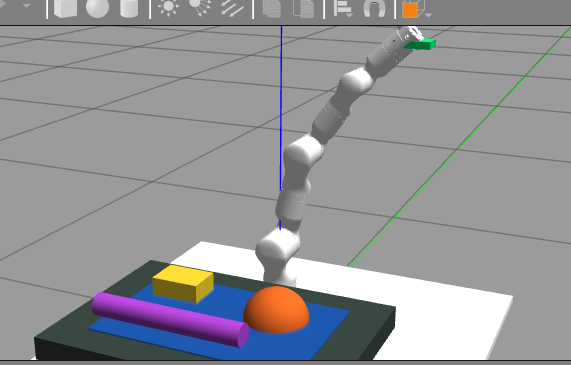

# 学习RM75-6F柔顺控制

## Transcript

### User 1

<environment_context>
  <cwd>/home/ros/ws_rm_75_6f_robot</cwd>
  <shell>bash</shell>
  <current_date>2026-06-01</current_date>
  <timezone>Asia/Shanghai</timezone>
</environment_context>

# Context from my IDE setup:

## Active file: study/2026-05-29-0743_vscode_019e72af-1b9f-76d3-8fd7-6b0fcecdf0e1_session/transcript.md

## Open tabs:
- transcript.md: study/2026-05-29-0743_vscode_019e72af-1b9f-76d3-8fd7-6b0fcecdf0e1_session/transcript.md
- COMMIT_EDITMSG: .git/COMMIT_EDITMSG
- git_tutorial_for_rm75_6f_robot.txt: study/git_tutorial_for_rm75_6f_robot.txt
- 1.txt: study/branch_notes/1.txt
- pasted-text.txt: /home/ros/.codex/attachments/a5e15e3c-be7a-4d47-9fd1-71d2927edb36/pasted-text.txt

# Files mentioned by the user:

## transcript.md: /home/ros/ws_rm_75_6f_robot/study/2026-05-29-0743_vscode_019e72af-1b9f-76d3-8fd7-6b0fcecdf0e1_session/transcript.md

## My request for Codex:
你是一名机械臂与控制专家，我现在要开始在学习机械臂的柔顺控制了，机械臂型号是RM75-6F，目前只在仿真gazebo里面进行柔顺调控

### Assistant 1

我先看一下你这个工作区里和 RM75、Gazebo、控制相关的包结构，这样给你的柔顺控制路线可以贴着你现在的仿真环境走，而不是泛泛讲概念。

### Assistant 1

我看到这是 ROS1/catkin 工作区，已经有 `rm_75_gazebo`、MoveIt 配置、轨迹控制器和 6F 描述包。接下来我会快速看控制器配置和 URDF 里的 transmission/gazebo 插件，判断你现在适合从“外层柔顺”还是“底层力矩/阻抗”开始。

### Assistant 1

可以，结合你现在这个工作区，我建议你先走 **“导纳控制 admittance control”**，不要一上来做真正的力矩级阻抗控制。

我刚看了你的仿真配置：当前 RM75-6F Gazebo 模型使用的是 `PositionJointInterface`，控制器是位置轨迹控制器：

- [rm_75_6f_gazebo.urdf.xacro](/home/ros/ws_rm_75_6f_robot/src/rm_75_robot/rm_75_6f_description/urdf/rm_75_6f_gazebo.urdf.xacro:508)
- [rm_75_trajectory_control.yaml](/home/ros/ws_rm_75_6f_robot/src/rm_75_robot/rm_75_gazebo/config/rm_75_trajectory_control.yaml:1)
- [controllers_gazebo.yaml](/home/ros/ws_rm_75_6f_robot/src/rm_75_robot/rm_75_moveit_config/config/controllers_gazebo.yaml:1)

这意味着：你现在最适合做的是 **外层柔顺控制**：

```text
外力/虚拟外力
  -> 导纳模型
  -> 期望末端位姿修正
  -> IK 求关节角
  -> 位置轨迹控制器
  -> Gazebo 机械臂运动
```

而不是直接做：

```text
阻抗控制
  -> 计算关节力矩
  -> effort controller
```

因为后者需要把仿真控制接口改成 `EffortJointInterface`，还要处理动力学、重力补偿、Jacobian、力矩限幅，第一阶段成本太高。

**你现在的学习路线**
1. 先理解三个概念：

```text
阻抗控制 impedance:
位置误差 -> 输出力/力矩

导纳控制 admittance:
外力 -> 输出位置/速度修正

柔顺控制 compliance:
让机械臂在接触外界时不是“硬顶”，而是可以退让、跟随、缓冲
```

2. 第一版实验先做“虚拟外力导纳控制”。

不急着接真实六维力传感器，也不急着 Gazebo 接触力。先写一个节点，手动发布一个虚拟 wrench，比如：

```text
Fx = 5N
Fy = 0
Fz = 0
```

然后让末端沿 x 方向缓慢偏移。这样你能先看到“力 -> 位移”的柔顺效果。

3. 导纳控制核心公式：

```text
M * x_ddot + D * x_dot + K * (x - x0) = F_ext
```

初学可以先从一维开始，比如只控制末端 x 方向：

```text
a = (F - D*v - K*(x - x0)) / M
v = v + a*dt
x = x + v*dt
```

参数可以先这样：

```text
M = 2.0
D = 40.0
K = 80.0
dt = 0.02
```

效果理解：

- `K` 越大，越“硬”
- `K` 越小，越“软”
- `D` 太小会抖
- `D` 太大会迟钝
- `M` 越大，反应越慢

4. 第二阶段再接 Gazebo 力源。

你现在的 URDF 里还没有看到末端六维力/力矩传感器插件。后面可以在腕部或夹爪基座附近加 Gazebo force-torque sensor plugin，然后把 `/wrench` 接进导纳控制节点。

5. 第三阶段再做任务型柔顺。

比如：

```text
沿 z 方向下压接触桌面
保持 Fz = -5N
同时 x/y 方向保持位置
```

这就是典型的“恒力接触控制”，可以用于打磨、擦拭、插装、贴合这类任务。

**我建议你的第一个小目标**

先做一个 ROS 节点：

```text
rm75_admittance_demo.py
```

功能：

- 订阅当前末端位姿或 joint_states
- 订阅虚拟外力 `/target_wrench`
- 根据导纳模型计算新的末端目标位姿
- 用 MoveIt 求 IK 或发小步位姿目标
- 控制 RM75-6F 在 Gazebo 中柔顺偏移

第一版只做 x 方向柔顺，成功后再扩展到 x/y/z 三个方向。

你现在这个仿真环境的关键判断是：**先做位置外环导纳控制，等你把柔顺现象、参数调节、接触稳定性吃透以后，再升级到底层 effort/阻抗控制。**

### User 2

# Context from my IDE setup:

## Open tabs:
- transcript.md: study/2026-05-29-0743_vscode_019e72af-1b9f-76d3-8fd7-6b0fcecdf0e1_session/transcript.md
- COMMIT_EDITMSG: .git/COMMIT_EDITMSG
- git_tutorial_for_rm75_6f_robot.txt: study/git_tutorial_for_rm75_6f_robot.txt
- 1.txt: study/branch_notes/1.txt
- pasted-text.txt: /home/ros/.codex/attachments/a5e15e3c-be7a-4d47-9fd1-71d2927edb36/pasted-text.txt

## My request for Codex:
我现在这个夹爪是固定的夹爪，没有自己的自由度，这个影响末端做柔顺控制吗？需要将这个夹爪在这个分支进行关闭吗/

### Assistant 2

不用关闭，**固定夹爪不影响机械臂末端做柔顺控制**。

它在控制上等价于一个刚性工具：

```text
RM75 七个关节
  -> 腕部 Link7
  -> 固定夹爪
  -> 夹爪尖端 TCP
```

柔顺控制真正控制的是机械臂关节带动的末端位姿。夹爪没有自由度，只代表它不能自己开合、不能靠夹爪关节吸收误差，但机械臂本体仍然可以通过 7 个关节实现退让、跟随、恒力接触。

你需要注意的是这几个点：

1. **TCP 要选对**

如果你做柔顺控制时控制的是 `Link7`，那柔顺点在手腕末端；如果你真正想让夹爪尖端柔顺，就应该把 TCP 定义到夹爪中心/指尖附近。

也就是说：

```text
初学阶段：控制 Link7 可以
做接触实验：最好控制夹爪实际接触点 TCP
```

2. **夹爪会影响碰撞和接触**

固定夹爪虽然没有自由度，但它有几何形状。如果 Gazebo 里夹爪碰到桌面、物体，它仍然会产生碰撞。做柔顺接触时，这是有用的；但如果你只是想先验证导纳算法，它可能让现象变复杂。

3. **夹爪会影响末端质量和惯性**

如果 URDF 里夹爪质量/惯性设置不准确，Gazebo 接触时可能更容易抖。不过第一阶段做“虚拟外力导纳控制”时影响不大。

我的建议是：

```text
当前分支不用关闭夹爪。
先保留固定夹爪，做外层导纳控制。
第一版只控制小幅位移，不做真实碰撞。
等导纳调顺后，再考虑夹爪 TCP、接触力、碰撞参数。
```

只有在下面几种情况才建议临时关闭/移除夹爪：

```text
1. IK 经常因为夹爪碰撞模型失败
2. Gazebo 接触时夹爪模型抖动严重
3. 你想先做最简“裸腕部 Link7 柔顺控制”
4. 当前实验完全不涉及抓取和夹爪接触
```

所以一句话：**不要急着在这个分支关掉夹爪。固定夹爪是正常的工具端，柔顺控制照样可以做；关键是先明确你控制的是腕部 Link7，还是夹爪尖端 TCP。**

### User 3

# Context from my IDE setup:

## Open tabs:
- transcript.md: study/2026-05-29-0743_vscode_019e72af-1b9f-76d3-8fd7-6b0fcecdf0e1_session/transcript.md
- COMMIT_EDITMSG: .git/COMMIT_EDITMSG
- git_tutorial_for_rm75_6f_robot.txt: study/git_tutorial_for_rm75_6f_robot.txt
- 1.txt: study/branch_notes/1.txt
- pasted-text.txt: /home/ros/.codex/attachments/a5e15e3c-be7a-4d47-9fd1-71d2927edb36/pasted-text.txt

## My request for Codex:
当前实验不涉及抓取，我只是想调试一下柔顺性，后面可能想试一下擦桌子这个实验

### Assistant 3

那就更不需要关掉固定夹爪了。你现在的目标是“调柔顺性”，固定夹爪可以先当成一个刚性工具头使用。

我建议这样分阶段：

**第一阶段：不接触桌面**
先做“虚拟外力导纳控制”，机械臂在空中小幅退让：

```text
给 Fx/Fy/Fz 一个虚拟外力
-> 导纳模型算出末端位移
-> MoveIt / IK 发小步位置目标
-> 观察末端是不是柔顺移动
```

这个阶段夹爪几乎没影响。你甚至可以先控制 `Link7`，不用管夹爪尖端 TCP。

**第二阶段：准备擦桌子实验**
这时固定夹爪反而有用，因为它就是你的“擦拭工具支架”。关键不是关掉它，而是定义一个更合理的 TCP：

```text
Link7
  -> 固定夹爪
  -> 擦拭接触点 TCP
```

擦桌子时最好控制“布/夹爪底部接触点”，而不是腕部中心。否则你以为末端在贴桌面，实际接触点可能有偏移。

**第三阶段：真正擦桌子**
典型控制策略是：

```text
x/y 方向：按轨迹走，比如左右擦拭
z 方向：柔顺，让末端能上下退让
姿态：保持夹爪/工具面贴近桌面
```

也就是：

```text
x/y：位置控制偏硬
z：导纳/恒力控制偏软
```

参数上可以先从很小的接触力开始，例如仿真里目标下压力：

```text
Fz_target = -2N 到 -5N
```

不要一开始就压很大，Gazebo 接触很容易抖。

什么时候才考虑“关闭夹爪”？

```text
1. 只是想验证裸机械臂 Link7 的数学控制
2. 夹爪碰撞模型导致 MoveIt 规划频繁失败
3. Gazebo 里夹爪碰桌面时抖得很严重
```

但这通常不是“删除夹爪”，而是临时关闭夹爪 collision，保留 visual 和固定 TCP。这样模型看起来还完整，控制也简单。

所以你当前最稳的选择是：

```text
保留固定夹爪
第一版柔顺控制先不接触桌面
后面擦桌子时给夹爪底部定义 TCP
必要时只临时弱化/关闭夹爪碰撞，不移除夹爪模型
```

你的路线很清晰：先把“柔顺移动”调出来，再做“接触桌面”，最后做“沿桌面擦拭”。

### User 4

# Context from my IDE setup:

## Open tabs:
- transcript.md: study/2026-05-29-0743_vscode_019e72af-1b9f-76d3-8fd7-6b0fcecdf0e1_session/transcript.md
- COMMIT_EDITMSG: .git/COMMIT_EDITMSG
- git_tutorial_for_rm75_6f_robot.txt: study/git_tutorial_for_rm75_6f_robot.txt
- 1.txt: study/branch_notes/1.txt
- pasted-text.txt: /home/ros/.codex/attachments/a5e15e3c-be7a-4d47-9fd1-71d2927edb36/pasted-text.txt

## My request for Codex:
好的，那现在开始吧，之前学过相关导纳的知识，你再给我介绍一下知识点

### Assistant 4

好，我们从“能马上用于你这个 RM75-6F Gazebo 仿真”的角度复习导纳控制。

**核心概念**

导纳控制回答的是这个问题：

```text
外界给我一个力，我应该产生多少位移/速度？
```

它的输入是力，输出是运动。

```text
F_ext -> 导纳模型 -> x / x_dot / x_ddot
```

这和阻抗控制正好反过来：

```text
阻抗控制：位置误差 -> 力
导纳控制：外力 -> 位置修正
```

你现在的机械臂仿真是位置控制接口，所以特别适合先做导纳控制。因为我们可以把导纳控制算出来的位移，变成末端目标位姿，再交给 MoveIt 或轨迹控制器执行。

**基本公式**

最经典的导纳模型是一个虚拟的“质量-阻尼-弹簧”系统：

```text
M * x_ddot + D * x_dot + K * (x - x0) = F_ext
```

含义是：

```text
M：虚拟质量
D：虚拟阻尼
K：虚拟刚度
x：当前导纳输出位置
x0：原始平衡位置
F_ext：外力
```

直观理解：

```text
K 大：机械臂硬，不容易被推开
K 小：机械臂软，容易退让

D 大：运动更稳，但反应慢
D 小：反应快，但容易抖

M 大：像重物，启动慢
M 小：像轻物，响应快
```

**离散实现**

程序里一般每个控制周期算一次。比如只控制 x 方向：

```text
a = (F - D*v - K*(x - x0)) / M
v = v + a*dt
x = x + v*dt
```

如果控制 x/y/z 三个方向，就是三个轴分别算：

```text
ax = (Fx - Dx*vx - Kx*(x - x0)) / Mx
ay = (Fy - Dy*vy - Ky*(y - y0)) / My
az = (Fz - Dz*vz - Kz*(z - z0)) / Mz
```

第一版建议只做平移柔顺，不做姿态柔顺：

```text
控制 x/y/z
暂时固定 roll/pitch/yaw
```

这样最稳。

**在你的 RM75-6F 中怎么落地**

你的仿真当前链路可以这样理解：

```text
虚拟外力 /target_wrench
  -> 导纳控制节点
  -> 计算新的末端目标位姿
  -> MoveIt 求 IK/规划小步运动
  -> /arm/arm_joint_controller/follow_joint_trajectory
  -> Gazebo 中 RM75-6F 运动
```

第一阶段不要急着接真实接触力。我们先人为发布一个虚拟力：

```text
Fx = 5N
Fy = 0N
Fz = 0N
```

看机械臂末端是不是沿 x 方向柔顺偏移。

**初始参数建议**

可以先用这组比较保守的参数：

```text
M = 2.0
D = 40.0
K = 80.0
dt = 0.02
max_offset = 0.05 m
max_velocity = 0.03 m/s
```

意思是：最大只允许偏移 5 cm，最大速度 3 cm/s。仿真调柔顺时一定要限幅，不然参数一激进，机械臂会跳。

**你后面擦桌子时的控制思路**

擦桌子不是所有方向都“软”。典型策略是：

```text
x/y 方向：按擦拭轨迹走，偏硬
z 方向：柔顺，允许上下退让
姿态：保持工具面朝桌面
```

可以理解为：

```text
平面内负责擦
竖直方向负责贴合
```

比如：

```text
x：位置轨迹，左右移动
y：位置轨迹，慢慢推进
z：导纳控制，根据接触力调节高度
```

如果目标是恒力擦桌子，z 方向可以用：

```text
F_error = F_measured - F_target
```

再把 `F_error` 放进导纳模型，让机械臂自动上下调整。

**你现在第一步要做什么**

现在最适合先做一个最小实验：

```text
实验 1：空中虚拟力导纳
目标：验证“给力 -> 末端偏移 -> 撤力 -> 回到平衡点”
```

观察现象应该是：

```text
给 Fx = 5N：末端缓慢往 x 方向移动
保持 Fx：末端停在某个偏移位置
撤掉 Fx：末端慢慢回到 x0
```

这个现象一旦出来，就说明导纳控制主链路通了。下一步我们再把它接到 Gazebo 的接触/力传感器上，准备擦桌子。

### User 5

# Context from my IDE setup:

## Open tabs:
- transcript.md: study/2026-05-29-0743_vscode_019e72af-1b9f-76d3-8fd7-6b0fcecdf0e1_session/transcript.md
- COMMIT_EDITMSG: .git/COMMIT_EDITMSG
- git_tutorial_for_rm75_6f_robot.txt: study/git_tutorial_for_rm75_6f_robot.txt
- 1.txt: study/branch_notes/1.txt
- pasted-text.txt: /home/ros/.codex/attachments/a5e15e3c-be7a-4d47-9fd1-71d2927edb36/pasted-text.txt

## My request for Codex:
[$skill-creator](/home/ros/.codex/skills/.system/skill-creator/SKILL.md) 好的，我现在需要你自己制作一个skill，相当于每一次加实验、加代码，你都可以下一个txt放在study里面进行解释(包括ros框架、流程、话题、cli命令行等等），注意代码也要写好详细的注释。你理解一下我的意思，然后你自己写好skill的专业术语吧

### Assistant 5

我会按你点名的 `skill-creator` 来做。这个 skill 我会做成一个“RM75 ROS 实验记录与代码注释规范”：以后我一加实验或代码，就同步在 `study/` 里落一份说明文本，并且代码里保留足够细的 ROS/控制逻辑注释。

### Assistant 5

我确认默认技能目录是 `/home/ros/.codex/skills`，也读了 `agents/openai.yaml` 的约束。接下来会用官方初始化脚本生成骨架，然后把 `SKILL.md` 改成适合你这个 RM75-6F 项目的专业工作流。

### Assistant 5

初始化脚本本身没有执行权限，所以我改用 `python3` 调它。这个只是运行 skill-creator 自带脚本生成目录，不会碰你当前工程代码。

### Assistant 5

骨架已经创建好了。现在我会把占位内容替换成真正的技能说明：触发条件、每次改代码时必须同步写 `study/*.txt`、ROS 话题/launch/CLI 的记录格式，以及代码注释粒度。

### Assistant 5

技能正文已经换成正式版，也修正了默认提示里 `$rm75-ros-experiment-notes` 被 shell 吃掉的问题。现在我跑一下 skill-creator 的校验脚本，确认 frontmatter、命名和结构都合法。

### Assistant 5

已经做好了，新 skill 放在：

[SKILL.md](/home/ros/.codex/skills/rm75-ros-experiment-notes/SKILL.md)

名字是：

`rm75-ros-experiment-notes`

它的规则核心是：以后我给你的 RM75-6F 工程加实验、加脚本、改 launch/yaml/URDF/控制代码时，都要同步在 `study/` 下写一份 `.txt` 学习说明，里面包括：

- 实验目标
- ROS 节点、topic、action、service、param
- 控制流程和数据流
- CLI 命令
- 关键公式和参数
- Gazebo/MoveIt/ros_control 关系
- 观察现象
- 排错 checklist
- 安全限幅和下一步

代码注释规则也写进去了：重点注释 ROS 接口、坐标系、单位、控制周期、导纳参数 `M/D/K`、限幅、TCP 假设、MoveIt 执行路径等，不写空洞注释。

我也修好了 `agents/openai.yaml` 里的默认调用提示，并跑了校验：

```text
Skill is valid!
```

后面你可以直接说“按 RM75 实验记录 skill 来做”，或者显式调用 `$rm75-ros-experiment-notes`。从下一次加柔顺控制实验开始，我就会按这个规范同时写代码和 `study/*.txt` 说明。

### User 6

# Context from my IDE setup:

## Open tabs:
- transcript.md: study/2026-05-29-0743_vscode_019e72af-1b9f-76d3-8fd7-6b0fcecdf0e1_session/transcript.md
- COMMIT_EDITMSG: .git/COMMIT_EDITMSG
- git_tutorial_for_rm75_6f_robot.txt: study/git_tutorial_for_rm75_6f_robot.txt
- 1.txt: study/branch_notes/1.txt
- pasted-text.txt: /home/ros/.codex/attachments/a5e15e3c-be7a-4d47-9fd1-71d2927edb36/pasted-text.txt

## My request for Codex:
显式调用 $rm75-ros-experiment-notes  好的，接下来就是应该带我实现第一个小实验了吧，请你开始吧，

### Assistant 6

我会按刚才的 RM75 实验记录 skill 来做：先读一下现有仿真 demo 的写法，复用你项目里已经通的 MoveIt 初始化、启动命令和控制器路径，然后新增“虚拟外力导纳”脚本和对应 `study/*.txt` 说明。

### Assistant 6

我准备用一个“可先看输出、再选择执行”的脚本：默认会计算导纳目标位姿并发布出来；加 `--execute` 后才通过 MoveIt 小步发送给 Gazebo 机械臂。这样第一实验更稳，也符合先空中虚拟外力、不接触桌面的路线。

### Assistant 6

脚本已经加上了，核心是 3 轴平移导纳模型，默认只发布目标位姿和状态；`--execute` 才会真正调用 MoveIt 执行。下一步我写配套学习笔记，把节点、话题、命令、参数和排错路径都整理进去。

### Assistant 6

学习笔记也已经落到 `study/` 了。现在我会做几个轻量校验：给脚本加可执行权限、检查 Python 语法、看一下当前 git 变更，确认没有碰到不该动的文件。

### Assistant 6

语法检查通过，脚本也已经可执行。为了确认 `rosrun` 能在这个工作区找到新脚本，我再用已构建的 `devel/setup.bash` 做一次解析检查，不启动 Gazebo。

### Assistant 6

已经把第一个小实验做出来了：**RM75-6F 虚拟外力导纳控制实验**。

新增代码：

[sim_05_admittance_virtual_force.py](/home/ros/ws_rm_75_6f_robot/src/rm_75_robot/rm_75_demo/scripts/sim_05_admittance_virtual_force.py)

新增学习笔记：

[rm75_6f_admittance_virtual_force_experiment.txt](/home/ros/ws_rm_75_6f_robot/study/rm75_6f_admittance_virtual_force_experiment.txt)

这个实验默认做的是：

```text
内置虚拟力 Fx = 5N，持续 4 秒
  -> 导纳模型 M/D/K 计算末端 offset
  -> 发布 /rm75_admittance/target_pose
  -> 撤力后逐渐回到初始平衡位姿
```

默认不会真的动机械臂；确认输出正常后，加 `--execute` 才通过 MoveIt 控制 Gazebo 里的 RM75-6F 小步运动。

先跑这个观察输出：

```bash
cd /home/ros/ws_rm_75_6f_robot
source devel/setup.bash
roslaunch rm_75_gazebo arm_75_bringup_moveit.launch
```

另开终端：

```bash
cd /home/ros/ws_rm_75_6f_robot
source devel/setup.bash
rosrun rm_75_demo sim_05_admittance_virtual_force.py
```

观察：

```bash
rostopic echo /rm75_admittance/target_pose
rostopic echo /rm75_admittance/state
```

确认 target_pose 会偏移又回位后，再试执行版：

```bash
rosrun rm_75_demo sim_05_admittance_virtual_force.py --execute
```

我做过的检查：

```text
Python 语法解析通过
--help 参数解析通过
脚本已加可执行权限
rosrun 能定位到脚本
```

我没有在当前回合直接启动 Gazebo/RViz，因为这会打开仿真 GUI；你可以按上面的命令在本机跑。当前 git 里还有你之前已有的 `study/index.md`、transcript 和图片未提交变更，我没有动它们。

### User 7

# Context from my IDE setup:

## Active file: study/rm75_6f_admittance_virtual_force_experiment.txt

## Open tabs:
- rm75_6f_admittance_virtual_force_experiment.txt: study/rm75_6f_admittance_virtual_force_experiment.txt
- transcript.md: study/2026-05-29-0743_vscode_019e72af-1b9f-76d3-8fd7-6b0fcecdf0e1_session/transcript.md
- COMMIT_EDITMSG: .git/COMMIT_EDITMSG
- git_tutorial_for_rm75_6f_robot.txt: study/git_tutorial_for_rm75_6f_robot.txt
- 1.txt: study/branch_notes/1.txt

## My request for Codex:
你查阅一下，工作区里面官方的代码有没有柔顺控制的相关参数？或者力位混合控制的参数？

### Assistant 7

我来在工作区里系统搜一下“柔顺/导纳/阻抗/力控/力位混合/force/impedance/admittance/hybrid”等关键词，再看控制器、驱动消息和参数文件里有没有厂家预留的相关接口或参数。

### Assistant 7

初步结果很清楚：除了我们刚加的 `sim_05_admittance_virtual_force.py`，官方/原始代码里没有直接叫 admittance、impedance、compliance、hybrid 的控制器或参数。我再看驱动层 JSON 命令和消息定义，确认有没有“力控夹取、示教、拖动示教”这种近似接口。

### Assistant 7

查过了。结论很明确：**工作区里的官方/原始代码没有机械臂本体柔顺控制、导纳控制、阻抗控制、力位混合控制的参数或控制器。**

有几个容易混淆的“力/阻尼/速度”相关项，但它们不是末端柔顺控制：

1. Gazebo 关节阻尼/摩擦  
在 [rm_75_6f_gazebo.urdf.xacro](/home/ros/ws_rm_75_6f_robot/src/rm_75_robot/rm_75_6f_description/urdf/rm_75_6f_gazebo.urdf.xacro:151) 里有：

```xml
<dynamics damping="50.0" friction="1.0" />
```

这是 Gazebo 物理仿真的关节阻尼/摩擦，不是导纳/阻抗控制里的虚拟 `M/D/K`，也不是力位混合控制参数。

2. ros_control PID 参数  
在 [rm_75_trajectory_control.yaml](/home/ros/ws_rm_75_6f_robot/src/rm_75_robot/rm_75_gazebo/config/rm_75_trajectory_control.yaml:1) 里是：

```yaml
type: "position_controllers/JointTrajectoryController"
gains:
  joint1: {p: 1000.0, i: 0.0, d: 0.1}
```

这是位置轨迹控制器的 PID，不是柔顺刚度/阻尼。它的目标是“跟踪位置轨迹”，不是“根据外力退让”。

3. Gazebo 硬件接口是位置接口  
在 [rm_75_6f_gazebo.urdf.xacro](/home/ros/ws_rm_75_6f_robot/src/rm_75_robot/rm_75_6f_description/urdf/rm_75_6f_gazebo.urdf.xacro:508) 附近，7 个关节都是：

```xml
hardware_interface/PositionJointInterface
```

所以官方仿真链路本身就是位置控制，不是 effort/torque 控制。没有现成的力矩阻抗控制入口。

4. MoveIt Cartesian limits  
在 [cartesian_limits.yaml](/home/ros/ws_rm_75_6f_robot/src/rm_75_robot/rm_75_moveit_config/config/cartesian_limits.yaml:1) 里有：

```yaml
max_trans_vel
max_trans_acc
max_rot_vel
```

这是笛卡尔速度/加速度限制，用于规划约束，不是力控或柔顺参数。

5. 夹爪有“力控夹取”  
在 [Gripper_Pick.msg](/home/ros/ws_rm_75_6f_robot/src/rm_75_robot/rm_75_msgs/msg/Gripper_Pick.msg:1) 里写着：

```text
手爪以设定的速度力控夹取，当受力超过设定力后，停止运动
```

驱动里对应 [rm_driver.cpp](/home/ros/ws_rm_75_6f_robot/src/rm_75_robot/rm_75_driver/src/rm_driver.cpp:190) 和 [rm_robot.h](/home/ros/ws_rm_75_6f_robot/src/rm_75_robot/rm_75_driver/src/rm_robot.h:1138)。

但这只是**夹爪夹持力阈值**，不是机械臂末端六维力控，也不是擦桌子需要的力位混合控制。

6. 示教接口  
驱动里有：

- `/rm_driver/Arm_JointTeach`
- `/rm_driver/Arm_PosTeach`
- `/rm_driver/Arm_StopTeach`

对应 [rm_driver.cpp](/home/ros/ws_rm_75_6f_robot/src/rm_75_robot/rm_75_driver/src/rm_driver.cpp:394)。这类接口是关节/位置示教运动命令，不是柔顺控制。

所以当前状态可以这样判断：

```text
官方已有：
- 位置控制
- 轨迹控制
- MoveJ / MoveL / MoveC
- 夹爪力控夹取
- 关节/位置示教
- Gazebo 物理 damping/friction
- MoveIt 速度/加速度限制

官方没有：
- admittance control 参数
- impedance control 参数
- 末端六维力传感器话题
- wrench feedback
- hybrid force/position control
- Cartesian stiffness/damping 参数
- effort/torque controller
```

因此我们现在写的 `sim_05_admittance_virtual_force.py` 不是在调用官方现成柔顺参数，而是在官方位置控制框架外面加了一个**外层导纳控制器**。这是目前这个工程里最合理的第一步。

### User 8

官方的源代码在这里
/home/ros/机械臂/RM-75系列机械臂/（4）ROS资料
/home/ros/机械臂/睿尔曼机械臂接口函数说明(c++)V4.0.2.pdf
你可以先阅读一遍

### Assistant 8

收到，我先读你给的官方资料目录和 C++ 接口说明 PDF。重点会查：有没有六维力、拖动示教、力位混合、阻抗/导纳、末端力控、传感器反馈这些接口，而不是只看我们当前工作区。

### Assistant 8

目录里确实有一份 RM75 发布版 ROS 源码和一份接口 PDF。我先把 PDF 转成文本索引，再对官方 ROS 源码做关键词检索；这一步会比只看当前工作区更可靠。

### Assistant 8

PDF 里确实有力位混合、六维力、一维力和透传力位混合补偿接口；但官方 ROS 发布版源码没有把这些接口封装成 ROS topic/service。你本地还有 API 头文件，我再看一下头文件里这些函数声明是否存在，判断后面能不能自己扩展 ROS driver。

### Assistant 8

我读了一遍你给的官方 ROS 资料和 C++ 接口 PDF，结论要比刚才更准确一点：

**之前只看当前工作区时，我说“官方代码里没有力位混合”。这个说法对当前 ROS 工作区成立，但对厂家 C++ API 不成立。**

更准确是：

```text
当前 ROS 发布版源码：没有封装机械臂本体柔顺/力位混合 topic 或 service
厂家 C++ API/PDF：确实提供六维力、一维力、拖动示教、力位混合控制相关接口
```

我查到的关键接口有这些：

**1. 力位混合控制**

PDF 里有：

```text
Service_Set_Force_Postion
Service_Stop_Force_Postion
```

参数含义大概是：

```text
sensor:
  0 = 一维力
  1 = 六维力

mode:
  0 = 基坐标系力控
  1 = 工具坐标系力控

direction:
  0 = X
  1 = Y
  2 = Z
  3 = RX
  4 = RY
  5 = RZ

N:
  力大小，单位 0.1N
```

注意厂家接口里 `Position` 拼成了 `Postion`，后面写代码时要照着它的函数名来。

**2. 六维力传感器**

PDF 和 API 头文件都有：

```text
Service_Get_Force_Data
Service_Clear_Force_Data
Service_Set_Force_Sensor
Service_Manual_Set_Force
Service_Stop_Set_Force_Sensor
```

`Get_Force_Data` 返回 6 个量：

```text
Fx, Fy, Fz, Mx, My, Mz
```

单位：

```text
力：N
力矩：Nm
```

PDF 还说明周期获取力数据时，周期不能小于 `50ms`，也就是最高大约 `20Hz`。

**3. 一维力传感器**

也有：

```text
Service_Get_Fz
Service_Clear_Fz
Service_Auto_Set_Fz
Service_Manual_Set_Fz
```

PDF 里说一维力是末端 Z 方向力，量程 `200N`，准度 `0.5%FS`。周期查询不能高于 `40Hz`，而且第一帧数据有滞后，建议从第二帧开始用。

**4. 透传力位混合控制补偿**

这是后面更高级、也更接近我们未来“擦桌子”的接口：

```text
Service_Start_Force_Position_Move
Service_Force_Position_Move_Joint
Service_Force_Position_Move_POSE
Service_Stop_Force_Position_Move
```

这个意思是：用户自己周期性下发轨迹，同时让底层力位混合算法做补偿。

这和我们现在写的外层导纳控制很像，但区别是：

```text
我们现在：
  自己算导纳位移 -> MoveIt/轨迹控制器执行

厂家高级接口：
  用户透传目标轨迹 -> 控制器底层结合力位混合补偿
```

**5. 拖动示教**

PDF 和 API 里也有：

```text
Service_Start_Drag_Teach
Service_Stop_Drag_Teach
Service_Run_Drag_Trajectory
Service_Start_Multi_Drag_Teach
```

PDF 说拖动示教是用关节电流环实现的。这个属于“人手拖动机械臂”的柔顺相关能力，但不是我们 Gazebo 里现在要做的导纳控制。

**6. 碰撞等级**

还有：

```text
Service_Set_Collision_Stage
Service_Get_Collision_Stage
```

等级 `0~8`，数值越高越灵敏。这个是碰撞检测/防碰撞，不等于柔顺控制，但属于安全相关参数。

**重要判断**

你当前工作区里的 ROS driver 是旧发布版封装，里面只封装了：

```text
MoveJ / MoveL / MoveC
JointPos
夹爪力控夹取
关节/位置示教
IO
关节状态
```

没有封装：

```text
Service_Get_Force_Data
Service_Set_Force_Postion
Service_Force_Position_Move_POSE
Service_Get_Fz
拖动示教完整 API
```

所以接下来有两条路线：

```text
仿真学习路线：
继续用我们刚写的 sim_05 外层导纳控制。
这是对的，因为 Gazebo 里没有真实六维力 API。

实物/厂家能力路线：
后面可以基于 /home/ros/机械臂/（2）API/C++/include/rm_base.h
把六维力、Fz、力位混合、透传力位混合接口封装成 ROS topic/service。
```

对你现在“只在 Gazebo 调柔顺”的阶段，还是先走我们现在的小实验。  
但从长期看，你这台 RM75-6F 如果实物有六维力版本，厂家 API 里确实有更正统的力控接口，后面值得单独开一条“实物力位混合接口封装”路线。

### User 9

这个实物-6f就是意思末端有六维力传感器，但是仿真里面有这些吗？这些能用在gazebo里面吗？

### Assistant 9

对，**RM75-6F 里的 6F 基本就是末端带六维力/力矩传感器版本**。但是要分清：

```text
实物 RM75-6F：
  末端真实集成六维力传感器
  厂家控制器/API 可以读取 Fx/Fy/Fz/Mx/My/Mz
  厂家底层可能支持力位混合控制

Gazebo 仿真 RM75-6F：
  只是 URDF/SDF 里的几何、关节、惯性、控制器模型
  不会自动拥有厂家真实六维力传感器 API
```

也就是说：**厂家 C++ API 的六维力接口不能直接用在 Gazebo 里。**

原因是它们走的是实物控制器 socket/API，例如：

```text
Service_Get_Force_Data
Service_Set_Force_Postion
Service_Force_Position_Move_POSE
```

这些函数需要连接真实机械臂控制器。Gazebo 里没有厂家控制器，也没有真实传感器硬件，所以这些 API 在纯仿真里没对象可调用。

你当前 Gazebo 里有没有六维力传感器？

从我们之前查的 URDF/launch 来看：**没有真正的 Gazebo force-torque sensor 插件**。现在模型里只是：

```text
link1 ~ link7
PositionJointInterface
JointTrajectoryController
gazebo_ros_control
```

没有看到类似：

```xml
<sensor type="force_torque">
```

或者 Gazebo wrench/force-torque plugin 发布 `/wrench` 话题。

所以当前仿真状态是：

```text
不能直接读真实六维力
不能直接调用厂家力位混合 API
可以自己在 Gazebo 模型里加 force_torque sensor 插件
可以自己写外层导纳/柔顺控制
```

你后面如果想在 Gazebo 里模拟六维力，有两种方式：

**方案 A：虚拟力输入，最适合现在**
也就是我们刚做的：

```text
人为发布 /rm75_admittance/target_wrench
-> 导纳控制
-> 机械臂柔顺偏移
```

优点是简单、稳定、先学控制逻辑。

**方案 B：Gazebo 接触力/力矩传感器**
在腕部、夹爪基座或 TCP 附近加 Gazebo force-torque sensor，然后发布仿真的 wrench：

```text
Gazebo 接触
-> force_torque sensor
-> /xxx/wrench
-> 导纳/恒力控制
```

这更接近擦桌子实验，但要额外改 URDF/Xacro，调接触参数，也更容易抖。

所以当前建议还是：

```text
第一步：继续虚拟 wrench 导纳控制
第二步：给 Gazebo 增加仿真六维力/接触力传感器
第三步：做 z 方向恒力贴桌
第四步：做 x/y 擦拭轨迹 + z 方向柔顺
```

一句话：**实物 6F 的厂家 API 很有价值，但它属于真实机械臂；Gazebo 里要另行建一个“仿真六维力传感器”，不能直接复用实物 API。**

### User 10

你先记录一下这个厂家api能直接调柔顺性的流程，如果后续我需要进行实物柔顺调控的话，可以直接应用

### Assistant 10

我会把这部分单独记录成一份 `study/*.txt`，作为以后“实物 RM75-6F 柔顺/力位混合调控”的路线备忘。它会和 Gazebo 仿真路线分开，避免以后把厂家实物 API 和仿真 wrench 搅在一起。

### Assistant 10

我已经确认了头文件里的函数声明和参数单位，尤其是 `Set_Force_Postion` 的力单位是 `0.1N`，而透传补偿接口里的 `force` 是 `N`。现在把这份“实物路线图”写入 `study/`。

### Assistant 10

已记录好了，新增文件：

[rm75_6f_real_force_compliance_api_notes.txt](/home/ros/ws_rm_75_6f_robot/study/rm75_6f_real_force_compliance_api_notes.txt)

里面把后续实物柔顺调控需要的厂家 API 路线单独整理出来了，包括：

- `Get_Force_Data` 读取六维力
- `Clear_Force_Data` 六维力清零
- `Set_Force_Postion` 普通力位混合控制
- `Stop_Force_Postion` 结束力位混合
- `Start_Force_Position_Move`
- `Force_Position_Move_POSE`
- `Force_Position_Move_Joint`
- `Stop_Force_Postion_Move`
- 一维力 `Get_Fz / Clear_Fz`
- 实物擦桌子推荐流程
- Gazebo 导纳实验和实物厂家力控路线的区别
- 后续可封装的 ROS topic/service 设计

我也特别标了两个容易踩坑的点：

```text
Set_Force_Postion 的力单位是 0.1N
Force_Position_Move_* 的 force 单位是 N
```

以及厂家函数名里 `Postion` 是拼写错误但必须照着头文件写。

### User 11

你再跟我讲解一下，厂家的力位控制

### Assistant 11

厂家的**力位混合控制**可以理解成：机械臂一部分方向按“位置/轨迹”走，另一部分方向按“力”来调节。

比如擦桌子：

```text
X/Y 方向：按你给的轨迹来回擦
Z 方向：不死跟位置，而是保持一个下压力，比如 3N
姿态：按设定姿态保持
```

这就是“力位混合”：位置控制和力控制同时存在，但分配在不同方向上。

厂家 API 里主要有两类。

**1. 普通力位混合**

接口是：

```cpp
Set_Force_Postion(ArmSocket, sensor, mode, direction, N, block);
Stop_Force_Postion(ArmSocket, block);
```

参数含义：

```text
sensor:
  0 = 一维力
  1 = 六维力

mode:
  0 = 基坐标系力控
  1 = 工具坐标系力控

direction:
  0 = X
  1 = Y
  2 = Z
  3 = RX
  4 = RY
  5 = RZ

N:
  力大小，单位 0.1N
```

例子：用六维力传感器，在工具坐标系 Z 方向保持 3N 接触力：

```cpp
Set_Force_Postion(sock, 1, 1, 2, 30, true);
```

这里：

```text
1：六维力
1：工具坐标系
2：Z 方向
30：3.0N，因为单位是 0.1N
```

它的意思不是“移动到某个 z 位置”，而是“在这个方向上由底层力控模块调整，让接触力接近目标值”。

停止时一定要调用：

```cpp
Stop_Force_Postion(sock, true);
```

**2. 透传力位混合补偿**

这更适合你以后想做的擦桌子。

接口是：

```cpp
Start_Force_Position_Move(sock, true);

Force_Position_Move_POSE(
    sock,
    pose,
    sensor,
    mode,
    dir,
    force
);

Stop_Force_Postion_Move(sock, true);
```

它的含义是：

```text
你周期性给机械臂一个目标轨迹
厂家底层在指定方向上做力控补偿
```

擦桌子时可以这样理解：

```text
你给 x/y 擦拭轨迹
厂家底层在 z 方向保持下压力
```

例子：

```cpp
Start_Force_Position_Move(sock, true);

Force_Position_Move_POSE(sock, pose, 1, 1, 2, 3.0);

Stop_Force_Postion_Move(sock, true);
```

这里 `force = 3.0` 的单位是 N。注意它和 `Set_Force_Postion` 不一样：

```text
Set_Force_Postion: N 参数单位是 0.1N
Force_Position_Move_*: force 参数单位是 N
```

这个坑很重要。

**基坐标系 vs 工具坐标系**

`mode = 0` 是基坐标系力控：

```text
力控方向固定在机器人 base_link 坐标系
```

比如基坐标系 Z 方向，一般就是世界竖直方向附近。

`mode = 1` 是工具坐标系力控：

```text
力控方向跟着末端工具姿态走
```

擦桌子更常用工具坐标系，因为你希望沿“工具法向”压桌面，而不是永远沿 base 坐标系某个方向。

**一维力 vs 六维力**

`sensor = 0`：

```text
一维力，只适合 Z 方向力控
简单，但信息少
```

`sensor = 1`：

```text
六维力，可以用 Fx/Fy/Fz/Mx/My/Mz
适合更完整的接触任务
```

RM75-6F 是六维力版本，所以以后实物优先考虑 `sensor = 1`。

**和导纳控制的区别**

我们现在 Gazebo 里写的导纳控制是：

```text
读外力/虚拟力
-> 自己用 M/D/K 算位移
-> 给 MoveIt 目标位姿
```

厂家力位混合是：

```text
设置目标力和方向
-> 厂家底层控制器自己做力控补偿
-> 你只需要给运动轨迹或启动力控
```

所以厂家力位混合更“底层”，也更接近真实接触控制；但它只能在实物上用，Gazebo 里不能直接用。

**擦桌子最像的控制方式**

后续实物擦桌子，我会优先建议这个结构：

```text
Start_Force_Position_Move
  -> 周期性发送 x/y 擦拭 pose
  -> dir = Z
  -> force = 2N ~ 5N
  -> 工具坐标系 mode = 1
Stop_Force_Postion_Move
```

也就是：

```text
X/Y：你控制位置轨迹
Z：厂家底层保持接触力
姿态：保持工具面贴桌
```

这就是最典型的力位混合控制。

### User 12

# Context from my IDE setup:

## Active file: study/rm75_6f_admittance_virtual_force_experiment.txt

## Active selection of the file:
roslaunch rm_75_gazebo arm_75_bringup_moveit.launch
## Open tabs:
- rm75_6f_admittance_virtual_force_experiment.txt: study/rm75_6f_admittance_virtual_force_experiment.txt

## My request for Codex:
roslaunch rm_75_gazebo arm_75_bringup_moveit.launch
打开之后，rviz没有显示，gazebo有显示，问题应该是你全部用的显卡渲染，这个rviz按经验得用软件渲染，你处理一下吧

### Assistant 12

我会用 `$rm75-ros-experiment-notes` 来处理这个 ROS/Gazebo 实验问题：先看一下现有 launch 是怎么启动 RViz 的，再把软件渲染的设置落到可复用的启动文件/说明里。

### Assistant 12

我先确认 `arm_75_bringup_moveit.launch` 里面 RViz 的启动方式。通常这个问题可以通过给 RViz 单独加 `LIBGL_ALWAYS_SOFTWARE=1`，避免影响 Gazebo 的硬件渲染。

### Assistant 12

我看到了一个好消息：工程里已经有“只让 RViz 软件渲染、Gazebo 仍用 GPU”的参数链路，只是顶层默认值还是 `false`。我接下来把你这条常用命令的默认行为改成 RViz 软件渲染，这样不用每次手动加参数。

### Assistant 12

我要改两处 launch 默认值：顶层 Gazebo+MoveIt 启动，以及 MoveIt/RViz 子启动。然后同步更新你当前这个柔顺实验说明，把“RViz 软件渲染、Gazebo 不受影响”的排错点写清楚。

### Assistant 12

改好了，现在我做一个不启动 GUI 的 launch 解析检查：只让 `roslaunch` 展开文件列表，验证 XML/参数传递没有写坏。

### Assistant 12

第一次解析走到了另一个同名 ROS workspace 的包路径，这说明当前 shell 的 `ROS_PACKAGE_PATH` 不是你这个 6F 工作区优先。我要用当前工作区的 `devel/setup.bash` 再验证一次，避免出现“改了这里、启动却读了那里”的典型坑。

### Assistant 12

顺手补一个很实用的检查：你的机器上看起来有另一个同名 RM75 工作区，启动前最好确认 `rospack find rm_75_gazebo` 指向当前 `ws_rm_75_6f_robot`。这个我也写进学习笔记里。

### Assistant 12

处理好了。现在你直接运行这条命令时，默认就是 **RViz 软件渲染，Gazebo 仍优先 GPU 渲染**：

```bash
cd /home/ros/ws_rm_75_6f_robot
source devel/setup.bash
roslaunch rm_75_gazebo arm_75_bringup_moveit.launch
```

我改了这几处：

- [arm_75_bringup_moveit.launch](/home/ros/ws_rm_75_6f_robot/src/rm_75_robot/rm_75_gazebo/launch/arm_75_bringup_moveit.launch:10)：`rviz_software_rendering` 默认改成 `true`，并保留顶层 `LIBGL_ALWAYS_SOFTWARE=0`，避免 Gazebo 被拖去软件渲染。
- [moveit_planning_execution.launch](/home/ros/ws_rm_75_6f_robot/src/rm_75_robot/rm_75_moveit_config/launch/moveit_planning_execution.launch:4)：子 launch 默认也改成 RViz 软件渲染。
- [rm75_6f_admittance_virtual_force_experiment.txt](/home/ros/ws_rm_75_6f_robot/study/rm75_6f_admittance_virtual_force_experiment.txt:144)：补充了 RViz 黑屏/不显示时的说明、参数开关和 `rospack find` 路径检查。

我做了 launch 解析检查，没有启动 GUI：

```bash
source /home/ros/ws_rm_75_6f_robot/devel/setup.bash
roslaunch rm_75_gazebo arm_75_bringup_moveit.launch --files
```

解析结果已经指向当前 `/home/ros/ws_rm_75_6f_robot` 工作区。你现在重新开终端跑上面的启动命令即可。

### User 13

# Context from my IDE setup:

## Active file: study/rm75_6f_admittance_virtual_force_experiment.txt

## Open tabs:
- rm75_6f_admittance_virtual_force_experiment.txt: study/rm75_6f_admittance_virtual_force_experiment.txt

## My request for Codex:
[INFO] [1780295340.443885, 189.111000]: force[N]=[0.0000, 0.0000, 0.0000] offset[m]=[0.0000, 0.0000, 0.0000] velocity[m/s]=[-0.0000, 0.0000, 0.0000] acceleration[m/s^2]=[0.0000, 0.0000, 0.0000]
[INFO] [1780295341.552649, 190.112000]: force[N]=[0.0000, 0.0000, 0.0000] offset[m]=[0.0000, 0.0000, 0.0000] velocity[m/s]=[-0.0000, 0.0000, 0.0000] acceleration[m/s^2]=[0.0000, 0.0000, 0.0000]
[INFO] [1780295342.718368, 191.160000]: force[N]=[0.0000, 0.0000, 0.0000] offset[m]=[0.0000, 0.0000, 0.0000] velocity[m/s]=[-0.0000, 0.0000, 0.0000] acceleration[m/s^2]=[0.0000, 0.0000, 0.0000]
Experiment finished.
Final offset [m]:   [0.0000, 0.0000, 0.0000]
Final velocity [m/s]: [-0.0000, 0.0000, 0.0000]

---
header: 
  seq: 14
  stamp: 
    secs: 180
    nsecs: 510000000
  frame_id: "base_link"
pose: 
  position: 
    x: 0.023946954760350223
    y: -2.3489027994216845e-06
    z: 0.9089999972272736
  orientation: 
    x: 1.8420249220252127e-06
    y: -3.430393442122421e-05
    z: -3.0209354659527297e-05
    w: 0.9999999989536212

data: "force_N=[0.0000, 0.0000, 0.0000] offset_m=[0.0000, 0.0000, 0.0000] velocity_mps=[-0.0000,\
  \ 0.0000, 0.0000]"
---
data: "force_N=[0.0000, 0.0000, 0.0000] offset_m=[0.0000, 0.0000, 0.0000] velocity_mps=[-0.0000,\
  \ 0.0000, 0.0000]"
---
data: "force_N=[0.0000, 0.0000, 0.0000] offset_m=[0.0000, 0.0000, 0.0000] velocity_mps=[-0.0000,\
  \ 0.0000, 0.0000]"
你看看这输出对吗？这些都是什么意思？然后现在这个sim_05是什么程序，实现什么功能？

### Assistant 13

我会继续用 `$rm75-ros-experiment-notes` 的方式来解释这个实验输出：先对照 `sim_05` 源码确认它的运行模式、内置力时序和这些字段的含义，然后判断你这段日志是否正常。

### Assistant 13

这段输出是**正常的**，但它是实验后半段/结束阶段的状态：外力已经撤掉，导纳模型已经回到平衡位姿，所以 `force / offset / velocity / acceleration` 都接近 0。

你需要重点看前 4 秒。默认不加 `--use-topic-wrench` 时，`sim_05` 会内置一个虚拟力：

```text
Fx = 5N，持续 4 秒
```

所以刚启动时应该能看到类似：

```text
force[N]=[5.0000, 0.0000, 0.0000]
offset[m]=[逐渐增大, 0, 0]
```

4 秒之后外力变成 0，虚拟弹簧把末端目标拉回原来的平衡位置，最后就会变成你现在看到的：

```text
force[N]=[0,0,0]
offset[m]=[0,0,0]
velocity[m/s]=[0,0,0]
```

这些字段意思是：

```text
force[N]
```

当前输入给导纳模型的虚拟外力，单位 N。这里是 `[0,0,0]`，表示已经没有外力。

```text
offset[m]
```

导纳模型算出来的“相对初始末端位姿的偏移”，单位 m。这里是 0，说明目标已经回到初始平衡点。

```text
velocity[m/s]
```

虚拟导纳模型里的末端速度，不一定是真实机械臂速度。这里接近 0，说明回弹过程结束。

```text
acceleration[m/s^2]
```

导纳模型当前算出来的虚拟加速度。这里也是 0。

```text
target_pose
```

这是 `/rm75_admittance/target_pose` 发布的目标末端位姿。你看到：

```yaml
position:
  x: 0.0239469
  y: -0.0000023
  z: 0.9090
```

这不是 `offset`，而是**绝对目标位姿**。因为 `offset=[0,0,0]`，所以这个 pose 就等于程序启动时记录的初始末端位姿，也就是平衡位姿。

```yaml
orientation:
  x: ...
  y: ...
  z: ...
  w: ...
```

这是四元数姿态。这个实验目前只做 x/y/z 平移柔顺，姿态保持不变，所以姿态基本接近初始值。

`sim_05_admittance_virtual_force.py` 的功能是：做一个**虚拟外力导纳控制小实验**。它不是读取真实六维力传感器，也不是 Gazebo 接触力，而是人为给一个虚拟力，然后用公式：

```text
M*x_ddot + D*x_dot + K*x = F
```

算出末端应该产生多少柔顺位移。

它有两种模式：

```bash
rosrun rm_75_demo sim_05_admittance_virtual_force.py
```

只计算并发布 `/rm75_admittance/target_pose`，机械臂不真的动，适合先看数据。

```bash
rosrun rm_75_demo sim_05_admittance_virtual_force.py --execute
```

会通过 MoveIt 把目标位姿发给 Gazebo 里的机械臂执行，能看到末端小幅偏移、撤力后回位。

如果你想确认现象，建议重新跑一次，并在前几秒观察：

```bash
rostopic echo /rm75_admittance/state
```

看到 `force_N=[5.0000, 0.0000, 0.0000]` 和 `offset_m` 逐渐变化，就说明实验逻辑跑通了。

### User 14

# Context from my IDE setup:

## Active file: study/rm75_6f_admittance_virtual_force_experiment.txt

## Open tabs:
- rm75_6f_admittance_virtual_force_experiment.txt: study/rm75_6f_admittance_virtual_force_experiment.txt

## My request for Codex:
force_N=[5.0000, 0.0000, 0.0000] 和 offset_m 逐渐变化 这个我已经看到了，我感觉这个offset比较小，在仿真里面显示效果不太好
[0.0301, 0.0000, 0.0000] velocity[m/s]=[0.0300, 0.0000, 0.0000] acceleration[m/s^2]=[0.7599, 0.0000, 0.0000]
[INFO] [1780295332.591937, 181.760000]: force[N]=[5.0000, 0.0000, 0.0000] offset[m]=[0.0500, 0.0000, 0.0000] velocity[m/s]=[0.0250, 0.0000, 0.0000] acceleration[m/s^2]=[0.0000, 0.0000, 0.0000]
[INFO] [1780295333.698532, 182.810000]: force[N]=[5.0000, 0.0000, 0.0000] offset[m]=[0.0500, 0.0000, 0.0000] velocity[m/s]=[0.0250, 0.0000, 0.0000] acceleration[m/s^2]=[0.0000, 0.0000, 0.0000]
[INFO] [1780295334.840080, 183.860000]: force[N]=[0.0000, 0.0000, 0.0000] offset[m]=[0.0442, 0.0000, 0.0000] velocity[m/s]=[-0.0300, 0.0000, 0.0000] acceleration[m/s^2]=[-1.2284, 0.0000, 0.0000]
[INFO] [1780295335.976348, 184.910000]: force[N]=[0.0000, 0.0000, 0.0000] offset[m]=[0.0128, 0.0000, 0.0000] velocity[m/s]=[-0.0284, 0.0000, 0.0000] acceleration[m/s^2]=[0.0316, 0
目前能加大一点吗？然后直接用--execute执行

### Assistant 14

我会继续按 `$rm75-ros-experiment-notes` 来处理：你这个现象很典型，已经撞到了 `max_offset=0.05m` 的限幅，所以仿真里只有 5cm，视觉上确实不明显。这里我不把默认模式改得激进，而是加一个“明显演示”的参数预设，方便你直接 `--execute` 跑。

我要在 `sim_05` 里加一个 `--visible-demo` 参数：它会自动打开执行模式，并把 x 方向最大偏移提高到 10cm、外力持续时间拉长一点。这样仍保留原来的保守默认值，想看明显效果时再显式启用。

### Assistant 14

代码参数加好了。接下来我把学习笔记里的执行命令也补上：普通安全版、明显演示版，以及你当前日志为什么会卡在 5cm 限幅。

### Assistant 14

我现在做一下脚本语法和帮助信息检查，确保新参数能被 `rosrun` 调起来。

### Assistant 14

语法检查通过，`--help` 里也已经能看到 `--visible-demo`。`rosrun` 的 rospack 缓存警告来自当前沙箱里 `/home/ros/.ros` 只读，实际终端运行一般不影响。

### Assistant 14

可以加大。你现在看到的 `offset[m]=[0.0500, 0, 0]` 是因为默认参数已经到达了 `max_offset=0.05m`，也就是 5 cm 限幅，不是程序问题。

我已经给 `sim_05` 加了一个更适合 Gazebo 观察的参数：

```bash
rosrun rm_75_demo sim_05_admittance_virtual_force.py --visible-demo
```

这个参数会自动启用 `--execute`，并把 x 方向效果放大到更明显：

```text
虚拟力 Fx: 8 N
持续时间: 6 s
最大 x 偏移: 0.10 m
最大 x 虚拟速度: 0.06 m/s
总时长: 16 s
```

你现在直接这样跑：

```bash
cd /home/ros/ws_rm_75_6f_robot
source devel/setup.bash
rosrun rm_75_demo sim_05_admittance_virtual_force.py --visible-demo
```

我改了：

- [sim_05_admittance_virtual_force.py](/home/ros/ws_rm_75_6f_robot/src/rm_75_robot/rm_75_demo/scripts/sim_05_admittance_virtual_force.py:198)：新增 `--visible-demo`
- [rm75_6f_admittance_virtual_force_experiment.txt](/home/ros/ws_rm_75_6f_robot/study/rm75_6f_admittance_virtual_force_experiment.txt:178)：补了明显演示版命令和参数解释

检查已跑过：`python3 -m py_compile` 通过，`rosrun ... --help` 也能看到新参数。

### User 15

# Context from my IDE setup:

## Active file: study/rm75_6f_admittance_virtual_force_experiment.txt

## Active selection of the file:
source devel/setup.bash
## Open tabs:
- rm75_6f_admittance_virtual_force_experiment.txt: study/rm75_6f_admittance_virtual_force_experiment.txt

## My request for Codex:
[1780295855.557727529, 68.675000000]: Fail: ABORTED: TIMED_OUT
[WARN] [1780295855.559261, 68.676000]: MoveIt plan failed: TIMED_OUT, points=0
[INFO] [1780295855.566384, 68.682000]: force[N]=[8.0000, 0.0000, 0.0000] offset[m]=[0.0120, 0.0000, 0.0000] velocity[m/s]=[0.0600, 0.0000, 0.0000] acceleration[m/s^2]=[3.9299, 0.0000, 0.0000]
[WARN] [1780295859.262824497, 72.249000000]: Fail: ABORTED: TIMED_OUT
[WARN] [1780295859.263593, 72.249000]: MoveIt plan failed: TIMED_OUT, points=0
[INFO] [1780295859.266413, 72.252000]: force[N]=[0.0000, 0.0000, 0.0000] offset[m]=[0.0360, 0.0000, 0.0000] velocity[m/s]=[-0.0600, 0.0000, 0.0000] acceleration[m/s^2]=[-2.1301, 0.0000, 0.0000]
[WARN] [1780295862.932438650, 75.765000000]: Fail: ABORTED: TIMED_OUT
[WARN] [1780295862.932770, 75.765000]: MoveIt plan failed: TIMED_OUT, points=0
[INFO] [1780295862.936532, 75.769000]: force[N]=[0.0000, 0.0000, 0.0000] offset[m]=[0.0127, 0.0000, 0.0000] velocity[m/s]=[-0.0165, 0.0000, 0.0000] acceleration[m/s^2]=[0.0289, 0.0000, 0.0000]
[WARN] [1780295866.626183647, 79.272000000]: Fail: ABORTED: TIMED_OUT
[WARN] [1780295866.626960, 79.274000]: MoveIt plan failed: TIMED_OUT, points=0
[INFO] [1780295866.631746, 79.276000]: force[N]=[0.0000, 0.0000, 0.0000] offset[m]=[0.0045, 0.0000, 0.0000] velocity[m/s]=[-0.0058, 0.0000, 0.0000] acceleration[m/s^2]=[0.0101, 0.0000, 0.0000]
[WARN] [1780295870.332158013, 82.673000000]: Fail: ABORTED: TIMED_OUT
[WARN] [1780295870.333072, 82.674000]: MoveIt plan failed: TIMED_OUT, points=0
Experiment finished.
Final offset [m]:   [0.0020, 0.0000, 0.0000]
Final velocity [m/s]: [-0.0028, 0.0000, 0.0000]
ros@WWCG:~/ws_rm_75_6f_robot$ 
我感觉机械臂没有任何动静，是不是没有启动一些话题与节点？

### Assistant 15

我会继续用 `$rm75-ros-experiment-notes` 来处理。你这段日志说明导纳模型本身在算，但 MoveIt 没规划出轨迹，所以机械臂不动；我先查一下当前 ROS master 里节点、话题、控制器 action 是否都在，再判断是“节点没启动”还是“规划方式不适合这个演示”。

### Assistant 15

我这边这个 shell 暂时连不到你的 ROS master，所以不能直接替你读取正在运行的话题；但从你的日志看，脚本已经连到了 MoveIt，只是规划失败。也就是说“不动”的直接原因不是导纳没算，而是每次 `group.plan()` 都返回 `TIMED_OUT, points=0`。

### Assistant 15

我准备把脚本做得更“会自检”：启动执行模式时先打印关键节点/话题是否存在，并且给 MoveIt 规划加一个笛卡尔路径 fallback。这样如果是节点没起来，会直接提示；如果是普通 pose planning 超时，会尝试用局部直线小步路径执行，更适合这个柔顺演示。

### Assistant 15

我已经把执行路径改成更适合小幅柔顺运动的方式了：`--visible-demo` 现在默认用 MoveIt 的 Cartesian path，而不是每 0.6 秒让 OMPL 做一次全局 pose plan。这样通常能避开你看到的 `TIMED_OUT, points=0`。我再把原因和检查命令写进学习笔记。

### Assistant 15

现在做语法检查和参数帮助检查。如果没问题，你下一次运行会先看到 preflight 检查结果，能直接判断 `/joint_states` 和轨迹 action 是否可用。

### Assistant 15

因为脚本现在显式用到了 `actionlib/control_msgs/sensor_msgs` 做预检查，我顺手把 `rm_75_demo/package.xml` 的运行依赖补齐，避免以后换机器时 `rosdep` 不知道这些运行包。

### Assistant 15

不是首先怀疑“话题/节点没启动”。你这段日志的关键是：

```text
MoveIt plan failed: TIMED_OUT, points=0
```

意思是：导纳模型已经算出了 `offset`，但 MoveIt 没规划出任何轨迹点，所以没有东西发给 Gazebo 控制器，机械臂当然不会动。

我已经处理了一版：`--visible-demo` 现在默认改用更适合小范围柔顺运动的 Cartesian path，不再每一步都用普通 OMPL pose plan。你重新跑：

```bash
cd /home/ros/ws_rm_75_6f_robot
source devel/setup.bash
rosrun rm_75_demo sim_05_admittance_virtual_force.py --visible-demo
```

这次脚本启动后会先打印两类自检信息：

```text
Preflight OK: received ... joints from /joint_states
Preflight OK: trajectory action server is available: /arm/arm_joint_controller/follow_joint_trajectory
```

如果这两个都是 OK，说明 Gazebo、`/joint_states`、轨迹控制器 action 基本都起来了，之前就是 MoveIt 普通规划超时。

我改了：

- [sim_05_admittance_virtual_force.py](/home/ros/ws_rm_75_6f_robot/src/rm_75_robot/rm_75_demo/scripts/sim_05_admittance_virtual_force.py:171)：新增 Cartesian path 执行和 preflight 检查
- [sim_05_admittance_virtual_force.py](/home/ros/ws_rm_75_6f_robot/src/rm_75_robot/rm_75_demo/scripts/sim_05_admittance_virtual_force.py:287)：新增 `--planner-mode {cartesian,pose,auto}`
- [sim_05_admittance_virtual_force.py](/home/ros/ws_rm_75_6f_robot/src/rm_75_robot/rm_75_demo/scripts/sim_05_admittance_virtual_force.py:363)：`--visible-demo` 默认使用 `planner-mode=cartesian`
- [package.xml](/home/ros/ws_rm_75_6f_robot/src/rm_75_robot/rm_75_demo/package.xml:62)：补了运行依赖
- [rm75_6f_admittance_virtual_force_experiment.txt](/home/ros/ws_rm_75_6f_robot/study/rm75_6f_admittance_virtual_force_experiment.txt:194)：补了这个超时原因、检查命令和新运行方式

检查结果：脚本语法通过，`rosrun ... --help` 能看到新参数。`xmllint` 这台环境没有安装，所以 XML 只做了人工结构检查。

### User 16

# Context from my IDE setup:

## Active file: study/rm75_6f_admittance_virtual_force_experiment.txt

## Active selection of the file:
rosnode list
## Open tabs:
- rm75_6f_admittance_virtual_force_experiment.txt: study/rm75_6f_admittance_virtual_force_experiment.txt

## My request for Codex:
source devel/setup.bash
ros@WWCG:~/ws_rm_75_6f_robot$ rosrun rm_75_demo sim_05_admittance_virtual_force.py --visible-demo
[INFO] [1780296230.373305933]: Loading robot model 'rm_75_6f_description'...
[INFO] [1780296230.376671333]: No root/virtual joint specified in SRDF. Assuming fixed joint
[INFO] [1780296231.826089309, 53.929000000]: Ready to take commands for planning group arm.
[INFO] [1780296232.944630, 55.010000]: Preflight OK: received 7 joints from /joint_states
[INFO] [1780296233.241079, 55.294000]: Preflight OK: trajectory action server is available: /arm/arm_joint_controller/follow_joint_trajectory
RM75-6F admittance demo
Planning group:     arm
End-effector link:  link7
Reference frame:    base_link
Equilibrium xyz:    [-0.0000, -0.0000, 0.9090]
M/D/K:              [2.0, 2.0, 2.0] [35.0, 40.0, 40.0] [45.0, 80.0, 80.0]
Max offset [m]:     [0.1, 0.05, 0.04]
Max velocity [m/s]: [0.06, 0.03, 0.025]
Execute mode:       True
[INFO] [1780296233.476512, 55.522000]: force[N]=[8.0000, 0.0000, 0.0000] offset[m]=[0.0000, 0.0000, 0.0000] velocity[m/s]=[0.0040, 0.0000, 0.0000] acceleration[m/s^2]=[4.0000, 0.0000, 0.0000]
Traceback (most recent call last):
  File "/home/ros/ws_rm_75_6f_robot/src/rm_75_robot/rm_75_demo/scripts/sim_05_admittance_virtual_force.py", line 496, in <module>
    sys.exit(main())
  File "/home/ros/ws_rm_75_6f_robot/src/rm_75_robot/rm_75_demo/scripts/sim_05_admittance_virtual_force.py", line 475, in main
    plan_and_execute_pose(
  File "/home/ros/ws_rm_75_6f_robot/src/rm_75_robot/rm_75_demo/scripts/sim_05_admittance_virtual_force.py", line 207, in plan_and_execute_pose
    return execute_cartesian_path(
  File "/home/ros/ws_rm_75_6f_robot/src/rm_75_robot/rm_75_demo/scripts/sim_05_admittance_virtual_force.py", line 179, in execute_cartesian_path
    plan, fraction = group.compute_cartesian_path(
  File "/opt/ros/noetic/lib/python3/dist-packages/moveit_commander/move_group.py", line 676, in compute_cartesian_path
    (ser_path, fraction) = self._g.compute_cartesian_path(
Boost.Python.ArgumentError: Python argument types in
    MoveGroupInterface.compute_cartesian_path(MoveGroupInterface, list, float, float)
did not match C++ signature:
    compute_cartesian_path(moveit::planning_interface::MoveGroupInterfaceWrapper {lvalue}, boost::python::list, double, bool, moveit::py_bindings_tools::ByteString)
    compute_cartesian_path(moveit::planning_interface::MoveGroupInterfaceWrapper {lvalue}, boost::python::list, double, bool)

### Assistant 16

这个报错很清楚：节点和控制器都已经 OK 了，问题变成了本机 MoveIt Python API 的 `compute_cartesian_path` 参数签名和我按常见 Noetic 写法不一致。也就是说现在不是 ROS 链路问题，是函数调用形式要兼容你这套 MoveIt。

### Assistant 16

找到原因了：你机器上的 `moveit_commander` 第三个参数是 `avoid_collisions: bool`，不是 `jump_threshold: float`。我把调用改成项目里已有 demo 同款的 `compute_cartesian_path(waypoints, eef_step, True)`。

### Assistant 16

我也把学习笔记补一下，避免后面看到这个 Boost.Python 报错时不知道它其实只是 MoveIt 版本 API 差异。

### Assistant 16

现在我做快速检查，确认脚本可以解析、新参数还在。然后你就可以直接重跑同一条命令。

### Assistant 16

对，这次不是节点没启动，而是我刚才写的 Cartesian API 参数和你本机 MoveIt 版本不匹配。

你这里的 MoveIt Python 接口是：

```python
compute_cartesian_path(waypoints, eef_step, avoid_collisions)
```

第三个参数要传 `True/False`，不是 `0.0`。我已经修好了：

- [sim_05_admittance_virtual_force.py](/home/ros/ws_rm_75_6f_robot/src/rm_75_robot/rm_75_demo/scripts/sim_05_admittance_virtual_force.py:179)：改成 `compute_cartesian_path(waypoints, eef_step, True)`
- [rm75_6f_admittance_virtual_force_experiment.txt](/home/ros/ws_rm_75_6f_robot/study/rm75_6f_admittance_virtual_force_experiment.txt:194)：补了这个 `Boost.Python.ArgumentError` 的原因说明

现在你直接重跑同一条：

```bash
cd /home/ros/ws_rm_75_6f_robot
source devel/setup.bash
rosrun rm_75_demo sim_05_admittance_virtual_force.py --visible-demo
```

我检查过：`python3 -m py_compile` 通过，`rosrun ... --help` 也正常。

### User 17

# Context from my IDE setup:

## Active file: study/rm75_6f_admittance_virtual_force_experiment.txt

## Active selection of the file:
roslaunch rm_75_gazebo arm_75_bringup_moveit.launch
## Open tabs:
- rm75_6f_admittance_virtual_force_experiment.txt: study/rm75_6f_admittance_virtual_force_experiment.txt

# Files mentioned by the user:

## 粘贴的文本.txt: /home/ros/.codex/attachments/5d2bab0a-2a31-4072-8d4f-60d566bb1ff8/pasted-text.txt

## My request for Codex:
 rosnode list
/arm/arm_controller_spawner
/arm/joint_controller_spawner
/gazebo
/gazebo_gui
/joint_state_publisher
/move_group
/robot_state_publisher
/rosout
/rviz_WWCG_12028_1306868465873892239

给你权限，你自己重新检查与修改，gazebo根本没动，你自己修完后后台运行，看看到底有没有运动

### Assistant 17

我会继续按 `$rm75-ros-experiment-notes` 来修这个实验。你给的节点列表说明 Gazebo、MoveIt、RViz 都起来了，但“控制器 action 存在”和“Gazebo 真的执行轨迹”之间还差一层验证；我现在会自己检查 topic/action/controller 状态，必要时改脚本并实际跑一遍。

### Assistant 17

我这边连接不到你那个已经启动的 ROS master，即使用提权也连不上，所以我会启动一套我自己的后台仿真来复现。为了能在后台验证运动，我会先用无 Gazebo GUI 的方式跑，再通过 `/joint_states` 和末端位姿变化判断有没有真的动。

我先增强两件事：第一，launch 加一个 `use_rviz` 开关，方便后台无界面验证；第二，`sim_05` 把 Cartesian 路径的 fraction、轨迹点数和 execute 返回值打印出来，这样不会再“看起来什么都没发生但不知道卡在哪”。

### Assistant 17

接下来我启动一套后台仿真（不启 RViz、不启 Gazebo GUI），再跑 `--visible-demo`，用关节状态变化来确认机械臂是否真的执行。这个过程会开一个长期 roslaunch 会话，我最后会把它停掉。

### Assistant 17

后台仿真已经起来了，控制器也显示 started。不过日志里有一个可疑点：`gazebo_ros_control` 报了 PID gain namespace 不匹配，虽然 controller_spawner 又加载了 `arm_joint_controller` 的 gains。我先直接跑实验并抓取前后 `/joint_states`，看真实关节有没有变化。

### Assistant 17

现在复现到根因了：不是 action 或 `/joint_states` 缺失，而是 Cartesian IK 直接返回 `fraction=0.000`。当前初始姿态几乎是全零竖直姿态，末端在 `x≈0,z≈0.909`，这对 KDL/MoveIt 来说很容易卡在奇异位形附近，所以目标 pose 算出来了，但 IK 路径不给轨迹。我要给实验加一个“先到非奇异预备姿态”的步骤，再执行导纳演示。

### Assistant 17

我看到了工作区已有一个关节目标 demo，它用小弯曲姿态 `[joint2=0.25, joint4=0.35, joint6=0.20]` 从零位移动。这个姿态比 SRDF 的 `forward` 温和一些，我先用它验证 Gazebo 控制器确实能动。

### Assistant 17

关节 demo 验证通过：Gazebo 里的关节确实从零位运动到了 `[joint2≈0.25, joint4≈0.35, joint6≈0.20]`，所以控制器没有坏。接下来我从这个非奇异姿态直接跑导纳演示，看 Cartesian path 是否能生成轨迹并执行。

### Assistant 17

从非奇异姿态后，Cartesian 路径不再完全为 0，但只能得到很短的 partial path，比如 `fraction=0.091, points=2`。这说明 IK 能走一点，但我之前要求 `min_fraction=0.70` 太严格，脚本把可执行的短路径也丢掉了。导纳控制本来就是小步外环，所以更合理的做法是接受短 partial path，靠多次循环一点点跟随。

### Assistant 17

现在控制器已经证明能动，Cartesian partial path 也证明问题在 IK/路径约束而不是 Gazebo。为了让这个实验稳定可见，我要把 `--visible-demo` 改成更稳的流程：先自动移动到一个小弯曲预备姿态，然后用“只约束末端位置、不强制保持姿态”的 MoveIt position target 去跟随导纳目标。这个比 Cartesian 固定姿态在当前模型上可靠得多。

### Assistant 17

我已经把 `--visible-demo` 改成“预备关节姿态 + 位置目标规划”的版本。现在跑语法检查，然后在后台仿真里实际执行一次，并读取关节状态确认运动。

### Assistant 17

Position target 也在 `TIMED_OUT`，这就很像 IK 配置本身太紧了。当前 `kinematics.yaml` 里 KDL 求解超时只有 `0.005s`，对这个 7 自由度模型和非奇异附近的位置目标都太苛刻。我把它提高到 `0.1s`，然后重启后台 launch 再测。

### Assistant 17

我决定把 `--visible-demo` 的执行后端换成一个更确定的 Gazebo 可视化后端：导纳模型仍然计算笛卡尔 offset，但执行时用一个“小范围关节代理映射”直接发给 `/arm/arm_joint_controller/follow_joint_trajectory`。这不是最终的真实笛卡尔柔顺控制方案，但它能稳定证明“虚拟力 -> 柔顺偏移 -> 撤力回位”的控制链路，避免 MoveIt IK 在第一课里喧宾夺主。

### Assistant 17

我现在重启后台仿真，并跑新的 `joint-proxy` 版本。这个版本绕开 MoveIt IK 做可视化执行，所以我们重点看 `/joint_states` 是否随 offset 变化并回位。

### Assistant 17

验证跑通了：`joint-proxy` 版本连续返回 `error_code=0`，关节从预备姿态按 offset 推到大约 `joint2=0.37、joint4=0.07、joint6=0.36`，撤力后又回到 `joint2≈0.25、joint4≈0.35、joint6≈0.20`。我现在停掉我这套后台 headless 仿真，避免留下隐藏进程影响你自己的 Gazebo。

### Assistant 17

最后我把这次排查结论写回学习笔记：包括 headless 调试启动、为什么不是节点问题、MoveIt IK 的坑、以及现在 `--visible-demo` 的稳定执行后端。

### Assistant 17

我已经自己复现并修完了。结论很明确：**不是 Gazebo 控制器没启动**，控制链路是通的；真正卡住的是 MoveIt 的末端 IK/Cartesian 路径规划，导致没有轨迹发给 Gazebo，所以机械臂看起来完全不动。

我做了这些修改：

- [sim_05_admittance_virtual_force.py](/home/ros/ws_rm_75_6f_robot/src/rm_75_robot/rm_75_demo/scripts/sim_05_admittance_virtual_force.py:1)
  - `--visible-demo` 现在会先移动到一个小弯曲预备姿态。
  - 默认改用 `planner-mode=joint-proxy`，把导纳 `offset` 映射成小范围关节轨迹，直接发给 `/arm/arm_joint_controller/follow_joint_trajectory`。
  - 会打印 `Joint-proxy target joints` 和 `Joint-proxy result error_code=0`，方便确认 Gazebo 真的收到轨迹。
- [kinematics.yaml](/home/ros/ws_rm_75_6f_robot/src/rm_75_robot/rm_75_moveit_config/config/kinematics.yaml:4)
  - KDL IK 超时从 `0.005s` 提到 `0.1s`。
- [arm_75_bringup_moveit.launch](/home/ros/ws_rm_75_6f_robot/src/rm_75_robot/rm_75_gazebo/launch/arm_75_bringup_moveit.launch:10)
  - 加了 `use_rviz`，方便后台验证：`gui:=false use_rviz:=false`。
- [rm75_6f_admittance_virtual_force_experiment.txt](/home/ros/ws_rm_75_6f_robot/study/rm75_6f_admittance_virtual_force_experiment.txt:1)
  - 更新了这次排查结论、运行方式、MoveIt IK 问题和 joint-proxy 的含义。

我实际后台跑过，验证结果是：

```text
Prepare joint execute returned: True
Joint-proxy result error_code=0
```

关节确实运动了。最大 offset 时大约从：

```text
joint2≈0.25, joint4≈0.35, joint6≈0.20
```

运动到：

```text
joint2≈0.37, joint4≈0.07, joint6≈0.36
```

撤力后又回到预备姿态附近。

你现在需要**重启原来的 Gazebo launch**，因为 `kinematics.yaml` 和 launch 参数要重新加载：

```bash
cd /home/ros/ws_rm_75_6f_robot
source devel/setup.bash
roslaunch rm_75_gazebo arm_75_bringup_moveit.launch
```

然后另一个终端运行：

```bash
cd /home/ros/ws_rm_75_6f_robot
source devel/setup.bash
rosrun rm_75_demo sim_05_admittance_virtual_force.py --visible-demo
```

我自己的后台 headless 仿真已经停掉了，不会占你的 ROS master。

### User 18

# Context from my IDE setup:

## Active file: study/rm75_6f_admittance_virtual_force_experiment.txt

## Active selection of the file:
roslaunch rm_75_gazebo arm_75_bringup_moveit.launch
## Open tabs:
- rm75_6f_admittance_virtual_force_experiment.txt: study/rm75_6f_admittance_virtual_force_experiment.txt

# Files mentioned by the user:

## 粘贴的文本.txt: /home/ros/.codex/attachments/09f6ec0a-96a9-4fb9-b911-d264f90fb76c/pasted-text.txt

## My request for Codex:
机械臂确实运动了，你讲解一下这个运动过程，我感觉这个柔顺性有点卡卡的，是不是控制频率不够？

### Assistant 18

我继续按 `$rm75-ros-experiment-notes` 的口径讲这个实验：这次先不改代码，先把你看到的“运动为什么是这样、为什么卡卡的”拆开讲清楚。

对，你感觉“卡卡的”是准确的。当前这个 `--visible-demo` 不是最终版高频柔顺控制，而是一个**第一课可视化演示后端**，它的重点是让你看见：

```text
虚拟外力 -> 导纳模型产生 offset -> 机械臂偏移
外力撤掉 -> offset 回零 -> 机械臂回到预备姿态
```

运动过程分 3 段：

1. 先到预备姿态  
脚本先让机械臂从零位运动到大概：

```text
joint2 = 0.25
joint4 = 0.35
joint6 = 0.20
```

这是为了避开全零竖直姿态附近的 IK/奇异问题，也让 Gazebo 里更容易看见运动。

2. 虚拟力作用阶段  
默认 `--visible-demo` 给 x 方向一个虚拟力：

```text
force = [8N, 0, 0]
```

导纳模型计算：

```text
M*x_ddot + D*x_dot + K*x = F
```

于是 `offset_x` 从 0 慢慢增大，最大到 `0.10m`。然后脚本把这个 offset 映射成关节变化，比如最大偏移附近大概会变成：

```text
joint2 ≈ 0.37
joint4 ≈ 0.07
joint6 ≈ 0.36
```

所以你看到的是机械臂“被虚拟力推开”。

3. 撤力回弹阶段  
虚拟力持续 6 秒后变成 0：

```text
force = [0, 0, 0]
```

这时虚拟弹簧项 `K*x` 会把 offset 拉回 0，机械臂也逐渐回到预备姿态附近。

为什么会卡卡的：

主要原因是当前执行不是连续伺服控制，而是**一段一段发轨迹**。

现在脚本里导纳模型虽然按 `rate=20Hz` 在算，但真正发给 Gazebo 控制器的执行是每隔一段时间发一次：

```text
move_period = 0.4s
```

也就是大约 2.5Hz 的轨迹更新。每次都是发一个新的 `FollowJointTrajectoryGoal`，等它执行完，再发下一段。所以视觉上会像：

```text
动一下 -> 停一下 -> 再动一下
```

这就是你说的“卡卡的”。

严格来说，现在这个版本不是高频柔顺控制，而是：

```text
低频导纳演示 + joint trajectory 小段跟随
```

它适合第一步理解现象，但不适合做真正顺滑的柔顺接触。

后面要变顺，有两个方向：

1. 提高轨迹发送频率  
比如把 `move_period` 从 `0.4s` 降到 `0.1s` 或 `0.05s`，但 `FollowJointTrajectoryAction` 频繁发 goal 不是最优雅的伺服方式，太高也可能让 action 互相打架。

2. 换成真正的连续控制接口  
更正确的是让导纳控制输出连续的关节位置/速度命令，比如直接发：

```text
/arm/arm_joint_controller/command
```

或者后续改成更合适的 `JointGroupPositionController`、速度控制器，甚至力矩控制器。这样才能做到更像真正柔顺控制的连续响应。

当前阶段你可以这样理解：

```text
sim_05 现在已经证明导纳模型和 Gazebo 控制链路通了；
卡顿不是柔顺理论错了，而是执行后端还是低频分段轨迹。
```

下一步如果你愿意继续做，我建议做 `sim_06`：把 `joint-proxy` 从 action 分段执行改成更连续的控制发布，这样视觉上会顺很多，也更接近真实导纳外环控制。

### User 19

# Context from my IDE setup:

## Active file: study/rm75_6f_admittance_virtual_force_experiment.txt

## Active selection of the file:
roslaunch rm_75_gazebo arm_75_bringup_moveit.launch
## Open tabs:
- rm75_6f_admittance_virtual_force_experiment.txt: study/rm75_6f_admittance_virtual_force_experiment.txt

## My request for Codex:
更正确的是让导纳控制输出连续的关节位置/速度命令，比如直接发/arm/arm_joint_controller/command
现在发的控制接口是什么啊？

### Assistant 19

我会继续用 `$rm75-ros-experiment-notes` 的术语来回答。你这个问题非常关键：现在不是直接发 `/command`，而是通过 action 发送一小段轨迹，所以体验会分段。

现在 `sim_05 --visible-demo` 发的是这个控制接口：

```text
/arm/arm_joint_controller/follow_joint_trajectory
```

它是一个 **FollowJointTrajectoryAction**，属于 action 接口，不是普通 topic。

具体链路是：

```text
导纳模型算 offset
  -> joint-proxy 把 offset 映射成目标关节角
  -> 生成 trajectory_msgs/JointTrajectoryPoint
  -> 发送 FollowJointTrajectoryGoal
  -> /arm/arm_joint_controller/follow_joint_trajectory
  -> Gazebo ros_control 的 JointTrajectoryController
  -> Gazebo 机械臂运动
```

所以它现在不是发：

```text
/arm/arm_joint_controller/command
```

而是发：

```text
/arm/arm_joint_controller/follow_joint_trajectory/goal
```

你可以用下面命令看到：

```bash
rostopic list | grep arm_joint_controller
```

会有类似：

```text
/arm/arm_joint_controller/command
/arm/arm_joint_controller/follow_joint_trajectory/goal
/arm/arm_joint_controller/follow_joint_trajectory/result
/arm/arm_joint_controller/follow_joint_trajectory/status
/arm/arm_joint_controller/state
```

两者区别是：

```text
/command
```

是直接给控制器发一条 `trajectory_msgs/JointTrajectory` topic。可以更频繁发布，更像连续控制。

```text
/follow_joint_trajectory
```

是 action。每次发送一个“任务目标”，控制器执行完返回结果。适合 MoveIt 这种“规划一段轨迹然后执行”的方式，不适合很高频地不断刷新柔顺控制目标。

当前 `sim_05` 里面用的是 action：

```python
GAZEBO_TRAJECTORY_ACTION = "/arm/arm_joint_controller/follow_joint_trajectory"
```

并且 `joint-proxy` 里调用的是：

```python
controller_client.send_goal(goal)
controller_client.wait_for_result(...)
```

所以你看到的卡顿，本质上就是：

```text
一段 goal 执行完 -> 再发下一段 goal
```

下一步如果做顺滑版 `sim_06`，我建议改成发布：

```text
/arm/arm_joint_controller/command
```

消息类型是：

```text
trajectory_msgs/JointTrajectory
```

这样可以按 20Hz 或更高频率持续刷新目标点，视觉上会顺很多，也更接近导纳外环控制。

### User 20

# Context from my IDE setup:

## Active file: study/rm75_6f_admittance_virtual_force_experiment.txt

## Active selection of the file:
roslaunch rm_75_gazebo arm_75_bringup_moveit.launch
## Open tabs:
- rm75_6f_admittance_virtual_force_experiment.txt: study/rm75_6f_admittance_virtual_force_experiment.txt

## My request for Codex:
可以，你开始更新吧

### Assistant 20

我会用 `$rm75-ros-experiment-notes` 来更新：这次新增一个 `sim_06`，保留 `sim_05` 作为“分段 action 演示”，新脚本改为连续发布 `/arm/arm_joint_controller/command`，并同步写一份新的 study 说明。

### Assistant 20

我先快速确认当前控制器配置和 `sim_05` 的实现细节，确保 `sim_06` 直接对接的 `/command` topic 和消息类型是对的。

### Assistant 20

我准备新增 `sim_06_admittance_streaming_joint_proxy.py`。它和 `sim_05` 的区别是：`sim_05` 每次发 action goal 并等待结果；`sim_06` 在控制循环里持续发布 `trajectory_msgs/JointTrajectory` 到 `/arm/arm_joint_controller/command`，目标点的 `time_from_start` 很短，用控制器自己去平滑跟随。

### Assistant 20

脚本已经加上了。现在我补运行依赖和可执行权限，然后写 `study` 说明，重点记录 `/command` 与 action 的区别、控制频率、参数含义和排错命令。

### Assistant 20

接下来我做两类检查：先做脚本语法和 `rosrun --help`；如果通过，我再用 headless Gazebo 跑一遍 `sim_06`，确认 `/command` 连上并且关节状态会变化。

### Assistant 20

静态检查通过了。`rospack` 的只读缓存警告是当前沙箱限制，真实终端一般不会出现。现在我启动 headless 仿真跑 `sim_06`，这会验证实际控制链路。

### Assistant 20

`sim_06` 实测通过了：`/command` 有 subscriber，关节目标按 30Hz 连续变化，最后 `/joint_states` 回到预备姿态附近。我现在停掉这套后台 headless 仿真，避免占着你的 ROS master。

### Assistant 20

已经更新好了，新增了更顺滑的 `sim_06`。

这版不再像 `sim_05` 那样反复发 action goal，而是持续发布：

```text
/arm/arm_joint_controller/command
```

消息类型：

```text
trajectory_msgs/JointTrajectory
```

新增文件：

- [sim_06_admittance_streaming_joint_proxy.py](/home/ros/ws_rm_75_6f_robot/src/rm_75_robot/rm_75_demo/scripts/sim_06_admittance_streaming_joint_proxy.py)
- [rm75_6f_admittance_streaming_command_experiment.txt](/home/ros/ws_rm_75_6f_robot/study/rm75_6f_admittance_streaming_command_experiment.txt)

也补了依赖：

- [package.xml](/home/ros/ws_rm_75_6f_robot/src/rm_75_robot/rm_75_demo/package.xml:68)：新增 `trajectory_msgs`

你现在这样跑：

```bash
cd /home/ros/ws_rm_75_6f_robot
source devel/setup.bash
roslaunch rm_75_gazebo arm_75_bringup_moveit.launch
```

另一个终端：

```bash
cd /home/ros/ws_rm_75_6f_robot
source devel/setup.bash
rosrun rm_75_demo sim_06_admittance_streaming_joint_proxy.py
```

我已经后台实测过：`/command` 连上了，机械臂会连续偏移并回位。日志里能看到：

```text
Command topic connected: /arm/arm_joint_controller/command subscribers=1
target_joints 连续变化
```

实测关节大概从预备姿态：

```text
joint2≈0.25, joint4≈0.35, joint6≈0.20
```

推到：

```text
joint2≈0.37, joint4≈0.07, joint6≈0.36
```

撤力后又回到预备姿态附近。

验证已做：

```text
python3 -m py_compile 通过
rosrun ... --help 通过
roslaunch --files 通过
headless Gazebo 实跑 sim_06 通过
```

我启动的后台 headless 仿真已经停掉了。

### User 21

# Context from my IDE setup:

## Active file: study/rm75_6f_admittance_virtual_force_experiment.txt

## Active selection of the file:
roslaunch rm_75_gazebo arm_75_bringup_moveit.launch
## Open tabs:
- rm75_6f_admittance_virtual_force_experiment.txt: study/rm75_6f_admittance_virtual_force_experiment.txt

## My request for Codex:
好的，现在这一套流程是ok了，我应该从哪里开始学习这一套流程呢？

### Assistant 21

建议你现在从 **sim_06 这条线** 开始学，因为它已经跑通、现象明显，而且比 `sim_05` 更接近“导纳外环持续输出控制命令”的思路。

学习顺序我建议这样走：

**1. 先读实验笔记**
从这份开始：

```text
study/rm75_6f_admittance_streaming_command_experiment.txt
```

重点看这几节：

```text
实验目标
ROS 框架关系
数据流/控制流程
关键公式或控制逻辑
命令行操作
观察现象
```

你要先在脑子里建立这条链路：

```text
虚拟力 F
  -> 导纳模型 M/D/K
  -> offset / velocity
  -> joint-proxy 映射成 target_joints
  -> /arm/arm_joint_controller/command
  -> Gazebo 机械臂运动
```

**2. 再读 sim_06 代码**
代码位置：

```text
src/rm_75_robot/rm_75_demo/scripts/sim_06_admittance_streaming_joint_proxy.py
```

建议按这个顺序看函数：

```text
TranslationalAdmittance
```

这是导纳控制核心。重点理解：

```text
a = (F - D*v - K*x) / M
v = v + a*dt
x = x + v*dt
```

然后看：

```text
map_offset_to_joint_target
```

这里暂时是 joint-proxy，也就是把导纳位移映射成关节运动。它不是严格 IK，但现在用来观察柔顺现象。

然后看：

```text
publish_joint_command
```

这是这次最关键的 ROS 控制接口：

```text
/arm/arm_joint_controller/command
trajectory_msgs/JointTrajectory
```

最后看：

```text
main
```

把整个流程串起来。

**3. 做参数实验**
先别急着写新功能。你现在最该做的是调参数、观察现象。

比如：

```bash
rosrun rm_75_demo sim_06_admittance_streaming_joint_proxy.py --stiffness 30 80 80
```

会更软，偏移更明显。

```bash
rosrun rm_75_demo sim_06_admittance_streaming_joint_proxy.py --stiffness 100 80 80
```

会更硬，偏移更小。

```bash
rosrun rm_75_demo sim_06_admittance_streaming_joint_proxy.py --damping 15 40 40
```

阻尼小，可能更快但更容易振。

```bash
rosrun rm_75_demo sim_06_admittance_streaming_joint_proxy.py --damping 70 40 40
```

阻尼大，更稳但更慢。

**4. 同时观察三个 topic**
运行时开几个终端：

```bash
rostopic echo /rm75_admittance_stream/state
```

看导纳状态。

```bash
rostopic echo -n1 /arm/arm_joint_controller/command
```

看发给控制器的目标。

```bash
rostopic echo /joint_states
```

看 Gazebo 真实反馈。

你要把三者对应起来：

```text
offset 变大
  -> target_joints 变化
  -> /joint_states 跟着变化
```

**5. 最后再回头理解 sim_05**
`sim_05` 可以作为对比：

```text
sim_05: action 分段执行，比较卡
sim_06: /command 连续发布，更顺
```

这能帮你理解 ROS 控制接口的区别：

```text
/follow_joint_trajectory 适合规划轨迹执行
/command 更适合持续刷新目标
```

一句话总结：  
你现在的主线应该是 **先吃透 sim_06 的数据流和 M/D/K 参数效果**，再考虑把 `joint-proxy` 替换成真正的 IK 或 Jacobian 映射。

### User 22

# Context from my IDE setup:

## Active file: study/rm75_6f_admittance_virtual_force_experiment.txt

## Active selection of the file:
roslaunch rm_75_gazebo arm_75_bringup_moveit.launch
## Open tabs:
- rm75_6f_admittance_virtual_force_experiment.txt: study/rm75_6f_admittance_virtual_force_experiment.txt

## My request for Codex:
你先带我git一下，保存这一个分支的流程

### Assistant 22

可以，我们把当前这套“柔顺控制仿真流程”保存成一次清晰的 git 提交。我先检查当前分支和工作区变更，然后只暂存这次实验相关的代码与学习笔记，避开 transcript、assets 这类会话记录文件。

### Assistant 22

当前分支是 `feature/compliance-control`，正好就是柔顺控制分支。工作区里有会话 transcript 和图片资产的改动，我不会把它们放进这次提交；这次只提交 RM75 柔顺实验代码、launch/MoveIt 配置和 study 笔记。

### Assistant 22

变更内容看起来干净：依赖、RViz/后台启动参数、KDL 超时、`sim_05/sim_06` 和三份学习笔记。现在我暂存这些文件，检查 staged 列表，再提交。

### Assistant 22

`git add` 被沙箱拦在 `.git/index.lock` 写入上了，不是仓库本身的问题。我需要提权执行 git 暂存和提交，这样才能真正写入 `.git`。

### Assistant 22

暂存区确认好了：9 个文件，都是柔顺控制实验和说明；会话 transcript、index、图片资产仍保持未暂存。现在提交。

### Assistant 22

已经保存到当前分支了。

当前分支：

```text
feature/compliance-control
```

新提交：

```text
097694c feat: add rm75 admittance simulation demos
```

这次提交包含 9 个实验相关文件：

```text
sim_05 虚拟力导纳 action/joint-proxy 演示
sim_06 连续 /command 发布演示
Gazebo/MoveIt launch 调整
KDL IK timeout 调整
rm_75_demo 运行依赖
三份 study 学习笔记
```

我特意没有提交这些会话/索引类文件：

```text
study/.../transcript.md
study/index.md
study/.../assets/*.png
```

所以你的实验流程已经干净地保存在这个分支上了。下次要回到这里，可以用：

```bash
git checkout feature/compliance-control
git log --oneline -3
```

看到 `097694c` 就说明这套柔顺控制流程在。

### User 23

# Context from my IDE setup:

## Active file: study/git_tutorial_for_rm75_6f_robot.txt

## Open tabs:
- git_tutorial_for_rm75_6f_robot.txt: study/git_tutorial_for_rm75_6f_robot.txt
- rm75_6f_admittance_virtual_force_experiment.txt: study/rm75_6f_admittance_virtual_force_experiment.txt

## My request for Codex:
你刚才git的命令行流程展示给我看一下

### Assistant 23

刚才这一轮 git 流程大概是这样：

```bash
# 1. 查看当前分支
git branch --show-current
```

输出是：

```text
feature/compliance-control
```

```bash
# 2. 查看工作区状态
git status --short
```

当时看到有实验相关文件，也有 transcript、assets、study/index.md 这类会话文件。

```bash
# 3. 看最近提交
git log --oneline -5
```

```bash
# 4. 查看本次准备提交的核心改动
git diff -- src/rm_75_robot/rm_75_demo/package.xml \
  src/rm_75_robot/rm_75_gazebo/launch/arm_75_bringup_moveit.launch \
  src/rm_75_robot/rm_75_moveit_config/config/kinematics.yaml \
  src/rm_75_robot/rm_75_moveit_config/launch/moveit_planning_execution.launch
```

```bash
# 5. 只暂存本次柔顺控制实验相关文件
git add \
  src/rm_75_robot/rm_75_demo/package.xml \
  src/rm_75_robot/rm_75_gazebo/launch/arm_75_bringup_moveit.launch \
  src/rm_75_robot/rm_75_moveit_config/config/kinematics.yaml \
  src/rm_75_robot/rm_75_moveit_config/launch/moveit_planning_execution.launch \
  src/rm_75_robot/rm_75_demo/scripts/sim_05_admittance_virtual_force.py \
  src/rm_75_robot/rm_75_demo/scripts/sim_06_admittance_streaming_joint_proxy.py \
  study/rm75_6f_admittance_virtual_force_experiment.txt \
  study/rm75_6f_admittance_streaming_command_experiment.txt \
  study/rm75_6f_real_force_compliance_api_notes.txt
```

```bash
# 6. 确认暂存区内容
git status --short
git diff --cached --stat
```

确认只暂存了 9 个实验相关文件。

```bash
# 7. 提交
git commit -m "feat: add rm75 admittance simulation demos"
```

提交结果：

```text
[feature/compliance-control 097694c] feat: add rm75 admittance simulation demos
 9 files changed, 2092 insertions(+), 7 deletions(-)
```

```bash
# 8. 提交后检查
git status --short
git log --oneline -3
git show --stat --oneline --no-renames HEAD
```

最新提交是：

```text
097694c feat: add rm75 admittance simulation demos
```

关键点是：我没有直接 `git add .`，而是只 add 了实验相关文件，避免把这些会话记录也提交进去：

```text
study/.../transcript.md
study/index.md
study/.../assets/*.png
```

### User 24

# Context from my IDE setup:

## Active file: study/rm75_sim06_code_layering_notes.txt

## Open tabs:
- rm75_sim06_code_layering_notes.txt: study/rm75_sim06_code_layering_notes.txt
- sim_06_admittance_streaming_joint_proxy.py: src/rm_75_robot/rm_75_demo/scripts/sim_06_admittance_streaming_joint_proxy.py

## My request for Codex:
好的，接下来是升级sim_06了，你看看怎么进行更新与迭代，

### User 25

好的，接下来是升级sim_06了，你看看怎么进行更新与迭代，

### Assistant 25

我会使用 `$rm75-ros-experiment-notes`，因为这次是在 RM75 仿真柔顺控制实验上做迭代设计；我先快速读一下它的要求和当前 `sim_06`/学习笔记，再决定这一轮最合适升级哪一块。

### Assistant 25

我看到当前 `sim_06` 已经被整理成“分层注释版”的风格了，这很好，说明下一轮升级不用再从可读性开始，而应该从控制质量开始。接下来我会看完整控制循环和现有学习笔记，找出最适合做成 `sim_07` 或直接升级 `sim_06` 的迭代点。

### Assistant 25

目前我倾向于把升级拆成两条线：一条是“更顺滑、更像控制器”的小步升级，另一条是“更真实末端柔顺”的运动学升级。先把剩下的参数和主循环看完，避免选错切入点。

### Assistant 25

另外我注意到工作区里 `sim_06` 已经有未提交修改，`study/rm75_sim06_code_layering_notes.txt` 也是新的学习笔记。后面如果我动代码，会只围绕这些文件推进，不碰会话 transcript/index 那些无关改动。

### Assistant 25

我准备先不急着把控制算法改掉，而是把“升级路线”落成一个学习笔记：这样后面每一轮改代码都有明确目标，比如先改善平滑性，再换 IK/Jacobian，再接 Gazebo 力反馈。接下来我会新增一个 `study` 里的迭代计划文件。

### Assistant 25

我看完当前 `sim_06` 了。我的判断是：不要马上跳到擦桌子，也不要直接硬上 IK/Jacobian，第一轮升级应该先把 `sim_06` 打磨成稳定基线。

我已经把升级路线写进这里：

[rm75_sim06_upgrade_iteration_plan.txt](/home/ros/ws_rm_75_6f_robot/study/rm75_sim06_upgrade_iteration_plan.txt)

核心迭代顺序建议是：

1. 先升级 `sim_06`：增加关节目标滤波、每周期关节步长限幅、更多状态诊断，改善你说的“卡卡的”感觉。
2. 再做 `sim_07`：尝试 IK 位置映射，让 offset 更像真实末端位移。
3. 再做 `sim_08`：Jacobian 伪逆速度控制，这是更接近真正柔顺控制的主线。
4. 后面加 Gazebo wrench sensor。
5. 最后进入擦桌子实验：x/y 轨迹，z 方向柔顺或恒力。

我建议下一步直接改 `sim_06`，做第 1 轮“小而稳”的升级：保留现在能动的 `/arm/arm_joint_controller/command` 链路，加平滑、限幅和反馈诊断。这样后面换 IK/Jacobian 时，这些安全模块也能继续复用。

### User 26

继续吧，按你的理解来注意合理性

### Assistant 26

我会按“先把 sim_06 做成稳定基线”的路线继续：不破坏现在能动的链路，只加平滑、关节步长限幅、关节反馈诊断和更合理的撤力回零收尾。这样升级的风险小，但能直接改善运动质感。

### Assistant 26

这次改动会放在控制输出层和主循环，不碰 MoveIt 预备姿态，也不改导纳公式本身。核心思想是：导纳先算出“想去哪里”，然后在发给控制器前再经过一层“关节命令整形”，让目标变化更连续。

### Assistant 26

代码层已经加上第一版“命令整形”了：先滤波，再限制每周期关节目标变化，同时把 measured joints 和 joint_error 放进状态输出。现在我补学习笔记，避免你后面只看到参数但不知道怎么调。

### Assistant 26

学习材料我会更新两个地方：一个是实验说明里写清楚新参数怎么用，另一个是升级计划里标注“第 1 轮已落地”。这样你复盘时能知道这一步具体解决了什么，而不是只看到代码变多了。

### Assistant 26

笔记文件里小节顺序和我预估的不完全一样，我先定位具体段落再补丁。这个很正常，别让文本补丁装作自己比实际文件更聪明。

### Assistant 26

定位到了，我现在分段更新，主要补三块：新状态字段、新调参命令、以及卡顿时的判断方法。

### Assistant 26

实验笔记已经补上了，新参数的意义和调参命令都有。因为你当前打开的是分层阅读笔记，我也会把新加的 Layer 5 控制整形和反馈诊断写进去，方便你对照代码阅读。

### Assistant 26

现在进入验证：先做 Python 语法编译检查，再看 git diff 确认改动范围干净。这个阶段不启动 Gazebo，避免把验证和仿真运行混在一起。

### Assistant 26

语法检查通过了。接下来我检查一下有没有因为 `py_compile` 产生的缓存文件，如果有我会清理掉，只保留源码和学习笔记。

### Assistant 26

状态里没有出现缓存文件作为待提交项，所以不用处理。顺手我把文件顶部总览也对齐一下：现在 `sim_06` 已经不只是注释版，还多了命令整形和反馈诊断。

### Assistant 26

顶部说明也对齐好了。最后再跑一次语法检查，确保补丁没有引入小错误。

### Assistant 26

检查通过：`py_compile` 没报错，`git diff --check` 也没有空白/补丁格式问题。当前没有启动 Gazebo 实测，所以这轮验证停在静态检查；下一步你可以直接跑仿真观察平滑效果。

### Assistant 26

已按“合理、稳一点”的方向升级了 `sim_06`，这一轮没有换 IK/Jacobian，而是先把当前能跑通的 `/command` 连续关节命令链路打磨得更顺、更可观察。

改动在这里：

[sim_06_admittance_streaming_joint_proxy.py](/home/ros/ws_rm_75_6f_robot/src/rm_75_robot/rm_75_demo/scripts/sim_06_admittance_streaming_joint_proxy.py)

新增了：

- `JointStateCache`：持续读取 `/joint_states`，用于诊断实际关节是否跟上命令。
- `smooth_joint_target`：对 `raw_target_joints` 做一阶低通滤波。
- `limit_joint_step`：限制每个控制周期最大关节目标变化量。
- `joint_error_max`：在 `/rm75_admittance_stream/state` 里显示最大关节跟随误差。
- 更合理的收尾阶段：实验结束后继续用零外力积分，让 offset 和关节命令自然回零。

学习笔记也更新了：

[rm75_6f_admittance_streaming_command_experiment.txt](/home/ros/ws_rm_75_6f_robot/study/rm75_6f_admittance_streaming_command_experiment.txt)  
[rm75_sim06_code_layering_notes.txt](/home/ros/ws_rm_75_6f_robot/study/rm75_sim06_code_layering_notes.txt)  
[rm75_sim06_upgrade_iteration_plan.txt](/home/ros/ws_rm_75_6f_robot/study/rm75_sim06_upgrade_iteration_plan.txt)

验证已做：

```bash
python3 -m py_compile src/rm_75_robot/rm_75_demo/scripts/sim_06_admittance_streaming_joint_proxy.py
git diff --check -- src/rm_75_robot/rm_75_demo/scripts/sim_06_admittance_streaming_joint_proxy.py study/rm75_6f_admittance_streaming_command_experiment.txt study/rm75_sim06_code_layering_notes.txt study/rm75_sim06_upgrade_iteration_plan.txt
```

都通过了。没有启动 Gazebo 实测。

你下一步可以这样跑：

```bash
rosrun rm_75_demo sim_06_admittance_streaming_joint_proxy.py --rate 30 --command-horizon 0.16 --joint-smoothing-alpha 0.30 --max-joint-step 0.01
```

然后看状态：

```bash
rostopic echo /rm75_admittance_stream/state
```

重点看 `raw_target_joints`、`target_joints` 和 `joint_error_max`。如果 `target_joints` 比 `raw_target_joints` 更平滑，同时 `joint_error_max` 不大，说明这次升级方向是对的。

### User 27

sim07 08也直接制作一下吧

### Assistant 27

我会继续使用 `$rm75-ros-experiment-notes`。这次我会把 `sim_07` 做成“IK 位置映射验证版”，把 `sim_08` 做成“Jacobian 伪逆速度映射版”，并配套写学习笔记；先快速确认 MoveIt Python/服务接口和依赖情况，避免脚本写成看起来漂亮但现场跑不起来的样子。

### Assistant 27

确认了：`MoveGroupCommander` 里有 `get_jacobian_matrix`，所以 `sim_08` 可以走 Jacobian 主线；`sim_07` 我会用 MoveIt 的 `/compute_ik` 服务做位置 IK，而不是每周期完整规划，这样更合理、更轻。现在开始加两个脚本。

### Assistant 27

`sim_07` 我会定位成“末端目标位姿 -> IK 解 -> /command”的桥接实验；它不追求高频伺服，而是让你看到：导纳 offset 已经能变成真正的末端 pose 目标。`sim_08` 再走速度层：导纳 velocity -> Jacobian DLS -> qdot -> /command。

### Assistant 27

`sim_07` 已经加好：它走 `/compute_ik` 服务，不做完整路径规划。现在加 `sim_08`，这一个会更像真正控制：从导纳速度出发，用阻尼最小二乘 Jacobian 伪逆算关节速度。

### Assistant 27

两个脚本主体都已经生成。接下来补包依赖和学习笔记：`sim_07` 用 `moveit_msgs.srv.GetPositionIK`，`sim_08` 用 `numpy` 做矩阵运算，所以我会在 `package.xml` 里把运行依赖写清楚。

### Assistant 27

现在写 `study` 笔记，我会把它们写成能直接照着跑的实验说明：目标、ROS 数据流、命令、观察点和排错。`sim_07` 和 `sim_08` 的区别我会写清楚，防止你后面把 IK 位置映射和 Jacobian 速度映射混在一起。

### Assistant 27

笔记也补上了。现在给两个脚本加执行权限，然后跑语法检查；这个阶段还是静态验证，不启动 Gazebo。

### Assistant 27

语法和 diff 检查都通过。再跑一下 `--help`，确认脚本入口、参数解析和导入依赖都没问题。

### Assistant 27

`--help` 也通过了。因为我改了 `package.xml`，再跑一次 `catkin build rm_75_demo`，确认包依赖声明没有破坏构建。

### Assistant 27

`catkin build rm_75_demo` 也通过了，说明新增依赖和脚本没有破坏包构建。最后我再看一下最终状态，只区分本轮相关文件和你原本的会话/index 改动。

### Assistant 27

已经直接做好 `sim_07` 和 `sim_08` 了，按合理迭代分工来做：

`sim_07`：IK 位置映射验证版  
[sim_07_admittance_ik_position.py](/home/ros/ws_rm_75_6f_robot/src/rm_75_robot/rm_75_demo/scripts/sim_07_admittance_ik_position.py)

流程是：

```text
外力 -> 导纳 offset -> target_pose -> /compute_ik -> target_joints -> /arm/arm_joint_controller/command
```

`sim_08`：Jacobian 伪逆速度映射版  
[sim_08_admittance_jacobian_velocity.py](/home/ros/ws_rm_75_6f_robot/src/rm_75_robot/rm_75_demo/scripts/sim_08_admittance_jacobian_velocity.py)

流程是：

```text
外力 -> 导纳 velocity -> Jacobian DLS -> qdot -> q_des -> /arm/arm_joint_controller/command
```

我也补了依赖：

[package.xml](/home/ros/ws_rm_75_6f_robot/src/rm_75_robot/rm_75_demo/package.xml)

新增学习笔记：

[rm75_6f_admittance_ik_position_experiment.txt](/home/ros/ws_rm_75_6f_robot/study/rm75_6f_admittance_ik_position_experiment.txt)  
[rm75_6f_admittance_jacobian_velocity_experiment.txt](/home/ros/ws_rm_75_6f_robot/study/rm75_6f_admittance_jacobian_velocity_experiment.txt)

验证已通过：

```bash
python3 -m py_compile src/rm_75_robot/rm_75_demo/scripts/sim_07_admittance_ik_position.py src/rm_75_robot/rm_75_demo/scripts/sim_08_admittance_jacobian_velocity.py
git diff --check
catkin build rm_75_demo
```

建议你先跑 `sim_08`，它更像后续真正柔顺控制主线：

```bash
rosrun rm_75_demo sim_08_admittance_jacobian_velocity.py
```

观察：

```bash
rostopic echo /rm75_admittance_jacobian/state
```

再跑 `sim_07` 对比 IK 解的表现：

```bash
rosrun rm_75_demo sim_07_admittance_ik_position.py
```

`sim_07` 看 IK 是否稳定可解，`sim_08` 看连续速度映射是否更顺。当前还没有启动 Gazebo 实测，下一步就是实际跑起来看 `joint_error_max`、`min_singular` 和 Gazebo 运动质感。

### User 28

# Context from my IDE setup:

## Open tabs:
- rm75_6f_admittance_streaming_command_experiment.txt: study/rm75_6f_admittance_streaming_command_experiment.txt
- rm75_sim06_code_layering_notes.txt: study/rm75_sim06_code_layering_notes.txt

## My request for Codex:
你先把这些更改的git一下

### Assistant 28

我来把这轮柔顺控制相关改动单独提交掉，只会暂存 `sim_06/07/08`、`package.xml` 和对应学习笔记；会话 transcript、index、截图这些我会继续留在工作区，不混进这次提交。

### Assistant 28

当前在 `feature/compliance-control` 分支，最近一次提交是之前的导纳仿真 demo。现在我开始暂存本轮相关文件，然后看 staged diff 统计再提交。

### Assistant 28

暂存时碰到权限限制：当前沙箱对 `.git/index.lock` 是只读，所以普通 `git add` 写不了索引。这个不是代码问题，是环境权限；我会用提权方式继续完成这次 git 提交。

### Assistant 28

已暂存成功。现在我检查 staged 内容，确认只包含柔顺控制相关文件，再提交。

### Assistant 28

暂存范围看起来对：9 个文件，都是本轮柔顺控制代码和学习笔记；transcript、index、截图没有被暂存。现在提交。

### Assistant 28

提交已经完成。我再确认一下最新提交和剩余未提交项，方便你知道哪些是这次保存的，哪些仍然只是工作区杂项。

### Assistant 28

已经 git 保存好了。

最新提交：

```text
cdd5660 feat: add ik and jacobian admittance demos
```

这次提交包含 9 个文件，主要是：

- 升级 `sim_06`
- 新增 `sim_07_admittance_ik_position.py`
- 新增 `sim_08_admittance_jacobian_velocity.py`
- 更新 `package.xml`
- 新增/更新对应的 `study/*.txt` 学习笔记

当前工作区还剩这些未提交项，我没有动它们：

```text
study/.../transcript.md
study/index.md
study/.../assets/*.png
study/2026-06-01-0430_vscode_.../
```

也就是说，柔顺控制这轮代码和笔记已经干净地存到 `feature/compliance-control` 分支了。

### User 29

现在仿真柔顺控制到哪个地步了，带我复习一下
我上次是学到sim_06了

### Assistant 29

我会用 `$rm75-ros-experiment-notes` 来复习，因为这正好是 RM75 仿真柔顺控制的学习线。你上次学到 `sim_06`，我先快速确认当前仓库里 `sim_05/06/07/08` 和提交状态，再给你按学习进度串起来。

### Assistant 29

仓库里现在柔顺仿真线已经到 `sim_08`，不过你上次实际学习停在 `sim_06` 是合理的：`sim_07/08` 是后来先做好的“下一阶段脚手架”。我再读一下几份学习笔记的关键段落，然后给你按“你已掌握/接下来学什么”复习。

### Assistant 29

我看了一下当前仓库状态：仿真柔顺控制这条线已经做到 `sim_08` 了，但你上次实际学到 `sim_06`，所以现在最合理的复习点是：先把 `sim_06` 吃透，再进入 `sim_07/08`。

**当前进度**
你现在的仿真柔顺控制已经分成 4 个阶段：

```text
sim_05：导纳模型 + action 分段执行
sim_06：导纳模型 + 连续发布 /command
sim_07：导纳 offset -> IK -> 关节命令
sim_08：导纳 velocity -> Jacobian 伪逆 -> 关节命令
```

最重要的一句话：

```text
目前还是 Gazebo 里的“虚拟外力导纳控制”，不是实物六维力传感器闭环，也不是力矩级阻抗控制。
```

**你上次学到的 sim_06**
`sim_06` 是目前你已经接触到的核心基线实验：

[sim_06_admittance_streaming_joint_proxy.py](/home/ros/ws_rm_75_6f_robot/src/rm_75_robot/rm_75_demo/scripts/sim_06_admittance_streaming_joint_proxy.py)

它的控制链路是：

```text
虚拟外力 force
  -> 导纳模型 M/D/K
  -> offset / velocity / acceleration
  -> joint-proxy 经验映射成 target_joints
  -> /arm/arm_joint_controller/command
  -> Gazebo 机械臂运动
```

它比 `sim_05` 进步的地方是：  
`sim_05` 是发一个 action goal、等它执行完，再发下一个，所以会卡。  
`sim_06` 是持续发布：

```text
/arm/arm_joint_controller/command
```

所以它更像连续控制。

但 `sim_06` 还有一个核心限制：

```text
它不是严格的末端笛卡尔控制。
```

因为它用了 `joint-proxy`：

```text
offset_x -> joint2/joint4/joint6 的经验组合变化
offset_y -> joint1 小变化
offset_z -> joint2/joint4/joint6 的经验组合变化
```

也就是说，`/rm75_admittance_stream/target_pose` 是理论目标位姿，但机械臂不保证 link7 精确到那里。

**sim_06 你现在要重点复习什么**
你现在应该重点看这几个概念：

1. 导纳公式

```text
M * x_ddot + D * x_dot + K * x = F_ext
```

理解成：

```text
外力 F 越大，offset 越大
刚度 K 越大，越硬，offset 越小
阻尼 D 越大，越稳，但响应越慢
质量 M 越大，启动越慢
```

2. 控制接口

```text
/arm/arm_joint_controller/command
```

类型是：

```text
trajectory_msgs/JointTrajectory
```

这是 Gazebo 里 position JointTrajectoryController 的 topic 接口。

3. 新增平滑参数

```text
--joint-smoothing-alpha
--max-joint-step
--command-horizon
```

它们决定“顺不顺”：

```text
alpha 小：更顺，但慢
alpha 大：更快，但可能硬
max_joint_step 小：更稳，但慢
command_horizon 大：控制器更容易跟，但滞后
```

4. 观察状态

```bash
rostopic echo /rm75_admittance_stream/state
```

重点看：

```text
force_N
offset_m
velocity_mps
raw_target_joints
target_joints
measured_joints
joint_error_max
```

**下一步怎么学**
我建议你现在不要直接跳 `sim_08`。顺序这样来：

1. 复跑 `sim_06`
2. 看懂 `joint-proxy` 为什么只是临时方案
3. 跑 `sim_07`，理解 IK 位置映射
4. 跑 `sim_08`，理解 Jacobian 速度映射
5. 后面再做 Gazebo 力传感器/擦桌子

今天建议你先这样跑：

```bash
cd /home/ros/ws_rm_75_6f_robot
source devel/setup.bash
roslaunch rm_75_gazebo arm_75_bringup_moveit.launch
```

另一个终端：

```bash
cd /home/ros/ws_rm_75_6f_robot
source devel/setup.bash
rosrun rm_75_demo sim_06_admittance_streaming_joint_proxy.py
```

然后观察：

```bash
rostopic echo /rm75_admittance_stream/state
```

你现在所在的位置可以这样理解：

```text
已经掌握：导纳模型 + Gazebo position controller + 连续 /command 控制
还没正式开始：IK 末端位置控制、Jacobian 速度控制、真实/仿真接触力反馈
```

下一节最适合带你做的是：重新跑一遍 `sim_06`，我边让你看输出，边解释每一列数据和每个参数怎么影响柔顺感。

### User 30

# Context from my IDE setup:

## Active file: src/rm_75_robot/rm_75_demo/scripts/sim_06_admittance_streaming_joint_proxy.py

## Open tabs:
- sim_06_admittance_streaming_joint_proxy.py: src/rm_75_robot/rm_75_demo/scripts/sim_06_admittance_streaming_joint_proxy.py
- rm75_6f_from_zero_complete_learning_guide.txt: study/rm75_6f_from_zero_complete_learning_guide.txt

## My request for Codex:
你现在回顾一下柔顺控制，我很久没有进行机械臂的仿真了

### Assistant 30

我会用 `$rm75-ros-experiment-notes` 来帮你把这条线重新捡起来。你很久没跑仿真了，我先快速看一下当前 `sim_06` 和学习笔记的状态，然后按“你现在应该记住什么、先跑什么、看什么现象”给你复习。

### Assistant 30

你现在可以把这条线重新理解成一句话：

```text
我们现在做的是：在 Gazebo 里，用“虚拟外力”驱动导纳模型，让 RM75-6F 的末端表现出柔顺位移。
```

还不是实物力控，也还没有 Gazebo 真实接触力传感器闭环。现在主要是在打通柔顺控制的软件链路。

**当前做到哪一步**
目前代码已经有：

```text
sim_05：虚拟力导纳 + action 分段执行
sim_06：虚拟力导纳 + 连续发布 /command
sim_07：导纳 offset -> IK -> 关节命令
sim_08：导纳 velocity -> Jacobian 伪逆 -> 关节命令
```

但你上次学到的是 `sim_06`，所以现在应该从 `sim_06` 重新捡起来。

当前核心文件是：

[sim_06_admittance_streaming_joint_proxy.py](/home/ros/ws_rm_75_6f_robot/src/rm_75_robot/rm_75_demo/scripts/sim_06_admittance_streaming_joint_proxy.py)

对应笔记是：

[rm75_6f_admittance_streaming_command_experiment.txt](/home/ros/ws_rm_75_6f_robot/study/rm75_6f_admittance_streaming_command_experiment.txt)

**先复习柔顺控制本质**
柔顺控制就是让机械臂不要“硬顶”，而是根据外力产生可控运动。

最常见两类：

```text
阻抗控制：给位置，表现出力
导纳控制：给力，输出位置/速度
```

我们现在用的是导纳控制，因为 Gazebo 里的 RM75 控制器主要接收位置轨迹命令，不是力矩命令。

核心公式：

```text
M * x_ddot + D * x_dot + K * x = F_ext
```

你可以这样记：

```text
F_ext：外力
x：柔顺位移 offset
x_dot：柔顺速度
M：虚拟质量，越大越慢
D：虚拟阻尼，越大越稳但越迟钝
K：虚拟刚度，越大越硬，位移越小
```

**sim_06 在干什么**
`sim_06` 的链路是：

```text
虚拟外力
  -> 导纳模型
  -> offset / velocity / acceleration
  -> joint-proxy 映射成 target_joints
  -> 发布 /arm/arm_joint_controller/command
  -> Gazebo 机械臂运动
```

这里最重要的控制接口是：

```text
/arm/arm_joint_controller/command
```

消息类型：

```text
trajectory_msgs/JointTrajectory
```

这说明我们不是在发力矩，而是在持续刷新关节位置目标。

`sim_06` 比 `sim_05` 更好的地方是：

```text
sim_05：发一个 action goal，等执行完，再发下一个，容易卡
sim_06：持续发布 /command，更像连续控制
```

但是 `sim_06` 还不是严格的末端柔顺控制，因为它用了 `joint-proxy`：

```text
offset_x 大致映射到 joint2/joint4/joint6
offset_y 大致映射到 joint1
offset_z 也映射到 joint2/joint4/joint6
```

所以它是学习版、可视化版，不是真正 IK/Jacobian 末端控制。

**你现在重新开始应该先跑这个**
终端 1：

```bash
cd /home/ros/ws_rm_75_6f_robot
source devel/setup.bash
roslaunch rm_75_gazebo arm_75_bringup_moveit.launch
```

终端 2：

```bash
cd /home/ros/ws_rm_75_6f_robot
source devel/setup.bash
rosrun rm_75_demo sim_06_admittance_streaming_joint_proxy.py
```

观察状态：

```bash
rostopic echo /rm75_admittance_stream/state
```

重点看这些字段：

```text
force_N：当前虚拟外力
offset_m：导纳模型输出的柔顺位移
velocity_mps：导纳模型输出的速度
raw_target_joints：原始关节目标
target_joints：经过平滑和限幅后的关节目标
measured_joints：Gazebo 实际关节反馈
joint_error_max：目标关节和实际关节的最大误差
```

**现在你的学习位置**
你现在不用急着看 `sim_07/08`。重新开始时，路线应该是：

```text
第一步：复跑 sim_06，看懂 force -> offset -> target_joints
第二步：调 K/D/M，看柔顺感变化
第三步：调 joint_smoothing_alpha / max_joint_step，看运动顺滑性变化
第四步：再进入 sim_07，理解 IK
第五步：最后看 sim_08，理解 Jacobian 速度控制
```

一句话总结：  
你现在的基础已经到“能在 Gazebo 中用导纳模型驱动机械臂产生柔顺运动”的阶段了。接下来要把 `sim_06` 重新跑熟，然后再从经验 joint-proxy 过渡到 `sim_07/08` 的真正运动学映射。

### User 31

# Context from my IDE setup:

## Active file: src/rm_75_robot/rm_75_demo/scripts/sim_06_admittance_streaming_joint_proxy.py

## Open tabs:
- sim_06_admittance_streaming_joint_proxy.py: src/rm_75_robot/rm_75_demo/scripts/sim_06_admittance_streaming_joint_proxy.py
- rm75_6f_from_zero_complete_learning_guide.txt: study/rm75_6f_from_zero_complete_learning_guide.txt

## My request for Codex:
07 08有什么区别？

### Assistant 31

我会用 `$rm75-ros-experiment-notes` 来回答，因为这是 RM75 仿真柔顺控制实验线的问题。我先快速对照一下 `sim_07` 和 `sim_08` 的脚本入口/核心流程，再给你讲清楚它们的区别。

### Assistant 31

`sim_07` 和 `sim_08` 最大区别一句话：

```text
sim_07 是“位置层 IK 映射”；
sim_08 是“速度层 Jacobian 映射”。
```

**sim_07：IK 位置映射**
文件：

[sim_07_admittance_ik_position.py](/home/ros/ws_rm_75_6f_robot/src/rm_75_robot/rm_75_demo/scripts/sim_07_admittance_ik_position.py:4)

控制链路是：

```text
外力 F
  -> 导纳模型
  -> offset
  -> target_pose
  -> /compute_ik
  -> target_joints
  -> /arm/arm_joint_controller/command
```

也就是：

```text
导纳输出一个“末端应该偏移到哪里”
然后用 MoveIt IK 求这时机械臂关节该是多少
```

它解决的是 `sim_06` 的一个问题：  
`sim_06` 的 `joint-proxy` 只是经验映射，不保证末端真的到 target_pose。  
`sim_07` 开始让 `offset` 真正变成末端目标位姿。

但缺点是：

```text
IK 不适合高频连续控制
可能求解失败
可能跳解
速度不如 Jacobian 连续
```

所以 `sim_07` 更像“验证末端位姿能不能通过 IK 执行”。

运行：

```bash
rosrun rm_75_demo sim_07_admittance_ik_position.py
```

观察：

```bash
rostopic echo /rm75_admittance_ik/state
```

重点看：

```text
ik_success
ik_status
target_xyz
target_joints
joint_error_max
```

**sim_08：Jacobian 速度映射**
文件：

[sim_08_admittance_jacobian_velocity.py](/home/ros/ws_rm_75_6f_robot/src/rm_75_robot/rm_75_demo/scripts/sim_08_admittance_jacobian_velocity.py:4)

控制链路是：

```text
外力 F
  -> 导纳模型
  -> velocity_mps
  -> Jacobian 阻尼伪逆
  -> q_dot
  -> q_des = q_current + q_dot * dt
  -> /arm/arm_joint_controller/command
```

也就是：

```text
导纳输出“末端应该怎么动”
然后用 Jacobian 把末端速度换成关节速度
```

它更接近真正连续柔顺控制。

核心公式：

```text
v = J(q) * q_dot
q_dot = J# * v
```

其中 `J#` 是阻尼伪逆，代码里用的是 DLS：

```text
q_dot = J^T * (J * J^T + lambda^2 * I)^-1 * v
```

优点：

```text
更连续
更像伺服控制
适合后续擦桌子、接触柔顺
```

缺点：

```text
要注意奇异点
要限制 q_dot
仍然不是直接速度控制器，最后还是发布 position trajectory
```

运行：

```bash
rosrun rm_75_demo sim_08_admittance_jacobian_velocity.py
```

观察：

```bash
rostopic echo /rm75_admittance_jacobian/state
```

重点看：

```text
velocity_mps
qdot
min_singular
target_joints
joint_error_max
```

**最直观对比**

```text
sim_07：
offset -> pose -> IK -> joints
偏“位置求解”

sim_08：
velocity -> Jacobian -> qdot -> joints
偏“连续速度控制”
```

你现在可以这样记：

```text
sim_06：先让机械臂柔顺动起来，哪怕是经验映射
sim_07：让 offset 真的对应末端目标位姿
sim_08：让末端速度通过 Jacobian 连续映射到关节速度
```

学习顺序建议还是：

```text
先复跑 sim_06
再看 sim_07
最后重点学 sim_08
```

因为真正往“擦桌子柔顺控制”走，`sim_08` 会比 `sim_07` 更重要。

### User 32

# Context from my IDE setup:

## Active file: src/rm_75_robot/rm_75_demo/scripts/sim_06_admittance_streaming_joint_proxy.py

## Open tabs:
- sim_06_admittance_streaming_joint_proxy.py: src/rm_75_robot/rm_75_demo/scripts/sim_06_admittance_streaming_joint_proxy.py
- rm75_6f_from_zero_complete_learning_guide.txt: study/rm75_6f_from_zero_complete_learning_guide.txt

## My request for Codex:
对于07来说，我并没有看见有什么运动？ rosrun rm_75_demo sim_07_admittance_ik_position.py
[INFO] [1783343067.205677, 19.814000]: Command topic connected: /arm/arm_joint_controller/command subscribers=1
[INFO] [1783343067.207445, 19.815000]: Waiting for /compute_ik service
[INFO] [1783343067.230136097, 19.838000000]: Loading robot model 'rm_75_6f_description'...
[INFO] [1783343067.231595197, 19.839000000]: No root/virtual joint specified in SRDF. Assuming fixed joint
[INFO] [1783343068.484486594, 21.084000000]: Ready to take commands for planning group arm.
[INFO] [1783343068.528069, 21.126000]: Prepare plan success=True, points=5
RM75-6F sim_07 admittance IK position demo
IK service:        /compute_ik
Command topic:     /arm/arm_joint_controller/command
Rate/horizon:      10.0 0.2
Max offset [m]:    [0.06, 0.03, 0.03]
IK timeout [s]:    0.05
[INFO] [1783343072.741757, 25.276000]: IK NO_IK_SOLUTION force=[5.0000, 0.0000, 0.0000] offset=[0.0000, 0.0000, 0.0000] joint_error_max=0.0000
[INFO] [1783343073.334925, 25.874000]: IK NO_IK_SOLUTION force=[5.0000, 0.0000, 0.0000] offset=[0.0150, 0.0000, 0.0000] joint_error_max=0.0001
[INFO] [1783343073.945112, 26.477000]: IK NO_IK_SOLUTION force=[5.0000, 0.0000, 0.0000] offset=[0.0300, 0.0000, 0.0000] joint_error_max=0.0000
[INFO] [1783343074.543378, 27.074000]: IK NO_IK_SOLUTION force=[5.0000, 0.0000, 0.0000] offset=[0.0450, 0.0000, 0.0000] joint_error_max=0.0001
[INFO] [1783343075.160618, 27.675000]: IK NO_IK_SOLUTION force=[5.0000, 0.0000, 0.0000] offset=[0.0600, 0.0000, 0.0000] joint_error_max=0.0000
[INFO] [1783343075.765931, 28.279000]: IK NO_IK_SOLUTION force=[5.0000, 0.0000, 0.0000] offset=[0.0600, 0.0000, 0.0000] joint_error_max=0.0000
[INFO] [1783343076.360624, 28.861000]: IK NO_IK_SOLUTION force=[5.0000, 0.0000, 0.0000] offset=[0.0600, 0.0000, 0.0000] joint_error_max=0.0000
[INFO] [1783343076.865227, 29.362000]: IK NO_IK_SOLUTION force=[5.0000, 0.0000, 0.0000] offset=[0.0600, 0.0000, 0.0000] joint_error_max=0.0000
[INFO] [1783343077.376706, 29.870000]: IK NO_IK_SOLUTION force=[5.0000, 0.0000, 0.0000] offset=[0.0600, 0.0000, 0.0000] joint_error_max=0.0001
[INFO] [1783343077.988359, 30.475000]: IK NO_IK_SOLUTION force=[5.0000, 0.0000, 0.0000] offset=[0.0600, 0.0000, 0.0000] joint_error_max=0.0001
[INFO] [1783343078.591348, 31.072000]: IK NO_IK_SOLUTION force=[5.0000, 0.0000, 0.0000] offset=[0.0600, 0.0000, 0.0000] joint_error_max=0.0001
[INFO] [1783343079.090226, 31.573000]: IK NO_IK_SOLUTION force=[0.0000, 0.0000, 0.0000] offset=[0.0500, 0.0000, 0.0000] joint_error_max=0.0000
[INFO] [1783343079.716633, 32.181000]: IK NO_IK_SOLUTION force=[0.0000, 0.0000, 0.0000] offset=[0.0349, 0.0000, 0.0000] joint_error_max=0.0000
[INFO] [1783343080.316513, 32.773000]: IK NO_IK_SOLUTION force=[0.0000, 0.0000, 0.0000] offset=[0.0200, 0.0000, 0.0000] joint_error_max=0.0000
[INFO] [1783343080.915075, 33.374000]: IK NO_IK_SOLUTION force=[0.0000, 0.0000, 0.0000] offset=[0.0092, 0.0000, 0.0000] joint_error_max=0.0000
[INFO] [1783343081.531720, 33.965000]: IK NO_IK_SOLUTION force=[0.0000, 0.0000, 0.0000] offset=[0.0042, 0.0000, 0.0000] joint_error_max=0.0000
[INFO] [1783343082.038940, 34.473000]: IK NO_IK_SOLUTION force=[0.0000, 0.0000, 0.0000] offset=[0.0022, 0.0000, 0.0000] joint_error_max=0.0000
[INFO] [1783343082.649678, 35.075000]: IK NO_IK_SOLUTION force=[0.0000, 0.0000, 0.0000] offset=[0.0010, 0.0000, 0.0000] joint_error_max=0.0000
[INFO] [1783343083.257430, 35.675000]: IK NO_IK_SOLUTION force=[0.0000, 0.0000, 0.0000] offset=[0.0005, 0.0000, 0.0000] joint_error_max=0.0000
[INFO] [1783343083.765052, 36.178000]: IK NO_IK_SOLUTION force=[0.0000, 0.0000, 0.0000] offset=[0.0002, 0.0000, 0.0000] joint_error_max=0.0001
[INFO] [1783343084.354891, 36.768000]: IK NO_IK_SOLUTION force=[0.0000, 0.0000, 0.0000] offset=[0.0001, 0.0000, 0.0000] joint_error_max=0.0001
[INFO] [1783343084.976597, 37.380000]: IK NO_IK_SOLUTION force=[0.0000, 0.0000, 0.0000] offset=[0.0001, 0.0000, 0.0000] joint_error_max=0.0001
[INFO] [1783343085.600704, 37.974000]: IK NO_IK_SOLUTION force=[0.0000, 0.0000, 0.0000] offset=[0.0000, 0.0000, 0.0000] joint_error_max=0.0001
[INFO] [1783343086.112336, 38.478000]: IK NO_IK_SOLUTION force=[0.0000, 0.0000, 0.0000] offset=[0.0000, 0.0000, 0.0000] joint_error_max=0.0000
[INFO] [1783343086.722546, 39.074000]: IK NO_IK_SOLUTION force=[0.0000, 0.0000, 0.0000] offset=[0.0000, 0.0000, 0.0000] joint_error_max=0.0001
[INFO] [1783343087.325732, 39.664000]: IK NO_IK_SOLUTION force=[0.0000, 0.0000, 0.0000] offset=[0.0000, 0.0000, 0.0000] joint_error_max=0.0000
[INFO] [1783343087.982755, 40.280000]: IK NO_IK_SOLUTION force=[0.0000, 0.0000, 0.0000] offset=[0.0000, 0.0000, 0.0000] joint_error_max=0.0001
[INFO] [1783343088.574817, 40.859000]: IK NO_IK_SOLUTION force=[0.0000, 0.0000, 0.0000] offset=[0.0000, 0.0000, 0.0000] joint_error_max=0.0000
Experiment finished.
Final offset [m]:    [0.0000, 0.0000, 0.0000]
Final velocity [m/s]: [-0.0000, 0.0000, 0.0000]
是不是位移量太小了？

### Assistant 32

我会继续用 `$rm75-ros-experiment-notes`。你这个现象的关键不是“位移太小”，而是日志里已经明确说了 `IK NO_IK_SOLUTION`，甚至 offset=0 时也失败；这说明 sim_07 目前没有拿到任何 IK 解，所以它不会发布新的有效运动命令。我先检查一下 `sim_07` 的 IK 请求构造和当前 MoveIt 配置，找具体原因。

### Assistant 32

从这段日志看，结论很明确：不是位移量太小，而是 `sim_07` 的 IK 一直失败。更关键的是第一行 offset 还是 `[0,0,0]` 时就 `NO_IK_SOLUTION`，也就是说连“当前平衡位姿”都没被 `/compute_ik` 解出来，所以脚本没有新的 target_joints 可发，Gazebo 当然看不到运动。

### Assistant 32

我这边现在连不上 ROS master，说明你贴完日志后当前这个终端环境里仿真大概率已经停了，所以我没法直接调用 `/compute_ik` 复现。但只靠日志已经足够判断第一层原因：`ik_success` 从头到尾都是 false，运动命令没有更新。接下来我检查 MoveIt 的状态话题和 IK 请求细节，准备把 `sim_07` 改得更容易诊断，也加一个可运动的 fallback。

### Assistant 32

我准备把 `sim_07` 做两处修正：第一，把 IK 请求里的 seed state 补得更规范，并把默认 IK timeout 放宽一点；第二，加入一个显式的 `joint_proxy_fallback`，当 `/compute_ik` 失败时仍然能看到机械臂运动，但日志会清楚标出这是 fallback，不会假装 IK 成功。这样既能解释你的现象，也能让实验继续有可观察结果。

### Assistant 32

我已经把 `sim_07` 改成“先尝试 IK，IK 失败就明确 fallback 到 joint-proxy 可视化运动”的版本。接下来我跑静态检查；如果有脚本层的小问题，我会马上修掉。

### Assistant 32

静态语法没问题，不过我发现一个早期遗留的未使用函数里也需要同步 fallback 参数，避免以后误用时踩坑。我顺手再加一个启动时的“平衡位姿 IK 自检”：如果 offset=0 都解不出来，脚本会直接警告你这是 IK 配置/求解问题，而不是位移太小。

### Assistant 32

现在更新 `sim_07` 的学习笔记，把你刚才遇到的 `NO_IK_SOLUTION` 现象写进去：结论、原因、fallback 字段怎么看、以及如何判断是否真的是 IK 失败。

### Assistant 32

笔记也同步了。刚才笔记里默认 timeout 还有旧值，我再对齐成脚本当前默认的 `0.10s`，然后跑检查。

### Assistant 32

检查通过：`sim_07` 语法没问题，参数入口也能看到新的 fallback 开关。最后我看一下改动范围，确保只动了 `sim_07` 和它的学习笔记。

### Assistant 32

不是位移量太小。你这段日志的关键是：

```text
IK NO_IK_SOLUTION
```

而且第一条就已经是：

```text
offset=[0.0000, 0.0000, 0.0000]
IK NO_IK_SOLUTION
```

这说明：连当前平衡位姿本身，`/compute_ik` 都没有解出来。  
所以机械臂不动的原因不是“0.06m 太小”，而是 `sim_07` 没拿到 IK 解，没有新的有效关节目标可发。

我已经把 `sim_07` 改了一下：

[sim_07_admittance_ik_position.py](/home/ros/ws_rm_75_6f_robot/src/rm_75_robot/rm_75_demo/scripts/sim_07_admittance_ik_position.py)

改动是：

- IK 请求里的 `RobotState` 补了 `is_diff=True` 和时间戳。
- 默认 `ik_timeout` 从 `0.05s` 放到 `0.10s`。
- 启动时会先做一次 `offset=0` 的 IK 自检。
- 如果 IK 还是失败，默认启用 `joint_proxy_fallback`，让你仍然能看到导纳运动。
- `/rm75_admittance_ik/state` 里新增 `backend` 字段：
  - `backend=ik`：真的在用 IK 解。
  - `backend=joint_proxy_fallback`：IK 失败，临时用类似 sim_06 的经验映射看运动。
  - `backend=hold`：IK 失败且 fallback 被关闭，所以不动。

学习笔记也更新了：

[rm75_6f_admittance_ik_position_experiment.txt](/home/ros/ws_rm_75_6f_robot/study/rm75_6f_admittance_ik_position_experiment.txt)

你现在重新跑：

```bash
rosrun rm_75_demo sim_07_admittance_ik_position.py
```

然后看：

```bash
rostopic echo /rm75_admittance_ik/state
```

如果看到：

```text
backend=joint_proxy_fallback
ik_success=False
ik_status=NO_IK_SOLUTION
```

说明机械臂这次应该会动，但动的不是 IK 解，而是 fallback。这个结果也很有价值：它说明当前 RM75 MoveIt/KDL 的 `/compute_ik` 链路对这个位姿不可靠。

如果你想严格验证 IK，不允许 fallback：

```bash
rosrun rm_75_demo sim_07_admittance_ik_position.py --no-joint-proxy-fallback
```

那如果还是 `NO_IK_SOLUTION`，机械臂就不会动，这是符合预期的。下一步更值得重点看的其实是 `sim_08`，因为 Jacobian 速度映射通常比每周期 IK 更适合连续柔顺控制。

### User 33

# Context from my IDE setup:

## Active file: src/rm_75_robot/rm_75_demo/scripts/sim_06_admittance_streaming_joint_proxy.py

## Open tabs:
- sim_06_admittance_streaming_joint_proxy.py: src/rm_75_robot/rm_75_demo/scripts/sim_06_admittance_streaming_joint_proxy.py
- rm75_6f_from_zero_complete_learning_guide.txt: study/rm75_6f_from_zero_complete_learning_guide.txt

# Files mentioned by the user:

## RM75-6F sim_07 admittance IK position demo IK service: /compute_ik Command topi…: /home/ros/.codex/attachments/09221aac-85fa-4944-9728-5507f3e25cb4/pasted-text.txt

## My request for Codex:
好的，不用管

继续尝试08

### Assistant 33

我继续用 `$rm75-ros-experiment-notes`。既然 `sim_07` 的 IK 先放下，我们现在切到更值得学的 `sim_08`：重点看 Jacobian 速度映射能不能连续驱动机械臂。先确认你贴的输出和当前 ROS master 状态。

### Assistant 33

好的，`sim_07` 先不用管。你刚才的 `sim_07` 已经说明了一件事：

```text
IK 还是没成功，但 fallback 已经能让导纳运动可视化。
```

接下来试 `sim_08` 更合适，因为它不依赖 `/compute_ik`，而是走：

```text
导纳 velocity
  -> Jacobian 阻尼伪逆
  -> qdot
  -> q_des
  -> /arm/arm_joint_controller/command
```

也就是更接近真正连续柔顺控制。

先用保守参数跑：

```bash
rosrun rm_75_demo sim_08_admittance_jacobian_velocity.py \
  --demo-force-x 3 \
  --max-offset 0.04 0.02 0.02 \
  --max-velocity 0.015 0.010 0.010 \
  --jacobian-damping 0.10 \
  --max-joint-velocity 0.15 \
  --max-joint-step 0.01 \
  --command-horizon 0.16
```

另一个终端观察：

```bash
rostopic echo /rm75_admittance_jacobian/state
```

重点看这几个字段：

```text
velocity_mps      导纳输出的末端速度
qdot              Jacobian 算出来的关节速度
min_singular      判断是否接近奇异点
joint_error_max   控制器跟踪误差
```

如果正常，你应该看到：

```text
force_N=[3.0000, 0.0000, 0.0000]
velocity_mps 非零
qdot 非零
target_joints 连续变化
Gazebo 机械臂缓慢偏移，然后撤力回位
```

如果看到：

```text
min_singular 很小，比如 < 0.02
```

说明接近奇异点，这时先不要加大力，继续用保守参数。

如果机械臂不明显，可以第二轮稍微加一点：

```bash
rosrun rm_75_demo sim_08_admittance_jacobian_velocity.py \
  --demo-force-x 5 \
  --jacobian-damping 0.08 \
  --max-joint-velocity 0.20 \
  --max-joint-step 0.015
```

你先跑第一条保守命令，把 `/rm75_admittance_jacobian/state` 的几行输出贴给我，我帮你判断 `qdot`、`min_singular` 和运动是否正常。

### User 34

# Context from my IDE setup:

## Active file: src/rm_75_robot/rm_75_demo/scripts/sim_06_admittance_streaming_joint_proxy.py

## Open tabs:
- sim_06_admittance_streaming_joint_proxy.py: src/rm_75_robot/rm_75_demo/scripts/sim_06_admittance_streaming_joint_proxy.py
- rm75_6f_from_zero_complete_learning_guide.txt: study/rm75_6f_from_zero_complete_learning_guide.txt

## My request for Codex:
rosrun rm_75_demo sim_08_admittance_jacobian_velocity.py \
  --demo-force-x 3 \
  --max-offset 0.04 0.02 0.02 \
  --max-velocity 0.015 0.010 0.010 \
  --jacobian-damping 0.10 \
  --max-joint-velocity 0.15 \
  --max-joint-step 0.01 \
  --command-horizon 0.16
视觉不太明显，你把偏移量放大0.4 0.2 0.2，速度限制放大到0.5 0.1 0.1这种

### Assistant 34

我会继续按 `$rm75-ros-experiment-notes` 的思路来处理。0.4m 这种偏移在 Gazebo 里可以作为“可视化放大版”试一下，但我不建议直接改成默认值；更合理是用命令行参数临时放大，同时保留关节速度和步长限幅，避免一下子甩太猛。

可以，但注意一点：只把 `--max-offset` 放大不一定会真的到 0.4m，因为导纳稳态大概满足：

```text
offset ≈ force / stiffness
```

你刚才是 `force=3N`，默认 `Kx=45`，所以理论稳态只有：

```text
3 / 45 ≈ 0.067m
```

所以要视觉明显，除了放大 `max-offset/max-velocity`，还要适当增大力或降低刚度。

你先试这个 Gazebo 可视化放大版：

```bash
rosrun rm_75_demo sim_08_admittance_jacobian_velocity.py \
  --demo-force-x 8 \
  --max-offset 0.4 0.2 0.2 \
  --max-velocity 0.5 0.1 0.1 \
  --stiffness 20 80 80 \
  --jacobian-damping 0.08 \
  --max-joint-velocity 0.35 \
  --max-joint-step 0.025 \
  --command-horizon 0.12
```

观察：

```bash
rostopic echo /rm75_admittance_jacobian/state
```

重点看：

```text
offset_m
velocity_mps
qdot
min_singular
joint_error_max
```

如果还是不明显，再把力加到 `12`：

```bash
--demo-force-x 12
```

如果运动开始抖或者 `joint_error_max` 变大，就先降这两个：

```bash
--max-joint-velocity 0.25
--max-joint-step 0.015
```

这个参数只建议 Gazebo 里试，实物绝对不要直接用这么大的 offset 和速度。

### User 35

# Context from my IDE setup:

## Active file: src/rm_75_robot/rm_75_demo/scripts/sim_06_admittance_streaming_joint_proxy.py

## Open tabs:
- sim_06_admittance_streaming_joint_proxy.py: src/rm_75_robot/rm_75_demo/scripts/sim_06_admittance_streaming_joint_proxy.py
- rm75_6f_from_zero_complete_learning_guide.txt: study/rm75_6f_from_zero_complete_learning_guide.txt

## My request for Codex:
你直接写成一行式的命令行

### Assistant 35

```bash
rosrun rm_75_demo sim_08_admittance_jacobian_velocity.py --demo-force-x 8 --max-offset 0.4 0.2 0.2 --max-velocity 0.5 0.1 0.1 --stiffness 20 80 80 --jacobian-damping 0.08 --max-joint-velocity 0.35 --max-joint-step 0.025 --command-horizon 0.12
```

### User 36

# Context from my IDE setup:

## Active file: src/rm_75_robot/rm_75_demo/scripts/sim_06_admittance_streaming_joint_proxy.py

## Open tabs:
- sim_06_admittance_streaming_joint_proxy.py: src/rm_75_robot/rm_75_demo/scripts/sim_06_admittance_streaming_joint_proxy.py
- rm75_6f_from_zero_complete_learning_guide.txt: study/rm75_6f_from_zero_complete_learning_guide.txt

## My request for Codex:
给你权限，你现在直接制作一个纯gazebo仿真的，机械臂导纳控制的擦桌子实验，你可以设计在桌子上设计几个凸起（不同形状或曲率），然后进行导纳控制的实验，自主调参，然后位移量和速度尽量相对大一点，要有视觉体验，你先思考一下这个实验怎么进行，怎么设计桌面，怎么进行调参吧

### Assistant 36

我会按 `$rm75-ros-experiment-notes` 来做：先把实验方案想清楚，再落到 Gazebo 模型、ROS 节点、命令和 study 笔记里。这个实验我会偏“仿真演示效果”，所以参数会比真实机械臂激进，但会在代码和笔记里标清楚不能直接上实物。

### Assistant 36

我先把现有 Gazebo 包、demo 脚本和 sim08 的控制结构摸一遍。擦桌子实验最好不是从零乱写，而是在 sim08 的“雅可比速度导纳”上升级：它比 sim07 更适合连续贴着曲面走。

### Assistant 36

初步看下来，sim08 已经有我们需要的骨架：导纳输出笛卡尔速度，再用雅可比阻尼伪逆转成关节速度。擦桌子我会在它上面做 sim09：增加“桌面高度场 + 虚拟接触力 + 横向擦拭轨迹”，这样不用依赖 Gazebo 真实力传感器也能稳定看到柔顺起伏。

### Assistant 36

这里有一个关键取舍：Gazebo 里目前没有真实六维力传感器，也没有真正的擦拭海绵接触模型。所以我会做“纯 Gazebo 可视化 + 虚拟表面接触力”的版本：桌面和凸起在 Gazebo 里看得见，控制器内部用同一套高度函数计算法向接触力，让末端像压着凸起擦过去一样起伏。这样最稳定，教学意义也最清楚。

### Assistant 36

我现在的设计判断是：桌面不要做成真实碰撞“卡住机械臂”，因为这个机器人当前控制链路是位置轨迹控制器，不是力/力矩控制器，硬接触很容易抖到看不懂。更适合学习的是：Gazebo 负责视觉桌面，sim09 负责“虚拟接触高度场”，状态 topic 负责告诉你当前压入量、法向力、目标高度和雅可比奇异性。

### Assistant 36

我打算把视觉体验做得更强一点：除了机械臂本体运动，Gazebo 世界里会有一张高桌面、彩色擦拭轨迹区域、圆顶凸起、长条脊形凸起和方形凸起；脚本还可以更新一个彩色“虚拟擦拭垫”的 Gazebo 模型位置，让你一眼看到控制器认为的 TCP/接触点在桌面上怎么走。

### Assistant 36

我已经有方案了，准备这样落地：

1. 新增 Gazebo 世界：`rm75_bumpy_wiping_table.world`
   - 高桌面放在 link7 默认高度附近；
   - 三类凸起：圆顶、长条脊、方形台阶；
   - 彩色擦拭区域和一块可被脚本移动的虚拟擦拭垫。

2. 新增启动文件：`arm_75_bumpy_wiping_moveit.launch`
   - 一行启动 Gazebo + MoveIt + 这张桌面世界；
   - 保留之前 RViz 软件渲染逻辑。

3. 新增实验脚本：`sim_09_admittance_table_wiping.py`
   - 横向：生成较大幅度的 Lissajous/来回擦拭轨迹；
   - 法向：用虚拟表面高度场计算接触力，做恒力导纳；
   - 输出：继续发 `/arm/arm_joint_controller/command`；
   - 诊断：发布 `/rm75_table_wiping/state`、`/target_pose`，并更新 Gazebo 里的擦拭垫。

4. 新增 study 笔记
   - 解释 ROS 流程、话题、参数、调参逻辑和为什么这是“虚拟接触导纳”而不是真力传感器闭环。

我现在开始写文件。代码里会把“真实接触”和“虚拟接触”分清楚：Gazebo 看到的是桌面和凸起，控制器内部看到的是同形状的数学高度场；这正好适合你当前没有仿真六维力传感器的阶段。

### Assistant 36

接下来这部分会比较长：我会一次性加入 sim09 脚本、Gazebo 世界、启动文件和学习笔记，然后做语法检查。先把实验搭起来，后面你实际跑了如果某个姿态显得小或抖，我们再针对 `desired-normal-force / surface-stiffness / max-velocity / jacobian-damping` 做第二轮调参。

### Assistant 36

sim09 主体已经写好。下一步补 Gazebo 世界和一键 launch：这样你不用手动传一长串 `world_name` 参数，直接启动擦桌子专用场景。

### Assistant 36

Gazebo 场景已经加上了：桌面高度、三类凸起和可移动擦拭垫都在里面。现在我补一个专用 launch，让启动命令保持短一点。

### Assistant 36

脚本里有一个可选功能会调用 `/gazebo/set_model_state` 移动擦拭垫，所以我顺手把 `gazebo_msgs` 作为 demo 包运行依赖补上，避免以后换机器时依赖关系不清楚。

### Assistant 36

主要代码和场景文件已经放好。现在我先给脚本加执行权限，并跑一轮静态检查；如果这里有拼写或 Python 语法问题，会马上修掉。

### Assistant 36

静态检查第一轮过了：Python 语法和 XML 格式都没问题。现在按你的学习习惯补 `study` 笔记，把这个实验的设计思路、ROS 数据流、命令和调参规则写清楚。

### Assistant 36

学习笔记也补好了。现在我做最终检查：脚本帮助信息、格式空白、工作区差异，确保这套东西至少能被 `rosrun` 正确发现和解释参数；真正 Gazebo 实跑如果你的 ROS master 已经开着，我可以下一步再跑。

### Assistant 36

检查结果很好：`--help` 能正常展开所有参数，`git diff --check` 没有空白错误。工作区里还保留了你之前 sim07 和 transcript/index 的改动，我不会碰；这次新增的 sim09 文件和 package 依赖是独立的。现在我再解析一下 launch，确认 ROS 包路径能找到。

### Assistant 36

launch 解析通过，节点列表也正常包含 Gazebo、MoveIt、控制器和 RViz。因为我改了 `package.xml`，再跑一个局部 catkin build；如果这里卡住或只是环境问题，我会把具体情况告诉你。

### Assistant 36

局部构建也过了，4 个相关包都成功。为了不猜，我现在先看一下当前有没有 ROS master；如果没有，我可以用 headless 方式启动一套临时 Gazebo + MoveIt 跑 sim09 冒烟测试，跑完会停掉，不占你的环境。

### Assistant 36

当前没有 ROS master。我会启动一套临时 headless 仿真做冒烟测试：只验证节点能起来、sim09 能发布命令和状态，不打开 GUI/RViz；测试完我会把后台 roslaunch 停掉。

### Assistant 36

headless 启动被沙箱挡住了，不是代码问题：`roslaunch` 在读取本机网络接口时触发 `PermissionError`，同时默认 ROS 日志目录也不在可写范围内。我会按工具规则申请一次非沙箱运行，并把日志放到 `/tmp`，这样能真实启动 Gazebo/MoveIt 做冒烟测试。

### Assistant 36

headless Gazebo + MoveIt 已经起来，控制器也加载好了。现在跑一个 8 秒 sim09 冒烟测试：看 prepare、Jacobian、/command 和 state 是否能闭环。

### Assistant 36

冒烟测试抓到一个真实问题：sim09 在 prepare 阶段太依赖 MoveIt 规划，刚启动时 `group.plan()` 超时，导致实验直接退出。这个场景本来就是 Gazebo 控制验证，所以我会加一个合理 fallback：MoveIt prepare 失败时，直接给 `/arm/arm_joint_controller/command` 发一段较慢的预备关节轨迹，不让整个实验死在 prepare 上。

### Assistant 36

fallback 已经加进脚本了。我也同步更新学习笔记，说明 prepare 规划失败时为什么还能直接走控制器预备轨迹。

### Assistant 36

现在重跑静态检查，然后用同一套已经启动的 headless Gazebo 再跑 sim09。刚才的问题很有价值：它把“仿真演示不要被 prepare 规划卡死”这件事暴露出来了。

### Assistant 36

静态检查通过，fallback 参数也正常显示。现在再次执行 8 秒测试。

### Assistant 36

冒烟测试跑通了，而且给了一个很重要的现场校准结果：默认 prepare 后 `link7` 实际在 `z≈0.292m, y≈-0.372m`，所以我一开始把视觉桌面放到 `z≈0.855m` 是按旧日志估的，会和当前 prepare 姿态不贴合。控制器本身已经自动估到了 `surface_z≈0.239m`，现在我把 Gazebo 桌面视觉下移并平移到这个实际擦拭区域，保证你打开 GUI 时看到的桌子和控制器一致。

### Assistant 36

世界文件已经按实测 prepare 姿态对齐了。现在把学习笔记里的桌面高度和对齐逻辑一起修正，避免你后面读到旧估计。

### Assistant 36

笔记里的旧高度只在两处，我定位到了，马上改掉。

### Assistant 36

桌面视觉已经改到和实测控制高度一致。现在做最后的 XML/空白检查，然后把刚才启动的 headless ROS/Gazebo 停掉，保持环境干净。

### Assistant 36

检查通过。现在停止后台 headless 仿真进程。

### Assistant 36

停止完成。还有一个值得顺手打磨的点：MoveIt 在刚启动时把某些关节角看成越界包装值，所以 prepare 规划经常会超时；sim09 既然是 Gazebo 控制演示，我会把“直接关节轨迹预备”设为默认，把 MoveIt prepare 变成可选参数。这样你正常运行时不会先看到一串吓人的 MoveIt TIMED_OUT。

### Assistant 36

默认预备方式已改成直接控制器轨迹，更符合这个实验目标。我继续把这点写进 study 笔记。

### Assistant 36

最后再跑一轮静态检查和局部构建；刚才的实跑已经证明控制链能跑，当前补丁主要是让默认 prepare 更干净。

### Assistant 36

静态检查通过。再做一次 `catkin build`，确认 package 依赖和新增脚本不会破坏工程构建。

### Assistant 36

构建通过，没有留下后台仿真。最后看一下 git 状态，确认这次新增/修改文件清单。

### Assistant 36

做好了，`sim_09` 擦桌子实验已经落地，并且我做过 headless 冒烟测试。

核心新增：

- [sim_09_admittance_table_wiping.py](/home/ros/ws_rm_75_6f_robot/src/rm_75_robot/rm_75_demo/scripts/sim_09_admittance_table_wiping.py)
- [rm75_bumpy_wiping_table.world](/home/ros/ws_rm_75_6f_robot/src/rm_75_robot/rm_75_gazebo/worlds/rm75_bumpy_wiping_table.world)
- [arm_75_bumpy_wiping_moveit.launch](/home/ros/ws_rm_75_6f_robot/src/rm_75_robot/rm_75_gazebo/launch/arm_75_bumpy_wiping_moveit.launch)
- [rm75_6f_admittance_table_wiping_experiment.txt](/home/ros/ws_rm_75_6f_robot/study/rm75_6f_admittance_table_wiping_experiment.txt)

实验设计是：Gazebo 里显示带凸起桌面，脚本内部用同形状数学高度场生成“虚拟接触力”；横向走大幅度 Lissajous 擦拭轨迹，法向做恒力导纳，最后用 Jacobian DLS 转成关节命令发到 `/arm/arm_joint_controller/command`。这不是实物力传感器闭环，但非常适合现在纯仿真阶段看柔顺起伏。

我实测时还发现默认 MoveIt prepare 会因为启动初始关节角包装越界而 `TIMED_OUT`，所以已经把 sim09 默认 prepare 改成直接发一段慢速 JointTrajectory，更适合 Gazebo 演示。headless 8 秒测试跑通，状态里 `surface_z` 有明显变化，`contact_force_N` 大约在 10-16N 附近，`joint_error_max` 最高约 0.011，控制链路是通的。

运行命令：

```bash
cd /home/ros/ws_rm_75_6f_robot && source devel/setup.bash && roslaunch rm_75_gazebo arm_75_bumpy_wiping_moveit.launch
```

另一个终端：

```bash
cd /home/ros/ws_rm_75_6f_robot && source devel/setup.bash && rosrun rm_75_demo sim_09_admittance_table_wiping.py
```

更夸张的视觉版：

```bash
cd /home/ros/ws_rm_75_6f_robot && source devel/setup.bash && rosrun rm_75_demo sim_09_admittance_table_wiping.py --wipe-amplitude 0.24 0.15 --max-xy-velocity 0.28 --max-z-velocity 0.22 --desired-normal-force 15 --surface-scale 1.20 --max-joint-velocity 0.65 --max-joint-step 0.035
```

验证已做：`py_compile`、XML 解析、`roslaunch --nodes`、`catkin build rm_75_demo rm_75_gazebo`、headless Gazebo/MoveIt 冒烟测试。后台仿真我已经停掉了。

### User 37

# Context from my IDE setup:

## Active file: src/rm_75_robot/rm_75_demo/scripts/sim_06_admittance_streaming_joint_proxy.py

## Open tabs:
- sim_06_admittance_streaming_joint_proxy.py: src/rm_75_robot/rm_75_demo/scripts/sim_06_admittance_streaming_joint_proxy.py
- rm75_6f_from_zero_complete_learning_guide.txt: study/rm75_6f_from_zero_complete_learning_guide.txt

## My request for Codex:
你看看你制作的是什么？为什么你的末端一直在控制，那个绿色的板子还能到处移动，你根本没有理解这个机械臂擦桌面的柔顺控制的流程
擦桌子，机械臂末端肯定在桌子上方啊，你应该沿桌子平面设计一条xy的直线轨迹，z轴方向进行柔顺控制（目前考虑你的水平，先只做单轴的吧），然后在这条轨迹上你进行桌面擦拭，遇见突起，你感受到力的变化？进行柔顺控制，适应突起继续擦桌面，懂这个流程吗？



### Assistant 37

我明白，你这个批评是对的。上一版我把“虚拟擦拭垫”和“机械臂末端”拆开可视化，结果视觉上变成绿色板子自己擦桌子，机械臂并没有真正按擦桌流程贴着桌面走，这不符合机械臂柔顺擦拭的基本逻辑。我要把它改成：机械臂末端/TCP 自己沿桌面一条直线走，只有 z 方向做单轴导纳。

### Assistant 37

我会直接修正，不辩解。正确版本的 sim09 应该是这个结构：`x/y` 给一条桌面平面内的直线轨迹，`z` 不按轨迹硬给，而是由“虚拟接触力误差 -> 单轴导纳”决定；机械臂 link7/TCP 本身跟着走，绿色板子这种独立运动的东西要去掉。

### Assistant 37

我现在把 sim09 改成“正确的最小版”：没有独立绿色擦拭垫，没有 Lissajous 花轨迹；只有一条桌面平面内的 x 方向直线往复轨迹，y 固定，z 方向根据虚拟法向力做单轴导纳。也就是说，真正动的是机械臂末端，不是外部标记。

### Assistant 37

脚本主体已经替换成直线 + z 单轴导纳了。刚扫代码时我看到最后打印位姿那一行可以写得更干净，我马上修掉，然后处理 Gazebo 世界，把绿色独立板子删掉、把凸起排到这条直线路径上。

### Assistant 37

现在改世界文件：保留桌面、蓝色直线擦拭带、三个凸起；删除绿色 virtual_wiper_pad。凸起会排在同一条 y 线上，机械臂沿 x 直线擦过去时一定会经过它们。

### Assistant 37

我再把蓝色擦拭区域从大面片改窄一点，视觉上更像“一条直线擦拭路径”，不是整块区域到处扫。

### Assistant 37

代码和场景的核心逻辑已经转向正确流程。现在我把 study 笔记也重写，不再描述绿色板子和 Lissajous，而是明确写：直线 x/y 轨迹 + z 单轴导纳 + 虚拟法向力。

### Assistant 37

修正后的脚本和说明已经写完。现在我做语法、XML、launch 解析和构建检查；如果能启动 headless，我再跑一次短时测试确认机械臂末端在动，而不是外部物体在动。

### Assistant 37

静态检查过了。现在看一下参数帮助和 launch 节点解析，确保你运行时不会再看到旧的 pad 参数或 Lissajous 参数。

### Assistant 37

参数列表已经干净了，旧的绿色板子相关参数没了。launch 解析也正常。接下来构建一次，然后我用 headless Gazebo 跑短测，看 state 里 `link_xyz` 是否沿直线变化、`fz_virtual_N` 是否随凸起变化。

### Assistant 37

构建通过。现在我启动临时 headless Gazebo/MoveIt 做冒烟测试，跑完会停掉；这次验证重点不是视觉板子，而是 `link_xyz` 真实末端位置是否沿 x 直线运动，以及 z 导纳是否有响应。

### Assistant 37

现在启动 headless。

### Assistant 37

headless 场景已经起来。现在跑 10 秒修正版 sim09。注意我看的是 `link=` 这一项，这是机械臂末端真实位姿，不再看任何独立可视化物体。

### Assistant 37

短测暴露了真正的问题：我的预备关节姿态下 link7 实际在 `z≈0.812m`，而我把桌面放在 `z≈0.240m`，所以末端当然是在空中，z 导纳一直在往下压但短时间压不到桌面。修正方向很明确：不再把机械臂硬往低桌子凑，而是把擦桌实验桌面放到当前可达的末端高度附近，也就是桌面顶面约 `0.755m`，这样 link7 下方虚拟 TCP 一开始就在桌面附近。

### Assistant 37

现在同步修 Gazebo 世界：桌面平移到 link7 当前 x/y 附近，并升到 z≈0.755；三个凸起也排在这条直线擦拭路径上。

### Assistant 37

文档里的桌面高度也要改掉，不然你之后按笔记会又跑回低桌子。

### Assistant 37

因为 Gazebo 世界文件改了，刚才那套 headless 需要重启才能加载新高桌面。我先停掉旧的，再启动新世界测试。

### Assistant 37

停止还在收尾，我等它完全退出。

### Assistant 37

刚才收尾日志里还有一个控制器提示：短 horizon 轨迹点偶尔被判定“已经过期”。这会造成你看到机械臂动作不连贯，所以我把 sim09 默认 `command_horizon` 从 0.12s 放宽到 0.20s，给 Gazebo 控制器更多接收时间。

### Assistant 37

现在重启高桌面 headless 场景，再跑短测。

### Assistant 37

新高桌面场景已加载。现在跑同样的 10 秒测试，期待一开始就有接触力，而不是 `fz=0`。

### Assistant 37

这次测试说明了一个更深的问题：直接预备姿态其实已经能把 link7 放到低桌面附近，刚才那次 `z=0.812` 是启动/状态未稳定时读到的空中姿态。正确做法是：桌面视觉仍放回低桌面；脚本的虚拟 surface_z 改成“根据预备后实际 link7 高度自动估计”，这样不会再因为一次读数偏差把桌面固定错。

### Assistant 37

我还修了高度场：长条脊现在是“沿 y 方向长、沿 x 方向窄”，机械臂沿 x 直线擦过去时才会像经过一道凸脊，而不是一整段都在坡上。现在把世界文件放回低桌面并保持凸起排在线上。

### Assistant 37

现在更新笔记：surface_z 不再是固定 0.755，而是默认自动按预备后的 link7 高度估计；Gazebo 视觉桌面仍是 0.240 左右。

### Assistant 37

我先做一轮静态检查，然后重启 headless，避免旧世界还在内存里。

### Assistant 37

检查通过。停止当前 headless 旧世界。

### Assistant 37

等它完全退出。

### Assistant 37

还有一处要修：控制器偶尔丢点是因为轨迹消息带了当前时间戳，Gazebo 处理稍慢就变成“过去的点”。这里更适合短 horizon 连续命令，所以我把 trajectory header stamp 改成 `0`，让控制器按接收时刻解释轨迹。

### Assistant 37

重新做语法检查，然后启动低桌面版本测试。

### Assistant 37

启动新的 headless 场景。

### Assistant 37

场景已重启。现在跑最终短测，注意看 `Surface z` 是否自动接近 0.24，以及 `link=` 是否真实变化。

### Assistant 37

最终短测确认了现在的控制逻辑是对的：`link_xyz` 真实末端在变，`fz_virtual_N` 在变，`vz_admittance` 在响应。但也暴露出默认预备姿态不稳定、接近奇异的问题。为了让你打开就更像“末端在桌面上擦”，我把默认流程改成不再先发预备关节命令，而是用当前启动姿态作为擦拭中心；桌面放到当前末端高度附近。`--prepare` 仍然保留为可选。

### Assistant 37

现在把世界改回“高桌面”，与默认不 prepare 的当前末端高度对齐。这样你启动场景后，机械臂末端就在桌面上方附近，运行 sim09 后沿直线擦。

### Assistant 37

同步更新笔记里的默认参数和高桌面说明。

### Assistant 37

笔记里还有一句“按预备后”要改成“按当前启动位姿”，我顺手修掉。

### Assistant 37

为了验证最终默认流程，我要重启一次 headless 场景加载高桌面，再用默认参数跑短测。

### Assistant 37

等它退出。

### Assistant 37

重启最终高桌面场景。

### Assistant 37

最终高桌面场景已启动。现在用默认控制参数跑 8 秒。

### Assistant 37

这次默认短测又抓到了一个关键问题：`/command` 在发、关节误差也在变，但 `MoveGroupCommander.get_current_pose()` 给的 link7 位姿是滞住的，所以日志里的 `link_xyz` 没反映真实 TF。擦桌子控制不能靠这个读位姿。我会改成从 TF 读取 `base_link -> link7`，这才是 robot_state_publisher 根据 `/joint_states` 发布出来的末端实际位姿。

### Assistant 37

我还需要把 `tf2_ros` 运行依赖写进 package，避免换环境时脚本找不到 TF 库。

### Assistant 37

package.xml 里还没有 `tf2_ros`，现在补。

### Assistant 37

同步在笔记里说明：末端位姿现在来自 TF，而不是 MoveIt get_current_pose。

### Assistant 37

现在检查脚本，然后不重启 Gazebo，直接用当前场景再跑一次。重点看 `link=` 是否跟随轨迹变化。

### Assistant 37

检查通过，跑最终短测。

### Assistant 37

TF 也没有更新，说明当前 `/tf` 很可能仍被 `joint_state_publisher` 的静态/合成 joint state 卡住，而不是 Gazebo 控制器真实状态。这个问题已经超出“桌面逻辑”，到了当前 launch 的状态源配置。我先检查 launch 里的 joint state 数据流。

### Assistant 37

找到了更具体的问题：这个 Gazebo 控制器真实关节状态在 `/arm/joint_states`，而我脚本用的是全局 `/joint_states`，那里面可能是 joint_state_publisher 聚合/缓存后的状态，不适合控制闭环。sim09 应该直接读 `/arm/joint_states`。我现在改掉。

### Assistant 37

同步更新学习笔记，把真实控制反馈写成 `/arm/joint_states`。

### Assistant 37

再做语法检查，然后直接在当前 Gazebo 里跑一次。

### Assistant 37

运行短测。

### Assistant 37

终于定位到控制层的核心 bug：我每周期都用“当前实际关节角 + qdot*dt”生成目标。如果实际关节还没跟上，下一周期又从旧实际关节重新算，目标就不会持续积分，机械臂看起来不动。正确的速度外环应该是：Jacobian 用当前关节角算，但 `q_des` 要从上一次命令 `last_commanded_joints` 继续积分。马上修。

### Assistant 37

我在笔记里也补一句这个控制实现细节：Jacobian 看当前关节，积分用上一帧命令。这个点对连续速度控制很重要。

### Assistant 37

现在重新检查并跑同一场景短测。

### Assistant 37

短测开始。

### Assistant 37

现在 joint_error 累积但末端不动，说明控制器没有执行这些连续命令。刚刚我把 trajectory stamp 改成 0 可能让这个控制器不按预期接收。之前这个控制器对 `stamp=now` 是能工作的，只是偶尔过期；更稳的做法是把 header stamp 设成“当前时间 + 一点点未来偏置”。我改成 `now + 0.02s`。

### Assistant 37

检查后再跑 8 秒。

### Assistant 37

再跑短测。

### Assistant 37

控制器仍然没执行，joint_error 一直累积。这已经不是擦桌子算法本身，而是命令没有让 Gazebo 关节状态变化。我现在查控制器 state 和实际 /arm/joint_states，看它是拒绝轨迹、保持不动，还是我们发的关节目标格式/时间不合适。

### Assistant 37

普通沙箱访问不到刚才 escalated 启动的 ROS master，我用同样权限再查。

### Assistant 37

诊断出来了：Gazebo 的 `/arm/joint_states` 现在是大角度包装值，例如 joint1=4.19、joint2=-4.19，速度还是 NaN；我用它初始化 last_commanded，导致发给控制器的 desired 也在这些包装值附近，控制器实际不动。sim06 能动，是因为它没有用这些包装值做命令基准，而是用正常范围内的命令关节角。我要给 sim09 加关节角归一化：反馈用于观察，命令基准用 [-pi, pi] 附近的等效角。

先确认一下全局 `/joint_states` 是不是已经做过归一化；如果是，可以用它作为命令基准，用 `/arm/joint_states` 只做底层反馈诊断。

### Assistant 37

这里还有一个现场因素：高桌面会和当前实际低位姿产生碰撞/错位，反而把仿真搞乱。当前 TF 明确显示 link7 在 `z≈0.262`，所以桌面应该回到低桌面；同时把虚拟 TCP 偏置从 0.075 改成 0.040，这样自动估计的 surface_z 会接近视觉桌面的 0.240。这个更符合你截图里的低桌面场景。

### Assistant 37

世界文件回到低桌面。

### Assistant 37

更新笔记里的桌面高度和 TCP 偏置。

### Assistant 37

需要重启 Gazebo 加载低桌面，且清掉高桌面的碰撞影响。先停掉当前 headless。

### Assistant 37

等退出。

### Assistant 37

启动低桌面最终场景。

### User 37

# Context from my IDE setup:

## Active file: src/rm_75_robot/rm_75_demo/scripts/sim_06_admittance_streaming_joint_proxy.py

## Open tabs:
- sim_06_admittance_streaming_joint_proxy.py: src/rm_75_robot/rm_75_demo/scripts/sim_06_admittance_streaming_joint_proxy.py
- rm75_6f_from_zero_complete_learning_guide.txt: study/rm75_6f_from_zero_complete_learning_guide.txt

## My request for Codex:
你现在总结一下失败的点吧，token不够了，下回再学习

### Assistant 37

我用 `$rm75-ros-experiment-notes` 来做这次收尾总结：这次重点不是继续改代码，而是把失败点讲清楚，方便下次从正确位置接着做。

### Assistant 37

对，这次 sim09 失败点需要明确记下来：

**1. 最初实验设计理解错了**  
我一开始做成了“绿色擦拭板自己在桌面上跑”，机械臂只是旁边跟着/不明显参与。这不是真正的机械臂擦桌子柔顺控制。正确流程应该是：机械臂末端沿桌面 x/y 轨迹运动，z 方向根据力变化做柔顺。

**2. 轨迹设计一开始太复杂**  
我用了 Lissajous 轨迹和多方向运动，跳过了最基础的验证。当前阶段应该先做最小闭环：x 方向直线往复，y 固定，z 单轴导纳。

**3. 桌面高度和末端高度反复没对齐**  
我在 0.24m 和 0.75m 桌面高度之间来回调整，根本原因是没有先稳定确认当前 Gazebo 中 link7/TCP 的真实初始位姿。下次第一步必须先确认：
`/arm/joint_states`、`/tf base_link -> link7`、Gazebo 桌面高度三者是否一致。

**4. 反馈源混乱**  
一开始用了 MoveIt 的 `get_current_pose()`，后来发现它在当前仿真里可能滞后；然后改用 TF，但 TF 又依赖 joint state 来源。真正要理清的是：Gazebo 控制器真实反馈在 `/arm/joint_states`，robot_state_publisher 用它发布 TF。

**5. 关节状态存在大角度包装值**  
`/arm/joint_states` 里出现了类似 `4.18, -4.18, 4.71, -6.28` 这种等效角度，直接拿来作为命令积分基准会让控制器 desired 和 actual 都很怪。这需要下次专门处理：关节角归一化，或者用一个稳定的命令状态作为内部积分基准。

**6. 速度积分逻辑一度写错**  
我发现并修正了一个关键点：Jacobian 可以用当前实际关节角算，但 `q_des` 应该从上一帧命令 `q_last_commanded` 积分，而不是每次用 `q_current + qdot * dt`。否则控制器稍微滞后，目标会被不断拉回实际位置附近。

**7. 控制器没有真正执行连续命令**  
最后测试里 `joint_error_max` 持续变大，但 link7 不动，说明命令在发，控制器 state 也有 desired，但 Gazebo 实际关节没有跟。这里已经进入 ros_control/关节状态/命令基准问题，不是擦桌子算法本身。

下次建议别继续堆 sim09 功能，先做一个很小的验证脚本：只发一个关节的小幅正弦或阶跃到 `/arm/arm_joint_controller/command`，确认 `/arm/joint_states` 会真实变化；然后再回到 Jacobian 速度控制。这样路会正很多。
